# AI视觉识别与追踪课程

## 1. 识别单个颜色

本节通过摄像头来识别颜色,识别到红色小球时，蜂鸣器发出滴滴报警声，并在回传画面中圈出，打印 "Color：red"。

### 1.1 实现原理

颜色识别的实现分为颜色识别和识别后的执行反馈两部分。

首先颜色识别部分，先进行高斯滤波（对图像中进行减噪），通过Lab颜色空间来对物品的颜色进行转换(关于Lab颜色空间的这个部分可以前往教程资料中 "**[OpenCV视觉基础课程]()**"进行详细学习)。

接着通过颜色阈值对圆圈中的物体颜色进行识别，再对图像部分进行掩膜（掩膜是用选定的图像、图形或物体，对处理的图像进行全局或者局部遮挡）。

然后经过对物品图片开闭运算处理后，最后将轮廓最大的物体用圆圈圈出。

开运算：先对图像腐蚀后膨胀。作用：用来消除小的物体，平滑形状边界，并且不改变其面积。可以去除小颗粒噪声，断开物体之间的粘连。

闭运算：先对图像膨胀后腐蚀。作用：用来填充物体内的小空洞，连接邻近的物体，连接断开的轮廓线，平滑其边界的同时不改变面积。

在识别后对蜂鸣器进行设置，使小车根据不同颜色来做出对应的反馈。比如识别红色，蜂鸣器响一声。

关于详细对应的反馈效果，可参考本文档[1.3 功能实现](#anchor_1_3)。

### 1.2 玩法开启及关闭步骤

:::{Note}
指令输入需严格区分大小写及空格，关键字可以使用"Tab"键进行补齐。
:::

1) 将设备开机，并参照课程资料的"**[远程工具安装与连接](https://docs.hiwonder.com/projects/SpiderPi_Pro/en/latest/docs/6_remote_tool.html#id2)**"内容，通过VNC远程连接工具连接。


2) 点击系统桌面左上角的图标，打开LX终端。


3) 输入指令，按下回车，则可定位到存放玩法程序的目录。

```commandline
cd spiderpi/functions
```

4) 输入指令，然后按下回车键，玩法启动。

```commandline
python3 color_recognition.py
```

5) 如需关闭此玩法，只需要在LX终端界面中按下"Ctrl+c"。若关闭失败，可多次按下。

<p id="anchor_1_3"></p>

### 1.3 实现效果

玩法开启后，通过摄像头来识别颜色,识别到红色小球时，蜂鸣器发出滴滴报警声，并在回传画面中圈出，打印 "Color：red"

:::{Note}
1. 识别过程中，请尽量保证在光线充足环境下进行识别，避免因光线问题导致识别不准确。

2. 识别过程中，摄像头视觉范围之内的背景中，不要出现与要识别颜色相近或相同的物体，避免误识别。
:::

### 1.4 功能延伸

- #### 1.4.1 更换默认识别颜色

颜色识别程序内置了三种颜色：红色、绿色以及蓝色，其中默认识别到红色，蜂鸣器发出滴滴响声，并在回传画面中圈出，打印 "Color：red"。

**这里我们将识别颜色更换为绿色为例，具体修改步骤如下所示：**

1) 输入指令切换到源码路径下的指令，按下回车。

```commandline
cd spiderpi/functions
```

2) 然后再输入指令打开程序文件的指令，按下回车。

```commandline
sudo vim color_recognition.py
```


3) 找到下图所示代码：


4) 按下键盘上的"**i**"键，进入到编辑模式。


5)  将步骤 3 中代码更换为下图代码：


6) 接下来，保存我们修改的内容。按下"**Esc**"键，然后依次输入"**:wq**"（注意wq前为冒号：），回车即可保存并退出。


7) 输入开启颜色识别玩法的指令，按下回车。

```commandline
sudo python3 color_recognition.py
```

### 1.4 程序分析

该程序的源代码位于：**/home/pi/spiderpi/functions/color_recognition.py**

根据实现的效果，梳理程序的过程逻辑，如下图所示：


- #### 1.5.1导入功能库


1)  导入opencv、时间、数学、线程相关的库。我们如果想要调用功能库里的函数，就可以使用"功能库名+函数名（参数，参数...）"如：


就是调用"**time**"库中的"**sleep**"函数，sleep()的作用是延时。

在python中有一些已经内置的库，我们直接导入调用就可以，比如"**time**"、"**cv2**"、"**math**"等。我们也可以自己写一个库，比如上面的"**yaml_handle**"文件读取库。

2)  实例化函数库。

我们有些函数库的名称太长，并且不容易记忆，为了方便调用函数，我们经常会对函数库进行实例化，如：


进行实例化后，在使用Board库中的函数，就可以像这样"**Board.函数名(参数,参数...)**"直接调用了，非常方便。

- #### 1.5.2 主函数分析

python程序中"**\_\_name\_\_ == '\_\_main\_\_:'**"就是程序的主函数。

1. **读取摄像头图像**


当玩法启动时，获取视频流并存储在"cap"中。

2. **进入图像处理**

读取到图像时，调用run()函数进行图像处理。


- 函数img.copy()的作用是将"**img**"的内容复制给"**frame**"。

- 函数run()进行图像处理。


- 对图片大小进行缩放，方便处理。


第一个参数"**img_copy**"是输入图像。

第二个参数"**size**"是输出图像的大小。大小可以自己设定。

第三个参数"**interpolation=cv2.INTER_NEAREST**"是插值方式。INTER_NEAREST：最邻近插值。INTER_LINEAR：双线性插值，如果最后一个参数你不指定，将默认使用这种方法。INTER_CUBIC：4x4像素邻域内的双立方插值。INTER_LANCZOS4：8x8像素邻域内的Lanczos插值。

- 高斯滤波

图像中总是会混入噪声，影响图像的质量，让特征不明显。根据不同的噪声种类选择对应的滤波方法，常见的有：高斯滤波、中值滤波、均值滤波等。

高斯滤波是一种线性平滑滤波，适用于消除高斯噪声，广泛应用于图像处理的减噪过程。


第一个参数"**frame_resize**"是输入图像。

第二个参数"**(3, 3)**"是高斯内核大小。

第三个参数"**3**"是X方向上的高斯核标准偏差。

- 将图像转换到LAB空间，其中函数cv2.cvtColor()是颜色空间转换函数。


第一个参数"**frame_gb**"是输入图像。

第二个参数"**cv2.COLOR_BGR2LAB**"是转换格式。"**cv2.COLOR_BGR2LAB**"是将BGR格式转换到LAB格式。如果要转换到RGB就可以使用"**cv2.COLOR_BGR2RGB**"。

- 将图像转换成二值图像，只有0和1，图像变得简单并且数据量减小，更容易处理。

采用cv2库中的inRange()函数对图像进行二值化处理。


第一个参数"**frame_lab**"是输入图像；

第二个参数"**(lab_data\[i\]\['min'\]\[0\],lab_data\[i\]\['min'\]\[1\],lab_data\[i\]\['min'\]\[2\])**"是颜色阈值下限；

第三个参数"**(lab_data\[i\]\['max'\]\[0\],lab_data\[i\]\['max'\]\[1\],lab_data\[i\]\['max'\]\[2\])**"是颜色阈值上限；

- 为了降低干扰，令图像更平滑，需要对图像进行腐蚀和膨胀操作，腐蚀（erosion）和膨胀（dilation）是两种基本的形态学操作，常用于图像处理，特别是在二值化图像的处理中。这两种操作通常用于去除小的噪声、分离和识别图像中的物体、以及调整图像的大小等。


第一个参数是输入图像；

第二个参数是结构元素（也称为内核），它定义了操作的性质。内核的大小和形状决定了腐蚀和膨胀的程度。

- 获取最大面积轮廓

完成上述的图像处理后，需要获取识别目标的轮廓，此处涉及cv2库中的findContours()函数。


第一个参数"dilated"是输入图像；

第二个参数"**cv2.RETR_EXTERNAL**"是轮廓的检索模式；

第三个参数"**cv2.CHAIN_APPROX_NONE)\[-2\]**"是轮廓的近似方法。

在获得的轮廓中寻找面积最大的轮廓，而为了避免干扰，需要设定一个最小值，仅当面积大于该值时，目标轮廓才有效。


3. **显示回传画面**


函数cv2.imshow()的作用是在窗口显示图像，"**'Frame'**"是窗口名称、"**Frame**"是显示内容。后面一定要有cv2.waitKey()，否则无法显示。

函数cv2.waitKey()的作用是等待按键输入，参数"**1**"是延迟时间。

- #### 1.5.3 驱动蜂鸣器


函数set_buzzer()是驱动蜂鸣器

代码time.sleep(0.1)为延时函数，"**0.2**"是响的时间。

## 2. 颜色分类

### 2.1 玩法简要说明

人类的眼睛可以很轻松的区分世界上不同的颜色，对于机器人而言，怎样可以识别物体颜色呢？我们可以给SpiderPi机器人加上摄像头视觉模块，通过视觉识别识别不同的颜色。

下面我们看下本节课整体实现的流程：

首先需要对颜色进行识别，我们使用Lab颜色空间来进行处理。先将RGB颜色空间转换为Lab，然后进行二值化处理，再经过膨胀腐蚀等操作，可获得只包含目标颜色的轮廓，再将该颜色轮廓用圆圈框起，便可实现物体颜色的识别。

接着根据识别的颜色进行判断，如果满足设定的颜色，即让头部舵机进行上下转动，否则进行左右转动。

<p id="anchor_2_2"></p>

### 2.2 玩法开启及关闭步骤

:::{Note}
指令输入需严格区分大小写及空格。
:::

1)  启动SpiderPi Pro机器人，通过VNC远程连接树莓派桌面。

2)  单击桌面左上角的的图标，打开LX终端。

3)  输入进入玩法程序所在目录的指令，按下回车。

```commandline
cd spiderpi/functions
```

4)  输入启动玩法的指令，回车。

```commandline
python3 color_detect.py
```

5)  如需关闭此玩法，可在LX终端界面按下"**Ctrl+C**"。若关闭失败，可多次按下。

### 2.3 功能实现

:::{Note}
程序默认将红色作为识别的正确颜色，如需将默认颜色更换为蓝色或绿色，可参考[2.4 功能延伸\ 更换默认识别颜色](#anchor_2_4_1)。
:::

将红色放置到摄像头前，机器人在识别到后会"**点头**"。当识别到蓝色或绿色小球，机器人识别到后将会"**摇头**"。

### 2.4 功能延伸

<span id="anchor_2_4_1" class="anchor"></span>

-  #### 2.4.1 更换默认识别颜色

颜色识别程序内置了三种颜色：红色、绿色、蓝色。其中，默认识别到红色时，机器人便执行点头动作。

此处**将默认识别颜色更换为绿色**为例，具体的修改步骤如下所示：

1)  输入进入玩法程序所在目录的指令，按下回车。

```commandline
cd spiderpi/functions
```

2)  输入打开程序文件的指令"**vim color_detect.py**"，按下回车。
```commandline
vim color_detect.py
```

3)  找到下图所示代码：

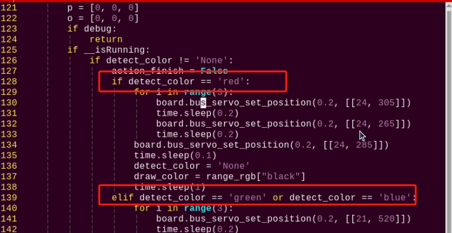

:::{Note}
在键盘输入代码位置序号后按下"Shift+G"键，可以直接跳转到对应位置。（本节旨在介绍快速跳转方法，故代码位置序号仅供参考，请以实际为准。）
:::

4)  点击"**i**"键进入编辑模式，将"**if detect_color == 'red':**"的"**red**"修改为"**green**"，将"**elif detect_color == 'green' or detect_color == 'blue':**"的"**green**"改为"**red**"即可。（如需更换为蓝色，同理）


修改完成后，按下"**Esc**"键，输入指令并回车，进行保存与退出。

```commandline
:wq
```

5)  修改完成后，再执行"[2.2 玩法开启及关闭步骤](#anchor_2_2)"内容，即可实现修改效果。

- #### 2.4.2 增加新的识别颜色

除了内置的红、绿、蓝三种可识别颜色，还可以添加其它可识别颜色。此处以**新增橙色**为例，具体的修改步骤如下：

1.  打开VNC，输入打开Lab颜色设置文件的指令。

```commandline
Vim spiderpi/config/lab_config.yaml
```

可使用截图或文件备份的方式记录初始数值。


2.  双击桌面的调试工具图标。若弹出提示框，选择"**执行**"即可。


点击"**Connect**"按键，若摄像头回传画面显示正常，代表连接成功。将调试颜色选择为"**red**"。


3.  将摄像头朝向想要识别的颜色，拖动滑杆以调整L、A、B参数，直到左侧画面中的目标颜色区域变为白色，其他区域变成黑色。

此处以橙色为例，将橙色物体置于摄像头的视野范围内，调整L、A、B对应滑杆，直到左侧画面中橙色部分变为白色，其他区域变为黑色。调节好参数后，点击下图所示的"**Save**"按键，保存数据。


4.  修改完成之后，检查修改值是否被成功写入。打开命令行终端，输入打开Lab颜色设置文件的命令。

```commandline
Vim spiderpi/config/lab_config.yaml
```

:::{Note}
为了避免对玩法造成影响，在修改Lab参数后，建议通过LAB_Tool工具将数值恢复为初始值。
:::

5.  查看参数可知，修改值已经成功写入配置程序中。按下"**Esc**"键，输入指令并回车，进行保存与退出。

```commandline
:wq
```

6.  参照[2.4 功能延伸\ 更换默认识别颜色](#anchor_2_4_1)，将默认识别颜色修改为红色。


7.  再次启动该玩法，将橙色物品置于摄像头的视野范围内，当识别到该物体，SpiderPi Pro机器人会点头。如需要增加其它颜色作为可识别颜色，可参考前面步骤进行操作。

### 2.5 程序简要分析

该程序的源代码位于：**/home/pi/spiderpi/functions/color_detect.py**


根据实现的效果，梳理程序的过程逻辑，如下图所示：

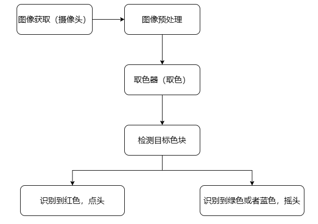

- #### 2.5.1 导入功能库


**处理图像**

- **高斯滤波**

在将图像的颜色空间由RGB转换为Lab前，需要先对其进行降噪处理，此处用到cv2库中的GaussianBlur()函数，该函数用于对图像进行高斯滤波处理。


函数括号内的参数含义如下：

第一个参数"**frame_resize**"是输入图像；

第二个参数"**(3, 3)**"是高斯内核大小；

第三个参数"**3**"是在高斯滤波中其平均值附近允许的方差大。该值越大，平均值周围允许的方差越大；数值越小，平均值周围允许的方差越小。

- **二值化处理**

采用cv2库中的inRange()函数对图像进行二值化处理。


函数括号内的第一个参数是输入图像；第二个、第三个参数分别是阈值的下限和上限。当像素点RGB的颜色数值处于上、下限之间时，该像素点被赋值为1，否则为0。

- **腐蚀膨胀处理**

为了降低干扰，令图像更平滑，需要对图像进行腐蚀和膨胀处理。


erode()函数用于对图像进行腐蚀操作。以代码"**eroded = cv2.erode(frame_mask, cv2.getStructuringElement(cv2.MORPH_RECT, (3, 3)))**"为例，括号内的参数含义如下：

第一个参数"**frame_mask**"是输入图像；

第二个参数"**cv2.getStructuringElement(cv2.MORPH_RECT, (3, 3))**"是决定操作性质的结构元素或内核。其中，括号内的第一个参数是内核形状，第二个参数是内核尺寸。

dilate()函数用于对图像进行膨胀操作。此函数括号内参数的含义与erode()函数的相同。

- **获取最大面积轮廓**

完成上述的图像处理后，需要获取识别目标的轮廓，此处涉及cv2库中的findContours()函数。


函数括号内的第一个参数是输入图像；第二个参数是轮廓的检索模式；第三个参数是轮廓的近似方法。

在获得的轮廓中寻找面积最大的轮廓，而为了避免干扰，需要设定一个最小值，仅当面积大于该值时，目标轮廓才有效。


- #### 2.5.3 反馈信息

获得最大面积轮廓后，通过调用cv2库中的circle()函数，用圆圈对识别目标进行标识，圆圈的线条颜色是识别目标的颜色。


为了提高识别结果的准确率，需要对其进行多次判断。

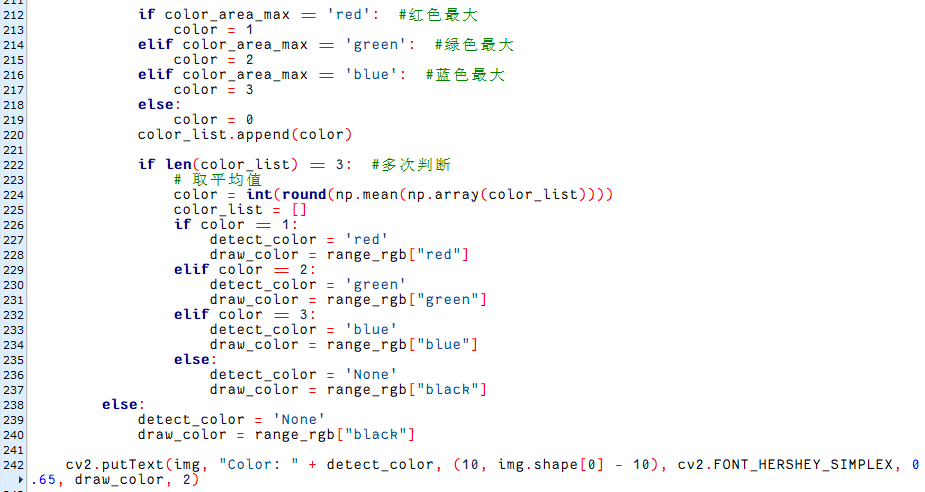

完成判断后，在回传画面内打印识别目标的颜色，此处涉及cv2库中的putText()函数。


函数括号内的参数含义如下：

第一个参数"**img**"，为输入图像；

第二个参数"**"Color: " + detect_color**"，表示显示内容；

第三个参数"**(10, img.shape\[0\] - 10)**"，是显示位置；

第四个参数"**cv2.FONT_HERSHEY_SIMPLEX**"，表示字体类型；

第五个参数"**0.65**"，表示字体大小；

第六个参数"**draw_color**"，代表字体颜色；

第七个参数"**2**"，表示字体粗细。

- #### 2.5.4 主函数分析

python程序中"**\_\_name\_\_ == '\_\_main\_\_:'**"就是程序的主函数。首先调用函数init()进行初始化配置。本程序中初始化包括：舵机回到初始位置、读取颜色阈值文件。一般还有端口、外设、定时中断等配置，这些都要在初始化内容中完成。


1. **读取摄像头图像**


当玩法启动时，将图像存储在"**img**"中。

2. **进入图像处理**


- 函数img.copy()的作用是将"**img**"的内容复制给"**frame**"。

- 函数run()进行图像处理。


- #### 2.5.5 子线程分析

小车移动函数move()作为子线程运行，当识别到颜色后，就会执行move()函数。

主要是对图像处理结果进行判断，再执行不同的反馈。


### 3. 颜色位置识别

本节课可以通过摄像头进行颜色识别红绿蓝三色小球，并在回传画面中圈出，显示其XY坐标位置。

### 3.1 实现原理

目标追踪的实现可分为颜色识别和位置标记两部分。

首先颜色识别部分，先进行高斯滤波（对图像中进行减噪），通过Lab颜色空间来对物品的颜色进行转换(关于Lab颜色空间的这个部分可以前往"**[OpenCV视觉基础课程]()**"课程进行详细学习)。

接着通过颜色阈值对圆圈中的物体颜色进行识别，再对图像部分进行掩膜（掩膜是用选定的图像、图形或物体，对处理的图像进行全局或者局部遮挡）。

然后经过对物品图片开闭运算处理后，最后将轮廓最大的物体用圆圈圈出。

开运算：先对图像腐蚀后膨胀。作用：用来消除小的物体，平滑形状边界，并且不改变其面积。可以去除小颗粒噪声，断开物体之间的粘连。

闭运算：先对图像膨胀后腐蚀。作用：用来填充物体内的小空洞，连接邻近的物体，连接断开的轮廓线，平滑其边界的同时不改变面积。

位置标记需要使用特定的检测算法。其基本原理是在图像中寻找符合预定义特征或模式的区域，然后返回这些区域的位置和边界框。

### 3.2 玩法开启及关闭步骤

:::{Note}
指令的输入需严格区分大小写和空格，另外可按键盘"Tab"键进行关键词补齐。
:::

1)  将设备开机，并参照课程资料的"**[远程桌面工具安装与连接\1. 远程工具安装与连接]()**"内容，通过VNC远程连接工具连接。


3)  点击系统桌面左上角的图标，打开LX终端。


4)  在打开的界面中，输入进入玩法程序所在目录的指令，按下回车键。

```commandline
cd spiderpi/functions
```

5)  输入指令，然后按下回车，启动玩法。

```commandline
python3 color_position_recognition.py
```

6)  如需关闭此玩法，只需要在LX终端界面中按下"**Ctrl+c**"。若关闭失败，可多次按下。

### 3.3 实现效果

**程序默认的追踪颜色为红绿蓝三色小球，识别完成后在回传画面中圈出，并显示其XY坐标位置**。

:::{Note}
1)  识别过程中，请尽量保证在光线充足环境下进行识别，避免因光线问题导致识别不准确。

2)  识别过程中，摄像头视觉范围之内的背景中，不要出现与要识别颜色相近或相同的物体，避免误识别。

3)  若颜色识别不准确可参照本文档"4.功能延伸--\>4.1颜色调节阈值"，对颜色阈值进行设置。
:::

### 3.4 功能延伸

- #### 3.4.1 调节颜色阈值

在玩法体验的过程中，如识别物体颜色效果不佳，则需调节颜色阈值。**本节以调节红色为例，其他颜色设置方法皆可参考，操作步骤如下：**

1)  双击系统桌面图标，在弹出的界面中点击"**执行**"。

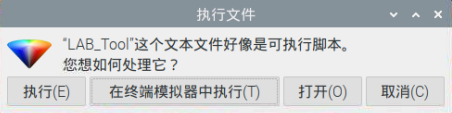

2)  进入界面后，点击"**Connect**"。


3)  连接成功后，在界面右下角的颜色选项栏中选择"**red**"。


4)  若在弹出的界面中未出现回传画面，说明摄像头未连接成功，需检查一下摄像头连接线是否连接好。

下图界面右侧是实时回传画面，左侧是需要被采集的颜色。将摄像头对准红色色块，然后拖动下方的六个滑杆，使得左侧画面中红色色块的区域全部变为白色，其它区域为黑色。接着点击"Save"按钮保存数据。


- #### 3.4.2 增加新的识别颜色

除了内置三种识别的颜色，我们还可以设置其它可识别的颜色，**比如我们以紫色作为新增的识别颜色为例，具体的修改步骤如下：**

1)  双击系统桌面图标，然后弹出的提示框内直接选择"**执行**"即可。


2)  在弹出的界面中依次选择"**Connect**"。


3)  点击"**Add**"，然后为新增颜色命名（这里以"**purple**"为例），再点击"**OK**"。


4)  然后点击颜色选框的下拉按钮，选择"**purple**"。


5)  将摄像头对准紫色物体，拖动L、A、B应的滑杆，直到左侧画面里要识别的颜色区域变为白色，其他区域变成黑色。


6)  最后，再点击"**Save**"，保存一下调节好的颜色阈值。

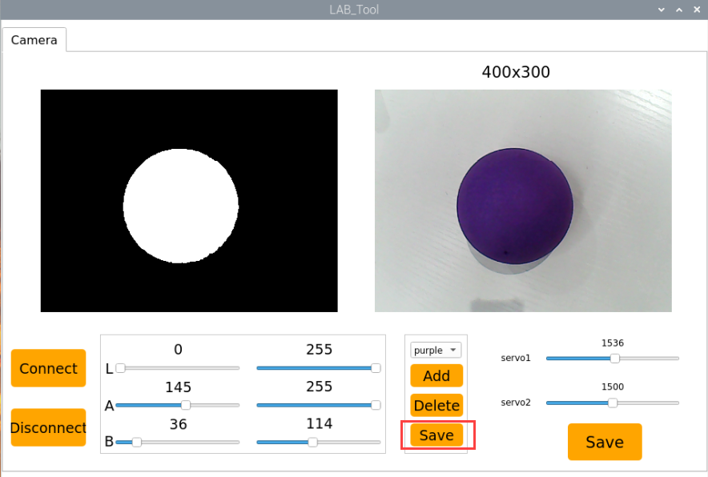

7)  修改完成后，我们可以检查一下修改的值是否成功被写入进去，输入指令，并按下回车，进入到程序代码所在目录。

```commandline
cd spiderpi/config
```

8)  再输入指令，并按下回车，打开程序文件。

```commandline
sudo vim lab_config.yaml
```

9)  打开颜色阈值程序文件后，即可查看紫色阈值参数。


10) 输入":q"后，按下回车，退出此文件。


11) 输入指令，按下回车，切换到主目录。

```commandline
cd
```

12) 输入指令，按下回车，则可定位到存放玩法程序的目录。

```commandline
cd spiderpi/functions
```

13) 然后再输入指令打开程序文件的指令，按下回车。

```commandline
sudo vim color_position_recognition.py
```

14) 接着找到如下图所示代码。


15) 按下键盘上的"**i**"键，进入到编辑模式。


16) 手动输入添加"**'purple': (128,** **0,** **128)**"，如下图所示：(128, 0, 128)为紫色的RGB紫，用户可通过网络搜索关键词"紫色RGB值"来获取。

```python
'purple': (128, 0, 128),
```


17) 找到图示代码，插入红框中的代码段。


18) 按下键盘上的"ESC"按键，输入'：wq'，退出并保存代码。


19) 输入指令,并按下回车开启玩法。

```commandline
python3 color_position_recognition.py
```

20) 如果需要添加其他颜色作为可识别颜色，可参考前面步骤进行操作。

### 3.5 程序说明

该程序的源代码位于：/home/pi/spiderpi/functions/color_position_recognition.py

根据实现的效果，梳理程序的过程逻辑，如下图所示：


- #### 3.5.1 导入功能库


1)  导入opencv、时间、数学、线程、逆运动学相关的库。我们如果想要调用功能库里的函数，就可以使用"**功能库名+函数名（参数，参数...）**"如：


就是调用"**time**"库中的"**sleep**"函数。sleep()的作用是延时。

在python中有一些已经内置的库，我们直接导入调用就可以，比如"**time**"、"**cv2**"、"**math**"等。我们也可以自己写一个库，比如上面的"**yaml_handle**"文件读取库等。

2)  实例化函数库

我们有些函数库的名称太长，并且不容易记忆，为了方便调用函数，我们经常会对函数库进行实例化，如：


进行实例化后，在使用Misc库中的函数，就可以像这样"**Misc.函数名(参数,参数...)**"直接调用了，非常方便。

- #### 3.5.2 主函数分析

python程序中"**\_\_name\_\_ == '\_\_main\_\_:'**"就是程序的主函数。加载相机校准参数，并使用这些参数来校正图像的畸变和进行图像的裁剪，以便更好地进行后续处理，如特征检测、图像识别等。

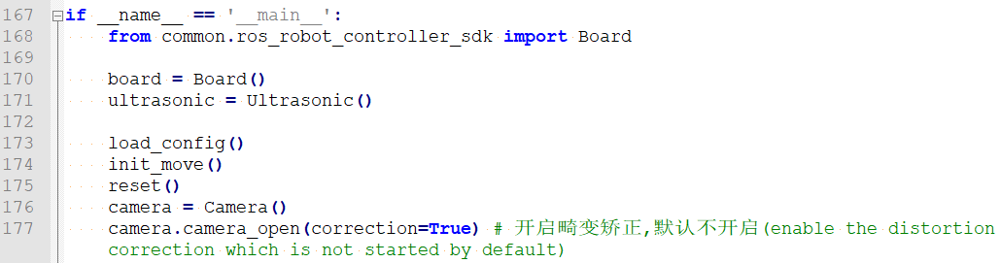

**读取摄像头图像**


当玩法启动时，首先读取摄像头。

**进入图像处理**

1)  函数run()进行图像处理。


- 对图片大小进行缩放，方便处理。


第一个参数"**img_copy**"是输入图像。

第二个参数"**size**"是输出图像的大小。大小可以自己设定。

第三个参数"**interpolation=cv2.INTER_NEAREST**"是插值方式。INTER_NEAREST：最邻近插值。INTER_LINEAR：双线性插值，如果最后一个参数你不指定，将默认使用这种方法。INTER_CUBIC：4x4像素邻域内的双立方插值。INTER_LANCZOS4：8x8像素邻域内的Lanczos插值。

- 高斯滤波

图像中总是会混入噪声，影响图像的质量，让特征不明显。根据不同的噪声种类选择对应的滤波方法，常见的有：高斯滤波、中值滤波、均值滤波等。

高斯滤波是一种线性平滑滤波，适用于消除高斯噪声，广泛应用于图像处理的减噪过程。


第一个参数"**frame_resize**"是输入图像。

第二个参数"**(3, 3)**"是高斯内核大小。

第三个参数"**3**"是X方向上的高斯核标准偏差。

- 将图像转换到LAB空间，其中函数cv2.cvtColor()是颜色空间转换函数。


第一个参数"**frame_gb**"是输入图像。

第二个参数"**cv2.COLOR_BGR2LAB**"是转换格式。"**cv2.COLOR_BGR2LAB**"是将BGR格式转换到LAB格式。如果要转换到RGB就可以使用"**cv2.COLOR_BGR2RGB**"。

- 将图像转换成二值图像，只有0和1，图像变得简单并且数据量减小，更容易处理。

采用cv2库中的inRange()函数对图像进行二值化处理。


第一个参数"**frame_lab**"是输入图像；

第二个参数"**(lab_data\[i\]\['min'\]\[0\],lab_data\[i\]\['min'\]\[1\],lab_data\[i\]\['min'\]\[2\])**"是颜色阈值下限；

第三个参数"**(lab_data\[i\]\['max'\]\[0\],lab_data\[i\]\['max'\]\[1\],lab_data\[i\]\['max'\]\[2\])**"是颜色阈值上限；

- 为了降低干扰，令图像更平滑，需要对图像进行腐蚀和膨胀操作，腐蚀和膨胀是一种形态学操作，腐蚀通常用于减小图像中前景对象的尺寸或消除小的对象；膨胀通常用于增大图像中前景对象的尺寸或填补对象内部的小洞。


- 获取最大面积轮廓

完成上述的图像处理后，需要获取识别目标的轮廓，此处涉及cv2库中的findContours()函数。


第一个参数"dilated"是输入图像；

第二个参数"**cv2.RETR_EXTERNAL**"是轮廓的检索模式；

第三个参数"**cv2.CHAIN_APPROX_NONE)\[-2\]**"是轮廓的近似方法。

在获得的轮廓中寻找面积最大的轮廓，而为了避免干扰，需要设定一个值，仅当面积大于该值时，目标轮廓才有效。


- 获取位置信息

采用cv2库中的cv2.putText() 函数在图像上绘制文本

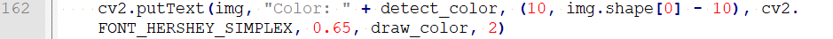

第一个参数"img"是输入图像；

第二个参数 "Color: " + detect_color"是要绘制的文本内容，通常以字符串形式传入；

第三个参数"(10, img.shape\[0\] - 10)"是文本在图像中的起始坐标点，即文本左下角的位置（x, y）；

第四个参数"cv2.FONT_HERSHEY_SIMPLEX"表示使用简单的字体；

第五个参数"0.65" 字体大小的缩放因子，指定文本字体的大小缩小到默认大小的0.65倍；

第六个参数"draw_color"是文本的颜色；

第七个参数"2"是文本字体的线条粗细。

**显示回传画面**


函数cv2.imshow()的作用是在窗口显示图像，"**'Frame'**"是窗口名称、"**frame**"是显示内容。后面一定要有cv2.waitKey()，否则无法显示。

函数cv2.waitKey()的作用是等待按键输入，参数"**1**"是延迟时间。

## 4. 颜色追踪

### 4.1 玩法简要说明

下面我们看下本节课整体实现的流程：

首先需要对颜色进行识别，我们使用Lab颜色空间来进行处理。先将RGB颜色空间转换为Lab，然后进行二值化处理，再经过膨胀腐蚀等操作，可获得只包含目标颜色的轮廓，再将该颜色轮廓用圆圈框起，便可实现物体颜色的识别。

接着在识别到后对云台部分进行处理，以图像的中心点的x、y坐标作为设定值，以当前获取的x、y坐标作为输入值进行更新pid。

然后根据图像位置的反馈进行计算，最后通过目标位置的变化使云台舵机跟随转动，从而达到颜色跟踪的效果。

### 4.2 玩法开启及关闭步骤

:::{Note}
指令输入需严格区分大小写及空格。
:::

1)  启动SpiderPi Pro机器人，通过VNC远程连接树莓派桌面。

2)  单击桌面左上角的的图标，打开LX终端。


3)  输入进入玩法程序所在目录的指令，按下回车。

```commandline
cd spiderpi/functions
```

4)  输入启动玩法的指令"**python3 color_track.py**"，按下回车。

:::{Note}
**python3 color_track.py**
:::

5)  如需关闭此玩法，可在LX终端界面按下"**Ctrl+C**"，若关闭失败，可多次按下。

### 4.3 功能实现

:::{Note}
程序默认识别到绿色时会进行追踪。如需将默认识别颜色修改为蓝色，可参考[4.4 功能延伸\ 更换默认识别颜色](#anchor_4_4_1)。另外，手持小球移动时，速度不宜过快，并应保持在摄像头的视野范围内。
:::

玩法开启后，手持绿色小球进行缓慢移动，SpiderPi Pro的机械臂将随着目标颜色的移动而跟随转动。

### 4.4 功能延伸

<span id="anchor_4_4_1" class="anchor"></span>

- #### 4.4.1 更换默认识别颜色

颜色追踪程序内置了两种颜色：绿色和蓝色。其中，默认识别到绿色时，SpiderPi Pro机械臂会跟随目标的移动而转动。

本节以**将默认识别颜色更换为蓝色**为例，具体修改步骤如下所示：

1)  输入进入玩法程序所在目录的指令，按下回车。

```commandline
cd spiderpi/functions
```

2)  输入打开程序文件的指令，按下回车。

```commandline
vim color_track.py
```

3)  找到下图所示代码：


:::{Note}
在键盘输入代码位置序号后按下"Shift+G"键，可以直接跳转到对应位置。（本节旨在介绍快速跳转方法，故代码位置序号仅供参考，请以实际为准。）**
:::

3)  点击"**i**"键进入编辑模式，将"\_**\_target_color = ('green',)**"内的"**green**"修改为"**blue**"。


4)  修改完成后，按下"**Esc**"键，输入指令并回车，进行保存与退出。

```commandline
:wq
```

- #### 4.4.2 增加新的识别颜色

:::{Note}
为了更好的体验效果，尽量不增加红色作为识别颜色。
:::

除了内置的绿、蓝两种可识别颜色，还可以添加其它可识别颜色。此处以**新增橙色**为例，具体的修改步骤如下：

1.  打开VNC，输入打开Lab颜色设置文件的指令。

```commandline
Vim spiderpi/config/lab_config.yaml
```

可使用截图或文件备份的方式记录初始数值。


2.  双击桌面的调试工具图标。若弹出提示框，选择"**执行**"即可。


点击"**Connect**"按键，若摄像头回传画面显示正常，代表连接成功。将调试颜色选择为"**green**"。


3.  将摄像头朝向想要识别的颜色，拖动滑杆以调整L、A、B参数，直到左侧画面中的目标颜色区域变为白色，其他区域变成黑色。

此处以橙色为例，将橙色物体置于摄像头的视野范围内，调整L、A、B对应滑杆，直到左侧画面中橙色部分变为白色，其他区域变为黑色。调节好参数后，点击下图所示的"**Save**"按键，保存数据。


4.  修改完成之后，检查修改值是否被成功写入。打开命令行终端，输入打开Lab颜色设置文件的命令。

```commandline
Vim spiderpi/config/lab_config.yaml
```

为了避免对玩法造成影响，在修改Lab参数后，建议通过LAB_Tool工具将数值恢复为初始值。

5.  查看参数可知，修改值已经成功写入配置程序中。按下"**Esc**"键，输入指令并回车，进行保存与退出。

```commandline
:wq
```

6.  参照[4.4 功能延伸\ 更换默认识别颜色](#anchor_4_4_1)，将默认识别颜色修改为绿色。


7.  再次启动该玩法，手持橙色物品在摄像头的视野范围内移动。当识别到该物体，机器人头部会随着目标颜色的移动而转动。如需要增加其它颜色作为可识别颜色，可参考前面步骤进行操作。

#### 4.5 程序简要分析

该程序的源代码位于：**/home/pi/spiderpi/functions/color_track.py**


根据实现的效果，梳理程序的过程逻辑，如下图所示：


- #### 4.5.1导入功能库


- **高斯滤波**

在将图像的颜色空间由RGB转换为Lab前，需要先对其进行降噪处理，此处用到cv2库中的GaussianBlur()函数，该函数用于对图像进行高斯滤波处理。


函数括号内的参数含义如下：

第一个参数"**frame_resize**"是输入图像；

第二个参数"**(5, 5)**"是高斯内核大小；

第三个参数"**5**"是在高斯滤波中其平均值附近允许的方差大。该值越大，平均值周围允许的方差越大；数值越小，平均值周围允许的方差越小。

- **二值化处理**

采用cv2库中的inRange()函数对图像进行二值化处理。


函数括号内的第一个参数是输入图像；第二个、第三个参数分别是阈值的下限和上限。当像素点RGB的颜色数值处于上、下限之间时，该像素点被赋值为1，否则为0。

- **腐蚀膨胀处理**

为了降低干扰，令图像更平滑，需要对图像进行腐蚀和膨胀处理。


erode()函数用于对图像进行腐蚀操作。以代码"**eroded = cv2.erode(frame_mask, cv2.getStructuringElement(cv2.MORPH_RECT, (3, 3)))**"为例，括号内的参数含义如下：

第一个参数"**frame_mask**"是输入图像；

第二个参数"**cv2.getStructuringElement(cv2.MORPH_RECT, (3, 3))**"是决定操作性质的结构元素或内核。其中，括号内的第一个参数是内核形状，第二个参数是内核尺寸。

dilate()函数用于对图像进行膨胀操作。此函数括号内参数的含义与erode()函数的相同。

- **获取最大面积轮廓**

完成上述的图像处理后，需要获取识别目标的轮廓，此处涉及cv2库中的findContours()函数。


函数括号内的第一个参数是输入图像；第二个参数是轮廓的检索模式；第三个参数是轮廓的近似方法。

在获得的轮廓中寻找面积最大的轮廓，而为了避免干扰，需要设定一个最小值，仅当面积大于该值时，目标轮廓才有效。


- #### 4.5.2 反馈信息

获得最大面积轮廓后，通过调用cv2库中的minEnclosingCircle()函数，获取目标轮廓的最小外接圆。

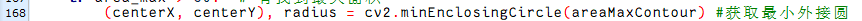

用圆圈对识别目标进行标识，此处涉及cv2库中的circle()函数。


- #### 4.5.3 驱动舵机

以图像中心点的X、Y坐标为设定值，云台追踪使用PID算法，让摄像头中心靠近目标中心坐标。以当前识别目标的X、Y坐标为输入值，对PID进行更新。

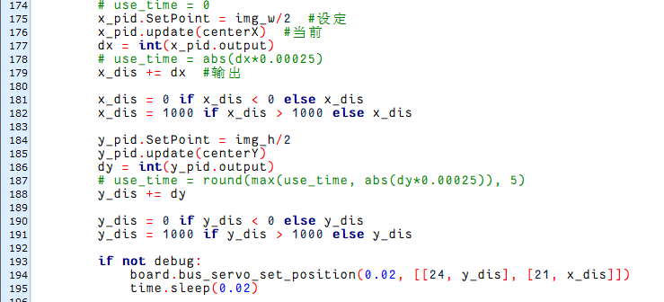

通过调用Board库中的bus_servo_set_position()函数，驱动指定的舵机转动到指定位置，即可实现追踪效果。


以"**bus_servo_set_position(0.02, \[\[24, y_dis\], \[21, x_dis\]\])**"函数为例，括号内的参数含义如下：

第一个参数"0.02"是转动时间，单位为s"**24**"；

第二个参数"24"是要驱动的舵机ID；

第三个参数"**y_dis**"，是转动位置。

## 5. 智能巡线

### 5.1 实验原理

巡线是机器人比赛中的常见项目，传统的巡线项目通过二路或者四路巡线传感器来进行实现，而在SpiderPi Pro机器人仅需通过视觉模块识别线条颜色，再经过图像算法处理，即可实现巡线移动。  
下面我们看下本节课整体实现的流程：

首先，需要对线条颜色进行识别，此处使用Lab颜色空间进行处理，将图像颜色空间由RGB转换为Lab，随后对图像进行二值化、腐蚀、膨胀等操作，获得只包含目标颜色的轮廓，并用圆圈将其标识出来。

接着在识别到后对云台部分进行处理，以图像的中心点的x、y坐标作为设定值，以当前获取的x、y坐标作为输入值进行更新pid。

然后根据图像中线条位置的反馈进行计算，最后通过位置的变化使机器人跟随线条轨迹进行移动，从而达到智能巡线的效果。

<p id="anchor_5_2"></p>

### 5.2 玩法开启及关闭步骤

:::{Note}
指令输入需严格区分大小写及空格。
:::

1)  启动SpiderPi Pro机器人，通过VNC远程连接树莓派桌面。

2)  单击桌面左上角的的图标，打开LX终端。


3)  输入进入玩法程序所在目录的指令，按下回车。

```commandline
cd spiderpi/functions
```

4)  输入启动玩法的指令"**python3 visual_patrol.py**"，按下回车。

```commandline
python3 visual_patrol.py
```

5)  如需关闭此玩法，可在LX终端界面按下"**Ctrl+C**"，如关闭失败，可多次按下。

### 5.3 功能实现

:::{Note}
程序默认的识别颜色为红色，如需修改为白色或黑色，可参考[5.4 功能延伸\ 更换默认巡线颜色](#anchor_5_4_1)。
:::

将红色的电工胶带铺设在所用场地，并将SpiderPi Pro机器人置于红色线条上。启动玩法后，机器人将巡红色线条进行移动。

### 5.4 功能延伸

<span id="anchor_5_4_1" class="anchor"></span>

- #### 5.4.1 更换默认巡线颜色

程序内置了三种颜色：红色、白色、黑色。其中，巡线默认颜色为红色。此处以**将默认颜色修改为白色**为例，修改步骤如下所示：

1)  输入进入玩法程序所在目录的指令，按下回车。

```commandline
cd spiderpi/functions
```

2)  输入打开程序文件的指令"**vim visual_patrol.py**"，按下回车。

```commandline
vim visual_patrol.py
```

3)  找到下图所示代码：


:::{Note}
在键盘输入代码位置序号后按下"Shift+G"键，可以直接跳转到对应位置。（本节旨在介绍快速跳转方法，故代码位置序号仅供参考，请以实际为准。）
:::

4)  点击"**i**"键进入编辑模式，将"\_**\_target_color = ('red',)**"内的"**red**"修改为"**white**"。（如需更换为黑色，修改为"**black**"）


5)  修改完成后，按下"**Esc**"键，输入"**:wq**"并回车，进行保存与退出。


- #### 5.4.2 增加新的巡线颜色

除了内置的三种巡线颜色，还可以添加其它可识别颜色，此处以**新增蓝色**为例，具体的修改步骤如下：

1.  打开VNC，输入打开Lab颜色设置文件的指令。

```commandline
Vim spiderpi/config/lab_config.yaml
```

可使用截图或文件备份的方式记录初始数值。


2.  双击桌面的调试工具图标。若弹出提示框，选择"**执行**"即可。


3.  点击"**Connect**"按键，若摄像头回传画面显示正常，代表连接成功。将调试颜色选择为"**red**"。


4.  将摄像头朝向想要识别的颜色，拖动滑杆以调整L、A、B参数，直到左侧画面中的目标颜色区域变为白色，其他区域变成黑色。

此处以蓝色为例，将蓝色线条置于摄像头的视野范围内，调整L、A、B对应滑杆，直到左侧画面中蓝色部分变为白色，其他区域变为黑色。调节好参数后，点击下图所示的"**Save**"按键，保存数据。


为了避免对玩法造成影响，在修改Lab参数后，建议通过LAB_Tool工具将数值恢复为初始值。

5.  修改完成之后，检查修改值是否被成功写入。打开命令行终端，输入打开Lab颜色设置文件的命令。

```commandline
Vim spiderpi/config/lab_config.yaml
```

6.  查看参数可知，修改值已经成功写入配置程序中。按下"**Esc**"键，输入指令并回车，进行保存与退出。

```commandline
:wq
```

7.  参照[5.4 功能延伸\ 更换默认巡线颜色](#anchor_5_4_1)，将默认巡线颜色设置为红色。


8.  再次按照"[5.2 玩法开启及关闭步骤](#anchor_5_2)"启动该玩法，SpiderPi Pro机器人会沿着蓝色线条进行移动。如需要增加其它颜色作为可识别颜色，可参考前面步骤进行操作。

### 5.5 程序简要分析

该程序的源代码位于：**/home/pi/spiderpi/functions/visual_patrol.py**


根据实现的效果，梳理程序的过程逻辑，如下图所示：


- #### 5.5.1 导入库文件


1)  导入opencv、时间、数学、线程相关的库。我们如果想要调用功能库里的函数，就可以使用"**功能库名+函数名（参数，参数...）**"如：


就是调用"**time**"库中的"**sleep**"函数，sleep()的作用是延时。

在python中有一些已经内置的库，我们直接导入调用就可以，比如"**time**"、"**cv2**"、"**math**"等。我们也可以自己写一个库，比如上面的"**yaml_handle**"文件读取库。

2)  实例化函数库。

我们有些函数库的名称太长，并且不容易记忆，为了方便调用函数，我们经常会对函数库进行实例化，如：


进行实例化后，在使用Board库中的函数，就可以像这样"**Board.函数名(参数,参数...)**"直接调用了，非常方便。

- #### 5.5.2 定义全局变量


- #### 5.5.3 主函数分析

python程序中"**\_\_name\_\_ == '\_\_main\_\_:'**"就是程序的主函数。首先调用函数init()进行初始化配置。本程序中初始化包括：舵机回到初始位置、读取颜色阈值文件。一般还有端口、外设、定时中断等配置，这些都要在初始化内容中完成。


**读取摄像头图像**


当玩法启动时，将图像存储在"**img**"中。

**进入图像处理**

读取到图像时，调用run()函数进行图像处理。


1)  函数img.copy()的作用是将"**img**"的内容复制给"**frame**"。

- **高斯滤波**

在将图像的颜色空间由RGB转换为Lab前，需要先对其进行降噪处理，此处用到cv2库中的GaussianBlur()函数，该函数用于对图像进行高斯滤波处理。


函数括号内的参数含义如下：

第一个参数"**img**"是输入图像；

第二个参数"**(3, 3)**"是高斯内核大小；

第三个参数"**3**"是在高斯滤波中其平均值附近允许的方差大。该值越大，平均值周围允许的方差越大；数值越小，平均值周围允许的方差越小。

- **二值化处理**

采用cv2库中的inRange()函数对图像进行二值化处理。


函数括号内的第一个参数是输入图像；第二个、第三个参数分别是阈值的下限和上限。当像素点RGB的颜色数值处于上、下限之间时，该像素点被赋值为1，否则为0。

- **腐蚀膨胀处理**

为了降低干扰，令图像更平滑，需要对图像进行腐蚀和膨胀处理。


erode()函数用于对图像进行腐蚀操作。以代码"**eroded = cv2.erode(frame_mask, cv2.getStructuringElement(cv2.MORPH_RECT, (3, 3)))**"为例，括号内的参数含义如下：

第一个参数"**frame_mask**"是输入图像；

第二个参数"**cv2.getStructuringElement(cv2.MORPH_RECT, (3, 3))**"是决定操作性质的结构元素或内核。其中，括号内的第一个参数是内核形状，第二个参数是内核尺寸。

dilate()函数用于对图像进行膨胀操作。此函数括号内参数的含义与erode()函数的相同。

- **获取最大面积轮廓**

完成上述的图像处理后，需要获取识别目标的轮廓，此处涉及cv2库中的findContours()函数。


函数括号内的第一个参数是输入图像；第二个参数是轮廓的检索模式；第三个参数是轮廓的近似方法。

在获得的轮廓中寻找面积最大的轮廓，而为了避免干扰，需要设定一个最小值，仅当面积大于该值时，目标轮廓才有效。


- **获取位置信息**

采用cv2库中的minAreaRect()函数获取目标轮廓的最小外接矩形，并通过boxPoints()函数得到其四个顶点的坐标。随后，可以由矩形的顶点坐标推算出其中心点坐标。


**5.4 控制巡线**

完成图像处理后，通过调用kinematics.IK库中的函数控制SpiderPi Pro机器人移动。


下表为用于控制SpiderPi Pro机器人移动的函数：

|                   **函数**                    |   **作用**    |
|:---------------------------------------------:|:-------------:|
|  ik.go_forward(ik.initial_pos, 2, 50, 80, 1)  | 朝前直走50mm  |
|    ik.back(ik.initial_pos, 2, 100, 80, 1)     | 朝后直走100mm |
|  ik.turn_left(ik.initial_pos, 2, 30, 100, 1)  | 原地左转30度  |
| ik.turn_right(ik.initial_pos, 2, 30, 100, 1)  | 原地右转30度  |
| ik.left_move(ik.initial_pos, 2, 100, 100, 1)  |   左移100mm   |
| ik.right_move(ik.initial_pos, 2, 100, 100, 1) |   右移100mm   |

以"**ik.go_forward(ik.initial_pos, 2, 50, 80, 1)**"为例，其中，函数括号内的参数含义如下：

第一个参数"**ik.initial_pos**"代表姿态；

第二个参数"**2**"是模式，"**2**"为六足模式；

第三个参数"**50**"是步幅，单位为mm（转弯时是角度，单位为度）；

第四个参数"**80**"是速度，单位为mm/s；

第五个参数"**1**"是执行次数，当值为"**0**"时表示无限循环。

## 6. 标签检测

### 6.1 玩法简要说明

机器人通过识别到标签时，蜂鸣器发出声音，并返回回传画面，并打印标签的 tag_id 及 tag_family 信息。。

AprilTag 作为一种视觉定位标志符，类似于二维码或者条形码，可以用于快速地检测标志 并计算出相对位置，能够满足实时性的要求。

同时，它也可被应用于各种任务，包括 AR、机器人和相机校准等。目前，AprilTag 可以直 接用打印机打印出来，并且其检测程序可以计算相对于相机的精确 3D 位置、方向和 ID。

本节课我们通过结合 OpenCV 与 AprilTag，完成一个检测 AprilTag 标签的小项目。当摄 像头识别到标签时，机器人板载蜂鸣器则发出声音作为提示，并返回回传画面。

### 6.2 玩法开启及关闭

:::{Note}
指令的输入需严格区分大小写及空格。
:::

1)  将机器人开机，然后通过VNC远程连接树莓派桌面。关于VNC的安装及连接，可参考"**[远程桌面工具安装与连接\1. 远程工具安装与连接](https://docs.hiwonder.com/projects/SpiderPi_Pro/en/latest/docs/6_remote_tool.html)**"。


2)  点击系统桌面左上角的图标，打开LX终端。


3)  输入指令，按下回车键,则可定位到存放玩法程序的目录。

```commandline
cd spiderpi/functions
```

4)  输入指令，然后按下回车键将玩法启动。

```commandline
python3 apriltag_recognition.py
```

5)  如需关闭此玩法，只需要在LX终端界面中按下"**Ctrl+C**"。如果关闭失败，可多次按下。

### 6.3 实现效果

:::{Note}
本玩法标签放置位置尽量在纯色背景或白色背景下进行，深色背景（例如黑色）会影响标签识别的效果。
:::

开启玩法后，可将自带的 AprilTag 标签放置在摄像头前。当机器人识别到后，蜂鸣器会发声提示。回传画面将显示捕捉到的标签画面并将标签圈出，同时显示标签的 tag_id 及 tag\_ family 信息。

### 6.4 程序参数说明

该程序的源代码位于：**/home/pi/spiderpi/functions/apriltag_recognition.py**

- **图像获取及处理**

首先对图像进行处理，所谓对图像的处理即对数字的处理。我们先导入包：


其次，初始化并开启摄像头，进行图像获取，然后对图像进行复制、重映射、显示。


接着，我们需要将RGB格式图像转换为灰度图像信息。代码如下：


- **标签检测**

在图像处理完毕后，我们需要对标签进行检测处理。通过调用 tag 的库文件对获取的图像进行检测。代码实现如下所示：


在检测后将会获取标签码四个角点的信息：


接下来需要绘制 Tag 标签的轮廓。在 OpenCV 中我们通过 cv2.drawContours 函数来实现， 程序如下所示：


这个函数一共有五个参数，各个参数的含义如下所示：

第一个参数"img"：代表一张图片；

第二个参数"\[np.array(corners, np.int)\]"：代表轮廓；

第三个参数"-1"：代表轮廓的索引，-1 表示绘制所有轮廓；

第四个参数"(0, 255, 255)"：代表轮廓的颜色；

第五个参数"2"：代表轮廓的厚度。

- **获取标签信息**

程序通过直接调用 Apriltag 库来进行编码与解码，以获取标签的信息。根据编码方式的不同， 生成不同的内点坐标。

在确定的四边形中明确点阵坐标，为了进一步确定编码是否可靠，要同时与已知的编码库 进行匹配。


## 7. 标签识别

### 7.1 玩法简要说明

AprilTag作为一种视觉定位标志符，其作用类似于二维码或者条形码，可以帮助快速检测标志与计算相对位置，它的主要应用范围有AR、机器人和相机校准等。

下面我们看下本节课整体实现的流程：

首先，需要对标签进行检测，此处涉及定位、图像分割、轮廓查找等操作。完成轮廓定位后，通过获取轮廓的角点信息，将直线拟合形成一个闭环。

最后，对检测标签进行编码与解码处理，并根据标签ID，控制SpiderPi Pro机器人执行对应的反馈动作。

<p id="anchor_7_2"></p>

### 7.2 玩法开启及关闭步骤

:::{Note}
指令输入需严格区分大小写及空格。
:::

1)  启动SpiderPi Pro机器人，通过VNC远程连接树莓派桌面。

2)  单击桌面左上角的的图标，打开LX终端。


3)  输入进入玩法程序所在目录的指令，按下回车。

```commandline
cd spiderpi/functions
```

4)  输入启动玩法的指令，按下回车。

```commandline
python3 apriltag_detect.py
```

5)  如需关闭此玩法，可在LX终端界面按下"**Ctrl+C**"。如果关闭失败，可多次按下。

### 7.3 功能实现

1)  **尽量在纯色背景或白色背景下进行此玩法，深色背景会影响标签识别的效果。**

2)  **请保持标签卡片面的完整性，污渍或褶皱会影响识别。**

当识别到对应标签，机器人会执行标签对应的反馈动作。此外，回传画面内会用黄色方框标识出标签，且打印标签的ID与类别。

下表为标签ID及其对应的反馈动作：

| **标签ID** | **执行动作** |
|:----------:|:------------:|
|     1      |     招手     |
|     2      |   原地踏步   |
|     3      |     扭腰     |

### 7.4 功能延伸

<span id="anchor_7_4_1" class="anchor"></span>

- #### 7.4.1 修改反馈动作

当识别到标签，程序默认ID为1的标签对应反馈动作"**招手**"。此处以**将反馈动作修改为"踢腿"**为例，具体修改步骤如下：

1)  输入进入玩法程序所在目录的指令，按下回车。

```commandline
cd spiderpi/functions
```

2)  输入打开程序文件的指令，按下回车。

```commandline
vim apriltag_detect.py
```

3)  找到下图所示代码：


:::{Note}
在键盘输入代码位置序号后按下"Shift+G"键，可以直接跳转到对应位置。本节旨在介绍快速跳转方法，故代码位置序号仅供参考，请以实际为准。
:::

**点击"i"键进入编辑模式。**

4)  将"**agc.run_action(**"**wave**")"内的"**wave**"修改为"**kick**"。如需更换为其他动作组，可前往目录"**/home/pi/spiderpi/aiction_groups**"查看动作组名称。

**kick**


5)  修改完成后，按下"**Esc**"键，输入指令并回车，进行保存与退出。

```commandline
:wq
```

- #### 7.4.2 修改/增加识别标签

可在本节目录下的"ApirlTag标签集合"文件夹内找到标签汇总素材。（该目录需要先解压）

另外还需要注意以下几点：

1.  无需自行在网上下载素材，使用我们提供的标签（共200张）即可。（标签素材可在本节目录下的"标签集合"中找到）

2.  自行打印标签的尺寸没有绝对大小要求，但需保证玩法开启后可以识别，因此不建议过大或过小。（识别到会画面会黄框圈出）

3.  标签旁边区域最好为白色背景或全为白色背景，深色背景可能会影响识别效果。

此处以**增加标签ID4**为例，对应的反馈动作为"**高姿态立正**"，具体修改步骤如下：

1)  参照[7.4 功能延伸\  修改反馈动作](#anchor_7_4_1)，进入玩法程序所在目录，并打开对应的程序文件。

2)  将鼠标光标移动到下图所示位置，并用键盘输入"**5yy**"，复制光标后的五句代码。


3)  左下角出现"**5 lines yanked**"的提示，即表示复制成功。


4)  将鼠标光标移动到下图所示位置，并用键盘输入"**p**"，粘贴前面复制的代码。

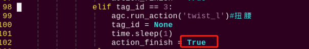


5)  点击"**i**"键进入编辑模式，将"**elif tag_id == 3:**"内的"**3**"修改为"**4**"，"**agc.run_action('twist_l')**"内的"**twist_l**"修改为"**stand_high**"，代码后方的注释修改为"**高姿态立正**"。如需更换为其他动作组，可前往目录"**/home/pi/spiderpi/action_groups**"查看动作组名称。


6)  完成修改后，按下"**Esc**"键，输入"**:wq**"并回车，进行保存与退出。

```commandline
:wq
```

7)  在本节目录下的文件夹"**标签集合**"内找到ID4标签，可自行打印出来。


8)  参照[7.2 玩法开启及关闭步骤](#anchor_7_2)，启动玩法，验证效果。


### 7.5 程序简要分析

该程序的源代码位于：**/home/pi/spiderpi/functions/apriltag_detect.py**

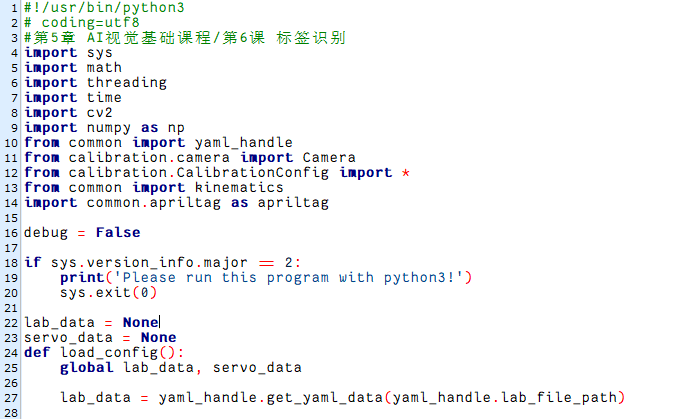

根据实现的效果，梳理程序的过程逻辑，如下图所示：


- #### 7.5.1 导入功能库


1)  导入opencv、时间、数学、线程、逆运动学相关的库。我们如果想要调用功能库里的函数，就可以使用"**功能库名+函数名（参数，参数...）**"如：


就是调用"**time**"库中的"**sleep**"函数。sleep()的作用是延时。

在python中有一些已经内置的库，我们直接导入调用就可以，比如"**time**"、"**cv2**"、"**math**"等。我们也可以自己写一个库，比如上面的"**yaml_handle**"文件读取库等。

2)  实例化函数库

我们有些函数库的名称太长，并且不容易记忆，为了方便调用函数，我们经常会对函数库进行实例化，如：


进行实例化后，在使用Board库中的函数，就可以像这样"**Board.函数名(参数,参数...)**"直接调用了，非常方便。

- #### 7.5.2 主函数分析

python程序中"**\_\_name\_\_ == '\_\_main\_\_:'**"就是程序的主函数。首先调用函数init()进行初始化配置。本程序中初始化包括：舵机回到初始位置、读取颜色阈值文件。一般还有端口、外设、定时中断等配置。这些都要在初始化内容中完成。


- #### 7.5.3 获取角点信息

通过np.rint()获取标签的四个角点。


- #### 7.5.4 检测标签

1.  获取标签的角点信息后，通过调用cv2库中的drawContours()函数，标识出标签。


函数括号内的参数含义如下：

第一个参数"**img**"是输入图像；

第二个参数"**\[np.array(corners, np.int)\]**"是轮廓本身，在Python中为list；

第三个参数"**-1**"是轮廓的索引，此处数值代表绘制轮廓list内的所有轮廓；

第四个参数"**(0, 255, 255)**"是轮廓颜色，其顺序为B、G、R，此处为黄色；

第五个参数"**2**"是轮廓宽度。

2.  获取标签的类型（tag_family）与ID（tag_id）。

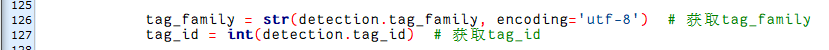

3.  通过调用cv2库中的putText()函数，将标签的ID与类型打印在回传画面内。


函数括号内的参数含义如下：

第一个参数是"**img**"是输入图像；

第二个参数是"**"tag_id: " + str(tag_id)**"是显示内容；

第三个参数是"**(10, img.shape\[0\] - 30)**"是显示位置；

第四个参数是"**cv2.FONT_HERSHEY_SIMPLEX**"是字体类型；

第五个参数是"**0.65**"是字体大小；

第六个参数是"**\[0, 255, 255\]**"是字体颜色，其顺序为B、G、R，此处为黄色；

第七个参数是"**2**"是字体粗细。

- #### 7.5.5 控制动作

获取标签ID后，通过调用agc.run_action()函数，控制SpiderPi Pro机器人执行对应动作组。

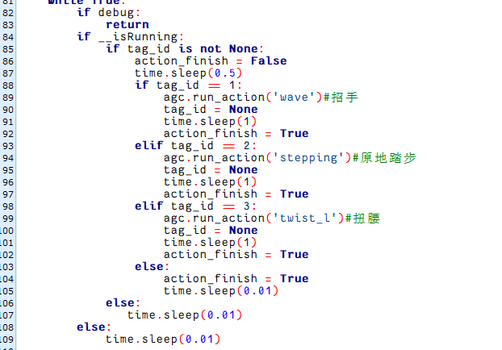

## 8. 人脸检测

### 8.1 玩法简要说明

识别到人脸后，蜂鸣器发声滴滴报警，并在回传画面中圈出人脸。

人工智能中最为一个广泛的应用当属图像识别，而图像识别中的人脸识别是最火热的应用，常常应用于门锁和手机人脸解锁等场景。

本节我们训练好的人脸模型，首先进行缩放画面检测人脸。然后将识别到的人脸坐标转换为未缩放前的坐标，进而判断是否为最大的人脸，并将识别到的人脸框出，蜂鸣器发出滴滴声。

### 8.2 玩法开启及关闭

:::{Note}
指令的输入需严格区分大小写及空格。
:::

1)  将机器人开机，然后通过VNC远程连接树莓派桌面。关于VNC的安装及连接，可参考"**第6章 远程桌面工具安装与连接\第1课 远程工具安装与连接**"。


2)  点击系统桌面左上角的图标，打开LX终端。


3)  输入指令，按下回车键则可定位到存放了玩法程序的目录。

```commandline
cd spiderpi/functions
```

4)  输入指令，然后按下回车键将玩法启动。

```commandline
python3 face_recongition.py
```

5)  如需关闭此玩法，只需要在LX终端界面中按下"**Ctrl+C**"。如果关闭失败，可多次按下。

### 8.3 实现效果

:::{Note}
本玩法请尽量避免在强光照射下进行，如太阳光、近距离白炽灯照射等，强光会影响人脸识别的效果，因此建议本玩法在室内进行，并且人脸距离摄像头范围以50cm-1m内为佳。
:::

玩法开启后，当检测到人脸时，蜂鸣器发声滴滴报警，并在回传画面中圈出人脸

### 8.4 程序简要分析

该程序的源代码位于：**/home/pi/spiderpi/functions/face_recongition.py**


- #### 8.4.1 功能逻辑

根据实现效果，梳理该玩法的实现逻辑如下图所示：


通过摄像头获取图像信息，再进行图像处理，即对图像进行颜色空间转化，方便进行人脸检测。

接着对图像进行人脸检测，获取人脸检测结果并调用动作组进行反馈。

- #### 8.4.2 程序逻辑及对应的代码分析

1. **导入库文件**


2. **定义全局变量**


3. **初始化与实例化工作**

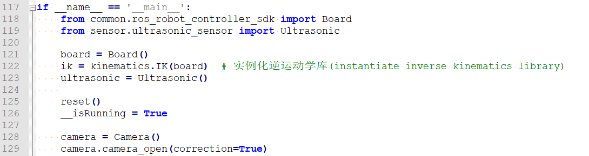

对camera库进行实例化操作，并调用camera_open()函数开启相机畸变矫正。


4. **图像处理**

将图像存储在img中，若图像不为空，调用run()函数进行图像处理。


- 对获取到的人脸图像信息进行坐标转化。

处理图像中的目标检测结果，并特别关注于面部检测（尽管从代码中无法直接确认，但根据上下文可以合理推断）。它首先检查每个检测到的目标的置信度（confidence），如果置信度高于某个阈值（conf_threshold），则进一步处理该目标的位置信息，并将其绘制在图像上。同时，它还计算了目标区域的面积，并跟踪最大面积的目标区域


- 通过调用cv2库中的rectangle()函数，用矩形方框标识出回传画面内的人脸。


函数括号内的参数含义如下：

第一个参数"**img**"是输入图像；

第二个参数"**bbox**"是矩形的像素坐标；；

第三个参数"**(0, 255, 0)**"是矩形边线颜色，其顺序为B、G、R，此处为绿色；

第四个参数"**2**"是矩形边线宽度。值为"**-1**"时，代表用参数四指定颜色填充矩形。

5. **显示回传画面**

调用cv2库中的resize()函数对图形进行缩放，将其在回传画面中实时显示。


在run()函数中，当检测到人脸时，蜂鸣器发出滴滴响声。


## 9. 人脸检测

### 9.1 玩法简要说明

在图像识别中，人脸识别技术十分热门，常被应用于门锁、手机人脸解锁等场景。

首先，我们需要对图像进行缩放处理，完成人脸检测步骤；

随后，将识别到的人脸坐标转换为未缩放前的坐标，并用方框标识出目标人脸；

最后，控制SpiderPi Pro机器人执行反馈动作。当没有检测到人脸，控制机械臂左右转动，搜寻人脸。

### 9.2 玩法开启及关闭步骤

:::{Note}
指令输入需严格区分大小写及空格。
:::

1)  启动SpiderPi Pro机器人，通过VNC远程连接树莓派桌面。

2)  单击左上角桌面的的图标，打开LX终端。


3)  输入进入玩法程序所在目录的指令，按下回车。

```commandline
cd spiderpi/functions
```

4)  输入启动玩法的指令，按下回车。

```commandline
python3 face_detect.py
```

5)  如需关闭此玩法，可在LX终端界面按下"**Ctrl+C**"。如果关闭失败，可多次按下。

### 9.3 功能实现

:::{Note}
由于强光会影响人脸识别的效果，请尽量避免在强光环境下执行本玩法（如太阳光、近距离白炽灯照射等），建议在室内进行，且人脸与摄像头的距离控制在1m内为佳。
:::

玩法开启后，摄像头将仰起来一定角度后，进行左右转动，当识别到人脸，机械臂会停止转动，且机器人会执行"**招手**"动作。

### 9.4 功能延伸-修改反馈动作

可在目录"**/home/pi/SpiderPi/action_groups**"下找到内置动作组文件。

当识别到人脸，程序默认的反馈动作为"**招手**"。此处以**将反馈动作修改为"扭身"** 为例，具体修改步骤如下：

1)  输入进入玩法程序所在目录的指令，按下回车。

```commandline
cd spiderpi/functions
```

2)  输入打开程序文件的指令"**vim face_detect.py**"，按下回车。

```commandline
vim face_detect.py
```

3)  找到下图所示代码：


:::{Note}
在键盘输入代码位置序号后按下"Shift+G"键，可以直接跳转到对应位置。本节旨在介绍快速跳转方法，故代码位置序号仅供参考，请以实际为准。
:::

4)  点击"**i**"键进入编辑模式。

5)  将"**agc.run_action(**"**wave**")"内的"**wave**"修改为"**twist**"。如需更换为其他动作组，可前往目录"**/home/pi/spiderpi/action_groups**"查看动作组名称。


修改完成后，按下"**Esc**"键，输入指令并回车，进行保存与退出。

```commandline
:wq
```

### 9.5 程序简要分析

该程序的源代码位于：**/home/pi/spiderpi/functions/face_detect.py**


根据实现的效果，梳理程序的过程逻辑，如下图所示：

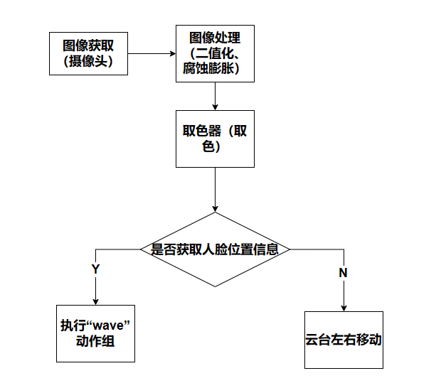

- #### 9.5.1 导入库文件


- #### 9.5.2 定义全局变量


- #### 9.5.3 处理图像

- **颜色空间转换**

将BGR图像转换为LAB图像


cvtColor()函数用于转换颜色空间。以代码"**gray = cv2.cvtColor(frame_resize, cv2.COLOR_BGR2GRAY)**"为例，括号内的参数含义如下：

第一个参数"**frame_resize**"是输入图像；

第二个参数"**cv2.COLOR_BGR2GRAY**"是转换类型，此处是BGR和灰度图的转换。

- **调用人脸检测器**

完成上述的图像处理后，将图像放入人脸检测器进行处理。

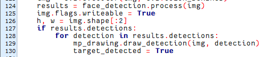

- **显示回传画面**

调用cv2库中的resize()函数对图形进行缩放，将其在回传画面中实时显示。


- #### 9.5.4 控制动作

当识别到人脸，通过调用agc.run_action()函数，控制SpiderPi Pro机器人执行指定动作组。


当没有检测到人脸， 调用board.bus_servo_set_position（）函数控制SpiderPi Pro机器人的机械臂进行左右转动。


- #### 9.5.5 主函数分析

1)  调用init()函数对SpiderPi进行初始化工作。

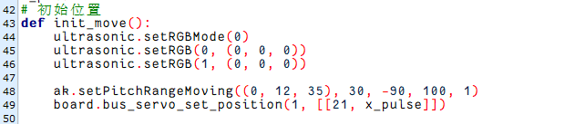

- 接着调用reset()函数对舵机等变量参数进行重置；


2)  调用start()函数开启人脸追踪的玩法。


3)  对camera库进行实例化操作，并调用camera_open()函数开启相机畸变矫正。


- #### 9.5.6 子线程分析

运行子线程调用move()函数，来控制云台舵机。


在move()函数中，使用board.bus_servo_set_position()函数来调整云台舵机的转动。


舵机控制以代码"b**oard.bus_servo_set_position(0.05, \[\[21,x_pulse\]\])**"为例，括号内的参数含义如下：

第一个参数："0.05"，是舵机的运行时间，单位为m；

第二个参数"**21**"是舵机编号，为2号舵机；

第三个参数：" **x_pulse**"是舵机的脉宽，范围在1000~1900之间。

## 10. 自动避障

### 10.1 玩法简要说明

超声波传感器可以测量与前方物体之间的距离。从超声波传感器获取数据后，对数据进行处理与判断。当测量距离小 于设定阈值，机器人将进行转向，避开前方障碍物。否则，机器人将向前移动。

### 10.2 玩法开启及关闭步骤

:::{Note}
指令输入需严格区分大小写及空格。
:::

1)  启动SpiderPi Pro机器人，通过VNC远程连接树莓派桌面。

2)  单击桌面左上角的的图标，或按住快捷键"**Ctrl+Alt+T**"，打开LX终端。


3)  输入进入玩法程序所在目录的指令，按下回车。

```commandline
cd spiderpi/functions
```

4)  输入启动玩法的指令，按下回车。

```commandline
python3 avoidance.py
```

5)  如需关闭此玩法，可在LX终端界面按下"**Ctrl+C**"。如果关闭失败，可多次按下。

### 10.3 功能实现

:::{Note}
程序默认的测距阈值为40cm。如需将默认阈值修改为其他数值，可参考[10.4 功能延伸\ 修改默认测距阈值](#anchor_10_4_1)。
:::

启动玩法后，回传画面内会显示测量距离。当与障碍物的间距小于25cm时，机器人会先后退再左转；当间距大于25cm，小于40cm时，机器人会直接左转；当间距大于40cm时，机器人会向前移动。

### 10.4 功能延伸

<span id="anchor_10_4_1" class="anchor"></span>

- #### 10.4.1 修改默认测距阈值

程序默认的测距阈值为40cm（取值范围是30-60），此处以**将阈值修改为50cm**为例，具体修改步骤如下：

1)  输入进入玩法程序所在目录的指令，按下回车。

```commandline
cd spiderpi/functions
```

2)  输入打开程序文件的指令，按下回车。

```commandline
vim avoidance.py
```

3)  找到下图所示代码：


:::{Note}
在键盘输入代码位置序号后按下"Shift+G"键，可以直接跳转到对应位置。本节旨在介绍快速跳转方法，故代码位置序号仅供参考，请以实际为准。
:::

4)  点击"**i**"键进入编辑模式，将"**Threshold = 40.0**"内的"**40.0**"修改为"**50.0**"。


5)  修改完成后，按下"**Esc**"键，输入"**:wq**"并回车，进行保存与退出。

```commandline
:wq
```

### 10.5 程序参数说明

该程序的源代码位于：**/home/pi/spiderpi/functions/avoidance.py**

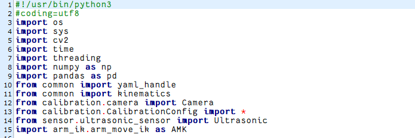

根据实现的效果，梳理程序的过程逻辑，如下图所示：


- #### 10.5.1 导入库文件


- #### 10.5.2 定义全局变量


- #### 10.5.3 主函数分析

**初始化与实例化工作**


1)  调用init()函数对SpiderPi进行初始化工作。


- 接着调用reset()函数对舵机变量参数进行重置；

  

2)  对camera库进行实例化操作，并调用camera_open()函数开启相机畸变矫正。

    

- #### 10.5.4 测量距离

- **设置测距阈值**

设置一个阈值"**Threshold**"，用于判断是否进行避障，单位为cm。


- **获取并处理测量数据**

通过调用getDistance()函数，获取超声波传感器测得的距离数据。


对获取的数据进行处理，得到更为准确的距离数值。

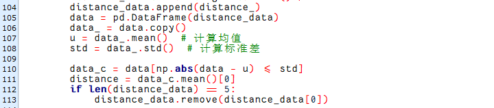

- **反馈信息**

通过调用cv2库中的putText()函数，将测得距离打印在回传画面内。


函数括号内的参数含义如下：

第一个参数是"**img**"是输入图像；

第二个参数是"**"Dist:%.1fcm" % distance**"是显示内容；

第三个参数是"**(30, 480 - 30)**"是显示位置；

第四个参数是"**cv2.FONT_HERSHEY_SIMPLEX**"是字体类型；

第五个参数是"**1.2**"是字体大小；

第六个参数是"**TextColor**"是字体颜色；

第七个参数是"**2**"是字体粗细。

- #### 10.5.5 控制动作

将测得距离与设定阈值进行比较，SpiderPi Pro机器人会根据判断结果执行对应动作。


下表为测得距离与其对应的反馈动作：

|   **距离范围（distance）**   |     **反馈动作**     |
|:----------------------:|:--------------------:|
| 0cm < distance < 25cm  | 机器人先后退，再左转 |
| 25cm < distance < 40cm |    机器人直接左转    |
|    40cm < distance     |      机器人前进      |

通过调用kinematics.IK库中的函数，可以控制SpiderPi Pro机器人移动。下表为用于控制SpiderPi Pro机器人移动的函数：

|                  **函数**                   |   **作用**   |
|:-------------------------------------------:|:------------:|
|    ik.back(ik.initial_pos, 2, 80, 50, 1)    |   后退80mm   |
| ik.turn_left(ik.initial_pos, 2, 15, 50, 1)  | 原地左转15度 |
| ik.go_forward(ik.initial_pos, 2, 80, 50, 1) |   前进80mm   |

其中，函数括号内的参数含义如下：

第一个参数是姿态；

第二个参数是模式，"**2**"为六足模式；

第三个参数是步幅，单位为mm（转弯时是角度，单位为度）；

第四个参数是速度，单位为mm/s；

第五个参数是执行次数，值为"**0**"时表示无限循环。

## 11. 单种颜色形状识别

### 11.1 玩法简要说明

首先，需要对颜色进行识别，此处使用Lab颜色空间进行处理，将图像颜色空间由RGB转换为Lab。

随后，对图像进行二值化、腐蚀、膨胀等操作，获得只包含目标颜色的轮廓，并在回传画面内用圆圈标识出目标轮廓。

最后，对轮廓进行形状判别，并控制SpiderPi Pro机器人作出对应的反馈。

### 11.2 玩法开启及关闭步骤

:::{Note}
指令输入需严格区分大小写及空格。
:::

1)  启动SpiderPi Pro机器人，通过VNC远程连接树莓派桌面。

2)  点击系统桌面左上角的图标，打开Terminator终端。

3) 

4)  输入进入玩法程序所在目录的指令，按下回车。

```commandline
cd spiderpi/advanced
```

5)  输入启动玩法的指令，按下回车。

```commandline
python3 shape_recognition_plain.py
```

6)  如需关闭此玩法，可在LX终端界面按下"**Ctrl+C**"，如关闭失败，可多次按下。

### 11.3 功能实现

玩法开启后，将需要识别的蓝色物体依次放置于摄像头的视野范围内。当识别出物体形状，终端处会打印形状名称，蜂鸣器会发声。当识别到三角形，蜂鸣器会响1次；当识别到矩形，蜂鸣器会响2次；当识别到圆形，蜂鸣器会响3次。

### 11.4 功能延伸

- #### 11.4.1 更改默认识别颜色

玩法默认的可识别颜色为蓝色，此处以**将默认识别颜色更换为红色**为例，具体的修改步骤如下所示：

1)  输入进入玩法程序所在目录的指令，按下回车。

```commandline
cd spiderpi/advanced
```

2)  输入打开程序文件的指令，按下回车。

```commandline
sudo vim shape_recognition_plain.py
```

3)  找到下图所示代码：


:::{Note}
在键盘输入代码位置序号后按下"Shift+G"键，可以直接跳转到对应位置。（本节旨在介绍快速跳转方法，故代码位置序号仅供参考，请以实际为准。）
:::

4)  按下"**i**"键进入编辑模式。将"**color = 'blue'**"中的"**blue**"改为"**red**"即可。


5)  修改完成后，按下"**Esc**"键，输入指令并按下回车，进行保存与退出。

```commandline
:wq
```

6)  修改完成后，再执行"2.玩法开启及关闭步骤"，即可实现修改效果。

- #### 11.4.2 更改反馈声音

玩法默认识别到三角形时，蜂鸣器响1次；识别到矩形时，蜂鸣器响2次；识别到圆形时，蜂鸣器响3次。此处以**将圆形对应的蜂鸣器发声次数更改为2次**为例，具体的修改步骤如下所示：

1)  输入进入玩法程序所在目录的指令，按下回车。

```commandline
cd spiderpi/advanced
```

2)  输入打开程序文件的指令，按下回车。

```commandline
sudo vim shape_recognition_plain.py
```

3)  找到下图所示代码：


4)  按下"**i**"键进入编辑模式，将"**board.set_buzzer(2400,** **0.1, 0.4,** **3)**"中的"**3**"改为"**2**"即可。


5)  修改完成后，按下"**Esc**"键，输入"**:wq**"并回车，进行保存与退出。

```commandline
:wq
```

7)  修改完成后，再执行"2.玩法开启及关闭步骤"，即可实现修改效果。

### 11.5 程序参数说明

该程序源码位于：**/home/pi/spiderpi/advanced/shape_recognition_plain.py**

根据实现的效果，梳理程序的过程逻辑，如下图所示：


- #### 11.5.1 导入功能库


1)  导入opencv、时间、数学、线程、逆运动学相关的库。我们如果想要调用功能库里的函数，就可以使用"**功能库名+函数名（参数，参数...）**"如：


就是调用"**time**"库中的"**sleep**"函数。sleep()的作用是延时。

在python中有一些已经内置的库，我们直接导入调用就可以，比如"**time**"、"**cv2**"、"**math**"等。我们也可以自己写一个库，比如上面的"**yaml_handle**"文件读取库等。

2)  实例化函数库

我们有些函数库的名称太长，并且不容易记忆，为了方便调用函数，我们经常会对函数库进行实例化，如：


进行实例化后，在使用Board库中的函数，就可以像这样"**Board.函数名(参数,参数...)**"直接调用了，非常方便。

- #### 11.5.2 主函数分析

python程序中"**\_\_name\_\_ == '\_\_main\_\_:'**"就是程序的主函数。首先调用函数init()进行初始化配置。本程序中初始化包括：舵机回到初始位置、读取颜色阈值文件。一般还有端口、外设、定时中断等配置。这些都要在初始化内容中完成。


- #### 11.5.3 颜色检测参数

在这个玩法里，我们通过检测物体颜色来进行形状识别，检测颜色为蓝色，如下图:


检测物体颜色过程中主要涉及的检测参数如下：

1)  在将图像转换到LAB空间前，需要对图像进行减噪处理，使用GaussianBlur()函数进行高斯滤波，如下图所示：


第一个参数"**img**"是输入图像；

第二个参数"**(3, 3)**"是高斯内核大小。较大的内核通常会导致更大程度的过滤，令输出图像更为模糊，且还会增加计算的复杂性；

第三个参数"**3**"是高斯函数沿X方向的标准差。在高斯滤波器中用于控制其平均值附近的变化。该数据增大，平均值周围允许的变化范围随之增大；若减小，则平均值周围允许的变化范围减小。

2)  通过使用inRange函数对输入图像进行二值化处理，如下图所示：


3)  为了降低干扰，让图像更加平滑，通过使用cv2.morphologyEx函数对图片进行处理，如下图所示：


以"**opened = cv2.morphologyEx(frame_mask, cv2.MORPH_OPEN, np.ones((6,6),np.uint8))**"为例：

第一个参数"**frame_mask**"表示输入图像；

第二个参数表示进行变化的方式，"**cv2.MORPH_OPEN**"代表开运算，先进行腐蚀，再进行膨胀操作，能够排除小黑点；如果是"**cv2.MORPH_CLOSE**"代表闭运算，先进行膨胀操作，再进行腐蚀操作，能够排除小亮点；

第三个参数"**np.ones((6,6),np.uint8)**"表示方框的大小。

4)  找出物体的最大轮廓，如下图所示：


为了避免干扰，通过"**if contour_area_temp \> 50**"指令设置，只有面积大于50时，最大面积的轮廓才有效。

- #### 11.5.4 颜色识别参数

当机器人识别到蓝色物品，通过cv2.drawContours()函数来绘制物品的轮廓。


第一个参数"**img**"是输入图像；

第二个参数"**areaMaxContour**"是轮廓本身，在Python中为list；

第三个参数"**-1**"是轮廓的索引，此处数值代表绘制轮廓list内的所有轮廓；

第四个参数"**(0, 0, 255)**"是轮廓颜色，其顺序为R、G、B，此处为蓝色；

第五个参数"**2**"是轮廓宽度。

- #### 11.5.5 判断形状参数

1)  框出物体轮廓后，通过cv2.approxPolyDP获取多边形近似物体形状，如下图所示：


第一个参数"**areaMaxContour**"表示轮廓的点集；

第二个参数"**epsilon**"代表滤掉的线段集离新产生的线段集的距离为d，若d小于epsilon，则滤掉，否则保留；

第三个参数"**True**"表示闭合新产生的轮廓，如果是"**False**"表示不闭合轮廓。

为方便理解，以下图为例：


首先处理AC，发现B点到AB的距离d大于epsilon，则保留AB，接着处理BC线段。

:::{Note}
epsilon数值可自行设置，代码中设置为0.035倍的轮廓周长。设置时该数值越小，识别越好。
:::

2)  通过计算，获取多边形近似物体形状的边的数目，并在终端打印，如下图所示：


3)  通过获取的边的数目，判断物体形状，并在终端打印，同时控制蜂鸣器连续响起不 同次数，如下图所示：


## 12. 形状识别

### 12.1 玩法简要说明

首先，通过OpenCV处理摄像头的实时图像，对其进行二值化、腐蚀、膨胀等操作，获得只包含目标颜色的轮廓，并将其标识出来。

获取目标轮廓后，根据轮廓近似结果推导出图像对应形状，并将识别结果显示于点阵屏幕，从而达到形状识别的效果。

### 12.2 玩法开启及关闭步骤

:::{Note}
指令输入需严格区分大小写及空格。
:::

1)  启动SpiderPi Pro机器人，通过VNC远程连接树莓派桌面。

2)  点击系统桌面左上角的图标，打开Terminator终端。


2)  输入进入玩法程序所在目录的指令，按下回车。

```commandline
cd spiderpi/advanced
```

3)  输入启动玩法的指令，按下回车。

```commandline
python3 shape_recognition.py
```

4)  如需关闭此玩法，可在LX终端界面按下"**Ctrl+C**"。如果关闭失败，可多次按下。

### 12.3 功能实现

:::{Note}
程序默认识别颜色是红色、绿色和蓝色，可识别形状是三角形、矩形和圆形。
:::

当识别到对应形状，机器人上的点阵屏幕会显示对应形状图案。此外，终端处会打印形状边数与形状名称。

### 12.4 程序参数说明

该程序的源代码位于 **/home/pi/spiderpi/advanced/shape_recognition.py**

根据实现的效果，梳理程序的过程逻辑，如下图所示：


- #### 12.4.1 导入库文件


1)  导入opencv、时间、数学、线程、逆运动学相关的库。我们如果想要调用功能库里的函数，就可以使用"**功能库名+函数名（参数，参数...）**"如：


就是调用"**time**"库中的"**sleep**"函数。sleep()的作用是延时。

在python中有一些已经内置的库，我们直接导入调用就可以，比如"**time**"、"**cv2**"、"**math**"等。我们也可以自己写一个库，比如上面的"**yaml_handle**"文件读取库等。

2)  实例化函数库

我们有些函数库的名称太长，并且不容易记忆，为了方便调用函数，我们经常会对函数库进行实例化，如：


进行实例化后，在使用Board库中的函数，就可以像这样"**Board.函数名(参数,参数...)**"直接调用了，非常方便。

- #### 12.4.2 主函数分析

python程序中"**\_\_name\_\_ == '\_\_main\_\_:'**"就是程序的主函数。首先调用函数init()进行初始化配置。本程序中初始化包括：舵机回到初始位置、读取颜色阈值文件。一般还有端口、外设、定时中断等配置。这些都要在初始化内容中完成。


- #### 12.4.3 定义全局变量


**处理图像**

- **高斯滤波**

在将图像的颜色空间由RGB转换为Lab前，需要先对其进行降噪处理，此处用到cv2库中的GaussianBlur()函数，该函数用于对图像进行高斯滤波处理。


括号内的参数含义如下：

第一个参数"**img**"是输入图像；

第二个参数"**(3, 3)**"是高斯内核大小；

第三个参数"**3**"是在高斯滤波中其平均值附近允许的方差大。该值越大，平均值周围允许的方差越大；数值越小，平均值周围允许的方差越小。

- **二值化处理**

采用cv2库中的inRange()函数对图像进行二值化处理。


括号内的第一个参数是输入图像；第二个、第三个参数分别是阈值的下限和上限。当像素点RGB的颜色数值处于上、下限之间时，该像素点被赋值为1，否则为0。

- **腐蚀与膨胀处理**

腐蚀处理的作用是去除图像边缘的毛刺。而膨胀处理的作用是扩大图像边缘，填充目标物体边缘或内部的非目标像素点。

为了降低干扰，使图像更加平滑，需要使用OpenCV库中的morphologyEx()函数，将二值化处理后得到的灰度图像，依次进行开运算和闭运算处理。


开运算是先腐蚀后膨胀，它能够消除亮度较高的细小区域，在纤细点处分离物体。对于较大物体，可以在不明显改变其面积的情况下平滑其边界。

闭运算是先膨胀后腐蚀，它的作用在于弥合较窄的间断和细长的沟壑、消除小的孔洞、弥补轮廓线中的断裂，此外它对轮廓也有一定的平滑作用。

morphologyEx()函数括号内的参数含义如下：

第一个参数是输入图像；

第二个参数是使用的形态学方法，"**cv2.MORPH_OPEN**"为进行开操作，"**cv2.MORPH_CLOSE**"为进行闭操作；

第三个参数是形态学运算的内核，"**np.ones((6,6),np.uint8)**"为3×3的方形结构元素。

- **获取最大面积轮廓**

完成上述的图像处理后，需要获取识别目标的轮廓，此处涉及cv2库中的findContours()函数。


括号内的第一个参数是输入图像；第二个参数是轮廓的检索模式；第三个参数是轮廓的近似方法。

在获得的轮廓中寻找面积最大的轮廓，而为了避免干扰，需要设定一个最小值，仅当面积大于该值时，目标轮廓才有效。


获得最大面积轮廓后，用cv2库中的drawContours()函数对轮廓进行标识。


- **形状识别**

用cv2库中的arcLength()函数计算轮廓周长，并用approxPolyDP()函数进行轮廓近似。


根据轮廓近似结果得到识别图像的边数，进而判断图像对应形状。


- #### 12.4.4 点阵显示

根据形状识别结果，在点阵屏幕上显示对应图案。


将点阵屏幕分为16列LED，每列用1个十六进制数值进行控制。以"**0x88**"为例，将其转换为二进制，即"**10001000**"，则这个数值对应的LED自上往下的亮灭状态为"**亮灭灭灭亮灭灭灭**"

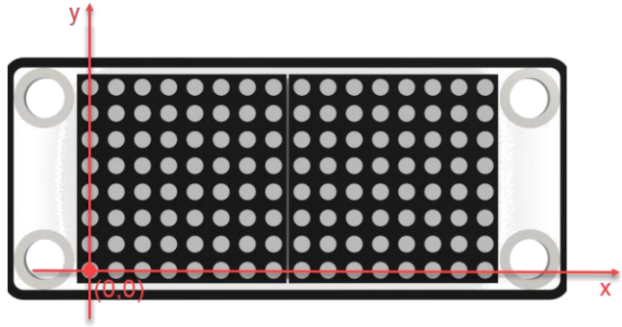

通过调用**HiwonderSDK.tm1640**库中的**update_display()** 函数，将**tm.display_buf**缓存区的字模刷新显示到点阵上，即可控制点阵屏幕显示所需的图案。
