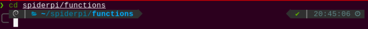
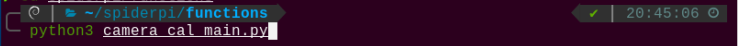
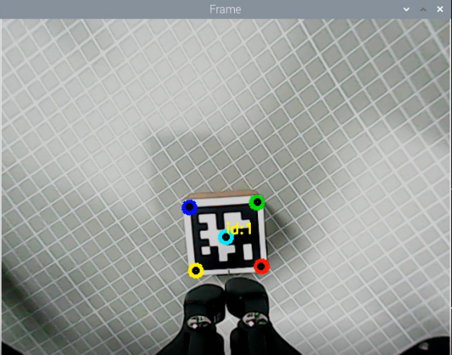
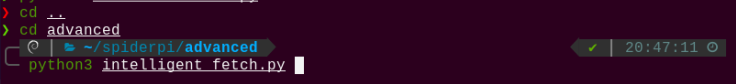
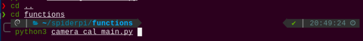
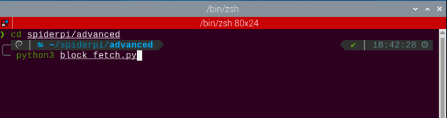
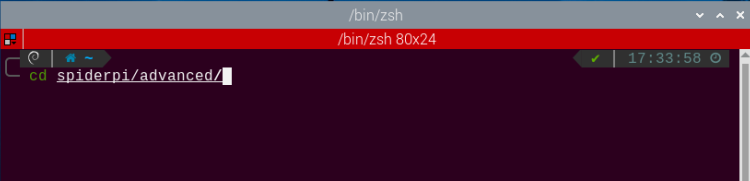
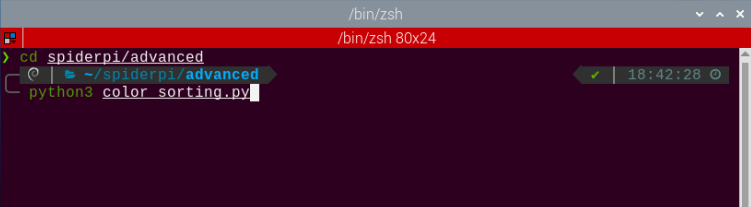
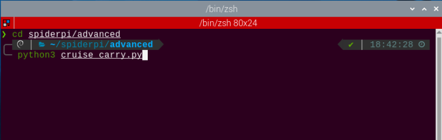

#  7. AI Visual Transporting & Kicking Ball Course

## 7.1 Locate the Ball

### 7.1.1 Program logic

Firstly, recognize the color of the ball. Firstly, convert the color space of the image from RGB into Lab. Then perform binaryzation, corrosion, dilation, etc., to obtain the contour only containing the target color and circle it.

Then use the robot body as a reference to establish a coordinate system, and then obtain the coordinate of the ball. Judge whether the ball is on the right or left through the coordinate of the x axis, and then control the corresponding foot to lift

### 7.1.2 Operation steps

The input command should be case sensitive and space sensitive.

(1) Boot up SpiderPi Pro, then remotely connect to Raspberry Pi desktop through VNC.

(2) Click  at upper left corner of desktop to open the Terminator.

(3) Enter the command “cd spiderpi/advanced” and press “Enter” to navigate to the directory where the game program is located.

```
cd spiderpi/advanced
```

(4) Input the command “python3 ball_orientation.py”, and then press Enter to start the game.

```
python3 ball_orientation.py
```

(5) If want to close this game, press “Ctrl+C” on LX terminal. If the game cannot be quit, please try again.

### 7.1.3 Project outcome

The default recognition color is green. If you want to modify it as other color, please check how to modify in “[7.1.5 Function Extension]()”

When the green ball is recognized, the green ball will be circled and its coordinate will be displayed on the terminal. And then control the robot to lift the corresponding leg.


### 7.1.4 Program Analysis

The source code of this program lies in: [/home/pi/spiderpi/advanced/ball_orientation.py]()

* **Import Function Library** 

{lineno-start=4}

```
import sys
import cv2
import math
import time
import threading
import numpy as np
from calibration.camera import Camera
from calibration.CalibrationConfig import *
from common import misc
from common import yaml_handle
from common import kinematics
from common.ros_robot_controller_sdk import Board
import arm_ik.arm_move_ik as AMK
```

(1) Import the libraries related to OpenCV, time, math, and threads. 

If want to call a function in library, you can use “library name+function name (parameter, parameter)”. For example:

{lineno-start=139}

```
                time.sleep(2)
```

Call `sleep` function in “time” library. The function `sleep ()` is used to delay. There are some built-in libraries in Python, so they can be called directly. For example, `time`, `cv2` and `math`. You can also write a new library like `yaml_handle”.

(2) Instantiate Function Library

<span class="mark">The name of function library is too long to memorize. For calling function easily, the library can be instantiated. For example:</span>

{lineno-start=13}

```
from common import yaml_handle
from common import kinematics
from common.ros_robot_controller_sdk import Board
import arm_ik.arm_move_ik as AMK
```

<span class="mark">After instantiating, you can directly input and call the function “Board.function name (parameter, parameter)”.</span>

* **Main Function Analysis** 

The python program `__name__ == ’__main__:’` is the main function of program. Firstly, the function `init()` is called to initialize. The initialization in this program includes: return the servo to the initial position, read the color threshold file. Generally there are also configurations for ports, peripherals, timing interrupts, etc., which are all done in the process of initialization.

{lineno-start=214}

```
if __name__ == '__main__':
    from sensor.ultrasonic_sensor import Ultrasonic
    ultrasonic = Ultrasonic()

    #加载参数(load parameter)
    param_data = np.load(calibration_param_path + '.npz')

    #获取参数(obtain parameter)
    mtx = param_data['mtx_array']
    dist = param_data['dist_array']
    newcameramtx, _ = cv2.getOptimalNewCameraMatrix(mtx, dist, (640, 480), 0, (640, 480))
    mapx, mapy = cv2.initUndistortRectifyMap(mtx, dist, None, newcameramtx, (640, 480), 5)

    init_move()
    load_config()
    camera = Camera()
    camera.camera_open()
```

* **Define Global Variables** 

{lineno-start=34}

```
current_pos = [[-199.53, -177.73, -100.0],
               [ -35.0, -211.27, -100.0],
               [199.53, -177.73, -100.0],
               [199.53,  177.73, -100.0],
               [ -35.0,  211.27, -100.0],
               [-199.53, 177.73, -100.0]]

# 左右两只前脚与摄像头坐标零点对应的参数(The parameters of the left and right front legs corresponding to the coordinates zero point of the camera)
left_pos =  [-220, -0, -80]
right_pos = [-220,  0, -80]


range_rgb = {
    'red': (0, 0, 255),
    'blue': (255, 0, 0),
    'green': (0, 255, 0),
    'black': (0, 0, 0),
    'white': (255, 255, 255)}

# 变量定义(define variables)
i = 0
ultrasonic = None
step = False
size = (640, 480)
old_x, old_y = 0, 0
initial_coord = (0, 18, 10)
world_x, world_y = -1, -1
lab_data = None
K,R,T = None,None,None
```

* **Image processing** 

**(1) Gaussian filtering**

Before converting the image from RGB into LAB space, denoise the image and use `GaussianBlur()` function in cv2 library for Gaussian filtering.

{lineno-start=167}

```
    frame_gb = cv2.GaussianBlur(frame_resize, (3, 3), 3) 
```

The meaning of the parameters in bracket is as follow:

The first parameter `frame_resize` is the input image.

The second parameter `(3, 3)` is the size of Gaussian kernel.

The third parameter `3` is the allowable variance around the average in Gaussian filtering. The larger the value, the larger the allowable variance around the average value; The smaller the value, the smaller the allowable variance around the average value.

**(2) Binaryzation processing**

Adopt `inRange()` function in cv2 library to perform binaryzation on the image.

{lineno-start=169}

```
    frame_mask = cv2.inRange(frame_lab,
                             (lab_data[color]['min'][0],
                              lab_data[color]['min'][1],
                              lab_data[color]['min'][2]),
                             (lab_data[color]['max'][0],
                              lab_data[color]['max'][1],
                              lab_data[color]['max'][2]))  #对原图像和掩模进行位运算(perform bitwise operation to original image and mask)
```

The first parameter in the bracket is the input image. The second and the third parameters respectively are the lower limit and upper limit of the threshold. When the RGB value of the pixel is between the upper limit and lower limit, the pixel is assigned a value of 1, otherwise, 0.

**(3) Corrosion and dilation**

To reduce the interference and make the image smoother, it is necessary to perform corrosion and dilation on the image.

{lineno-start=176}

```
    eroded = cv2.erode(frame_mask, cv2.getStructuringElement(cv2.MORPH_RECT, (3, 3)))  #腐蚀(erode)
    dilated = cv2.dilate(eroded, cv2.getStructuringElement(cv2.MORPH_RECT, (3, 3))) #膨胀(dilate)
```

`erode()` function is used for corrosion. Take `eroded = cv2.erode(frame_mask, cv2.getStructuringElement(cv2.MORPH_RECT, (3, 3)))` for example. The meaning of the parameters in bracket are as follow.

The first parameter `frame_mask` is the input image The second parameter `cv2.getStructuringElement(cv2.MORPH_RECT, (3, 3))` is the structural element and kernel deciding the nature of the operation. And the first parameter in the parenthesis is the kernel shape and the second parameter is the kernel dimension.

`dilate()` function is used for image dilation. And the meaning of the parameters in parenthesis is the same as that of `erode()` function.

**(4) Acquire the maximum contour**

After processing the image, acquire the contour of the target to be recognized, which involves `findContours()` function in cv2 library.

{lineno-start=178}

```
    contours = cv2.findContours(dilated, cv2.RETR_EXTERNAL, cv2.CHAIN_APPROX_NONE)[-2]  #找出轮廓(find contours)
```

The first parameter in parentheses is the input image; the second parameter is the retrieval mode of the contour; the third parameter is the approximation method of the contour.

Find the contour of the maximum area among the obtained contours. To avoid interference, please set a minimum value. Only when the area is larger than this value, the target contour is valid.

{lineno-start=87}

```
def get_area_maxContour(contours):
    contour_area_temp = 0
    contour_area_max = 0
    area_max_contour = None
    max_area = 0

    for c in contours:  # 历遍所有轮廓(traverse through all contours)
        contour_area_temp = math.fabs(cv2.contourArea(c))  # 计算轮廓面积(calculate contour area)
        if contour_area_temp > contour_area_max:
            contour_area_max = contour_area_temp
            if contour_area_temp >= 100:  # 只有在面积大于设定时，最大面积的轮廓才是有效的，以过滤干扰(Only when the area is greater than the set value, the contour with the maximum area is considered valid to filter out interference)
                area_max_contour = c
                max_area = contour_area_temp

    return area_max_contour, max_area  # 返回最大的轮廓, 面积(Return the largest contour and area)
```

* **Feedback** 

According to the coordinate of the X axis, decide which leg of the robot to lift.

{lineno-start=129}

```
def move():
    global step
    global world_x, world_y
    
    while True:
        if step:
            if world_x > 0: # 目标在右边(the target is on the right)
                # 抬起右前脚(lift the right front leg)
                current_pos[5] = [-300, 100, -50]
                ik.stand(current_pos) 
                time.sleep(2)
                
            else: # 目标在左边(the target is on the left)
                # 抬起左前脚(lift the left front leg)
                current_pos[0] = [-300, -100, -50]
                ik.stand(current_pos)
                time.sleep(2)
                
        else:
            # 回到初始姿态(return to the initial status)
            current_pos[0] = [-199.53, -177.73, -100]
            ik.stand(current_pos)
            current_pos[5] = [-199.53, 177.73, -100]
            ik.stand(current_pos)
            time.sleep(1)
```

`current_pos[5] = [-300, 100, -50]` and `current_pos[0] = [-300, -100, -50]` are used to control the movement of the leg. 

Take `current_pos[5] = [-300, 100, -50]` for example.

The first parameter `5` is used to control the position of the leg. Robot legs is numbered counterclockwise.

The second parameter `[-300, 100, -50]` is x, y, z coordinate of the end of the leg.

### 7.1.5 Function extension

The program defaults to recognize green ball and display its coordinate. If you want to modify the recognition color, like red, you can follow the below steps to operate.

(1) Input the command **“cd spiderpi/advanced”** and press **“Enter”** to get to the catalog where the game programs are stored.

```
cd spiderpi/advanced
```


(2) Input command **“sudo vim ball_orientation.py”** and press **“Enter”** to open the program file.

```
sudo vim ball_orientation.py
```


(3) Locate these codes.


(4) Press **“i”** key to enter the editing mode.


(5) Modify “green” of `color=’green’` as “red”, as shown below.


(6) After successful modification, press **“Esc”** and then input **“:wq”** to save the file and exit the editor.


(7) Execute the steps in “[7.1.2 Operation Steps]()” to locate the red ball.

## 7.2 Kick the Ball

In the experiment, a small “ball” is used for demonstration. A color block can also be used to achieve intelligent kicking of the block.

### 7.2.1 Program Logic

Firstly, program SpiderPi Pro to recognize the color. Convert RGB color space into Lab. Then perform binaryzation, corrosion, dilation, etc., to obtain the contour only containing the target color and circle it.

The robot will perform color recognition till the coordinate of the “ball” is obtained. Then it will approach the ball. Next, according to the X axis coordinate of the ball, control the front leg which is closer to the ball to kick.

### 7.2.2 Operation Steps

:::{Note}

The input command should be case sensitive and space sensitive.

:::

(1) Boot up SpiderPi Pro, then remotely connect to Raspberry Pi desktop through VNC.

(2) Click  at upper left corner of desktop to open the Terminator.


(3) Enter the command and press **“Enter”** to navigate to the directory where the game program is located.

```
cd spiderpi/advanced
```

(4) Input the command and then press **“Enter”** to start the game.

```
python3 intelligent_kick.py
```

(5) If want to close this game, press “Ctrl+C” on LX terminal. If the game cannot be quit, please try again.

### 7.2.3 Project Outcome

:::{Note}

The default recognition color is green.

:::

After the green ball is recognized, based on the position of the “ball”, SpiderPi Pro will use the front leg closer to the ball to kick the ball. Besides, the ball will be circled and the color of the “ball” will be printed on the camera returned image.


### 7.2.4 Program Analysis

The source codes of this program are stored in: [/home/pi/spiderpi/advanced/intelligent_kick.py]()

* **Import Function Library** 

{lineno-start=4}

```
import sys
import cv2
import math
import numpy as np
import time
import threading
from calibration.camera import Camera
from calibration.CalibrationConfig import *
from common import misc
from common.pid import PID
from common import yaml_handle
from common import kinematics
from common.ros_robot_controller_sdk import Board
from sensor.ultrasonic_sensor import Ultrasonic
import arm_ik.arm_move_ik as AMK
```

(1) Import the libraries related to OpenCV, time, math, and threads. If want to call a function in library, you can use “library name+function name (parameter, parameter)”. For example:

{lineno-start=251}

```
            time.sleep(0.05)
```

Call `sleep`  function in `time` library. The function `sleep ()` is used to delay. There are some built-in libraries in Python, so they can be called directly. For example, `time`, `cv2` and `math`. You can also write a new library like `yaml_handle`.

(2) Instantiate Function Library

<span class="mark">The name of function library is too long to memorize. For calling function easily, the library can be instantiated. For example:</span>

{lineno-start=12}

```
from common import misc
from common.pid import PID
from common import yaml_handle
from common import kinematics
from common.ros_robot_controller_sdk import Board
```

<span class="mark">After instantiating, you can directly input and call the function `Board.function name (parameter, parameter)`.</span>

* **Main Function Analysis** 

The python program  `__name__ == ’__main__:’`  is the main function of program. Firstly, the function `init()` is called to initialize. The initialization in this program includes: return the servo to the initial position, read the color threshold file. Generally there are also configurations for ports, peripherals, timing interrupts, etc., which are all done in the process of initialization.

{lineno-start=338}

```
if __name__ == '__main__':
    from sensor.ultrasonic_sensor import Ultrasonic

    ultrasonic = Ultrasonic()

    #加载参数(load parameter)
    param_data = np.load(calibration_param_path + '.npz')

    #获取参数(obtain parameter)
    mtx = param_data['mtx_array']
    dist = param_data['dist_array']
    newcameramtx, _ = cv2.getOptimalNewCameraMatrix(mtx, dist, (640, 480), 0, (640, 480))
    mapx, mapy = cv2.initUndistortRectifyMap(mtx, dist, None, newcameramtx, (640, 480), 5)

    init()
    camera = Camera()
    camera.camera_open()
```

* **Image processing** 

**(1) Gaussian filtering**

Before converting the image from RGB into LAB space, denoise the image and use `GaussianBlur()` function in cv2 library for Gaussian filtering.

{lineno-start=273}

```
    frame_gb = cv2.GaussianBlur(frame_resize, (5, 5), 5)  
```

The meaning of the parameters in bracket is as follow

The first parameter `frame_resize` is the input image.

The second parameter `(5, 5)` is the size of Gaussian kernel.

The third parameter `5` is the allowable variance around the average in Gaussian filtering. The larger the value, the larger the allowable variance around the average value; The smaller the value, the smaller the allowable variance around the average value.

**(2) Binaryzation processing**

Adopt `inRange()` function in cv2 library to perform binaryzation on the image.

{lineno-start=281}

``` 
            frame_mask = cv2.inRange(frame_lab,
                                         (lab_data[i]['min'][0],
                                          lab_data[i]['min'][1],
                                          lab_data[i]['min'][2]),
                                         (lab_data[i]['max'][0],
                                          lab_data[i]['max'][1],
                                          lab_data[i]['max'][2]))  #对原图像和掩模进行位运算(perform bitwise operation to original image and mask)
```

The first parameter in the bracket is the input image. The second and the third parameters respectively are the lower limit and upper limit of the threshold. When the RGB value of the pixel is between the upper limit and lower limit, the pixel is assigned a value of 1, otherwise, 0.

**(3) Corrosion and dilation**

To reduce the interference and make the image smoother, it is necessary to perform corrosion and dilation on the image.

{lineno-start=288}

```
            eroded = cv2.erode(frame_mask, cv2.getStructuringElement(cv2.MORPH_RECT, (3, 3)))  #腐蚀(erode)
            dilated = cv2.dilate(eroded, cv2.getStructuringElement(cv2.MORPH_RECT, (3, 3))) #膨胀(dilate)
```

`erode()` function is used for corrosion. Take `eroded = cv2.erode(frame_mask, cv2.getStructuringElement(cv2.MORPH_RECT, (3, 3)))` for example. The meaning of the parameters in bracket are as follow.

The first parameter `frame_mask` is the input image

The second parameter `cv2.getStructuringElement(cv2.MORPH_RECT, (3, 3))` is the structural element and kernel deciding the nature of the operation. And the first parameter in the parenthesis is the kernel shape and the second parameter is the kernel dimension.

`dilate()` function is used for image dilation. And the meaning of the parameters in parenthesis is the same as that of `erode()` function.

**(4) Acquire the maximum contour**

After processing the image, acquire the contour of the target to be recognized, which involves `findContours()` function in cv2 library.

{lineno-start=292}

```
            contours = cv2.findContours(dilated, cv2.RETR_EXTERNAL, cv2.CHAIN_APPROX_NONE)[-2]  # 找出轮廓(find contours)
```

The first parameter in parentheses is the input image; the second parameter is the retrieval mode of the contour; the third parameter is the approximation method of the contour.

Find the contour of the maximum area among the obtained contours. To avoid interference, please set a minimum value. Only when the area is larger than this value, the target contour is valid.

{lineno-start=66}

```
def get_area_maxContour(contours):
    contour_area_temp = 0
    contour_area_max = 0

    area_max_contour = None
    max_area = 0

    for c in contours:  # 历遍所有轮廓(traverse through all contours)
        contour_area_temp = math.fabs(cv2.contourArea(c))  # 计算轮廓面积(calculate contour area)
        if contour_area_temp > contour_area_max:
            contour_area_max = contour_area_temp
            if contour_area_temp > 50:  # 只有在面积大于设定时，最大面积的轮廓才是有效的，以过滤干扰(Only when the area is greater than the set value, the contour with the maximum area is considered valid to filter out interference)
                area_max_contour = c
                max_area = contour_area_temp

    return area_max_contour, max_area  # 返回最大的轮廓(return the largest contour)
```

After the contour with the largest area is acquired, call `minEnclosingCircle()` and `drawContours()`  functions in cv2 library to acquire the smallest circumscribed circle of the target contour and mark it.

{lineno-start=295}

```
    if area_max > 50:  # 有找到最大面积(the maximum area has been found)
        (centerX, centerY), radius = cv2.minEnclosingCircle(areaMaxContour) #获取最小外接圆(obtain the minimum circumscribed circle)
        centerX = int(misc.map(centerX, 0, size[0], 0, img_w))
        centerY = int(misc.map(centerY, 0, size[1], 0, img_h))
        radius = int(misc.map(radius, 0, size[0], 0, img_w))
        cv2.circle(img, (int(centerX), int(centerY)), int(radius), range_rgb[detect_color], 2)
```

* **Acquire the coordinate** 

After the coordinate is confirmed, convert the coordinate into actual distance through calculation.

{lineno-start=159}

```
            if abs(dx) > 5 or dy > 20 or dy < -10:
                if dy < -10:
                    direction = 0
                elif dy > 20 and abs(dx) < 15:
                    direction = 180
                    dx = -dx
                    
                if abs(dy) > 50:
                    amplitude = int(abs(dy)-abs(dx)*2)
                    
                elif abs(dy) < 20:
                    amplitude = int(abs(dy) + abs(dx)*1.5)
                    
                else:
                    amplitude = abs(dy)
                if dx > 5:
                    ago_direction = 'right'
                elif dx < -5:
                    ago_direction = 'left'
                ik.setStepMode(ik.initial_pos, 2, 2, amplitude*1.5, dz, direction, 0, dx/10, p, o, 50, 1)
                move_st = True
```

* **Kick the ball** 

Firstly, control the robot to approach the ball.

{lineno-start=177}

```
                    ago_direction = 'left'
                ik.setStepMode(ik.initial_pos, 2, 2, amplitude*1.5, dz, direction, 0, dx/10, p, o, 50, 1)
                move_st = True
            
            else:
                ik.setStepMode(ik.initial_pos, 2, 2, 70, 20, 0, 0, 0, p, o, 50, 2)  # 朝前直走(go straight forward)
```

Judge the ball is closer to which front leg according to the X axis coordinate of the ball. And control the corresponding front leg to kick the ball.

{lineno-start=182}

```
                ik.setStepMode(ik.initial_pos, 2, 2, 70, 20, 0, 0, 0, p, o, 50, 2)  # 朝前直走(go straight forward)
                ik.stand(ik.initial_pos, t=500)
                if x_dis <= 510:
                    ik.stand(current_pos)
                    time.sleep(0.5)
                    # 抬起右前脚(lift right front leg)
                    current_pos[5] = [-199.53, 177.73, -60]
                    ik.stand(current_pos) 
                    time.sleep(0.2)
                    # 右脚踢球(kick the ball with right leg)
                    current_pos[5] = [-340, -30, -80]
                    ik.stand(current_pos,200) 
                    time.sleep(0.5)
                    # 回到初始姿态(return to initial position)
                    current_pos[5] = [-199.53, 177.73, -100]
                    ik.stand(current_pos)
                    ik.stand(ik.initial_pos, t=500)
                else:
                    ik.stand(current_pos)
                    time.sleep(0.5)
                    # 抬起左前脚(lift left front leg)
                    current_pos[0] = [-199.53, 177.73, -60]
                    ik.stand(current_pos) 
                    time.sleep(0.2)
                    # 左脚踢球(kick the ball with left leg)
                    current_pos[0] = [-340, 30, -80]
                    ik.stand(current_pos,200) 
                    time.sleep(0.5)
                    # 回到初始姿态(return to initial position)
                    current_pos[0] = [-199.53, -177.73, -100]
                    ik.stand(current_pos)
                    ik.stand(ik.initial_pos, t=500)
```

The attitude data of the SpiderPi Pro is defined as a 3×6 array, and the array elements represent the X, Y, and Z coordinates of the ends of the six legs (unit is mm). The left front leg is the first leg, and the leg is sequenced counterclockwise, hence the right front leg is the sixth leg.

{lineno-start=57}

```
current_pos = [[-199.53, -177.73, -100.0],
               [ -35.0, -211.27, -100.0],
               [199.53, -177.73, -100.0],
               [199.53,  177.73, -100.0],
               [ -35.0,  211.27, -100.0],
               [-199.53, 177.73, -100.0]]
```

Modify the coordinate parameter of the corresponding leg, and call `stand()` function in `kinematics.IK`  library to update the data, which can change the posture of SpiderPi Pro.

{lineno-start=182}

```
                ik.setStepMode(ik.initial_pos, 2, 2, 70, 20, 0, 0, 0, p, o, 50, 2)  # 朝前直走(go straight forward)
                ik.stand(ik.initial_pos, t=500)
                if x_dis <= 510:
                    ik.stand(current_pos)
                    time.sleep(0.5)
                    # 抬起右前脚(lift right front leg)
                    current_pos[5] = [-199.53, 177.73, -60]
                    ik.stand(current_pos) 
                    time.sleep(0.2)
                    # 右脚踢球(kick the ball with right leg)
                    current_pos[5] = [-340, -30, -80]
                    ik.stand(current_pos,200) 
                    time.sleep(0.5)
                    # 回到初始姿态(return to initial position)
                    current_pos[5] = [-199.53, 177.73, -100]
                    ik.stand(current_pos)
                    ik.stand(ik.initial_pos, t=500)
                else:
                    ik.stand(current_pos)
                    time.sleep(0.5)
                    # 抬起左前脚(lift left front leg)
                    current_pos[0] = [-199.53, 177.73, -60]
                    ik.stand(current_pos) 
                    time.sleep(0.2)
                    # 左脚踢球(kick the ball with left leg)
                    current_pos[0] = [-340, 30, -80]
                    ik.stand(current_pos,200) 
                    time.sleep(0.5)
                    # 回到初始姿态(return to initial position)
                    current_pos[0] = [-199.53, -177.73, -100]
                    ik.stand(current_pos)
                    ik.stand(ik.initial_pos, t=500)
```

## 7.3 Position Calibration

### 7.3.1 Preface

Position calibration is to adjust where the SpiderPi Pro picks the object, which aims at accurate picking.

Before the game starts, you need to paste the included ID1 sticker on one block.

The overall implementation process of this lesson is as follows:

It’s necessary to import the required libraries and modules, load the calibration parameters of the camera (matrix mtx and distortion coefficient dist), and calculate the new camera matrix newcameramtx. Then, detect AprilTag markers through positioning, image segmentation, and contour finding. After contour positioning, detect quadrilaterals and fit lines to form a closed loop by obtaining the four corner points. Next, update the status, calculate the world coordinates, update the image, and perform calibration.

After modification, SpiderPi Pro can pick the target object accurately.

### 7.3.2 Operation steps

The input command should be case sensitive and space sensitive.

(1) Boot up SpiderPi Pro, then remotely connect to Raspberry Pi desktop through VNC.

(2) Click  at upper left corner of desktop, or press “Ctrl+Alt+T” to open LX terminal.


(3) Enter the command “cd spiderpi/functions” and press “Enter” to navigate to the directory where the game program is located.

```
cd spiderpi/functions
```



(4) Input command “python3 camera_cal_main.py” and press “Enter” to run calibration program.

```
python3 camera_cal_main.py
```



(5) Place the block with ID1 sticker right under the gripper.

(6) If you want to exit the game, press “Ctrl+C” to close the LX terminal interface. If it cannot be closed, you can try again.

(7) When you hear two beeps, start calibrating the position.

(8) 15s later, the robot will beep three times continuously. When the 5 black dots overlap the 5 colored dots, it means that the calibration is completed.



:::{Note}

 If it beeps three times continuously but 5 black dots don’t coincide with the 5 colored dots, the calibration doesn’t work. And you can adjust the lighting again and then start the program of position calibration.

:::

(9) Having calibrated, press “Ctrl+C” to close the LX terminal interface. If it cannot be closed, you can try again.

(10\) En<span class="mark">ter the command “cd ..” and press “Enter” to switch to the parent directory; enter the “cd advand/” command</span> and press “Enter” to get into the catalog of intelligent picking program; and place the red block under the gripper and input the command “python3 intelligent_fetch.py”, then press “Enter” to start the intelligent picking game.

```
cd ..
```

```
cd advanced/
```

```
python3 intelligent_fetch.py
```



(11) If the gripper is not at the accurate position during picking, as the picture shown, you can run the calibration program to make fine adjustment again.

(12\) Enter command<span class="mark">s “cd ..”, “cd functions”,</span> and “python3 camera_cal\_ main.py” in turn to run the calibration program.
```
cd ..
```

```pycon
cd functions
```
```pycon
python3 camera_cal_ main.py
```


(13\) Place the tag block according to the picking effect in the game. For example, if the gripper stops in front of the red block not at the middle, place the tag block under the gripper not at the position of the red block.

(14\) Having calibrated, run the intelligent picking program in the same way to check the calibration effect. You can see that the gripper can stop at the middle of the block and pick the block.

### 7.3.3 Program Analysis

The source code of the program is located in:[/home/pi/spiderpi/functions/camera_cal_main.py]()

{lineno-start=1}

```
#!/usr/bin/python3
# coding=utf8
import os
import cv2
import yaml
import time
import threading
import numpy as np
from common import apriltag
from calibration.camera import Camera
from calibration.CalibrationConfig import *
from common import kinematics
from common.ros_robot_controller_sdk import Board
import arm_ik.arm_move_ik as AMK
    
#加载参数(load parameters)
param_data = np.load(calibration_param_path + '.npz')
#获取参数(obtain parameters)
mtx = param_data['mtx_array']
dist = param_data['dist_array']
newcameramtx, _ = cv2.getOptimalNewCameraMatrix(mtx, dist, (640, 480), 0, (640, 480))


board = Board()
ik = kinematics.IK(board)
ak = AMK.ArmIK()


at_detector = apriltag.Detector(apriltag.DetectorOptions(families='tag36h11'))
marker_corners = np.asarray([[0, 0, 40],
                             [16.65, -16.65, 40],  # TAG_SIZE = 33.30mm
                             [-16.65, -16.65, 40],
                             [-16.65, 16.65, 40],
                             [16.65, 16.65, 40]],
                             dtype=np.float64)
marker_corners_block = np.copy(marker_corners)
marker_corners_block[:, 2] = marker_corners_block[:, 2] - 40
```

* **Import Function Library** 

{lineno-start=3}

```
import os
import cv2
import yaml
import time
import threading
import numpy as np
from common import apriltag
from calibration.camera import Camera
from calibration.CalibrationConfig import *
from common import kinematics
from common.ros_robot_controller_sdk import Board
import arm_ik.arm_move_ik as AMK
```

(1) Import the libraries related to OpenCV, time, math, threads, and inverse kinematics. If want to call a function in library, you can use “library name+function name (parameter, parameter)”. For example:

{lineno-start=174}

```
    time.sleep(3)
```

Call `sleep` function in `time` library. The function `sleep ()` is used to delay.

There are some built-in libraries in Python, therefore they can be called directly. For example, `time`, `cv2` and `math`. You can also write a new library like `yaml_handle`.

(2) Instantiate Function Library

The name of function library is too long to memorize. For calling function easily, the library can be instantiated. For example:

{lineno-start=13}

```
from common.ros_robot_controller_sdk import Board
```

<span class="mark">After instantiating, you can directly input and call the function `Board.function name (parameter, parameter)`.</span>

* **Main Function Analysis** 

The python program  `__name__ == ’__main__:’`  is the main function of program. Firstly, the function `init()` is called to initialize. The initialization in this program includes: return the servo to the initial position, read the color threshold file. Generally there are also configurations for ports, peripherals, timing interrupts, etc., which are all done in the process of initialization.

{lineno-start=189}

```
if __name__ == '__main__':
    
    #mapx, mapy = cv2.initUndistortRectifyMap(mtx, dist, None, newcameramtx, (640, 480), 5)
    
    debug = False
    if debug:
        print('Debug Mode')
        
    initMove()
    state = State()
    camera = Camera()
    camera.camera_open()
    while True:
        img = camera.frame
        if img is not None:
            frame = img.copy()
            #frame = cv2.remap(frame, mapx, mapy, cv2.INTER_LINEAR)  # 畸变矫正(distortion correction)
            Frame = run(frame)           
            cv2.imshow('Frame', Frame)
            key = cv2.waitKey(1)
            if key == 27:
                break
        else:
            time.sleep(0.01)
    camera.camera_close()
    cv2.destroyAllWindows()  
```

(1) Initialize posture and set servo position

{lineno-start=56}

```
def initMove():
    ik.stand(ik.initial_pos)
    board.bus_servo_set_position(1, [[25, 650]])
    ak.setPitchRangeMoving((0, 15, 5), -90, -90, 100, 2)
```

(2) Convert image data to actual physical space coordinates

{lineno-start=62}

```
def camera_to_world(cam_mtx, r, t, img_points):
    inv_k = np.asmatrix(cam_mtx).I
    r_mat = np.zeros((3, 3), dtype=np.float64)
    cv2.Rodrigues(r, r_mat)
    # invR * T
    inv_r = np.asmatrix(r_mat).I  # 3*3
    transPlaneToCam = np.dot(inv_r, np.asmatrix(t))  # 3*3 dot 3*1 = 3*1
    world_pt = []
    coords = np.zeros((3, 1), dtype=np.float64)
    for img_pt in img_points:
        coords[0][0] = img_pt[0][0]
        coords[1][0] = img_pt[0][1]
        coords[2][0] = 1.0
        worldPtCam = np.dot(inv_k, coords)  # 3*3 dot 3*1 = 3*1
        # [x,y,1] * invR
        worldPtPlane = np.dot(inv_r, worldPtCam)  # 3*3 dot 3*1 = 3*1
        # zc
        scale = transPlaneToCam[2][0] / worldPtPlane[2][0]
        # zc * [x,y,1] * invR
        scale_worldPtPlane = np.multiply(scale, worldPtPlane)
        # [X,Y,Z]=zc*[x,y,1]*invR - invR*T
        worldPtPlaneReproject = np.asmatrix(scale_worldPtPlane) - np.asmatrix(transPlaneToCam)  # 3*1 dot 1*3 = 3*3
        pt = np.zeros((3, 1), dtype=np.float64)
        pt[0][0] = worldPtPlaneReproject[0][0]
        pt[1][0] = worldPtPlaneReproject[1][0]
        pt[2][0] = 0
        world_pt.append(pt.T.tolist())
    return world_pt
```

(3) Input image processing tag

{lineno-start=92}

```
def run(img):
    frame_gray = cv2.cvtColor(np.copy(img), cv2.COLOR_RGB2GRAY)
    tags = at_detector.detect(frame_gray)
    for tag in tags:
        center = np.array(tag.center).astype(int)
        if tag.tag_id == 1:
            corners = tag.corners.reshape(1, -1, 2).astype(np.float32)
            pts = np.insert(corners[0], 0, values=tag.center, axis=0)
            with state.lock:
                rtl, new_r, new_t = cv2.solvePnP(marker_corners, pts, state.K, None)
                if rtl:
                    state.R = new_r if state.R is None else state.R * 0.95 + new_r * 0.05
                    state.T = new_t if state.T is None else state.T * 0.95 + new_t * 0.05
                rtl, new_r, new_t = cv2.solvePnP(marker_corners_block, pts, state.K, None)
                if rtl:
                    state.R_40 = new_r if state.R_40 is None else state.R_40 * 0.95 + new_r * 0.05
                    state.T_40 = new_t if state.T_40 is None else state.T_40 * 0.95 + new_t * 0.05
                if state.R is not None:
                    img_pts, jac = cv2.projectPoints(marker_corners, state.R, state.T, state.K, None)
                else:
                    img_pts = []
            corners = corners.astype(int)
            
            w = camera_to_world(state.K, state.R_40, state.T_40,
                                        center.reshape((1, 1, 2)))[0][0]
            print(center.reshape((1, 1, 2)))
            cv2.circle(img, tuple(corners[0][0]), 5, (255, 0, 0), 12)
            cv2.circle(img, tuple(corners[0][1]), 5, (0, 255, 0), 12)
            cv2.circle(img, tuple(corners[0][2]), 5, (0, 0, 255), 12)
            cv2.circle(img, tuple(corners[0][3]), 5, (0, 255, 255), 12)
            cv2.circle(img, tuple(center), 5, (255, 255, 0), 12)
            cv2.putText(img, "id:%d" % tag.tag_id,
                        (center[0], center[1] - 5), cv2.FONT_HERSHEY_SIMPLEX, 0.7, (0, 255, 255), 2)
            for i, c in enumerate(img_pts):
                cv2.circle(img, tuple(c.astype(int)[0]), 3, (0, 0, 0), 4)
        else:
            with state.lock:
                if state.R_40 is not None:
                    
                    w = camera_to_world(state.K, state.R_40, state.T_40,
                                        center.reshape((1, 1, 2)))[0][0]
                else:
                    w = 0, 0, 0
            cv2.putText(img, "id:{} x:{:.2f} y:{:.2f}".format(tag.tag_id, w[0], w[1]),
                        (center[0] - 20, center[1] - 5), cv2.FONT_HERSHEY_SIMPLEX, 0.7, (255, 0, 0), 2)
    return img
```

(4) Grayscale Transformation 

Convert an input color image to grayscale image using `cv2.cvtColor`.

{lineno-start=93}

```
    frame_gray = cv2.cvtColor(np.copy(img), cv2.COLOR_RGB2GRAY)
```

(5) Tag Detection:

{lineno-start=94}

```
    tags = at_detector.detect(frame_gray)
```

(6) Tag Processing:

{lineno-start=97}

```
        if tag.tag_id == 1:
            corners = tag.corners.reshape(1, -1, 2).astype(np.float32)
            pts = np.insert(corners[0], 0, values=tag.center, axis=0)
            with state.lock:
                rtl, new_r, new_t = cv2.solvePnP(marker_corners, pts, state.K, None)
                if rtl:
                    state.R = new_r if state.R is None else state.R * 0.95 + new_r * 0.05
                    state.T = new_t if state.T is None else state.T * 0.95 + new_t * 0.05
                rtl, new_r, new_t = cv2.solvePnP(marker_corners_block, pts, state.K, None)
                if rtl:
                    state.R_40 = new_r if state.R_40 is None else state.R_40 * 0.95 + new_r * 0.05
                    state.T_40 = new_t if state.T_40 is None else state.T_40 * 0.95 + new_t * 0.05
                if state.R is not None:
                    img_pts, jac = cv2.projectPoints(marker_corners, state.R, state.T, state.K, None)
                else:
                    img_pts = []
            corners = corners.astype(int)
```

① Traverse all detected tags and obtain the center and corner coordinates for each tag.

② If the tag ID is 1, process it and perform pose estimation using  `cv2.solvePnP`. This updates the state variables R and T.

(7) Coordinate transformation and visual marker:

{lineno-start=115}

```
            w = camera_to_world(state.K, state.R_40, state.T_40,
                                        center.reshape((1, 1, 2)))[0][0]
            print(center.reshape((1, 1, 2)))
            cv2.circle(img, tuple(corners[0][0]), 5, (255, 0, 0), 12)
            cv2.circle(img, tuple(corners[0][1]), 5, (0, 255, 0), 12)
            cv2.circle(img, tuple(corners[0][2]), 5, (0, 0, 255), 12)
            cv2.circle(img, tuple(corners[0][3]), 5, (0, 255, 255), 12)
            cv2.circle(img, tuple(center), 5, (255, 255, 0), 12)
            cv2.putText(img, "id:%d" % tag.tag_id,
                        (center[0], center[1] - 5), cv2.FONT_HERSHEY_SIMPLEX, 0.7, (0, 255, 255), 2)
            for i, c in enumerate(img_pts):
                cv2.circle(img, tuple(c.astype(int)[0]), 3, (0, 0, 0), 4)
        else:
            with state.lock:
                if state.R_40 is not None:
                    
                    w = camera_to_world(state.K, state.R_40, state.T_40,
                                        center.reshape((1, 1, 2)))[0][0]
                else:
                    w = 0, 0, 0
            cv2.putText(img, "id:{} x:{:.2f} y:{:.2f}".format(tag.tag_id, w[0], w[1]),
                        (center[0] - 20, center[1] - 5), cv2.FONT_HERSHEY_SIMPLEX, 0.7, (255, 0, 0), 2)
    return img
```

Use the `camera_to_world` function to convert the point from the camera coordinate system to the physical coordinate system.

Draw the corner points and the center point of the tag on the image, and use `cv2.putText` to display the tag ID and physical coordinates on the image. 

The parameters in the function are as follows:  

① The first parameter `img` is the input image;  

② The second parameter `str(tag_id)` is the content to be displayed;  

③ The third parameter `(10, img.shape[0] - 30)` is the display position;  

④ The fourth parameter `cv2.FONT_HERSHEY_SIMPLEX` is the font type;  

⑤ The fifth parameter `0.65` is the font size;  

⑥ The sixth parameter `[0, 255, 255]` is the font color, in BGR order, which is yellow;  

⑦ The seventh parameter `2` is the font thickness.  

Finally, the function returns the image.

(8) Action Control

{lineno-start=173}

```
def move():
    time.sleep(3)
    board.set_buzzer(2400, 0.1, 0.4, 1)
    down_cb()
    time.sleep(10)
    board.set_buzzer(2400, 0.1, 0.4, 2)
    up_cb()
    time.sleep(15)
    board.set_buzzer(2400, 0.1, 0.4, 3)
    save_cb()
```

<span class="mark">Upon observing that the five black dots overlapped with the five colored dots on the AprilTag block, SpiderPi Pro makes three beeps.</span>

## 7.4 Block Picking

### 7.4.1 Program Logic

Firstly, program SpiderPi Pro to recognize colors through Lab color space. Convert the RGB color space to Lab, and then perform image binarization, expansion, corrosion and other operations in sequence to obtain an outline only containing the target color. Then, circle the color outline to realize object color recognition.

After color recognition, calculate based on the feedback of the image position, and control the robotic arm of SpiderPi Pro to approach the target block, and open the gripper. Then pick the block to the corresponding position.

### 7.4.2 Operation Steps

:::{Note}

The input command should be case sensitive and space sensitive.

:::

(1) Boot up SpiderPi Pro, then remotely connect to Raspberry Pi desktop through VNC.

(2) Click  at upper left corner of desktop to open the Terminator.


(3) Enter the command “cd spiderpi/advanced” and press “Enter” to navigate to the directory where the game program is located.

```
cd spiderpi/advanced
```


(4) Input the command “python3 block_fetch.py”, and then press “Enter” to start the game.

```
python3 block_fetch.py
```



(5) If want to close this game, press “Ctrl+C” on LX terminal. If the game cannot be quit, please try again.

### 7.4.3 Project Outcome

After the block is recognized, the robotic arm will approach the block and open the gripper. After the block is placed to the middle of gripper, the robotic arm will transfer it to the right side.

### 7.4.4 Program Analysis

The source code of this program lies in: [/home/pi/spiderpi/advanced/block_fetch.py]()

* **Import Function Library** 

{lineno-start=4}

```
import sys
import cv2
import math
import time
import threading
import numpy as np
from common import misc
from common import yaml_handle
from common import kinematics
from common.ros_robot_controller_sdk import Board
from calibration.camera import Camera
from calibration.CalibrationConfig import *
import arm_ik.arm_move_ik as AMK
from sensor.ultrasonic_sensor import Ultrasonic
```

(1) Import the libraries related to OpenCV, time, math, and threads.

 If want to call a function in library, you can use “library name+function name (parameter, parameter)”. For example:</span>

{lineno-start=119}

```
            time.sleep(0.5)
```

Call `sleep` function in “time” library. The function `sleep ()` is used to delay. There are some built-in libraries in Python, so they can be called directly. For example, `time`, `cv2` and `math`. You can also write a new library like `yaml_handle`.

(2) Instantiate Function Library

<span class="mark">The name of function library is too long to memorize. For calling function easily, the library can be instantiated. For example:</span>

{lineno-start=10}

```
from common import misc
from common import yaml_handle
from common import kinematics
from common.ros_robot_controller_sdk import Board
```

After instantiating, you can directly input and call the function `Board.function name (parameter, parameter)`.

* **Main Function Analysis** 

The python program  `__name__ == ’__main__:’` is the main function of program. Firstly, the function `init()` is called to initialize. The initialization in this program includes: return the servo to the initial position, read the color threshold file. Generally there are also configurations for ports, peripherals, timing interrupts, etc., which are all done in the process of initialization.</span>

{lineno-start=215}

```
if __name__ == '__main__':
    #加载参数(load parameter)
    param_data = np.load(calibration_param_path + '.npz')

    #获取参数(obtain parameter)
    mtx = param_data['mtx_array']
    dist = param_data['dist_array']
    newcameramtx, _ = cv2.getOptimalNewCameraMatrix(mtx, dist, (640, 480), 0, (640, 480))
    mapx, mapy = cv2.initUndistortRectifyMap(mtx, dist, None, newcameramtx, (640, 480), 5)

    init_move()
    load_config()
    camera = Camera()
    camera.camera_open()
```

* **Image Processing** 

**(1) Gaussian filtering**

Before converting the image from RGB into LAB space, denoise the image and use `GaussianBlur()` function in cv2 library for Gaussian filtering.

{lineno-start=161}

```
    frame_gb = cv2.GaussianBlur(img, (3, 3),3)  
```

The meaning of the parameters in bracket is as follow

The first parameter `img` is the input image.

The second parameter `(3, 3)` is the size of Gaussian kernel.

The third parameter `3` is the allowable variance around the average in Gaussian filtering. The larger the value, the larger the allowable variance around the average value; The smaller the value, the smaller the allowable variance around the average value.

**(2) Binaryzation processing**

Adopt `inRange()` function in cv2 library to perform binaryzation on the image.

{lineno-start=162}

```
    frame_mask = cv2.inRange(frame_lab,
                             (lab_data[color]['min'][0],
                              lab_data[color]['min'][1],
                              lab_data[color]['min'][2]),
                             (lab_data[color]['max'][0],
                              lab_data[color]['max'][1],
                              lab_data[color]['max'][2]))  #对原图像和掩模进行位运算(perform bitwise operation to original image and mask)
```

The first parameter in the bracket is the input image. 

The second and the third parameters respectively are the lower limit and upper limit of the threshold. When the RGB value of the pixel is between the upper limit and lower limit, the pixel is assigned a value of 1, otherwise, 0.

**(3) Corrosion and dilation**

To reduce the interference and make the image smoother, it is necessary to perform corrosion and dilation on the image.

{lineno-start=169}

```
    eroded = cv2.erode(frame_mask, cv2.getStructuringElement(cv2.MORPH_RECT, (3, 3)))  #腐蚀(erode)
    dilated = cv2.dilate(eroded, cv2.getStructuringElement(cv2.MORPH_RECT, (3, 3))) #膨胀(dilate)
```

`erode()` function is used for corrosion. Take `eroded = cv2.erode(frame_mask, cv2.getStructuringElement(cv2.MORPH_RECT, (3, 3)))` for example. The meaning of the parameters in bracket are as follow.

The first parameter `frame_mask` is the input image

The second parameter `cv2.getStructuringElement(cv2.MORPH_RECT, (3, 3))` is the structural element and kernel deciding the nature of the operation. And the first parameter in the parenthesis is the kernel shape and the second parameter is the kernel dimension.

 `dilate()`  function is used for image dilation. And the meaning of the parameters in parenthesis is the same as that of `erode()` function.

**(4) Acquire the maximum contour**

After processing the image, acquire the contour of the target to be recognized, which involves `findContours()` function in cv2 library.

{lineno-start=171}

```
    contours = cv2.findContours(dilated, cv2.RETR_EXTERNAL, cv2.CHAIN_APPROX_NONE)[-2]  #找出轮廓(find contours)
```

The first parameter in parentheses is the input image; the second parameter is the retrieval mode of the contour; the third parameter is the approximation method of the contour.

Find the contour of the maximum area among the obtained contours. To avoid interference, please set a minimum value. Only when the area is larger than this value, the target contour is valid.

{lineno-start=61}

```
def get_area_maxContour(contours):
    contour_area_temp = 0
    contour_area_max = 0
    area_max_contour = None
    max_area = 0

    for c in contours:  # 历遍所有轮廓(traverse through all contours)
        contour_area_temp = math.fabs(cv2.contourArea(c))  # 计算轮廓面积(calculate contour area)
        if contour_area_temp > contour_area_max:
            contour_area_max = contour_area_temp
            if contour_area_temp >= 100:  # 只有在面积大于设定时，最大面积的轮廓才是有效的，以过滤干扰(Only when the area is greater than the set value, the contour with the maximum area is considered valid to filter out interference)
                area_max_contour = c
                max_area = contour_area_temp

    return area_max_contour, max_area  # 返回最大的轮廓, 面积(Return the largest contour and area)
```

**(5) Information feedback**

After the contour with the largest area is obtained, mark the contour with `circle()` function in cv2 library, and display the color with `putText()` function.

{lineno-start=180}

```
        cv2.circle(img, (centerX, centerY), radius, range_rgb[color], 2)#画圆(draw the circle)
        cv2.putText(img, "Color: " + color, (10, img.shape[0] - 10), cv2.FONT_HERSHEY_SIMPLEX, 0.65, range_rgb[color], 2)
```

* **Acquire the coordinate** 

(1) Judge whether the position of the ball remains stable in order to avoid the influence on the robot’s piking performance.

{lineno-start=183}

```
        if abs(centerX-old_x) < 8 and abs(centerY-old_y) < 8: # 判断目标坐标有没有变化(determine whether the target coordinate is changed)
            num += 1
        else:
            num = 0
            old_x, old_y = centerX, centerY
```

(2) After the coordinate is confirmed, convert the coordinate into actual distance through calculation.

{lineno-start=189}

```
        if num > 10: # 多次判断，确定目标位置稳定(judge multiple times to ensure stable target position)
            # 转换成现实距离(convert to realistic distance)
            center = np.array([centerX,centerY])
            w = camera_to_world(K, R, T, center.reshape((1, 1, 2)))[0][0] 
            world_x, world_y = int(-w[0])/10, int(-w[1])/10
```

* **Pick the block** 

Having gotten the location of the block, control the robotic arm of the SpiderPi Pro to move to the top of the block, and open its gripper. After the block is placed to the middle of the gripper, it will transfer it to the corresponding position.

{lineno-start=117}

```
    while True:
        if start:
            time.sleep(0.5)
            board.bus_servo_set_position(0.5, [[25, 120]]) # 张开爪子(open the gripper)
            x,y = initial_coord[0]+world_x, initial_coord[1]+world_y # 转换成机械臂坐标(convert to robotic arm coordinate)
            ak.setPitchRangeMoving((x, y, 5), -90, -90, 100, 1) # 移动到目标位置(move to the target position)
            time.sleep(3)
            board.bus_servo_set_position(0.5, [[25, 550]]) # 夹取目标(grasping target)
            time.sleep(2)
            ak.setPitchRangeMoving((12, 24, 5), -90, -90, 100, 1.5) # 抬起来(raise up)
            time.sleep(1.5)
            ak.setPitchRangeMoving((12, 24, -5), -90, -90, 100, 1) # 移动到放置位置(move to the placing position)
            time.sleep(1)
            board.bus_servo_set_position(0.5, [[25, 120]])  # 张开爪子(open the gripper)
            time.sleep(0.5)
            ak.setPitchRangeMoving((12, 24, 5), -90, -90, 100, 1) # 抬起来(raise up)
            time.sleep(1)
            ak.setPitchRangeMoving(initial_coord, -90, -90, 100, 2) # 回到检测色块姿态(return to the posture of color detecting)
            time.sleep(2)
            start = False
            world_x, world_y = 666, 666
            
        else:
            board.set_buzzer(2400, 0.1, 0.4, 1)  # 以2400Hz的频率，0.1秒开始响，0.4秒停止响，重复1次(The buzzer sounds at the frequency of 2400Hz starting from 0.1s followed by a pause of 0.4s, then it repeats this pattern once)
            time.sleep(1)
```

`bus_servo_set_position()` function in Board library and `setPitchRangeMoving()` function in ArmIK library will be used in block picking.

`bus_servo_set_position()` function is used to drive the serial servo to rotate to the designated position. Take `board.bus_servo_set_position(0.5, [[25, 120]])` for example. The meaning of the parameter in the bracket is as follow.

The first parameter `0.5` is the rotation time in the unit of s, which is 0.5s.

The second parameter `25` is the ID of the servo to be driven.

The third parameter `120` is the rotation position. It is obtained by angle conversion.

The rotation range of the serial bus servo is 0-1000 pulse width. The converted angle range is 0-240°, that is 1°is approximately equivalent to 4.2 pulse width. Formula: pulse width=4.2\*Angle. Note: this formula is only for reference.

`setPitchRangeMoving()` function is used to control the robotic arm of the SpiderPi Pro to move to the given coordinate. Take `AK.setPitchRangeMoving((x, y, -5), -90, -90, 100, 1)` for example. The meaning of the parameters in bracket is as follow.

The first parameter `(x, y, -5)` is the given coordinate and the unit is cm. This parameter is passed in as tuple.

The second parameter `-90` is the given pitch angle

The third parameter `-90` and the fourth parameter `100` is the range of the pitch angle.

The fifth parameter `1` is the rotation time of the servo and the unit is s.

## 7.5 Color Sorting

### 7.5.1 Program Logic

Firstly, program SpiderPi Pro to recognize colors through Lab color space. Convert the RGB color space to Lab, and then perform image binarization, expansion, corrosion and other operations in sequence to obtain an outline only containing the target color.

Then, circle the target outline on the camera returned image. And the robotic arm will perform corresponding action after recognizing the color. After that, the robotic arm will return to the initial posture.

### 7.5.2 Operation Steps

The input command should be case sensitive and space sensitive.

(1) Boot up SpiderPi Pro, then remotely connect to Raspberry Pi desktop through VNC.

(2) Click  at upper left corner of desktop to open the Terminator.


(3) Enter the command and press **“Enter”** to navigate to the directory where the game program is located.

```
cd spiderpi/advanced
```



(4) Input the command and then press **“Enter”** to start the game.

```
python3 color_sorting.py
```



(5) If want to close this game, press “Ctrl+C” on LX terminal. If the game cannot be quit, please try again.

### 7.5.3 Project Outcome

After the game starts, the robotic arm will raise, and the camera is facing forward horizontally. Please place red, green and blue balls in sequence within the camera’s field of view. When the colored block is recognized, it will be circled and the color of the block will be printed on the camera returned image.

When recognizing the red block, SpiderPi Pro will shake its head. When recognizing green or blue block, the robotic arm will move forward and open its gripper. Please place the block in the middle of the gripper, and then the robotic arm will pick the block and place it to the corresponding position. SpiderPi Pro will place the green block to its left front side, and blue block to its right front side.

### 7.5.4 Program Analysis

The source codes of this program are stored in: [/home/pi/spiderpi/advanced/color_sorting.py]()

* **Import Function Library** 

{lineno-start=4}

```
import sys
import cv2
import math
import time
import threading
import numpy as np
from common import misc
from common.pid import PID
from common import yaml_handle
from calibration.camera import Camera 
from calibration.CalibrationConfig import *
from sensor.ultrasonic_sensor import Ultrasonic
import arm_ik.arm_move_ik as AMK
from common import kinematics
from common.ros_robot_controller_sdk import Board
from sensor.ultrasonic_sensor import Ultrasonic
debug = False

board = Board()
ik = kinematics.IK(board)
ultrasonic = Ultrasonic()
ak = AMK.ArmIK()
```

(1) Import the libraries related to OpenCV, time, math, and threads. If want to call a function in library, you can use `library name+function name (parameter, parameter)`. For example:

{lineno-start=122}

```
                        time.sleep(0.3)
```

Call `sleep` function in `time` library. The function `sleep ()` is used to delay. There are some built-in libraries in Python, so they can be called directly. For example, `time`, `cv2` and `math`. You can also write a new library like `yaml_handle`.

(2) Instantiate Function Library

<span class="mark">The name of function library is too long to memorize. For calling function easily, the library can be instantiated. For example:</span>

{lineno-start=122}

```
                        time.sleep(0.3)
```

<span class="mark">After instantiating, you can directly input and call the function “Board.function name (parameter, parameter)”.</span>

* **Main Function Analysis** 

The python program `__name__ == ’__main__:’` is the main function of program. Firstly, the function `init()` is called to initialize. The initialization in this program includes: return the servo to the initial position, read the color threshold file. Generally there are also configurations for ports, peripherals, timing interrupts, etc., which are all done in the process of initialization.

{lineno-start=252}

```
if __name__ == '__main__':

    #加载参数(load parameter)
    param_data = np.load(calibration_param_path + '.npz')

    #获取参数(obtain parameter)
    mtx = param_data['mtx_array']
    dist = param_data['dist_array']
    newcameramtx, _ = cv2.getOptimalNewCameraMatrix(mtx, dist, (640, 480), 0, (640, 480))
    mapx, mapy = cv2.initUndistortRectifyMap(mtx, dist, None, newcameramtx, (640, 480), 5)
```

**(1) Read the Captured Image**

{lineno-start=267}

```
    while True:
        img = camera.frame
```

<span class="mark">When the the game is started, store the image in “img”.</span>

**(2) Enter Image Processing**

<span class="mark">When the captured image is read, call `run` function to process the image.</span>

{lineno-start=269}

```
        if img is not None:
            frame = img.copy()
            frame = cv2.remap(frame, mapx, mapy, cv2.INTER_LINEAR)  # 畸变矫正(distortion correction)
            Frame = run(frame)
```

The function `img.copy()` is used to copy the content of `img` to `frame`.

The function `run()` is used to process image.

{lineno-start=}

```
size = (320, 240)
def run(img):
    global draw_color
    global color_list
    global detect_color
    global action_finish
    
    img_copy = img.copy()
    img_h, img_w = img.shape[:2]

    if not __isRunning:
        return img

    frame_resize = cv2.resize(img_copy, size, interpolation=cv2.INTER_NEAREST)
    frame_gb = cv2.GaussianBlur(frame_resize, (3, 3), 3)      
    frame_lab = cv2.cvtColor(frame_gb, cv2.COLOR_BGR2LAB)  # 将图像转换到LAB空间(convert the image to LAB space)

    max_area = 0
    color_area_max = None    
    areaMaxContour_max = 0
    
    if action_finish:
        for i in lab_data:
            if i != 'black' and i != 'white':
                frame_mask = cv2.inRange(frame_lab,
                                         (lab_data[i]['min'][0],
                                          lab_data[i]['min'][1],
                                          lab_data[i]['min'][2]),
                                         (lab_data[i]['max'][0],
                                          lab_data[i]['max'][1],
                                          lab_data[i]['max'][2]))  #对原图像和掩模进行位运算(perform bitwise operation to original image and mask)
```

**(3) Image resizing process**

{lineno-start=182}

```
    frame_resize = cv2.resize(img_copy, size, interpolation=cv2.INTER_NEAREST)
```

The first parameter `img_copy` is the input image.

The second parameter `size` is the size of the output image. The size can be set based on you own needs. 

The third parameter `interpolation=cv2.INTER_NEAREST` is interpolation method. 

`INTER_NEAREST` is the nearest Neighbour Interpolation.

 `INTER_LINEAR` is the Bilinear Interpolation. If the last parameter is not modified, this method `INTER_LINEAR` will be used by default. 

`INTER_CUBIC`: Bicubic interpolation within a 4x4 pixel neighborhood. 

`INTER_LANCZOS4`: Lanczos interpolation within an 8x8 pixel neighborhood.

**(4) Gaussian filtering**

<span class="mark">Noise is always present in image to influence the image quality to weaken the features. Select the filter methods according to the different noises and the command method includes Gaussian filter, Median filtering, Mean filter, etc. Gaussian filter is a linear filter also smooths an image and reduces noise, which is widely used in processing image to eliminate noise.</span>

{lineno-start=183}

```
    frame_gb = cv2.GaussianBlur(frame_resize, (3, 3), 3)
```

The first parameter `frame_resize` is the input image.

The second parameter`(3, 3)` is the size of Gaussian kernel.

The third parameter `3` is the standard deviation of the Gaussian kernel in the X-axis direction.

**(5) Convert image to LAB space**

Use the `cv2.cvtColor()` function to convert the color space.

{lineno-start=184}

```
    frame_lab = cv2.cvtColor(frame_gb, cv2.COLOR_BGR2LAB)  # 将图像转换到LAB空间(convert the image to LAB space)
```

The first parameter `frame_gb` is the input image.

The second parameter `cv2.COLOR_BGR2LAB` specifies the conversion format. `cv2.COLOR_BGR2LAB` is used to convert BGR format to LAB format. If you want to convert to RGB, `cv2.COLOR_BGR2RGB` can be used.

**(6) Binaryzation processing**

Adopt `inRange()` function in cv2 library to perform binaryzation on the image.

{lineno-start=193}

```
                frame_mask = cv2.inRange(frame_lab,
                                         (lab_data[i]['min'][0],
                                          lab_data[i]['min'][1],
                                          lab_data[i]['min'][2]),
                                         (lab_data[i]['max'][0],
                                          lab_data[i]['max'][1],
                                          lab_data[i]['max'][2]))  #对原图像和掩模进行位运算(perform bitwise operation to original image and mask)
```

The first parameter in the bracket is the input image. The second and the third parameters respectively are the lower limit and upper limit of the threshold. When the RGB value of the pixel is between the upper limit and lower limit, the pixel is assigned a value of 1, otherwise, 0.

**(7) Corrosion and dilation**

To reduce distraction and make the image smoother, perform corrosion and dilation on the image.

{lineno-start=200}

```
                eroded = cv2.erode(frame_mask, cv2.getStructuringElement(cv2.MORPH_RECT, (3, 3)))  #腐蚀(erode)
                dilated = cv2.dilate(eroded, cv2.getStructuringElement(cv2.MORPH_RECT, (3, 3))) #膨胀(dilate)
```

`erode()` function is used for image corrosion. Take  `eroded = cv2.erode(frame_mask, cv2.getStructuringElement(cv2.MORPH_RECT, (3, 3)))` for example. The meaning of the parameters in bracket are as follow.

The first parameter `frame_mask` is the input image.

The second parameter `cv2.getStructuringElement(cv2.MORPH_RECT, (3, 3))` is the structural element or kernel deciding the operation nature. The first parameter in the bracket is the kernel shape and the second parameter is the kernel dimension.

`dilate()` is used to perform dilation on the image. The meaning of the parameters in the bracket is the same as that of `erode()` function.

**(8) Acquire the maximum contour**

After processing the image, acquire the contour of the target to be recognized, which involves `findContours()` function in cv2 library.

{lineno-start=204}

```
                contours = cv2.findContours(dilated, cv2.RETR_EXTERNAL, cv2.CHAIN_APPROX_NONE)[-2]  #找出轮廓(find contours)
```

The first parameter in parentheses is the input image; the second parameter is the retrieval mode of the contour; the third parameter is the approximation method of the contour.

Find the contour of the maximum area among the obtained contours. To avoid interference, please set a minimum value. Only when the area is larger than this value, the target contour is valid.

{lineno-start=205}

```
                areaMaxContour, area_max = getAreaMaxContour(contours)  #找出最大轮廓(find the largest contour)
                if areaMaxContour is not None:
                    if area_max > max_area:#找最大面积(find the largest area)
```

**(9) Obtain position information**

Using the `cv2.minEnclosingCircle` function in the cv2 library to obtain the minimum enclosing circle of the target contour, and obtaining the center coordinates and radius of the minimum enclosing circle.

{lineno-start=211}

```
        if max_area > 100:  # 有找到最大面积(the maximum area has been found)
            ((centerX, centerY), radius) = cv2.minEnclosingCircle(areaMaxContour_max)  # 获取最小外接圆(obtain the minimum circumscribed circle)
            centerX = int(misc.map(centerX, 0, size[0], 0, img_w))
            centerY = int(misc.map(centerY, 0, size[1], 0, img_h))
            radius = int(misc.map(radius, 0, size[0], 0, img_w))            
            cv2.circle(img, (centerX, centerY), radius, range_rgb[color_area_max], 2) #画圆(draw the circle)
```

<span class="mark">Obtaining the color with the largest area in the image through conditional statements.</span>

{lineno-start=218}

```
            if color_area_max == 'red':  #红色最大(red is the largest)
                color = 1
            elif color_area_max == 'green':  #绿色最大(green is the largest)
                color = 2
            elif color_area_max == 'blue':  #蓝色最大(blue is the largest)
                color = 3
            else:
                color = 0
            color_list.append(color)

            if len(color_list) == 3:  #多次判断(determine multiple times)
                # 取平均值(obtain mean)
                color = int(round(np.mean(np.array(color_list))))
                color_list = []
                if color == 1:
                    detect_color = 'red'
                    draw_color = range_rgb["red"]
                elif color == 2:
                    detect_color = 'green'
                    draw_color = range_rgb["green"]
                elif color == 3:
                    detect_color = 'blue'
                    draw_color = range_rgb["blue"]
                else:
                    detect_color = 'None'
                    draw_color = range_rgb["black"]               
        else:
            detect_color = 'None'
            draw_color = range_rgb["black"]
```

Cal the `putText()` function to display the block color in the live camera feed.

{lineno-start=248}

```
    cv2.putText(img, "Color: " + detect_color, (10, img.shape[0] - 10), cv2.FONT_HERSHEY_SIMPLEX, 0.65, draw_color, 2)
```

**(10) Display Transmitted Image**

{lineno-start=272}

```
            Frame = run(frame)
            cv2.imshow('Frame', Frame)
            key = cv2.waitKey(1)
            if key == 27:
                break
```

The function `cv2.imshow()` is used to display an image in a window. `'frame'` is the name of the window, and `'Frame'` is the content to be displayed. It is important to include `cv2.waitKey()` after this function, otherwise the image won’t be displayed.

The function `cv2.waitKey()` is used to wait for a key input, and the parameter `1` is the delay time.

* **Subthread Analysis** 

Run the `move()` function of the robotic arm as a subthread. When a color is recognized, the `move()` function is executed.

{lineno-start=105}

```
def move():
    global draw_color
    global detect_color
    global action_finish
    
    coord = {'blue':  ( 8, 24, -5.5),
             'green': (-8, 24, -5.5)}
    
    while True:
        if debug:
            return
        if __isRunning:
            if detect_color != 'None':
                action_finish = False
                if detect_color == 'red':
                    for i in range(3): # 识别到红色左右摇头(If red is recognized, shake the head left and right)
                        board.bus_servo_set_position(0.3,[[21,560]])
                        time.sleep(0.3)
                        board.bus_servo_set_position(0.3,[[21,440]])
                        time.sleep(0.3)
                    board.bus_servo_set_position(0.1,[[21,500]])
                    time.sleep(0.1)
                    detect_color = 'None'
                    draw_color = range_rgb["black"]                    
                    time.sleep(1)
                elif detect_color == 'green' or detect_color == 'blue': # 识别到蓝色或者绿色(blue or green is recognized)
                    board.bus_servo_set_position(0.6,[[25,120]])
                    time.sleep(0.6)
                    ak.setPitchRangeMoving((0, 18, 30), 0, -90, 100, 0.5) # 机械臂往前伸(extend the robotic arm forward)
                    time.sleep(2)
                    board.bus_servo_set_position(0.6,[[25,450]])
                    time.sleep(1)
                    x,y,z  = coord[detect_color] # 读取放置坐标(read placing coordinate)
                    pul, _ = ak.setPitchRange((x,y,z), -90, -80) # 逆运动学求解(calculate with inverse kinematics)
                    if pul is not None:
                        servo21 = pul['servo21']
                        board.bus_servo_set_position(0.5,[[21,servo21]])
                        time.sleep(0.5)
                    ak.setPitchRangeMoving((x,y,-2), -90, -90, 100, 1.6) # 机械臂运动到目标放置坐标上方(robotic arm moves above the target placing coordinate)
                    time.sleep(1.6)
                    ak.setPitchRangeMoving((x,y,z), -90, -90, 100, 0.6) # 到达放置目标(reach the target place for placing)
                    time.sleep(0.6)
                    board.bus_servo_set_position(0.6,[[25,120]])
                    time.sleep(0.8)
                    ak.setPitchRangeMoving((0, 12, 30), 0, -90, 100, 1.5) # 机械臂回初始姿态(robotic arm returns to the initial status)
                    time.sleep(1)
                    board.bus_servo_set_position(0.5,[[25,1000]])
                    time.sleep(1)
                    detect_color = 'None'
                    draw_color = range_rgb["black"]                    
                    time.sleep(1)
```

**(1) Set the coordinate for placing the block**

{lineno-start=110}

```
    coord = {'blue':  ( 8, 24, -5.5),
             'green': (-8, 24, -5.5)}
```

`(8, 24, -5.5)` is a given coordinate, passed in the form of a tuple.

**(2) Recognize red**

When recognizing the red block, call `setBusServoPulse()` function in Board library to control the pan-tilt of robotic arm to rotate around.

{lineno-start=110}

```
    coord = {'blue':  ( 8, 24, -5.5),
             'green': (-8, 24, -5.5)}
```

`bus_servo_set_position()` function is used to drive the serial bus servo to the designated position. Take `board.bus_servo_set_position(0.3,[[21,560]])` for example.

The first parameter `0.3` is the rotation time in the unit of s, which is 0.3s.

The second parameter `21` is the ID of servo to drive.

The third parameter `560` is the rotation position obtained by angle conversion.

The rotation range of the serial bus servo is 0-1000, corresponding to 0-240°. 1°is approximately equivalent to 4.2 pulse width. Formula: pulse width=4.2\*angle. Note: this formula is only for reference.

**(2) Recognize green or blue**

When green or blue block is recognized, combine `setBusServoPulse()` function in Board library and `setPitchRangeMoving()` function in ArmIK library to control the robotic arm to pick and place the block.

{lineno-start=130}

```
                elif detect_color == 'green' or detect_color == 'blue': # 识别到蓝色或者绿色(blue or green is recognized)
                    board.bus_servo_set_position(0.6,[[25,120]])
                    time.sleep(0.6)
                    ak.setPitchRangeMoving((0, 18, 30), 0, -90, 100, 0.5) # 机械臂往前伸(extend the robotic arm forward)
                    time.sleep(2)
                    board.bus_servo_set_position(0.6,[[25,450]])
                    time.sleep(1)
                    x,y,z  = coord[detect_color] # 读取放置坐标(read placing coordinate)
                    pul, _ = ak.setPitchRange((x,y,z), -90, -80) # 逆运动学求解(calculate with inverse kinematics)
                    if pul is not None:
                        servo21 = pul['servo21']
                        board.bus_servo_set_position(0.5,[[21,servo21]])
                        time.sleep(0.5)
                    ak.setPitchRangeMoving((x,y,-2), -90, -90, 100, 1.6) # 机械臂运动到目标放置坐标上方(robotic arm moves above the target placing coordinate)
                    time.sleep(1.6)
                    ak.setPitchRangeMoving((x,y,z), -90, -90, 100, 0.6) # 到达放置目标(reach the target place for placing)
                    time.sleep(0.6)
                    board.bus_servo_set_position(0.6,[[25,120]])
                    time.sleep(0.8)
                    ak.setPitchRangeMoving((0, 12, 30), 0, -90, 100, 1.5) # 机械臂回初始姿态(robotic arm returns to the initial status)
                    time.sleep(1)
                    board.bus_servo_set_position(0.5,[[25,1000]])
                    time.sleep(1)
                    detect_color = 'None'
                    draw_color = range_rgb["black"]                    
                    time.sleep(1)
```

`setPitchRangeMoving()` function is used to control the robotic arm to move to the given coordinate. Take `AK.setPitchRangeMoving((0, 18, 30), 0, -90, 100, 0.5)` for example. The meaning of the parameters in bracket is as follow.

The first parameter `(0, 18, 30)` is the given coordinate which is passed in as tuple. Its unit is cm.

The second parameter `0` is the given pitch angle.

The third parameter `-90` and the fourth parameter `100` is the range of the pitch angle.

The fifth parameter `0.5` is the rotation time of the servo in the unit of s.

## 7.6 Intelligent Picking

### 7.6.1 Program Logic

Firstly, program SpiderPi Pro to recognize colors through Lab color space. Convert the RGB color space to Lab, and then perform image binarization, expansion, corrosion and other operations in sequence to obtain an outline only containing the target color. Then, circle the color outline.

After color recognition, calculate based on the feedback of the image position, and control the robotic arm of SpiderPi Pro to pick the target block. Then detect human face. When the human face is detected, robotic arm will transfer the block to the corresponding position and place it down.

### 7.6.2 Operation Steps

The input command should be case sensitive and space sensitive.

(1) Boot up SpiderPi Pro, then remotely connect to Raspberry Pi desktop through VNC.

(2) Click  at upper left corner of desktop to open the Terminator.


(3) Enter the command “cd spiderpi/advanced” and press “Enter” to navigate to the directory where the game program is located.

```
cd spiderpi/advanced
```


(4) Input the command “python3 intelligent_fetch.py”, and then press “Enter” to start the game.

```
python3 intelligent_fetch.py
```


(5) If want to close this game, press “Ctrl+C” on LX terminal. If the game cannot be quit, please try again.

### 7.6.3 Project Outcome

After the game starts, place the red block within camera’s field of view. When recognizing the red block, SpiderPi Pro will bend the robotic arm down to pick the block.

SpiderPi Pro will start detecting human face. When human face is recognized, transfer the block to the designated position.


### 7.6.4 Program Analysis

The source codes of this program are stored in： [/home/pi/spiderpi/advanced/intelligent_fetch.py]()

* **Import Function Library** 

{lineno-start=4}

```
import sys
import cv2
import math
import time
import threading
import numpy as np
import mediapipe as mp
from common import misc
from common import yaml_handle
from common import kinematics
from common.ros_robot_controller_sdk import Board
from calibration.camera import Camera
from calibration.CalibrationConfig import *
from sensor.ultrasonic_sensor import Ultrasonic
import arm_ik.arm_move_ik as AMK
```

(1) Import the libraries related to OpenCV, time, math, and threads. If want to call a function in library, you can use “library name+function name (parameter, parameter)”. For example:

{lineno-start=133}

```
                time.sleep(0.5)
```

Call `sleep` function in “time” library. The function `sleep ()` is used to delay. There are some built-in libraries in Python, so they can be called directly. For example, `time`, `cv2` and `math`. You can also write a new library like `yaml_handle`.

(2) Instantiate Function Library

<span class="mark">The name of function library is too long to memorize. For calling function easily, the library can be instantiated. For example:</span>

{lineno-start=11}

```
from common import misc
from common import yaml_handle
from common import kinematics
from common.ros_robot_controller_sdk import Board
```

<span class="mark">After instantiating, you can directly input and call the function “Board.function name (parameter, parameter)”.</span>

* **Main Function Analysis** 

The python program `__name__ == ’__main__:’` is the main function of program. Firstly, the function `init()` is called to initialize. The initialization in this program includes: return the servo to the initial position, read the color threshold file. Generally there are also configurations for ports, peripherals, timing interrupts, etc., which are all done in the process of initialization.

{lineno-start=301}

```
if __name__ == '__main__':
    #加载参数(load parameter)
    param_data = np.load(calibration_param_path + '.npz')

    #获取参数(obtain parameter)
    mtx = param_data['mtx_array']
    dist = param_data['dist_array']
    newcameramtx, _ = cv2.getOptimalNewCameraMatrix(mtx, dist, (640, 480), 0, (640, 480))
    mapx, mapy = cv2.initUndistortRectifyMap(mtx, dist, None, newcameramtx, (640, 480), 5)

    init_move()
    load_config()
    camera = Camera()
    camera.camera_open()
```

**(1) Gaussian filtering**

Before converting the image from RGB into LAB space, denoise the image and use `GaussianBlur()` function in cv2 library for Gaussian filtering.

{lineno-start=245}

```
    frame_gb = cv2.GaussianBlur(frame_resize, (3, 3), 3) 
```

The meaning of the parameters in bracket is as follow

The first parameter `frame_resize` is the input image.

The second parameter `(3, 3)` is the size of Gaussian kernel.

The third parameter `3` is the allowable variation range around the average in Gaussian filtering. The larger the value, the larger the allowable variation range around the average value; The smaller the value, the smaller the allowable variation range around the average value.

**(2) Binaryzation processing**

Adopt `inRange()` function in cv2 library to perform binaryzation on the image.

{lineno-start=247}

```
    frame_mask = cv2.inRange(frame_lab,
                             (lab_data[color]['min'][0],
                              lab_data[color]['min'][1],
                              lab_data[color]['min'][2]),
                             (lab_data[color]['max'][0],
                              lab_data[color]['max'][1],
                              lab_data[color]['max'][2]))  #对原图像和掩模进行位运算(perform bitwise operation to original image and mask)
```

The first parameter in the bracket is the input image. The second and the third parameters respectively are the lower limit and upper limit of the threshold. When the RGB value of the pixel is between the upper limit and lower limit, the pixel is assigned a value of 1, otherwise, 0.

**(3) Corrosion and dilation**

To reduce the interference and make the image smoother, it is necessary to perform corrosion and dilation on the image.

{lineno-start=254}

```
    eroded = cv2.erode(frame_mask, cv2.getStructuringElement(cv2.MORPH_RECT, (3, 3)))  #腐蚀(erode)
    dilated = cv2.dilate(eroded, cv2.getStructuringElement(cv2.MORPH_RECT, (3, 3))) #膨胀(dilate)
```

`erode()` function is used for corrosion. Take `eroded = cv2.erode(frame_mask, cv2.getStructuringElement(cv2.MORPH_RECT, (3, 3)))` for example. The meaning of the parameters in bracket are as follow.

The first parameter `frame_mask` is the input image

The second parameter `cv2.getStructuringElement(cv2.MORPH_RECT, (3, 3))` is the structural element and kernel deciding the nature of the operation. And the first parameter in the parenthesis is the kernel shape and the second parameter is the kernel dimension.

`dilate()` function is used for image corrosion. And the meaning of the parameters in parenthesis is the same as that of `erode()` function.

**(4) Acquire the maximum contour**

① After processing the image, acquire the contour of the target to be recognized, which involves `findContours()` function in cv2 library.

{lineno-start=256}

```
    contours = cv2.findContours(dilated, cv2.RETR_EXTERNAL, cv2.CHAIN_APPROX_NONE)[-2]  #找出轮廓(find contours)
```

The first parameter in parentheses is the input image; the second parameter is the retrieval mode of the contour; the third parameter is the approximation method of the contour.

② Find the contour of the maximum area among the obtained contours. To avoid interference, please set a minimum value. Only when the area is larger than this value, the target contour is valid.

{lineno-start=72}

```
def get_area_max_contour(contours):
    contour_area_temp = 0
    contour_area_max = 0
    area_max_contour = None
    max_area = 0

    for c in contours:  # 历遍所有轮廓(traverse through all contours)
        contour_area_temp = math.fabs(cv2.contourArea(c))  # 计算轮廓面积(calculate contour area)
        if contour_area_temp > contour_area_max:
            contour_area_max = contour_area_temp
            if contour_area_temp >= 100:  # 只有在面积大于设定时，最大面积的轮廓才是有效的，以过滤干扰(Only when the area is greater than the set value, the contour with the maximum area is considered valid to filter out interference)
                area_max_contour = c
                max_area = contour_area_temp

    return area_max_contour, max_area  # 返回最大的轮廓, 面积(return the area of the largest contour)
```

**(5) Information feedback**

After the contour with the largest area is obtained, mark the contour with `circle()` function in cv2 library, and display the color with `putText()` function.

{lineno-start=265}

```
        cv2.circle(img, (centerX, centerY), radius, range_rgb[color], 2)#画圆(draw the circle)
        cv2.putText(img, "Color: " + color, (10, img.shape[0] - 10), cv2.FONT_HERSHEY_SIMPLEX, 0.65, range_rgb[color], 2)
```

* **Acquire the coordinate** 

(1) Judge whether the position of the ball remains stable in order to avoid the influence on the robot’s piking performance.

{lineno-start=268}

```
        if abs(centerX-old_x) < 8 and abs(centerY-old_y) < 8: # 判断目标坐标有没有变化(determine whether the target coordinate is changed)
            num += 1
        else:
            num = 0
            old_x, old_y = centerX, centerY
```

(2) After the coordinate is confirmed, convert the coordinate into actual distance through calculation.

{lineno-start=274}

```
        if num > 10: # 多次判断，确定目标位置稳定(judge multiple times to ensure stable target position)
            # 转换成现实距离(convert to realistic distance)
            center = np.array([centerX,centerY])
            w = camera_to_world(K, R, T, center.reshape((1, 1, 2)))[0][0] 
            world_x, world_y = int(-w[0])/10, int(-w[1])/10
            print(world_x, world_y)
            start = True 
            num = 0
```

* **Pick the block** 

Having gotten the location of the block, control the robotic arm of the SpiderPi Pro to move to the top of the block, and control the gripper to pick the block.

{lineno-start=131}

```
        if step == 'color': # 夹取色块阶段(the phrase of grasping block)
            if start:
                time.sleep(0.5)
                board.bus_servo_set_position(0.5, [[25, 120]])# 张开爪子(open the gripper)
                x,y = initial_coord[0]+world_x,  initial_coord[1]+world_y # 转换成机械臂坐标(convert to robotic arm coordinate)

                ak.setPitchRangeMoving((x, y+2, -5), -90, -90, 100, 2) # 移动到目标位置(move to the target position)
                time.sleep(2)
                board.bus_servo_set_position(0.5, [[25, 600]]) # 夹取目标(grasping target)
                time.sleep(0.5)
                ak.setPitchRangeMoving((x, y, 8), -90, -90, 100, 1) # 抬起来(raise up)
                time.sleep(1)
                ak.setPitchRangeMoving((0, 15, 30), 0, -90, 100, 2) # 检测人脸姿态(detect face status)
                step = 'face'
                time.sleep(2)
                start = False
                world_x, world_y = 666, 666
```

`bus_servo_set_position()` function in Board library and `setPitchRangeMoving()` function in ArmIK library will be used in block picking.

`bus_servo_set_position()` function is used to drive the serial servo to rotate to the designated position. Take `board.bus_servo_set_position(0.5, [[25, 120]])` for example. The meaning of the parameter in the bracket is as follow.

The first parameter `0.5` is the rotation time in the unit of s, which is 0.5s.

The second parameter `25` is the ID of the servo to drive.

The third parameter `120` is the rotation position. It is obtained by angle conversion.

The rotation range of the serial bus servo is 0-1000 pulse width. The converted angle range is 0-240°, that is 1° is approximately equivalent to 4.2 pulse width. Formula: pulse width=4.2\*Angle. Note: this formula is only for reference.

`setPitchRangeMoving()` function is used to control the robotic arm of the SpiderPi Pro to move to the given coordinate. Take `AK.setPitchRangeMoving((x, y, -5), -90, -90, 100, 1)` for example. The meaning of the parameters in bracket is as follow.

The first parameter `(x, y, -5)` is the given coordinate and the unit is cm. This parameter is passed in as tuple.

The second parameter `-90` is the given pitch angle

The third parameter `-90` and the fourth parameter “100” is the range of the pitch angle.

The fifth parameter `1` is the rotation time of the servo and the unit is s.

* **Detect human face** 

After picking the block, detect human face. The detection parameters involved in this process are as follow.

{lineno-start=189}

```
def face_detect(img):
    global  area
    global center_x, center_y
    global center_x, center_y, area
    global FaceDetect
    global action_finish
    
    
    img_copy = img.copy()
    img_h, img_w = img.shape[:2]
     
    imgRGB = cv2.cvtColor(img_copy, cv2.COLOR_BGR2RGB) # 将BGR图像转为RGB图像(convert the BGR image to RGB image)
    results = faceDetection.process(imgRGB) # 将每一帧图像传给人脸识别模块(transmit the image of each frame to face recognition module)

    if results.detections:  # 如果检测不到人脸那就返回None(If no face is detected, return Noun)

        for index, detection in enumerate(results.detections):  # 返回人脸索引index(第几张脸)，和关键点的坐标信息(Return the face index (the number of the detected face) and the coordinates of the facial keypoints)
            scores = list(detection.score)
            if scores and scores[0] > 0.7:

                bboxC = detection.location_data.relative_bounding_box  # 设置一个边界框，接收所有的框的xywh及关键点信息(Set a bounding box to receive the xywh and keypoint information of all the received boxes)
                
                # 将边界框的坐标点,宽,高从比例坐标转换成像素坐标(Convert the coordinates, width, and height of the bounding box from relative coordinates to pixel coordinates)
                bbox = (
                    int(bboxC.xmin * img_w),
                    int(bboxC.ymin * img_h),
                    int(bboxC.width * img_w),
                    int(bboxC.height * img_h)
                )
                cv2.rectangle(img, bbox, (0, 255, 0), 2)  # 在每一帧图像上绘制矩形框(draw rectangle box on the image of each frame)
                
                # 获取识别框的信息, xy为左上角坐标点(Obtain the information of the detected box, where xy is the coordinate of the upper-left corner)
                x, y, w, h = bbox
                center_x = int(x + (w / 2))
                center_y = int(y + (h / 2))
                area = int(w * h)
                
                FaceDetect = True


    else:
        center_x, center_y, area = -1, -1, 0
            
    return img
```

**(1) Information feedback**

After completing face detection, use `rectangle()` function to draw a rectangle to frame the human face, as shown in the following figure.

{lineno-start=218}

```
                cv2.rectangle(img, bbox, (0, 255, 0), 2)  # 在每一帧图像上绘制矩形框(draw rectangle box on the image of each frame)
```

The first parameter `img` is the input image, here referring to the image of the drawn rectangle.

The second parameter `bbox` is the start and end coordinates of the rectangle.

The third parameter`(0, 255, 0)` is the color of the rectangle border, here indicating green. And the numbers in parentheses represent B, G, and R respectively.

The forth parameter `2` is the width of rectangle border. If it is set as `-1`, it means that the rectangle will be filled with the designated color.

* **Transfer the block** 

After recognizing the human face, the robotic arm will transfer the block to the corresponding coordinate and place it down.

{lineno-start=152}

```
        elif step == 'face': # 检测人脸阶段(detect face phrase)
            if FaceDetect:

                w = ak.setPitchRange((0, 30, 30), 10, -10)[0] # 要递出去的位置,逆运动学求解,得到舵机脉宽值(Given the desired position, solve the inverse kinematics to obtain the servo pulse width value)
                if w is not None:
                    for i in ServoID:
                        board.bus_servo_set_position(1.5, [[i, w['servo'+str(i)]]])# 驱动舵机(drive the servo)
                else:
                    return
                time.sleep(2)
                board.bus_servo_set_position(0.5, [[25, 120]])# 张开爪子(open the gripper)
                time.sleep(1)
                ak.setPitchRangeMoving(initial_coord, -90, -90, 100, 2) # 回到检测色块姿态(return to the posture of color detecting)
                time.sleep(2)
                pulse21 = 500
                step = 'color'
                Face_Detect = False
                world_x, world_y = 666, 666
                time.sleep(1)
```

If not recognizing human face, the robotic arm will rotate around to search human face, as shown in the following picture.

{lineno-start=173}

```
            else: # 左右转动，寻找人脸(rotate left and right to find the face)
                if pulse21 > 700 or pulse21 < 300:
                    dn = 0 - dn
                pulse21 += dn
                board.bus_servo_set_position(0.02, [[21, pulse21]])# 张开爪子(open the gripper)
                time.sleep(0.03)
```

## 7.7 Line Following and Transferring

### 7.7.1 Program Logic

This game is combined with Line Following and Color Sorting. SpiderPi Pro will pick the colored blocks and transfer them to the destination and then sort them.

The implementation process is as follow.

Firstly, program SpiderPi Pro to recognize colors through Lab color space. Convert the RGB color space to Lab, and then perform image binarization, corrosion, expansion and other operations to obtain an outline only containing the target color.

Then, after the red line is detected, control SpiderPi Pro to move along the red line. When SpiderPi Pro arrives the picking point, control it to recognize and pick the block.

Next, control SpiderPi Pro to move to the storage destination, and perform color sorting.

Lastly, control the robot to move back to the picking point and repeat the previous operation.

### 7.7.2 Operation Steps

The input command should be case sensitive and space sensitive.

(1) Boot up SpiderPi Pro, then remotely connect to Raspberry Pi desktop through VNC.

(2) Click  at upper left corner of desktop to open the Terminator.


(3) Enter the command “cd spiderpi/advanced” and press “Enter” to navigate to the directory where the game program is located.

```
cd spiderpi/advanced
```


(4) Input the command “python3 cruise_carry.py”, and then press “Enter” to start the game.

```
python3 cruise_carry.py
```



(5) If want to close this game, press “Ctrl+C” on LX terminal. If the game cannot be quit, please try again.

### 7.7.3 Project Outcome

SpiderPi Pro will crawl along the red line. After detecting the red horizontal line, it starts detecting green or blue block. Having found the block, it will transfer the block and turn right 180°to continue its movement along the red line. When detecting the red horizontal line in the other end, it will place the blocks to the corresponding position.

After placing the colored block, it will turn right 180° again to continue transferring other colored blocks.


### 7.7.4 Program Analysis

The source code of this program is stored in: [/home/pi/spiderpi/advanced/cruise_carry.py]()

* **Set the detected color** 

In this game, SpiderPi Pro will detect green or blue block and red line.

{lineno-start=42}

```
color_list = ('green','blue')
```

{lineno-start=403}

```
    if step == 'move':
        img = lineDetect(img, 'red')
    elif step == 'detect' and not place:
        img = ColorDetect(img, color_list[skip])
```

* **Parameter of red line detection** 

Red line detection mainly involves the following parameters.

(1) Before converting the image from RGB into LAB space, denoise the image and use `GaussianBlur()` function in cv2 library for Gaussian filtering.

{lineno-start=281}

```
    frame_gb = cv2.GaussianBlur(img, (3, 3), 3)
```

The first parameter `img`  is the input image.

The second parameter `(3, 3)` is the size of Gaussian kernel. Larger kernel will lead to greater filtering, obscurer output image and more complex computation.

The third parameter `3` is the standard deviation of Gaussian function along X direction, which is used to control the variation around the average. As this data increases, the allowable range of variation around the average expands. As this data decrease, the allowable range of variation around the average narrows down.

(2) Use `inRange` function to perform binaryzation on the input image, as shown in the following figure.

{lineno-start=286}

```
        frame_mask = cv2.inRange(frame_lab,
                                 (lab_data[color]['min'][0],
                                  lab_data[color]['min'][1],
                                  lab_data[color]['min'][2]),
                                 (lab_data[color]['max'][0],
                                  lab_data[color]['max'][1],
                                  lab_data[color]['max'][2]))  #对原图像和掩模进行位运算(perform bitwise operation to original image and mask)
```

(3) To reduce interference and make the image smoother, corrosion and dilation need to be performed on the image, as shown in the below figure.

{lineno-start=293}

```
        eroded = cv2.erode(frame_mask, cv2.getStructuringElement(cv2.MORPH_RECT, (3, 3)))  #腐蚀(erode)
        dilated = cv2.dilate(eroded, cv2.getStructuringElement(cv2.MORPH_RECT, (3, 3)))    #膨胀(dilate)
```

`getStructuringElement` function is used to generate structural elements of different forms.

The first parameter `cv2.MORPH_RECT` is the kernel shape and the current parameter represents rectangle.

The second parameter `(3, 3)` is the size of the rectangle. The current dimension of the rectangle is 3x3.

(4) Find out the maximum contour of the object.

{lineno-start=71}

```
def getAreaMaxContour(contours):
    contour_area_temp = 0
    contour_area_max = 0
    area_max_contour = None
    max_area = 0

    for c in contours:  # 历遍所有轮廓(traverse through all contours)
        contour_area_temp = math.fabs(cv2.contourArea(c))  # 计算轮廓面积(calculate contour area)
        if contour_area_temp > contour_area_max:
            contour_area_max = contour_area_temp
            if contour_area_temp >= 100:  # 只有在面积大于设定时，最大面积的轮廓才是有效的，以过滤干扰(Only when the area is greater than the set value, the contour with the maximum area is considered valid to filter out interference)
                area_max_contour = c
                max_area = contour_area_temp

    return area_max_contour, max_area  # 返回最大的轮廓, 面积(Return the area of the largest contour)
```

To avoid interference, use  `if contour_area_temp > 100`  for command setting. Only when the area is larger than 100, the contour of maximum area is effective.

(5) When the red line is recognized by the robot, use `cv2.drawContours()` function to draw the contour of the colored object.

{lineno-start=305}

```
            cv2.drawContours(img, [box], -1, (0, 255, 255), 2)  #画出四个点组成的矩形(draw the rectangle composed of four points)
```

The first parameter `img` is the input image.

The second parameter `[box]` is the contour itself, and list in Python.

The third parameter `-1` is the index of the contour. The value here represents that all the contours in the list will be drawn.

The fourth parameter `(0, 255, 255)` is the color of contour. These three values respectively corresponds to B, G and R, and the current color is yellow.

The fifth parameter `2` is the contour width. If it is `-1`, it represents that the contour will be filled in with designated color.

(6) After the robot recognizes the red line, use `cv2.circle()` function to draw the center of the red line on the camera returned image.

{lineno-start=311}

```
            cv2.circle(img, (int(line_center_x), int(line_center_y)), 5, (0, 0, 255), -1)  #画出中心点(draw the center point)
            line_centerX = line_center_x
            line_centerY = line_center_y
```

The first parameter `img` is the input image. Here is the image of recognized colored object.

The second parameter `(int(line_center_x), int(line_center_y))` is the center coordinate of the drawn circle.

The third parameter `5` is the radius of the drawn circle.

The fourth parameter `(0, 0, 255)` is the color of the drawn circle. These three values respectively corresponds to B, G and R, and the current color is red.

The fifth parameter `-1` represents fill in the circle with the color of parameter 4. If it is a number, this parameter represents the width of the drawn circle.

* **Parameters of line following** 

After the red line is detected, control the robot to move along the red line. Its source code can be checked in the below figure.

{lineno-start=217}

```
        elif step == 'move': # 机器人巡线移动(robot line following movement)
            if line_centerX >= 0 and line_width < 100:    # 判断是否检测到线条(determine whether the line is detected)
                if abs(line_centerX -img_center_x) < 30:  # 判断是否偏离(check if there is any deviation)
                    ik.go_forward(ik.initial_pos, 2, 50, 60, 1)
                    
                elif line_centerX -img_center_x >= 30:    #线条在画面右侧，右转(If the line is on the right side of the image, the robot turns right)
                    ik.turn_right(ik.initial_pos, 2, 5, 50, 1)
                    
                elif line_centerX -img_center_x <= -30:   # 线条在画面左侧，左转(If the line is on the left side of the image, the robot turns left)
                    ik.turn_left(ik.initial_pos, 2, 5, 50, 1)
                    
                last_line_centerX = line_centerX
                n = 0
```

Take `ik.go_forward(ik.initial_pos, 2, 50, 60, 1)` for example.

The first parameter `ik.initial_pos` represents the posture.

The second parameter `2` represents the game mode is Hexapod Robot mode.

The third parameter `50` represents the stride in mm. The unit is degree when it makes turn.

The fourth parameter `60` represents the time taken to control the SpiderPi Pro to move in the stride or angle set in parameter 3.

The fifth parameter `1` represents the execution times. When it is set as 0, the robot will execute the action at loop.

* **Parameters of colored block detection** 

The parameters of colored block detection are similar to that of red line detection. The codes shown in the below figure.

{lineno-start=159}

```
            else:   #夹取状态(grasping status)
                if carry:
                    if world_x > 7:
                        ik.right_move(ik.initial_pos, 2, 30, 50, 1)
                        direction = 'right'
                        sp += 1
                        carry = False
                    elif world_x > 4 and world_y < -2:
                        ik.right_move(ik.initial_pos, 2, 30, 50, 1)
                        direction = 'right'
                        sp += 1
                        carry = False
                    elif world_x < -7:
                        ik.left_move(ik.initial_pos, 2, 30, 50, 1)
                        direction = 'left'
                        sp += 1
                        carry = False
                    elif world_x < -4 and world_y < -2:
                        ik.left_move(ik.initial_pos, 2, 30, 50, 1)
                        direction = 'left'
                        sp += 1
                        carry = False
                    elif world_y > 7:
                        ik.go_forward(ik.initial_pos, 2, 50, 60, 1)
                        carry = False
```

* **Parameters of intelligent transferring** 

According to the coordinate of the colored block, the robot will determine whether the block is on its right side or left side. Then it will approach the colored block automatically and pick the block. It will take the following steps to realize this action.

(1) Judge the position of the block, on its left or right. And approach the colored block.

{lineno-start=159}

```
            else:   #夹取状态(grasping status)
                if carry:
                    if world_x > 7:
                        ik.right_move(ik.initial_pos, 2, 30, 50, 1)
                        direction = 'right'
                        sp += 1
                        carry = False
                    elif world_x > 4 and world_y < -2:
                        ik.right_move(ik.initial_pos, 2, 30, 50, 1)
                        direction = 'right'
                        sp += 1
                        carry = False
                    elif world_x < -7:
                        ik.left_move(ik.initial_pos, 2, 30, 50, 1)
                        direction = 'left'
                        sp += 1
                        carry = False
                    elif world_x < -4 and world_y < -2:
                        ik.left_move(ik.initial_pos, 2, 30, 50, 1)
                        direction = 'left'
                        sp += 1
                        carry = False
                    elif world_y > 7:
                        ik.go_forward(ik.initial_pos, 2, 50, 60, 1)
                        carry = False
```

(2) Use `board.bus_servo_set_position` function to control the robotic arm to open its gripper.

{lineno-start=184}

```
                    else:
                        ik.stand(ik.initial_pos)
                        time.sleep(0.5)
                        board.bus_servo_set_position(0.5,[[25,120]])                  # 张开爪子(open the gripper)
```

The first parameter `0.5` is the running time of the servo in the unit of s.

The first parameter `25` is the servo ID.

The second parameter `120` is the servo value ranging from 0 to 1000.

(3) Use `AK.setPitchRangeMoving` function to control the robotic arm to move to the colored block.

{lineno-start=189}

```
                        ak.setPitchRangeMoving((x, y+1.5, 0), -90, -90, 100, 1)  # 移动到目标位置上方(move above the target position)
```

The first parameter `(x, y, -5)` is the coordinate where the robotic should reach.

The second parameter `-90` is the pitch angle

The third parameter `-90` and the fourth parameter `100` are the range of the pitch angle, that is -90~100.

The fifth parameter `1` is the time taken for the robotic arm to move to the specified coordinate.

:::{Note}

 `AK.tPitchRangeMoving` funcsetion finally will be converted into the values that control NO.21, 22, 23 and 24 servos on the robotic arm, which will involves the inverse kinematics of the robotic arm. If you want to learn more about inverse kinematics, you can refer to the tutoria<span class="mark">l in “Lesson 1 Color Tracking” in the same path as this lesson.</span>

:::

(4) Next, pick the colored block and lift the robotic arm. After that, program SpiderPi Pro to perform line following.

{lineno-start=189}

```
                        ak.setPitchRangeMoving((x, y+1.5, 0), -90, -90, 100, 1)  # 移动到目标位置上方(move above the target position)
                        time.sleep(1)
                        ak.setPitchRangeMoving((x, y+1.5, -5), -90, -90, 100, 1) # 移动到目标位置(move to the target position)
                        time.sleep(1)
                        board.bus_servo_set_position(0.5,[[25,550]])                # 夹取目标(grasping target)
                        time.sleep(0.5)
                        ak.setPitchRangeMoving((x, y+1, 0), -90, -90, 100, 1) # 抬起来(raise up)
                        time.sleep(1)
                        ak.setPitchRangeMoving(line_coord, -60, -90, 90, 1.5) # 机械臂回到巡线姿态(robotic arm returns to the line following posture)
                        time.sleep(1.5)
```

(5) According to the position of the colored block, control the robotic arm to move left and right.

{lineno-start=199}

```
                        if direction == 'left':
                            ik.right_move(ik.initial_pos, 2, 30, 50, sp)
                            direction = None
                            sp = 0
                        elif direction == 'right':
                            ik.left_move(ik.initial_pos, 2, 30, 50, sp)
                            direction = None
                            sp = 0            
                        place = True
                        carry = False
```

(6) Control the moving direction of the robot.

{lineno-start=210}

```
                        ik.back(ik.initial_pos, 2, 30, 50, 5)        # 向后退几步(back a few steps)
                        ik.stand(ik.initial_pos, t=500)              # 立正姿态(stand position)
                        ik.turn_left(ik.initial_pos, 2, 15, 50, 13)   # 右转180°(turn right for 180°)
                        ik.stand(ik.initial_pos, t=500)
                        time.sleep(0.5)
                        line_width = 0
```

* **Parameters of block placing** 

After picking the block, the robot will transfer it to the designated position. The specific the operation is as follow.

(1) The robot starts crawling along the red line. The parameters of this part are illustrated in “[7.7.4 Program Analysis -> Parameters of red line detection]()” and “[7.7.4 Program Analysis -> Parameters of line following]()”

(2) Control the robot to move along the red line. When the red horizontal line is detected, transfer the colored block and place it to the corresponding position.Lastly, control it to turn around, and continue line following and transferring other blocks.

{lineno-start=242}

```
            if line_width > 200: # 检测到横线(a horizontal line is detected)
                dn += 1
                time.sleep(0.01)
                if dn >= 5: # 多次检测(detect multiple times)
                    ik.go_forward(ik.initial_pos, 2, 60, 60, 3) # 向前走两步(go forward two steps)
                    ik.stand(ik.initial_pos, t=500)
                    if place
```