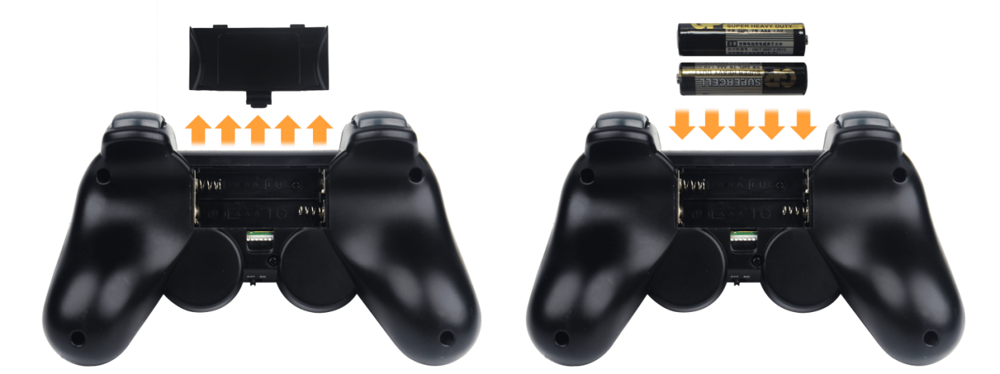
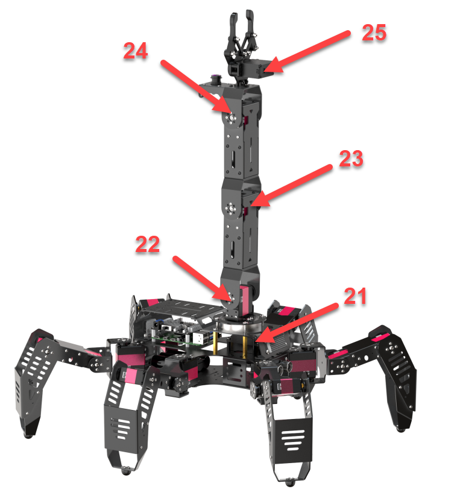
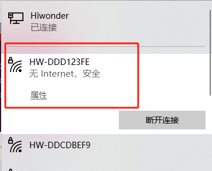
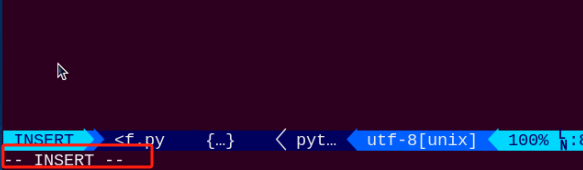
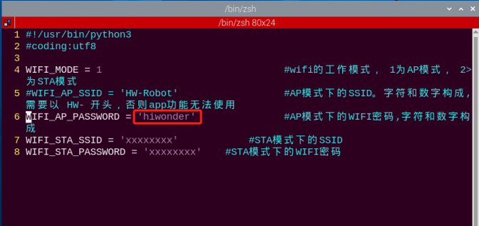
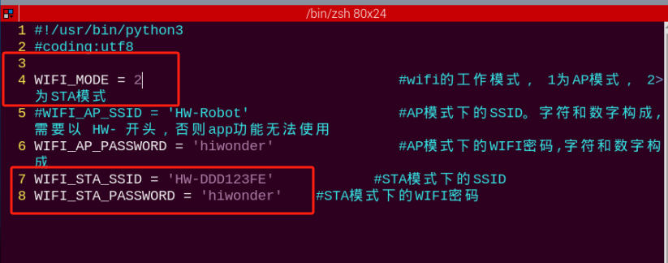

# 群发控制课程

## 1. 手柄控制

### 1.1 准备工作

**步骤1：** 将手柄接收器插入树莓派扩展板的任意一个USB接口。

:::{Note}
手柄接收器必须在设备开机前插入，如已插入则忽略本步骤。
:::

**步骤2：** 自备两节7号干电池，取出手柄后壳，将电池插入电池槽内，注意！正负极切勿插反。



### 1.2 设备连接

**步骤1：** 打开SipiderPi Pro开关。

**步骤2：** 打开手柄开关，此时手柄上两个LED灯（红色、绿色）将同时闪烁。

**步骤3：** 等待几秒，机器人将和手柄自动配对，配对成功后，绿色灯将常亮。

打开手柄开关后30秒内未连接机器人，或连接后5分钟内对手柄无任何操作，手柄将进入睡眠模式。若需唤醒手柄，按下“**START**”键即可。

### 1.3 模式介绍

手柄自身分为两种模式：**机体移动模式**（开机默认模式）和**机械臂控制模式**。

两种模式切换方法：同时按下“**START+SELECT**”键，手柄发出“滴”的一声，为机体移动模式，若响两声即为机械臂控制模式。

### 1.3 按键说明

**机体移动模式下手柄按键和机器人动作的对应关系如下表所示（以机器人为第一视角）：**

|       按键       |             功能             |
|:----------------:|:----------------------------:|
|      START       | 机体恢复初始化姿态(机体立正) |
|        L2        |          向左转30°           |
|        R2        |          向右转30°           |
| **↑/**左滑杆向上 |         向前直走50mm         |
| **↓/**左滑杆向下 |         向后直走50mm         |
| **←/**左滑杆向左 |         向左移动50mm         |
| **→/**左滑杆向右 |         向后移动50mm         |
|      **△**       |             战斗             |
|      **×**       |             扭身             |
|      **◻**       |             挥手             |
|      **○**       |             踢腿             |
|      **R1**      |            dance             |

**机械臂控制模式下的手柄按键和机器人动作的对应关系如下表所示（以机器人为第一视角）：**

|       按键       |        功能        |
|:----------------:|:------------------:|
|      START       | 机械臂恢复初始姿态 |
|        L2        |    25号舵机闭合    |
|        R2        |    25号舵机张开    |
|    左滑杆向上    |    22号舵机向前    |
|    左滑杆向下    |    22号舵机向后    |
| **←/**左滑杆向左 |    21号舵机向左    |
|    左滑杆向右    |    22号舵机向右    |
|      **◻**       |    23号舵机向前    |
|      **△**       |    23号舵机向后    |
|      **×**       |    24号舵机向前    |
|      **○**       |    24号舵机向后    |

下图为机械臂舵机ID示意图：



## 2. 群发控制

### 2.1 准备工作

1)  至少准备2台及以上的SpiderPi Pro机器人（本节课以2台机器人为例进行示范）。

2)  开发环境搭建。参考“**[远程工具安装与连接](https://docs.hiwonder.com/projects/SpiderPi_Pro/en/latest/docs/6_remote_tool.html)**”文档内容，下载并安装远程连接工具VNC。

### 2.2 实现原理

通过将主机与从机配置在同一个网络内，主机通过群发程序向从机发送动作指令，达到控制从机的效果。

### 2.3 实验步骤

- #### 2.3.1 配置主机

1)  首先，选取一台机器人作为主机，开启后远程连接桌面，我们这里以热点为“**HW-DDD123FE**”的机器人为例。



:::{Note}
请记住主机热点名称，后续步骤将用到此名称。
:::

2)  打开命令行终端，输入指令，按下回车，进入到Wi-Fi文件配置目录。

```commandline
cd hiwonder-toolbox/
```

3)  使用vi编辑器打开Wi-Fi配置文件，输入指令，按下回车。

```commandline
vim wifi_conf.py
```


4)  按一下键盘上的“**i**”，进入编辑模式。



5)  修改主机热点密码，将Wi-Fi密码修改成“hiwonder”，再进行反注释。操作如下图所示：



:::{Note}
密码的位数不可少于8位。
:::

6)  修改完成之后，按下“**Esc**”键，退出编辑模式。再输入“**:wq**”保存并退出。

```commandline
:wq
```

7)  输入命令“**sudo reboot**”将设备重启。（此步不可跳过！）

```commandline
sudo reboot
```

- #### 2.3.2 配置从机

:::{Note}
这里以单台从机操作为例进行说明，多台从机可参考同样的方法进行配置。
:::

1)  打开命令行终端，输入指令，按下回车，进入WI-Fi配置文件所在目录。

```commandline
cd hiwonder-toolbox/
```

2)  使用vi编辑器打开Wi-Fi配置文件，输入指令，按下回车。

```commandline
vim wifi_conf.py
```

3)  按一下键盘上的“**i**”，进入编辑模式。


4)  按照主机的热点名称与密码进行一致设置（本节课以默认ID：**HW-DDD123FE**为例），再将代码进行反注释。操作如下图所示：



5)  修改完成之后， 按下“**Esc**”键，退出编辑模式。再输入“**:wq**”保存并退出。

```commandline
:wq
```

6)  输入命令“**sudo reboot**”将设备重启。（**此步不可跳过！**）

```commandline
sudo reboot
```

- #### 2.3.3 群发控制

:::{Note}
群发控制时，从机需等待主机开机成功后再开启。
:::

1)  将主、从机器人放置在空旷平坦的地面，并且各个机器人保持一定距离,将PS2手柄接收器插入主机的USB接口。

2)  连接主机，打开命令行终端，输入指令，按下回车，进入群控文件所在目录。

```commandline
cd spiderpi/functions/
```

3)  输入开启群控服务端的指令，按下回车。

```commandline
python3 multi_control_server.py
```

4)  参考“**[上手试玩\1. 手机APP的安装和连接](https://docs.hiwonder.com/projects/SpiderPi_Pro/en/latest/docs/2_play_first_hand.html#app)**”获取从机的IP地址进行连接。

5)  连接从机之后打开命令行终端，输入指令，按下回车，进入群控文件所在目录。

```commandline
cd spiderpi/functions/
```

6)  输入开启群控客户端的指令，按下回车。

```commandline
python3 multi_control_client.py
```

7)  打开手柄进行连接，即可进行控制。

### 2.4 实现效果

程序启动后，从机机器人将与主机机器人同时执行同样的动作组。
