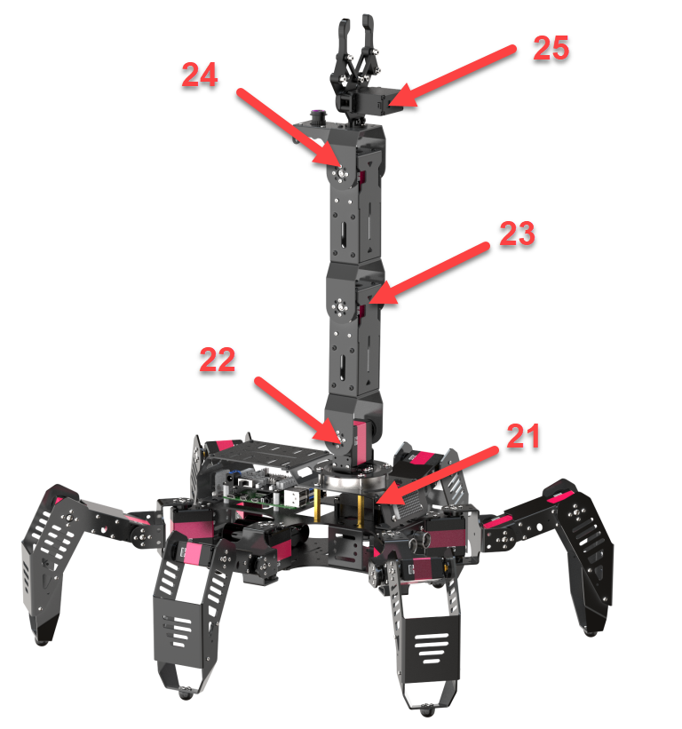
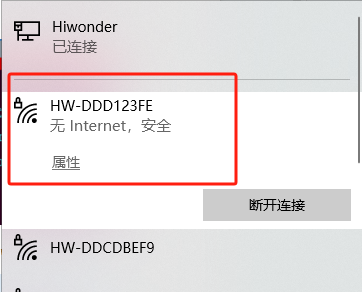
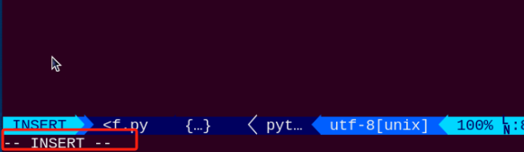
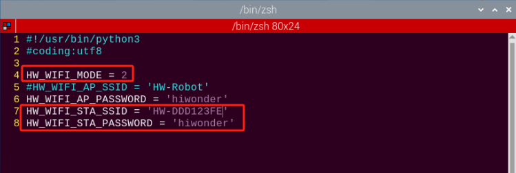

# 8. Mass Control

## 8.1 Handle Control

### 8.1.1 Getting ready

Step 1: insert the handle receiver into any USB interface on Raspberry Pi expansion board.

:::{Note}
Note: please insert the handle receiver before the device boots up.
:::

Step 2: please bring your own two triple A dry batteries.


### 8.1.2 Device connection

Step 1: turn on the switch of SpiderPi Pro.

Step 2: turn on the switch on the handle. At this time, two LED lights will flash simultaneously.

Step 3: please wait for a while. Then the robot will pair with the handle automatically. After successful pairing, the green light will keep lighting up.

If the handle doesn’t connect to the robot within 30s or there is no operation on the handle within 5 minutes after turning on, it will enter sleep mode. And you can press “**START**” to activate the handle.

### 8.1.3 Mode introduction

There are two modes, including **body control mode** and **robotic arm control mode**.

Way to switch the mode: press “START” and “SELECT” key at the same time. When the handle “beeps” once, the mode is switched to body control mode. If the handle “beeps” twice, the mode is switched to robotic arm control mode  

### 8.1.4 Key function

The function of each key under body control mode is listed below.


|                Key                |                  Function                  |
| :-------------------------------: | :-----------------------------------------: |
|               START               | the body will return to the initial posture |
|                L2                |             turn left 30 degree             |
|                R2                |            turn right 30 degree            |
|  &uarr; /move up left slider  |          go straight forward 50mm          |
| &darr;/move down left slider |          go straight backward 50mm          |
| &larr; /move left left slider |               move left 50mm               |
| &rarr; /move right left slider |             move backward 50mm             |
|              **△**              |                   attack                   |
|              **×**              |                    twist                    |
|              **◻**              |                    wave                    |
|              〇              |                    kick                    |
|              **R1**              |                    dance                    |

The function of each key under robotic arm control mode is listed below.


|          Key          |                Function                |
| :--------------------: | :------------------------------------: |
|         START         | robotic arm returns to initial posture |
|           L2           |           No.25 servo opens           |
|           R2           |           No.25 servo close           |
|  move up left slider  |       No.21 servo moves forward       |
| move down left slider |       No.21 servo moves backward       |
| move left left slider |       No.22 servo moves forward       |
| move right left slider |       No.22 servo moves backward       |
|         **◻**         |       No.23 servo moves backward       |
|         **△**         |       No.23 servo moves forward       |
|         **×**         |       No.24 servo moves backward       |
|         〇         |       No.24 servo moves forward       |

The ID of servos on the robot arm is as below:



## 8.2 Group Control

### 8.2.1 Getting ready

(1) 2 or above SpiderPi Pros are needed in group control.

(2) Set up development environment.  Please refer to the tutorial in “[Set Development Environment->3.1VNC Installation and Connection]()” to download and install VNC.

### 8.2.2 Program logic

First, configure the master and the salve to one network. Then the master sends the action command to the slave through group sending program so as to achieve group controlling.

### 8.2.3 Operation steps

* **configure the master** 

(1) Firstly, pick one robot as the master. After turning on the master robot, remotely connect to the desktop. Take **“HW-DDD123FE”** robot for example.



:::{Note}
please take down the hotspot name which will be used in the later step.
:::

(2) Open command line terminal. Then enter the command `cd hiwonder-toolbox/` and press `Enter` to enter the catalog of WiFi configuration file.

```commandline
cd hiwonder-toolbox/
```

(3) Enter `vim wifi_conf.py` command and press `Enter` to open Wi-Fi configuration file with vi editor.

```commandline
vim wifi_conf.py
```

(4) Press  `i`  key to enter the editing mode.



(5) Modify the WiFi password of the master as “**hiwonder**” and then uncomment this code shown in the below figure：


:::{Note}
the password should be 8 digits or above.
:::

(6) After modification, press `Esc` key to exit the editing mode. And input `:wq` to save and exit.

```commandline
:wq
```

(7) Input command `sudo reboot` to reboot the device. Please do not skip this step.

```commandline
sudo reboot
```

* **Configure the slave** 

:::{Note}
we use a single slave to demonstrate. If you need to configure multiple slaves, you can also follow the below steps to operate.
:::

(1) Open command line terminal. Then enter command `cd hiwonder-toolbox/` and press `Enter` to enter the catalog of WiFi configuration file.

```commandline
cd hiwonder-toolbox/
```

(2) Open the WiFi configuration file with vi editor. Enter command  `vim wifi_conf.py` and press `Enter`.

```commandline
vim wifi_conf.py
```

(3) Press `i` key to enter editing mode.


(4) Modify the WiFi password of the slave as “**hiwonder**” same as the master,and the ID as HW-DDD123FE. And then uncomment this code shown in the below figure：



(5) After modification, press “Esc” key to exit the editing mode. And input “:wq” to save and exit. 

```commandline
:wq
```

(6) Enter command `sudo reboot` to reboot the device. Please do not skip this step.

```commandline
sudo reboot
```

* **group control** 

:::{Note}
During group control, please turn on the master first, then the slave.
:::

(1) Place the master and slave robot on the open ground. And ensure there is certain interval between each robot. Insert the PS2 handle receiver into the USB interface on the master.

(2) Connect to the master, open the command line terminal, enter the command `cd spiderpi/functions/`, and press `Enter` to navigate to the directory where the group control file is located.

```commandline
cd spiderpi/functions/
```

(3) Enter the command `python3 multi_control_server.py` and press `Enter` to start the group control server.

```commandline
python3 multi_control_server.py
```

(4) Refer to the instruction of LAN mode connection in “[Quick User Experience\2.1 APP Installation and Connection]()” to obtain the IP address of the slave for connection.

(5) After the slave is connected, open the command line terminal, enter the command `cd spiderpi/functions/`, and press `Enter` to access the directory where the group control file is located.

```commandline
cd spiderpi/functions/
```

(6) Enter the command `python3 multi_control_client.py` and press `Enter` to start the group control client.

```commandline
python3 multi_control_client.py
```

(7) Open the handle for connection, then you can control SpiderPi Pro with it.

### 8.2.4 Project Outcome

After the program runs, the mater and slave robots will execute the same action group.
