# 学前先看

## 1. 认识SpiderPi Pro

### 1.1 产品简介

SpiderPi Pro是一款基于树莓派4B开发的AI视觉六足机器人套件，它在原SpiderPi六足机器人的基础上，增加了一个视觉机械手臂，可以拓展出更多有趣的AI创意玩法，如物品识别抓取、运输搬运、智能分拣、多台群控等。

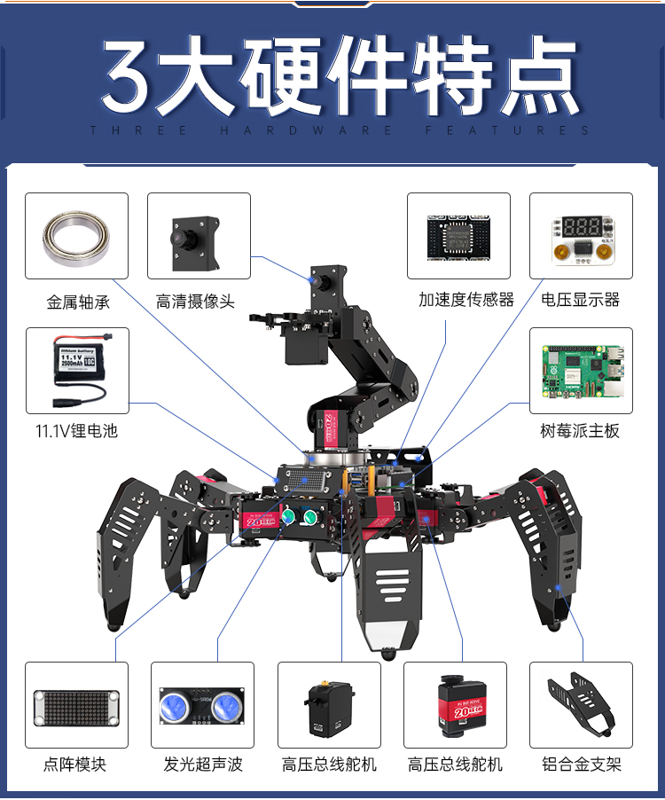

它不仅能满足用户对机器视觉、六足步态和机械臂运动学的学习和验证，还为传感器应用、视觉抓取等二次开发提供快速、便捷的集成方案。

### 1.2 零部件清单

## 2. 图文组装教程

### 步骤1：安装摄像头

- #### Step 1

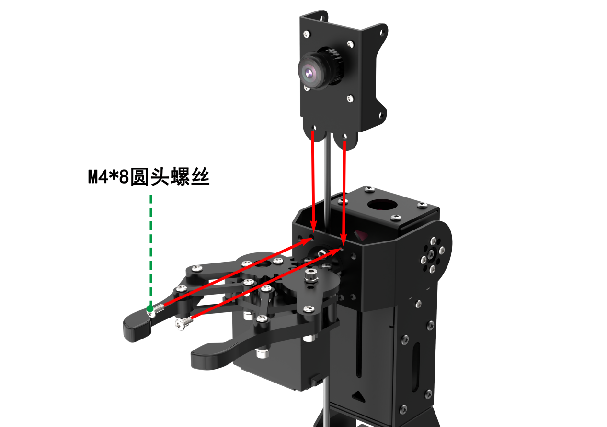

- #### Step 2

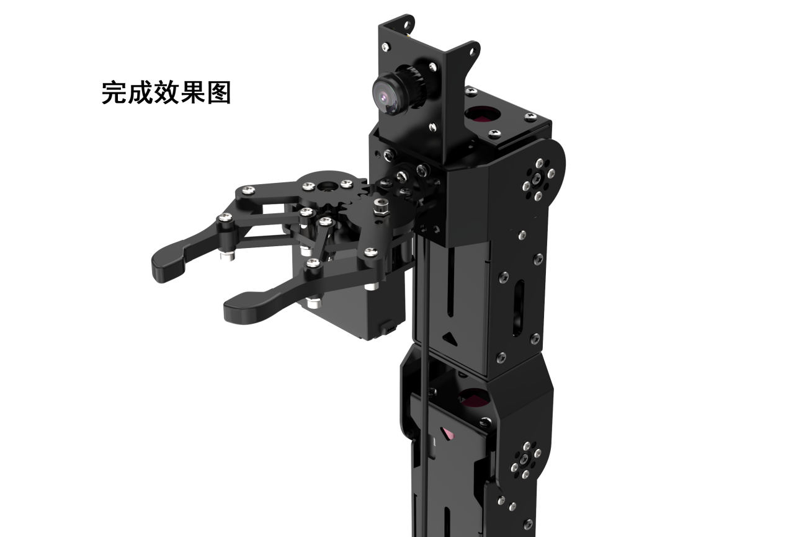

### 步骤2：安装机械臂

- #### Step 1

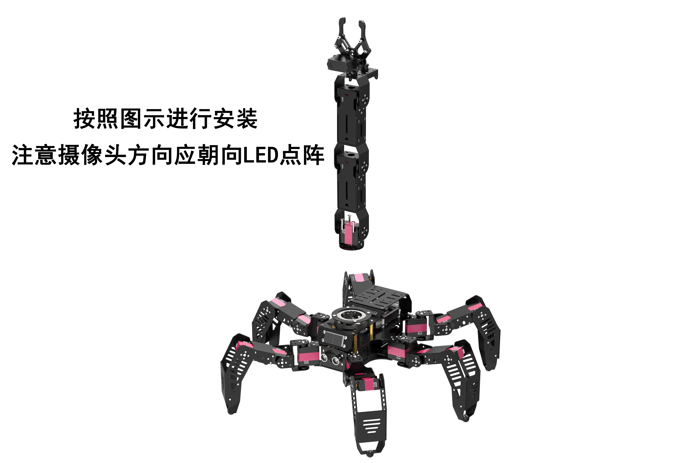

- #### Step 2

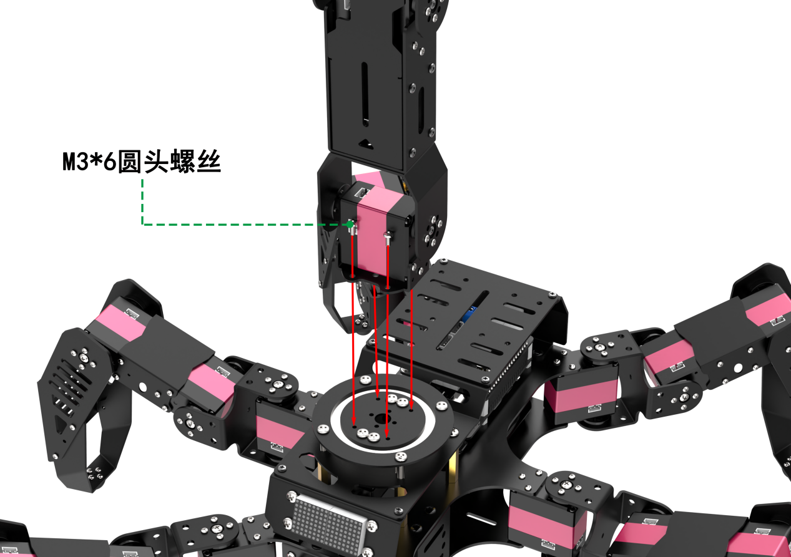

- #### Step 3

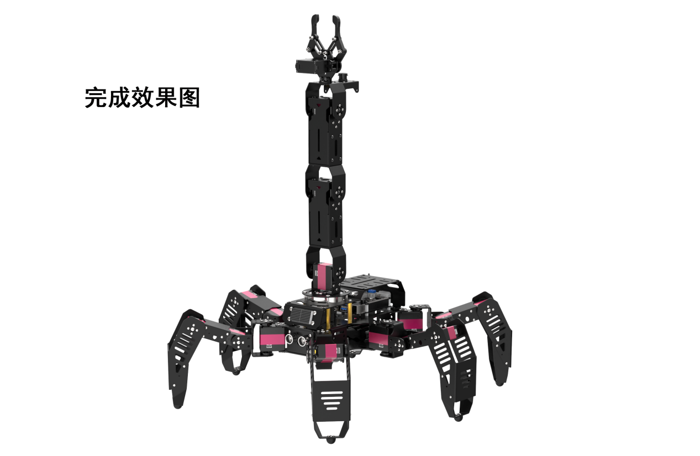

### 步骤3：摄像头与机械臂接线

- #### Step 1

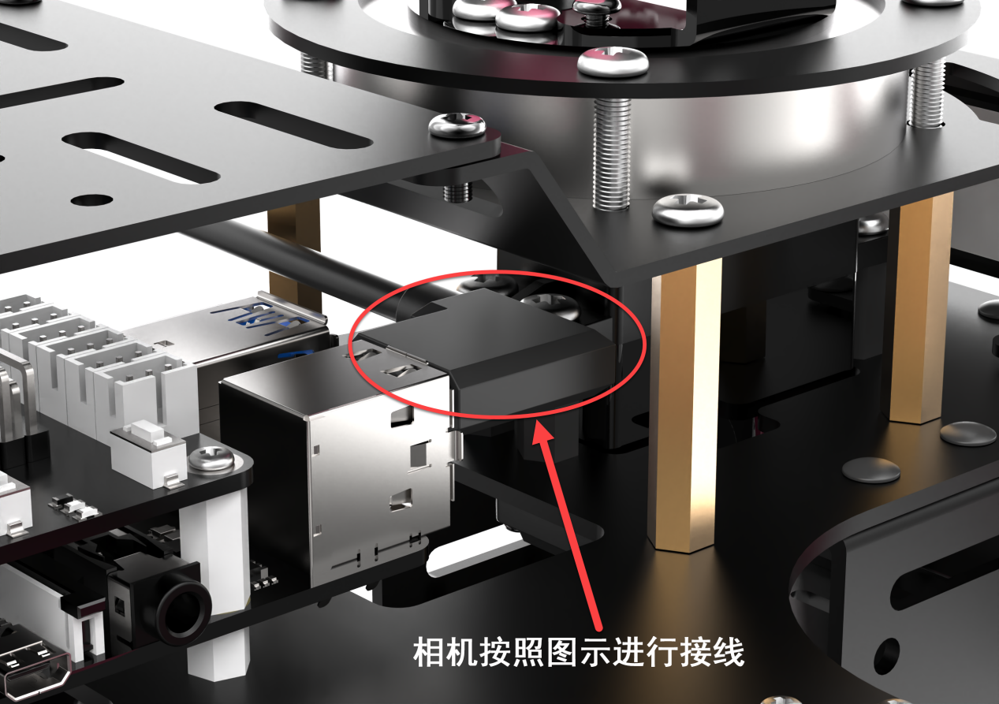

- #### Step 2

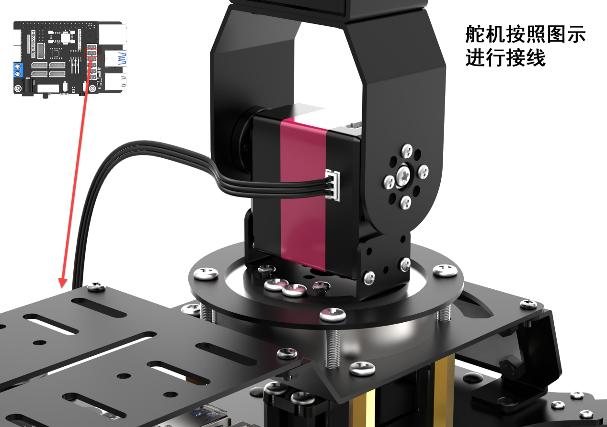

## 3. 机器人充电及开机

### 3.1 充电方法

1.  在充电前，请检查电池对接线是否以**红对红**、**黑对黑**的形式进行对接。

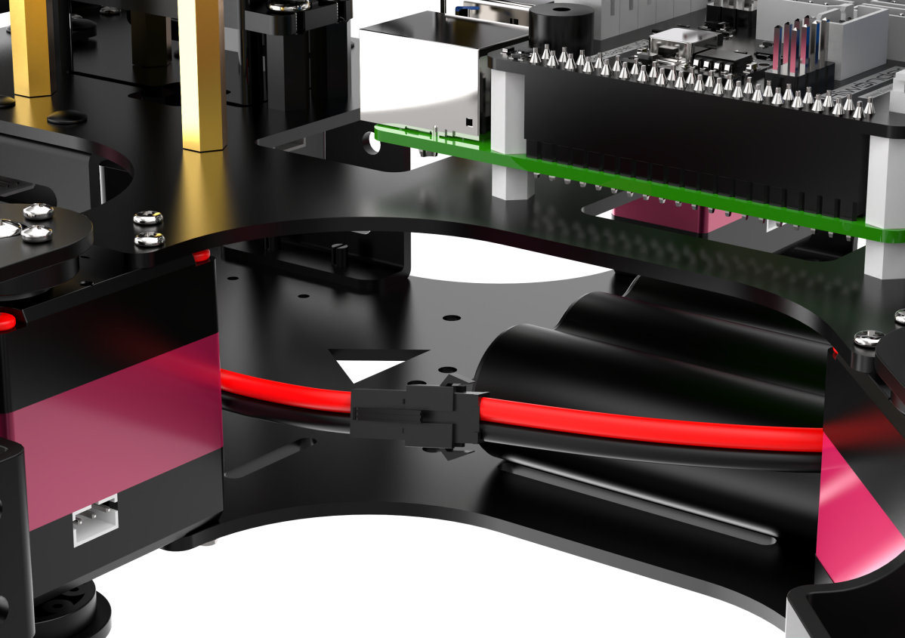

2.  将充电器连接至机器人背部树莓派扩展板的充电孔处。

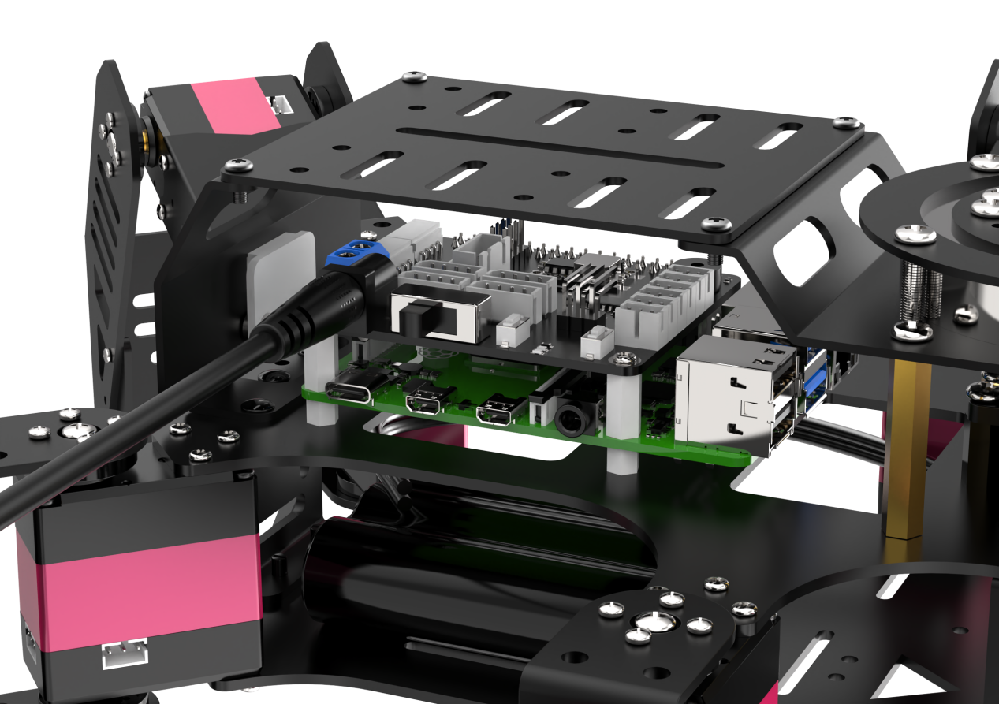

3.  未通电时，充电器的指示灯显示绿色。通电后，指示灯显示红色，代表正在充电（充电时长约为3小时）。

当充电器指示灯由红色变为绿色，代表充电完成。充电完成后，请尽快拔掉充电器，切勿一直充电！

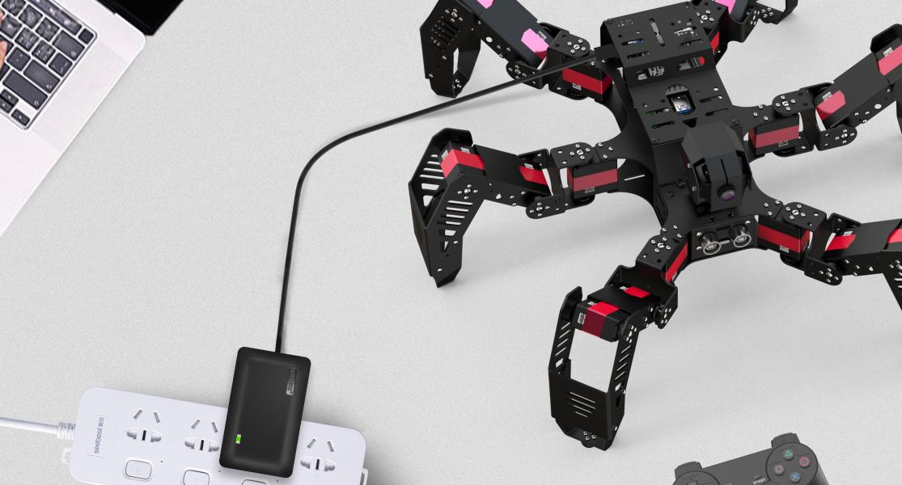

### 3.2 开关机

1)  将机器人背部树莓派扩展板开关由"**OFF**"推至"**ON**"。此时，扩展板上的LED1、LED2处于常亮状态。稍等片刻，LED2则开始闪烁，蜂鸣器会鸣叫一次，且机器人执行立正姿态，代表设备开机成功。

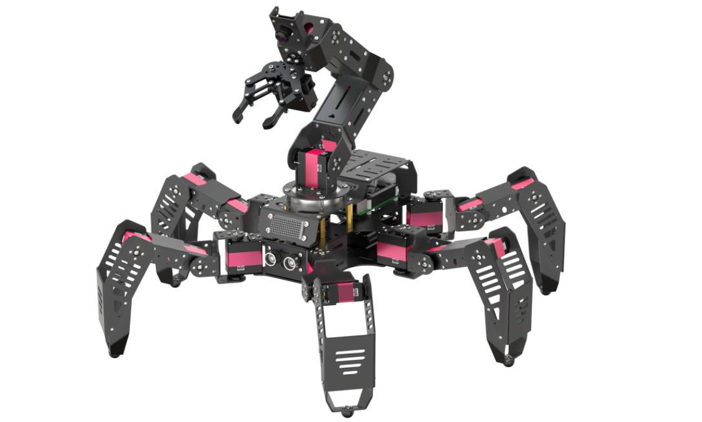

:::{Note}
树莓派本身也是电脑，开机启动需要耗费一定时间，请耐心等待。
:::

2)  机器人出厂默认为AP直连模式，会生成一个以"**HW**"开头的热点。

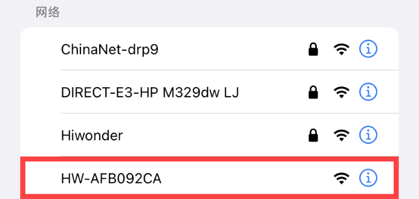

接下来可前往"**[上手试玩]()**"继续学习后续内容。

### 3.3 查看电量

SpiderPi Pro的尾部搭载了一个电压显示模块，可实时观察它当前的电量情况，如下图所示：

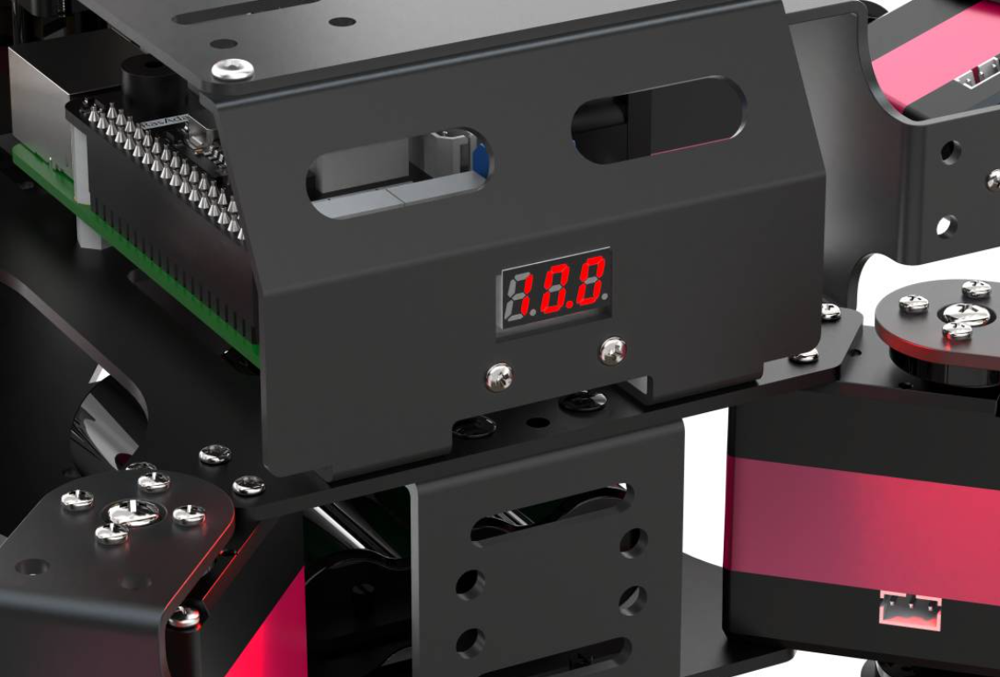

SpiderPi Pro的工作电压范围大小为9V-12.6V，当电量充满时，电压显示模块会显示"**12.6**"，当前电压小于10V时，请参考本文档"[3.1 充电方法](#anchor_3_1)"步骤及时给机器人充电。
