# 1. Getting Ready

## 1. SpiderPi Pro Introduction

### 1.1 Product introduction

Powered by Raspberry Pi 5, SpiderPi Pro is an AI vision hexapod robot kit. On the basis of SpiderPi, it is added a visual robotic arm and expanded more interesting AI games, such as target recognition and picking, intelligent transferring, intelligent sorting and group control.

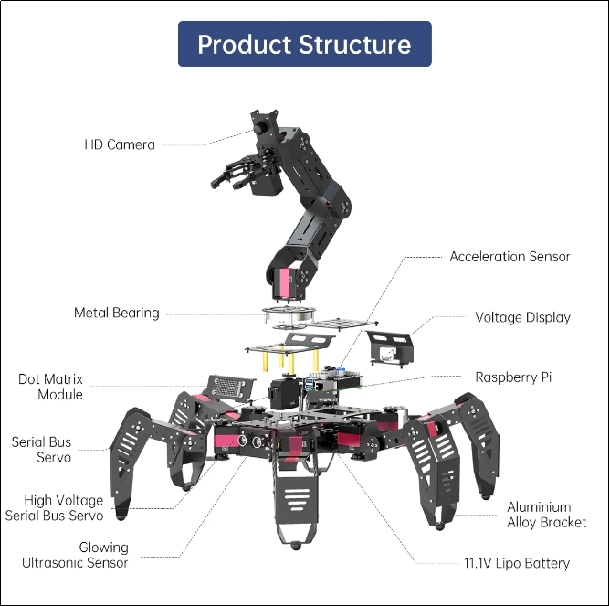

SpiderPi Pro is a great helper for us to learn and verify machine vision, hexapod gait and robot kinematic. Besides, it provides solutions for our secondary development, such as sensor applications, visual picking.

### 1.2 Package list

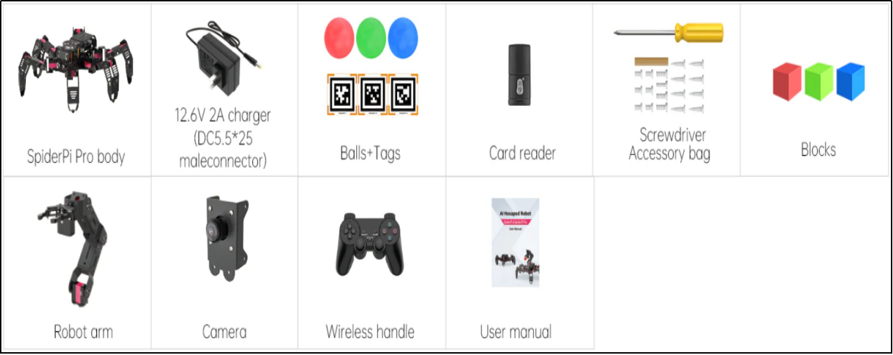

### 1.3 Usage Precautions

Please pay attention to the following points when using and storing this product:

(1) This product contains conductive components. Avoid contact with metal objects when powered on.

(2) After the robot is powered on, do not forcibly move the servo, as this may cause damage.

(3) If the robot runs for an extended period, the servos may become hot. Allow the robot to "rest" and wait for the servos to cool before resuming operation.

(4) Keep your face, glasses, and other body parts away from the robot while it is operating. Do not place fingers within the joint movement range to prevent injury. Also, be cautious of falls from high edges.

(5) The robot's servos are precision components and consumable parts. They may need replacement after long-term or intensive use.

(6) If the product will not be used for an extended period, fully charge the battery, remove it, and store it in a cool, dry place.

### 1.4 Copyright Notice

This manual is the property of Shenzhen Hiwonder Technology Co., Ltd. No organization or individual is permitted to reproduce, copy, translate, or distribute any content from this manual without authorization.

Any unauthorized use or infringement of this manual's copyright will be subject to legal action by our company.

### 1.5 Disclaimer

The product described in this manual (including hardware, software, etc.) is provided "as is." Every effort has been made to ensure the accuracy of this manual, but we cannot guarantee it is completely free from errors or omissions. This document is regularly reviewed, and we welcome feedback for improvements.
Product features and specifications may change with version upgrades. For the latest product information, please contact customer service when placing your order.

Furthermore, unless explicitly stated by Hiwonder, we are not responsible for any losses resulting from product malfunctions or damage under extreme conditions outside of typical use cases.

## 2. Assembly Tutorial

### 2.1 Installing the Camer

- **Step 1**

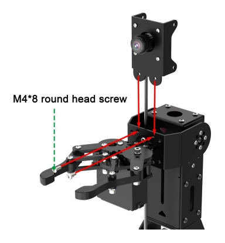

- **Step 2**

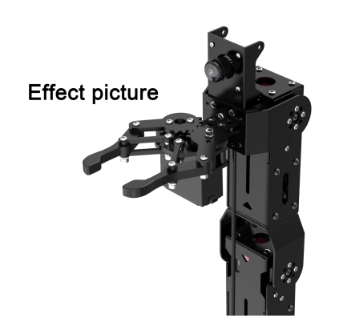

### 2.2 Installing the Robotic Arm

- **Step 1**

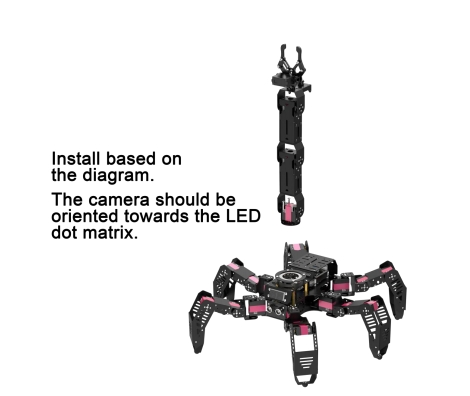

- **Step 2**

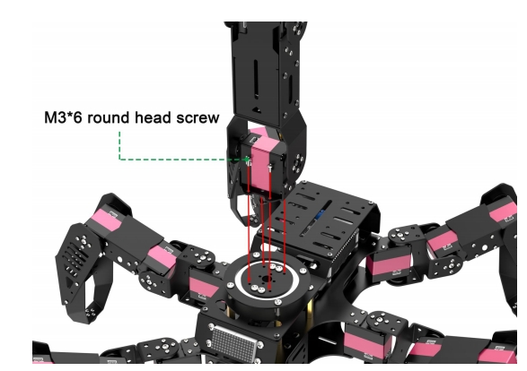

- **Step 3**

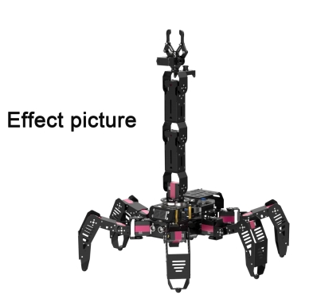

### 2.3 Connect the camera to the robotic arm

- **Step 1**

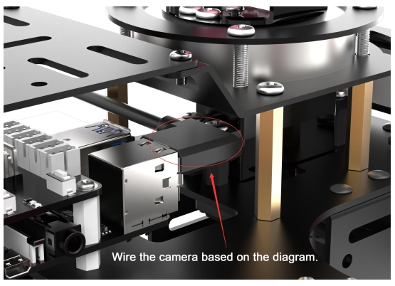

- **Step 2**

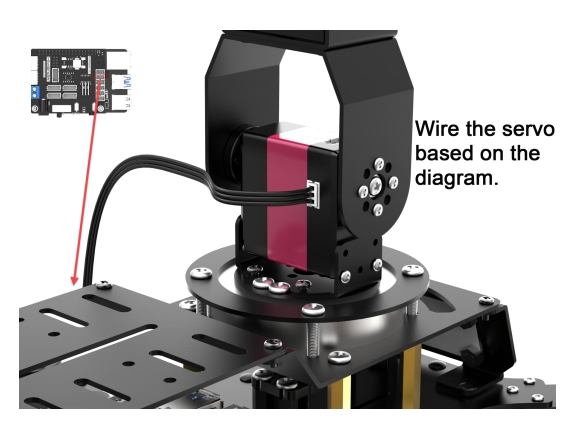

## 3. Charging and Power-On Status Explanation

### 3.1 Charging

(1) Before charging, please check whether the red wire is connected to red wire and black to black.

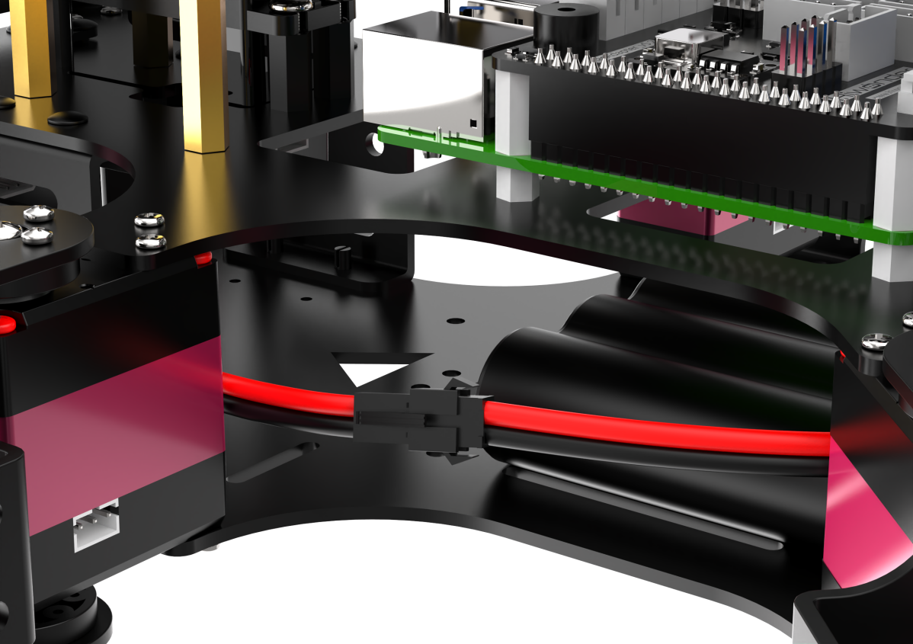

(2) Connect the charger to the hole on the Raspberry Pi expansion board on the back of the robot.

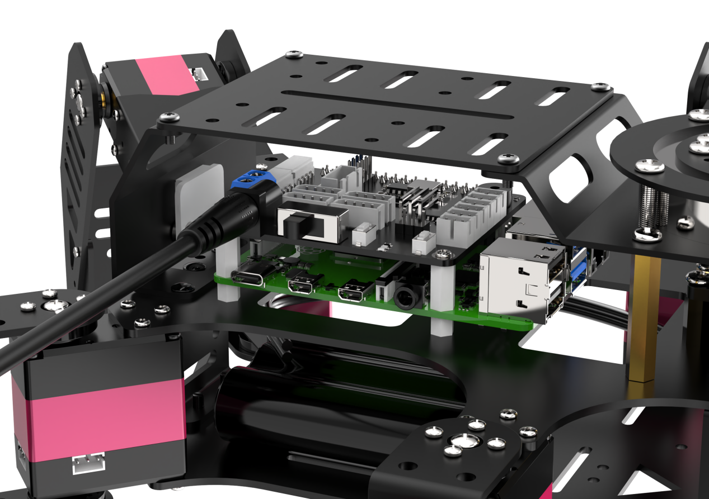

(3) When the charger isn't plugged in, the indicator of the charger is green. When it is plugged in, its indicator is red, which means that the SpiderPi Pro is charging. It takes about 3 hours to fully charge the SpiderPi Pro.

When the indicator turns green from red, it means that SpiderPi Pro is fully charged. After charging, please unplug the charger as soon as possible.

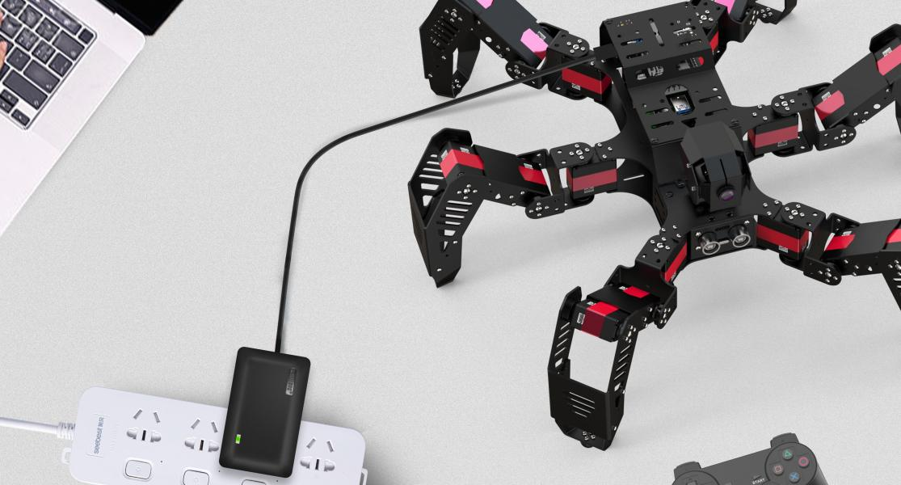

### 3.2 Boot up and Shut down

(1) Push the switch on Raspberry Pi expansion board to "ON". At this time, LED1 and LED2 will light up continuously. After a while, LED2 will start flashing and the buzzer will sound once. When the robot perform "attention" posture, it boots up successfully.

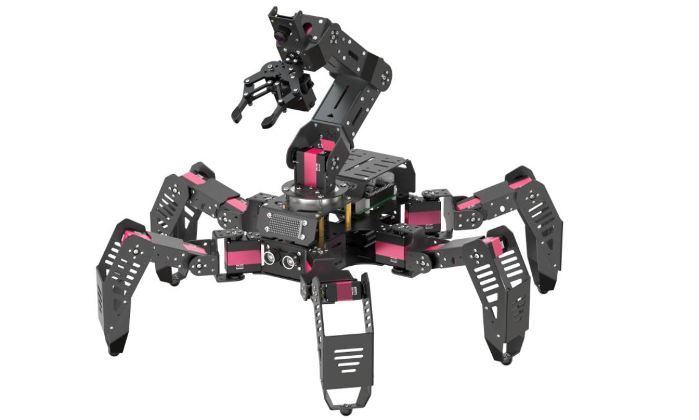

:::{Note}
as Raspberry Pi is a computer, it takes some time to boot up. Please be patient!
:::

(2) The default connection mode is AP direct connection mode. After the robot boots up successfully, it will generate a WiFi starting with "**HW**"。

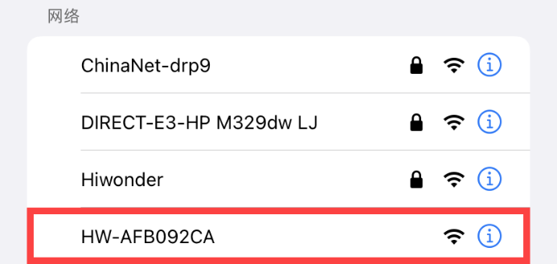

now you can turn to"**[Getting Ready](https://docs.hiwonder.com/projects/SpiderPi_Pro/en/latest/docs/2_play_first_hand.html)**"for more。

### 3.3 Check battery level

A voltage display module i  s positioned at the back of SpiderPi Pro allowing you to monitor the robot's real-time battery.

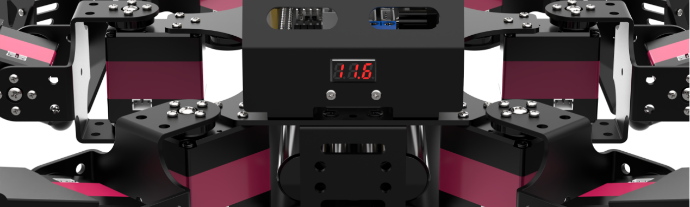

The working voltage of SpiderPi Pro ranges from 9V to 12.6V. The voltage of the battery fully charged reaches 12.6V. Please note that you need to charge the robot in time when the voltage drops below 10V.
