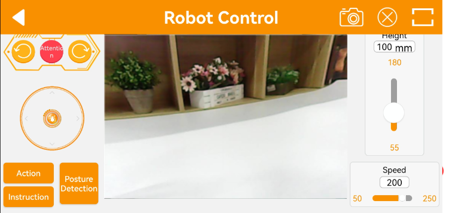
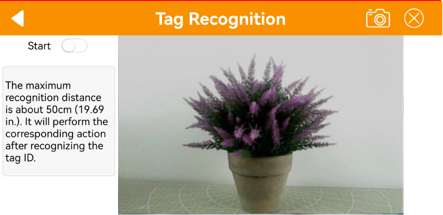

# 2. Quick User Experience

## [1. APP Installation and Connection ]()

## 2. APP Control

### 2.1 Getting ready

Follow the tutorial in [1. APP Installation and Connection]() under "[3. Color Threshold Adjustment]()" to install the app and connect to the SpiderPi Pro.

### 2.2 Start Games

After connecting, click SpiderPi Pro icon to enter the mode selection interface.

In the mode selection interface, click the icon corresponding to the game to enter the game interface.

**2.2.1 Robot Control**

This game allows you to control the movement and the action group execution of the robot in real time. The interface consists of four parts, and the descriptions and function icons of each part are shown below:

The interface of `Robot Control` can be divided into three parts. The left side of the interface can control the movement of the SpiderPi Pro by dragging the slider. Other function icons can refer to the following table:

|                                                  Icon                                                  |                                                        **Corresponding Function**                                                        |
| :-----------------------------------------------------------------------------------------------------: | :--------------------------------------------------------------------------------------------------------------------------------------: |
|    |                                                Drag to control SpiderPi Pro's movement.                                                |
|      | Clicking on the icons from left to right can control the robot to perform left slide, stand at attention, and right slide, respectively. |
|  |                                           Make SpiderPi Pro perform provided built-in actions.                                           |
|  |                                         Provide a guide for the remote control of the SpiderPi.                                         |
|  |                                                     Make SpiderPi Pro perform provi                                                     |
|  |                                                    Adjust SpiderPi's movement speed.                                                    |

Click the icon  at the top to bring up the interface for controlling the robotic arm. The movement of the robotic arm can be controlled by adjusting the angle of its 5 servos using the buttons.

If you want to back to the games option interface, you can click the blank area, then the title bar will appear. Next, click  at the left side.

**2.2.2 Color Recognition**

This game can recognize red, green, and blue. SpiderPi Pro will nod when it detects red and shake its head when it detects blue or green.

:::{Note}

* Please start this game under a well-lit environment, but try to keep it from direct light.

* When recognizing, please do not have the same or similar colored object within the detected range to avoid interference.

* If the recognition effect is not good enough, please refer to  "[3. Color Threshold Adjustment]()".
:::

(1) Click "Color Recognition" to enter this game. Its interface consists three parts:

① The status bar is located at the top of the interface.

②  The left side of the interface is the area for enabling, disabling the game and adjusting the color threshold.

③ The right side of the interface is the area for displaying the live camera feed.

(2) Click the "Start" allows you to place red, blue, and green objects one by one in front of the camera.

| Recognized Color |                              Outcome                              |
| :--------------: | :----------------------------------------------------------------: |
|       Red       |  The buzzer emits a "beep" sound, and the camera nods its head.  |
|      Green      | The buzzer emits a "beep" sound, and the camera shakes its head. |
|       Blue       | The buzzer emits a "beep" sound, and the camera shakes its head. |

(3) If want to back to mode selection interface, you can arbitrarily click the blank area in interface, then click .

**2.2.3 Target Tracking**

(1) Click "Target Tracking" to enter the game interface. Once activated, this game enables the pan-tilt of SpiderPi Pro to move along with the movement of the target color.

:::{Note}

Please start this game under a well-lit environment, but try to keep it from direct light.

When recognizing, please do not have the same or similar colored object within the detected range to avoid interference.

If the recognition effect is not good enough, please refer to "[3.Color Threshold Adjustment]()".

:::

① The status bar is located at the top of the interface.

② The tracking switch area is located on the left side of the interface

③ The live camera feed area is located on the right side of the interface.

(2) If want to back to mode selection interface, you can arbitrarily click the blank area in interface, then click .

**2.2.4 Line Following**

(1) Click "Line Following" to enter this game. After activating it, the SpiderPi Pro will move forward along a black, white or red line.

:::{Note}

* Please start this game under a well-lit environment, but try to keep it from direct light.

* When recognizing, please do not have the same or similar colored object within the detected range to avoid interference.

* If the recognition effect is not good enough, please refer to "[3. Color Threshold Adjustment]()".
  :::

① The status bar is located at the top of the interface.

②  The line tracking switch area is located on the left side of the interface

③ The camera live feed area is located on the right side of the interface.

(2) Click "Start following" to enter this game and select color. Then SpiderPi will follow the targeted line.

|                                               Icon Button                                               |         Function Instruction         |
| :-----------------------------------------------------------------------------------------------------: | :----------------------------------: |
|  |       Start or stop this game.       |
|  |      Select the targeted color.      |
|  | Display the selected tracking color. |

(3) If want to back to mode selection interface, you can arbitrarily click the blank area in interface, then click .

**2.2.5 Face Recognition**

:::{Note}
* Please start this game in a well-lit environment, but keep robot from the direct light.

* When recognizing, one human face only is allowed to appear within the detected range. Otherwise, it will affect the game result.

* The max recognition distance is about 1 meter.
:::

(1) Click Face Recognition to enter this game.

(2) After clicking  `Start`, the pan-tilt of the SpiderPi Pro will move left and right. When the face is detected, it will make a "Hello" action.

(3) If want to back to the mode selection interface, click the blank area of interface and then click  in the left side.

**2.2.6 Tag Recognition**

(1) Click "Tag Recognition" in mode selection interface to enter this game. This allows SpiderPi Pro's camera to recognize different QR code tags and execute corresponding actions.

:::{Note}
* When recognizing QR codes, the distance should not be too close or too far. The best distance between the QR code image and the camera is 35cm.

* Please start this game in a well-lit environment, but keep robot from the direct light.
:::

(2) Click "Start". Then SpiderPi will identify tags within the detected range and carry out different actions according to the recognized ID.

| **ID** | Corresponding Action |
| :----: | :------------------: |
|   1   |   Wave "Hello".   |
|   2   |    Walk in place.    |
|   3   |   Twist the body.   |

(3) If want to back to the mode selection interface, click the blank area of interface and then click  in the left side.

**2.2.7 Obstacle Avoidance**

(1) Click Obstacle Avoidance to enter the game interface. After this game is activated, the SpiderPi Pro can use ultrasonic to detect obstacles ahead to avoid them.

:::{Note}
Do not detect object at close range for a long time.
:::

① The left side of the interface includes the obstacle avoidance game switch and the obstacle threshold setting area.

② The middle of the interface is the camera transmission image area.

③ The right side of the interface includes the setting area for the RGB light and motor speed.

(2) Click "Start avoidance". SpiderPi Pro will move forwards and it will turn left when detecting obstacle ahead. Then continue moving forward until there is no obstacle.

|                                               Button Icon                                               |           Function Instruction           |
| :-----------------------------------------------------------------------------------------------------: | :---------------------------------------: |
|  |         Start or close this game.         |
|  | Set obstacle threshold in the unit of mm. |
|  |         Turn on or off RGB light.         |
|  |          Adjust RGB light color.          |

(3) If want to back to mode selection interface, you can arbitrarily click the blank area in interface, then click .

## [3.Adjust Color Threshold]()
