# 2. Quick User Experience

## 2.1 APP Installation and Connection 

The following instructions use TurboPi as an example and apply to other Hiwonder Raspberry Pi series products as well.
In this section, you will learn how to use APP "**WonderPi**" to control TurboPi. The installation method is as follows.

:::{Note}

① Make sure all APP permissions are turned on in settings, otherwise APP functions will be limited!

② Turn on Location and WiFi before operation.

:::

### 2.1.1 Installation

**[APP Installation Pack (Android)](https://play.google.com/store/apps/details?id=com.Wonder.Pi)**

**[APP Installation Pack (iOS)](https://apps.apple.com/cn/app/wonderpi/id1477946178)**

:::{Note}
- Please turn TurboPi on before connecting. 

- Make sure all APP permissions are turned on in settings, otherwise APP functions will be limited!

- Turn on Location and WiFi before operation.

:::

### 2.1.2 APP Connection

(1) Start robot. (The switch is on Raspberry Pi expansion board). For detailed instruction, please refer to the file in "**[Getting Ready\1.4 Charging and Power-On Status Explanation](https://docs.hiwonder.com/projects/SpiderPi_Pro/en/latest/docs/1_read_before_studying.html#charging-and-power-on-status-explanation)**".

(2) After TurboPi boots up successfully, it enters AP direct connection mode, and generates a WiFi starting with **"HW"**. Join this WiFi, and then you can experience robot games

* **Introduction to Connection Mode**

There are two connection modes, namely direct connection mode and LAN mode. APP functions are the same under these two modes.

(1) **AP direct connection mode:** RaspberryPi generates a WiFi which can be connected by phones. But this WiFi has no internet access. 

(2) **STA LAN mode:** Raspberry Pi actively connects to specific WiFi. In this mode, you can access internet.

* **Direct Connection Mode (MUST-READ)** 

:::{Note}
After TurboPi boots up successfully, it enters AP direct connection mode, and generates a WiFi starting with **"HW"**.
:::

(1) Open "**WonderPi**". Select **"Standard ->TurboPi"** in sequence.

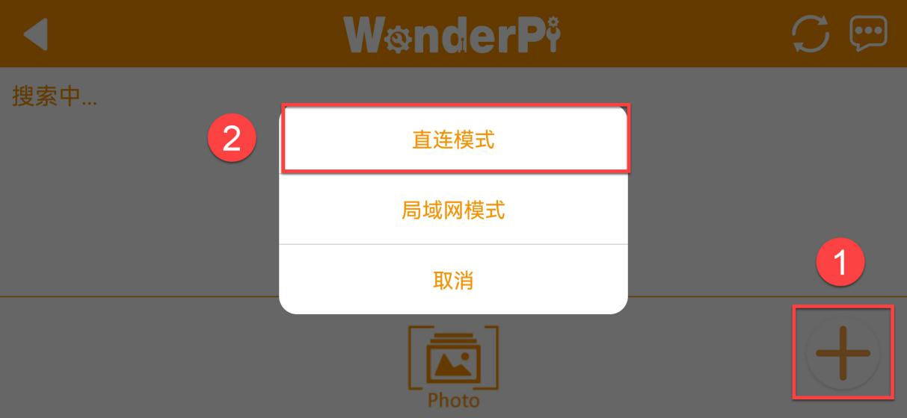

(2) Tap **"+"** in bottom right corner, and then select **Direct Connection Mode**.

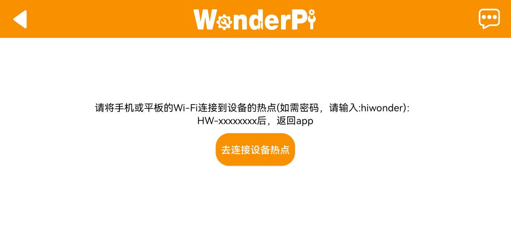

(3) Tap **"Go to connect device hotspot"**. Join WiFi starting with **"HW"**. The password is **"hiwonder"**.

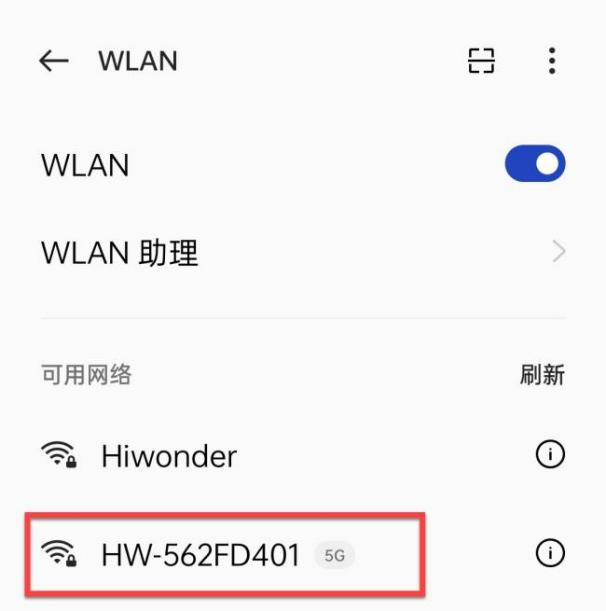

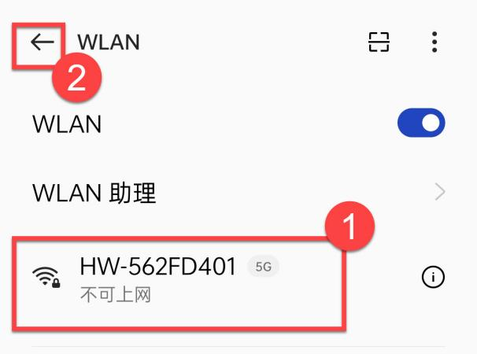

(4) Return back to APP after connection.

:::{Note}
 For iOS user, please don't return to APP until WiFi icon appears on status bar, otherwise robot cannot be searched. If robot cannot be searched by APP, tap 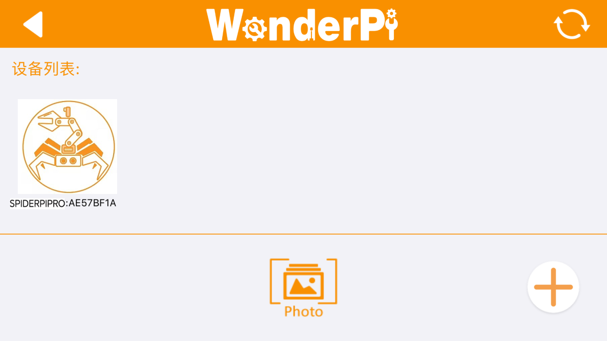 to refresh.
:::

(5) APP automatically connects to robot. When robot icon below occurs, connection completes. 

:::{Note}
If you are informed of "**No Internet. Whether to keep connection**", just select "**keep connected**".
:::

(6) Tap robot icon to enter mode selection interface.

For detailed introduction to robot games, please refer to the file in "**[2.2 APP Control](#anchor_2_2)**".

### 2.2.3  LAN Connection Mode

(1) Disconnect the WiFi generated by TurboPi. Connect your phone to a WiFi. Take **"Hiwonder"** as example.

(2) After connection, open **"WonderPi"**. Select **"Standard ->TurboPi"** in sequence.

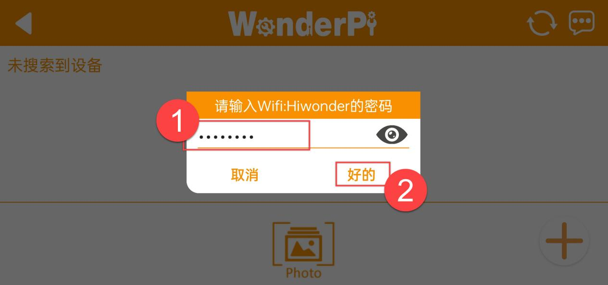

(3) Tap **"+"** in bottom right corner, and then select LAN Mode.

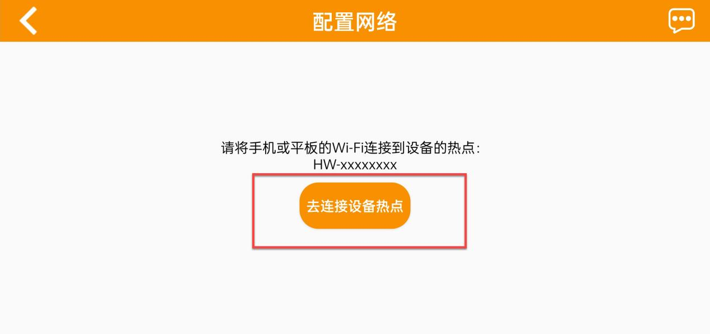

(4) Input the password of the WiFi your phone joins. Ensure the password you input is correct, otherwise APP fails to connect to robot. Tap **"OK"**.

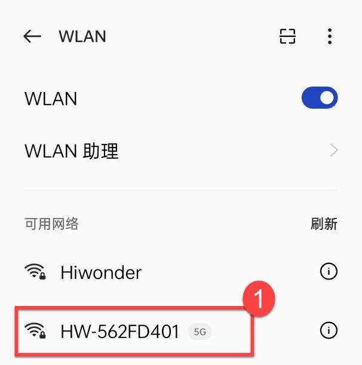

(5) Tap **"Go to connect device hotspot"**.

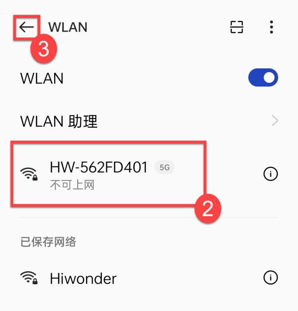

(6) Join the WiFi starting with **"HW".** The password is **"hiwonder"**. After connection, return back to APP.

(7) APP automatically configures network.

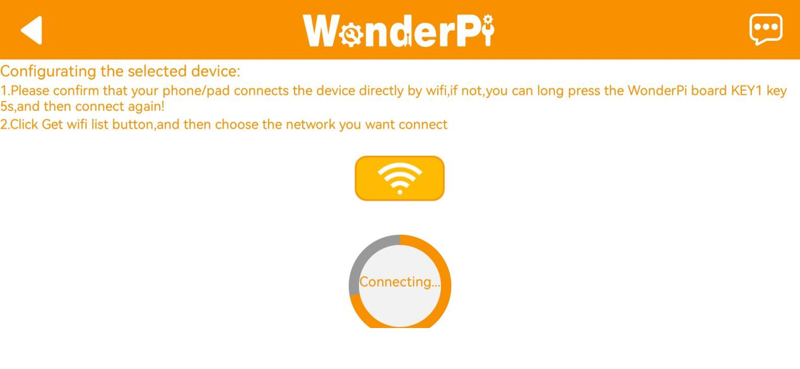

(8) After a while, robot icon below occurs, and LED on expansion board keeps on.

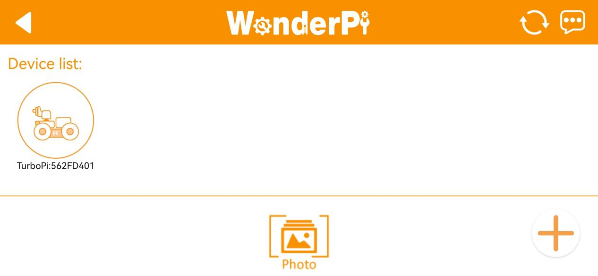

(9) Long press robot icon to check TurboPi's IP and ID.

(10) Tap robot icon to enter mode selection interface.

For detailed introduction to robot games, please refer to the file in"**[2.2 APP Control](#anchor_2_2)**".

## 2.2 APP Control

### 2.2.1 Getting ready

Follow the tutorial in [2.1 APP Installation and Connection](#anchor_2_1)  to install the app and connect to the SpiderPi Pro.

### 2.2.2 Start Games

After connecting, click SpiderPi Pro icon to enter the mode selection interface.

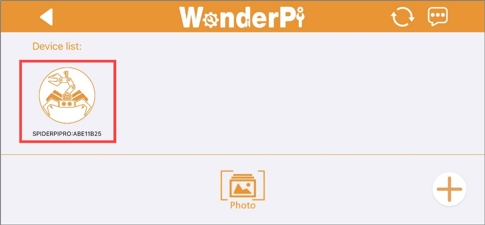

In the mode selection interface, click the icon corresponding to the game to enter the game interface.

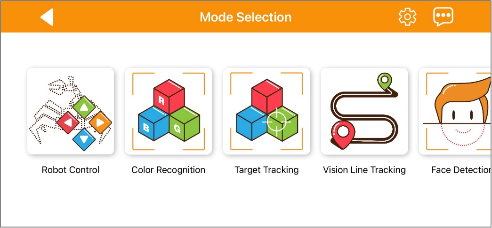

* **Robot Control** 

This game allows you to control the movement and the action group execution of the robot in real time. The interface consists of four parts, and the descriptions and function icons of each part are shown below:

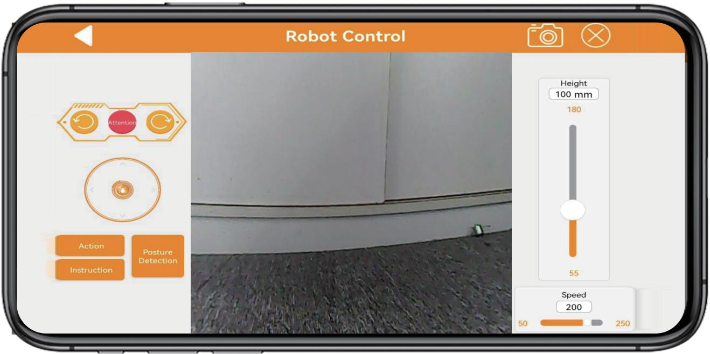

The interface of  `Robot Control`  can be divided into three parts. The left side of the interface can control the movement of the SpiderPi Pro by dragging the slider. Other function icons can refer to the following table:

|                                                  Icon                                                  |                                                        **Corresponding Function**                                                        |
| :-----------------------------------------------------------------------------------------------------: |:----------------------------------------------------------------------------------------------------------------------------------------:|
|  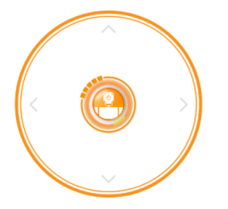  |                                                 Drag to control SpiderPi Pro's movement.                                                 |
|      | Clicking on the icons from left to right can control the robot to perform left slide, stand at attention, and right slide, respectively. |
|  |                                           Make SpiderPi Pro perform provided built-in actions.                                           |
|  |                                         Provide a guide for the remote control of the SpiderPi.                                          |
| 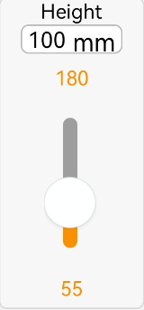 |                            Make SpiderPi Pro perform provi                                                                               |
| 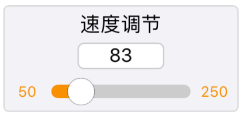 |                                                    Adjust SpiderPi's movement speed.                                                     |

Click the icon  at the top to bring up the interface for controlling the robotic arm. The movement of the robotic arm can be controlled by adjusting the angle of its 5 servos using the buttons.

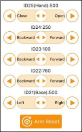

If you want to back to the games option interface, you can click the blank area, then the title bar will appear. Next, click  at the left side.

* **Color Recognition** 

This game can recognize red, green, and blue. SpiderPi Pro will nod when it detects red and shake its head when it detects blue or green.

:::{Note}

* Please start this game under a well-lit environment, but try to keep it from direct light.

* When recognizing, please do not have the same or similar colored object within the detected range to avoid interference.

* If the recognition effect is not good enough, please refer to  "[2.2.3 Adjust Color Threshold](#anchor_2_2_3)".
:::

(1) Click **"Color Recognition"** to enter this game. Its interface consists three parts:

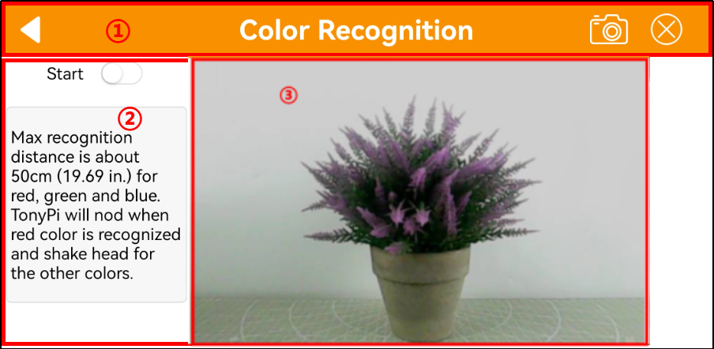

① The status bar is located at the top of the interface.

②  The left side of the interface is the area for enabling, disabling the game and adjusting the color threshold.

③ The right side of the interface is the area for displaying the live camera feed.

(2) Click the **"Start"** allows you to place red, blue, and green objects one by one in front of the camera.

| Recognized Color |                              Outcome                              |
| :--------------: | :----------------------------------------------------------------: |
|       Red       |  The buzzer emits a "beep" sound, and the camera nods its head.  |
|      Green      | The buzzer emits a "beep" sound, and the camera shakes its head. |
|       Blue       | The buzzer emits a "beep" sound, and the camera shakes its head. |

(3) If want to back to mode selection interface, you can arbitrarily click the blank area in interface, then click .

* **Target Tracking** 

(1) Click **"Target Tracking"** to enter the game interface. Once activated, this game enables the pan-tilt of SpiderPi Pro to move along with the movement of the target color.

:::{Note}

Please start this game under a well-lit environment, but try to keep it from direct light.

When recognizing, please do not have the same or similar colored object within the detected range to avoid interference.

If the recognition effect is not good enough, please refer to "[2.2.3 Adjust Color Threshold](#anchor_2_2_3)".

:::

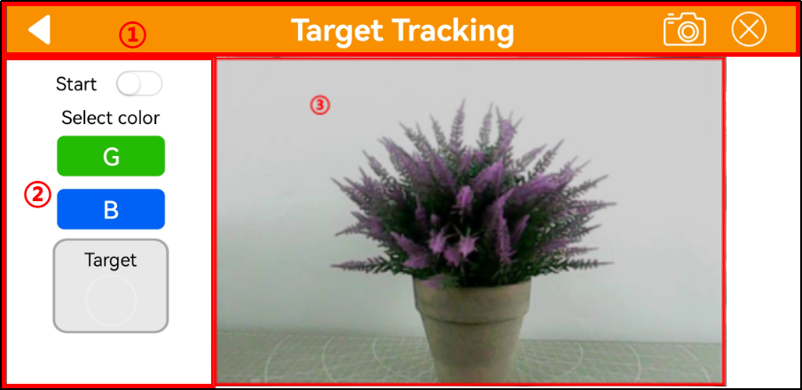

① The status bar is located at the top of the interface.

② The tracking switch area is located on the left side of the interface

③ The live camera feed area is located on the right side of the interface.

(2) If want to back to mode selection interface, you can arbitrarily click the blank area in interface, then click .

* **Line Following** 

(1) Click **"Line Following"** to enter this game. After activating it, the SpiderPi Pro will move forward along a black, white or red line.

:::{Note}

* Please start this game under a well-lit environment, but try to keep it from direct light.

* When recognizing, please do not have the same or similar colored object within the detected range to avoid interference.

* If the recognition effect is not good enough, please refer to "[2.2.3 Adjust Color Threshold](#anchor_2_2_3)".
:::

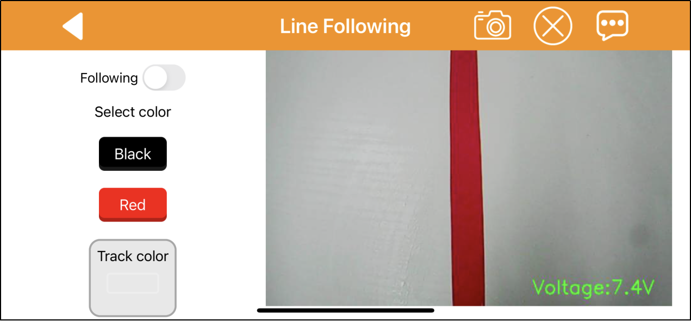

① The status bar is located at the top of the interface.

②  The line tracking switch area is located on the left side of the interface

③ The camera live feed area is located on the right side of the interface.

(2) Click **"Start following"** to enter this game and select color. Then SpiderPi will follow the targeted line.

|                                               Icon Button                                               |         Function Instruction         |
| :-----------------------------------------------------------------------------------------------------: | :----------------------------------: |
|  |       Start or stop this game.       |
| 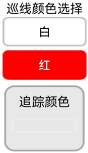 |      Select the targeted color.      |
| 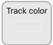 | Display the selected tracking color. |

(3) If want to back to mode selection interface, you can arbitrarily click the blank area in interface, then click .

* **Face Detection** 

:::{Note}

* Please start this game in a well-lit environment, but keep robot from the direct light.

* When recognizing, one human face only is allowed to appear within the detected range. Otherwise, it will affect the game result.

* The max recognition distance is about 1 meter.
:::

(1) Click Face Recognition to enter this game.

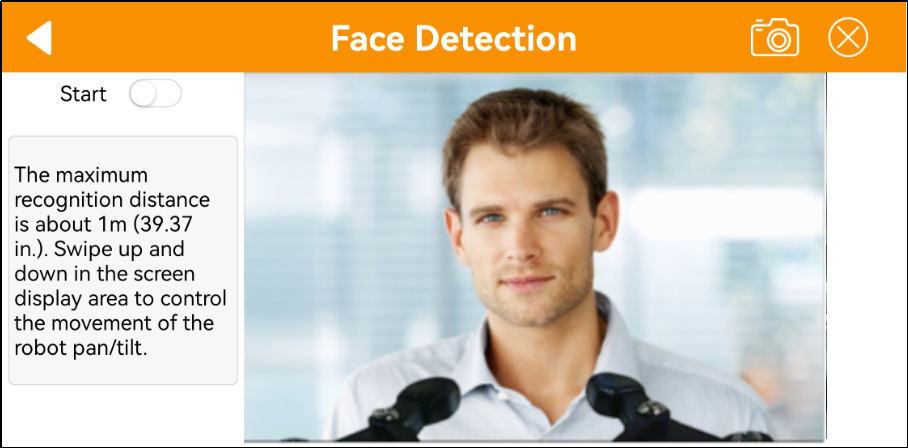

(2) After clicking  `Start`, the pan-tilt of the SpiderPi Pro will move left and right. When the face is detected, it will make a "**Hello**" action.

(3) If want to back to the mode selection interface, click the blank area of interface and then clickin the left side.

* **Tag Recognition** 

(1) Click **"Tag Recognition"** in mode selection interface to enter this game. This allows SpiderPi Pro's camera to recognize different QR code tags and execute corresponding actions.

:::{Note}

* When recognizing QR codes, the distance should not be too close or too far. The best distance between the QR code image and the camera is 35cm.

* Please start this game in a well-lit environment, but keep robot from the direct light.
:::

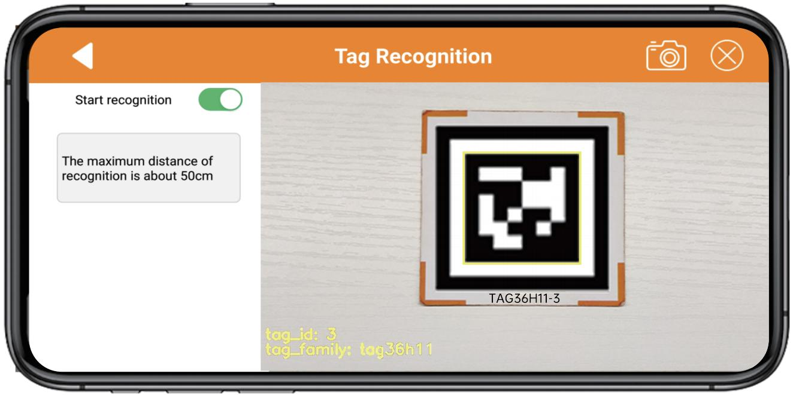

(2) Click "**Start**". Then SpiderPi will identify tags within the detected range and carry out different actions according to the recognized ID.

| **ID** | Corresponding Action |
| :----: | :------------------: |
|   1   |   Wave "Hello".   |
|   2   |    Walk in place.    |
|   3   |   Twist the body.   |

(3) If want to back to the mode selection interface, click the blank area of interface and then click  in the left side.

**2.2.7 Obstacle Avoidance**

(1) Click Obstacle Avoidance to enter the game interface. After this game is activated, the SpiderPi Pro can use ultrasonic to detect obstacles ahead to avoid them.

:::{Note}
Do not detect object at close range for a long time.
:::

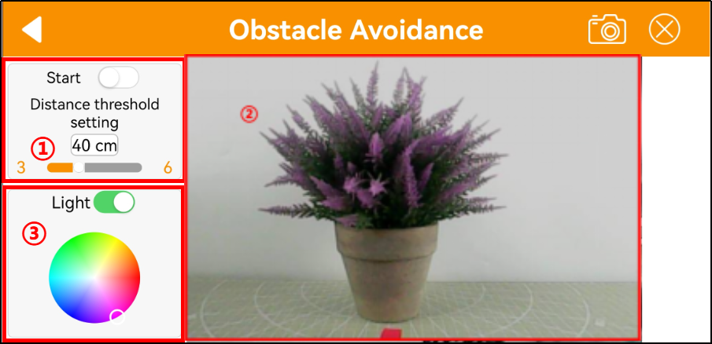

① The left side of the interface includes the obstacle avoidance game switch and the obstacle threshold setting area.

② The middle of the interface is the camera transmission image area.

③ The right side of the interface includes the setting area for the RGB light and motor speed.

(2) Click **"Start avoidance"**. SpiderPi Pro will move forwards and it will turn left when detecting obstacle ahead. Then continue moving forward until there is no obstacle.

|                                               Button Icon                                               |           Function Instruction           |
| :-----------------------------------------------------------------------------------------------------: | :---------------------------------------: |
| 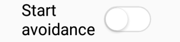 |         Start or close this game.         |
| 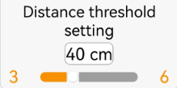 | Set obstacle threshold in the unit of mm. |
| 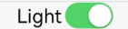 |         Turn on or off RGB light.         |
|  |          Adjust RGB light color.          |

(3) If want to back to mode selection interface, you can arbitrarily click the blank area in interface, then click .

### 2.3.3 Adjust Color Threshold

(1) Select color to be adjusted. Take red as example.

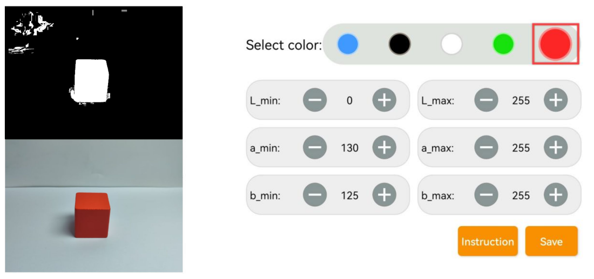

(2) Put red object within camera recognition zone. Set L_min, a_min and b_min to 0, and L_max, a_max and b_max to 255.

(3) Tap "**Instruction**" icon to check how to adjust color threshold.

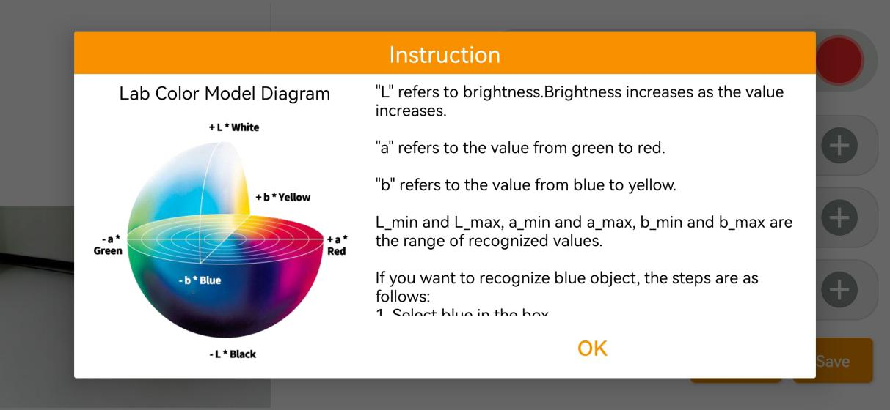

:::{Note}
if you need to close Instruction window, select "**OK**".
:::

(4) Red approaches "**+a**" zone, so you need to adjust A component.

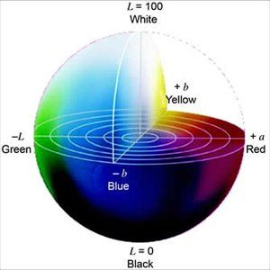

(5) Keep "**a_max**" value the same, and then increase "**a_min**" value till red object turns white and other area is black.

(6) Adjust "**L**" and "**B**" values. If it belongs to light red, increase L_min. Otherwise, decrease L_max. If it belongs to warm tone, increase B_min. Otherwise, decrease B_max.

(7) Remember to save the value after adjustment.

