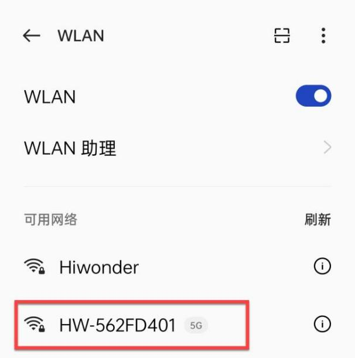
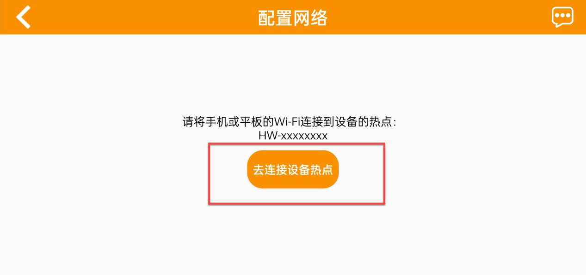
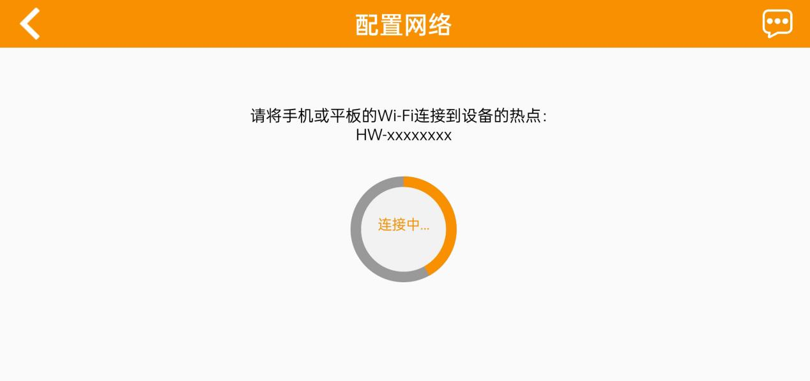
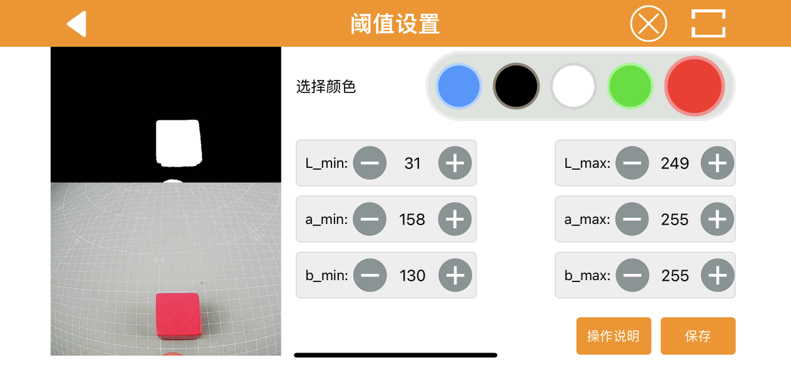

# 上手试玩

## 1. 手机APP安装与连接

### 1.1 准备工作

- **APP安装**

**[安卓系统](https://play.google.com/store/apps/details?id=com.Wonder.Pi)**： 需要注意，请务必在手机设置内为APP开启所有权限，否则可能会影响正常功能实现！

**[iOS系统](https://apps.apple.com/cn/app/wonderpi/id1477946178)**

- **设备开机**

按照"**[学前先看\3. 首次开机]()**"所学内容，打开树莓派扩展板电源开关，等待开机完成。

### 1.2 设备连接

SpiderPi开机成功后，会进入AP直连模式，并生成一个以"HW"开头的热点，使用手机APP连接该热点后，即可启动其对应玩法。

设备的连接方法有两种分别是直连模式与局域网模式，用户无论是选择AP直连模式还是STA局域网模式，都能一致实现SpiderPi手机APP的玩法功能。

- #### 1.2.1 连接模式简介

以下为SpiderPi的两种网络模式：

1.  AP 直连模式：开发板能够开启热点被手机连接上。(但不能联通外部网络)

2.  STA局域网模式：开发板能够主动去连接指定的热点/Wi-Fi。(可联通外部网络)

- #### 1.2.2 直连模式连接方法（必看）

:::{Note}
SpiderPi启动成功后会进入AP直连模式并生成一个以"HW"为开头的热点。
:::

1)  打开手机APP"**WonderPi**"，依次点击"**进阶套件**"、"**SpiderPi**"。

2)  点击界面右下角的"**+**"按钮，选择"**直连模式**"。

3)  点击"**去连接设备热点**"按键，前往设置界面，连接SpiderPi生成的热点，连接时需输入密码"**hiwonder**"。

4)  连接成功后返回手机APP。

:::{Note}
iOS系统下，需等待手机状态栏显示Wi-Fi图标后再返回APP，否则可能会搜索不到设备。若出现搜索不到设备的情况，可点击APP界面右上方的刷新图标****。**
:::

5)  此时APP将自动连接设备，稍等片刻，当搜索到下图所示图标时，即为连接成功。

:::{Note}
若出现"网络不可用，是否继续连接"的提示弹窗，单击"保持连接"按键即可。
:::

6)  点击上图的SpiderPi图标即可进入玩法模式选择界面，如下所示：

如需了解各个玩法的具体使用方法，可查看目录"**第4章 手机APP试玩\第2课手机APP试玩**"下的文档。

- #### 1.2.3 局域网模式连接方法在

1)  断开之前SpiderPi直连模式下的热点，将手机连接至一个Wi-Fi，这里以连接名称为："**Hiwonder**"的Wi-Fi为例。

2)  连接完成之后，打开"**WonderPi**"，依次点击"**进阶套件**"、"**SpiderPi**"。

3)  然后单击右下角"**+**"按钮，选择"**局域网模式**"。

4)  此时APP会提示输入你所连接Wi-Fi的密码（请确认密码是否输入正确，如果输入错误会导致连接失败），输入完成后点击"**好的**"。

5)  再点击"**去连接设备热点**"。

6)  此时手机会自动跳转到Wi-Fi连接页面，找到"**HW**"开头的热点，输入密码 "**hiwonder**"连接它。连接完成之后点击"**返回**"按钮。

7)  连接完成后，可以看到APP已经开始自动配置网络了。

8)  稍等片刻，主界面会显示SpiderPi的图标，同时扩展板上的LED灯也会常亮。

9)  长按APP中的SpiderPi图标，可以查看分配给SpiderPi的IP地址和ID。

10) 点击SpiderPi的图标，就可以进入到玩法页面了。

如需了解各个玩法的具体使用方法，可查看下节"**2. 手机APP试玩**"下的文档。

## 2. 手机APP试玩

### 2.1 准备工作

参照上节"**1. 手机APP的安装和连接**"教程，安装手机APP，并连接SpiderPi Pro机器人。

### 2.2 开始试玩

连接完成后，点击SpiderPi Pro机器人图标，进入模式选择界面。

在模式选择界面中点击玩法对应的图标即可进入玩法界面。

- #### 2.2.1 机体遥控

1)  玩法可以实时控制机体运动和动作组执行；界面分为四个部分，各部分的描述以及功能图标如下所示：

"**机体遥控**"界面分为三个部分，其中界面左侧可通过滑动摇杆来控制SpiderPi机体运动，其它功能图标可参考下表：

| **图标** | **对应功能** |
|:--:|:--:|
|  | 将中间旋钮拖至四周即可控制机器人移动。 |
|  | 从左至右依次点击图标可分别控制机器人进行左侧滑、立正及右侧滑。 |
|  | 可让机器人执行提供的内置动作。 |
|  | 提供机体遥控操作指南说明。 |
|  | 可对机器人高、中、低姿态进行调节。 |
|  | 可调节机器人的移动速度。 |

点击上侧的图标，即可弹出机械臂控制的界面界面。可通过按钮控制SpiderPiPro机械臂的5个舵机角度，从而控制机械臂运动。

2)  如需返回到玩法选择界面，点击空白区域调出状态栏，再点击左侧的图标即可。

- #### 2.2.2 颜色识别

该玩法可以识别红、绿、蓝三种颜色，识别到红色点头，识别到蓝色或绿色摇头。

:::{Note}
1.  请在光线充足的室内环境下进行，但尽量避免在强光直射下进行。
2.  识别时，摄像头画面内请勿应无同目标颜色相同或相近的杂物，避免干扰识别。
3.  如识别效果不佳，可前往目录"**[3. 颜色阈值设置](#anchor_3)**"查看文档，学习颜色阈值的调节方式。
:::

1. 点击"**颜色识别**"，进入玩法界面。该界面分为三个部分：

- 界面上方的是状态栏。

- 界面左侧是玩法的开启、关闭与颜色阈值调试区域；

- 界面右侧是摄像头回传画面区域。

点击"**开始识别**"按钮，可依次将红色、蓝色、绿色的物体单独放置于摄像头前。

| **识别颜色** |         **识别结果**         |
|:------------:|:----------------------------:|
|      红      | 蜂鸣器"滴"一声，摄像头点头。 |
|      绿      | 蜂鸣器"滴"一声，摄像头摇头。 |
|      蓝      | 蜂鸣器"滴"一声，摄像头摇头。 |

2.  如需返回到玩法选择界面，点击当前界面的空白区域，调出标题栏，随后点击按键即可。

- #### 2.2.3 目标追踪

点击"**目标追踪**"，进入玩法界面。该玩法开启后可以实现SpiderPi的云台随着目标颜色的移动而移动的功能。

:::{Note}
1.  请在光线充足的室内环境下进行，但尽量避免在强光直射下进行。
2.  识别时，摄像头画面内请勿应无同目标颜色相同或相近的杂物，避免干扰识别。
3.  如识别效果不佳，可前往目录"**[3. 颜色阈值设置]()**"查看文档，学习颜色阈值的调节方式。
:::

-  界面上方的是状态栏

-  界面左侧是追踪开关区域；

-  界面右侧是摄像头回传画面区域。

如需返回到玩法选择界面，点击当前界面的空白区域，调出标题栏，随后点击按键即可。

- #### 2.2.4 视觉巡线

点击"**视觉巡线**"，进入玩法界面。启动该玩法后，可以让SpiderPi沿着黑线、白线或红线前进。

:::{Note}
1.  请在光线充足的室内环境下进行，但尽量避免在强光直射下进行。
2.  识别时，摄像头画面内请勿应无同目标颜色相同或相近的杂物，避免干扰识别。
3.  如识别效果不佳，可前往目录"**[3. 颜色阈值设置](#anchor_3)**"查看文档，学习颜色阈值的调节方式。
:::

- 界面上方的是状态栏；

-  界面左侧是巡线开关区域；

-  界面右侧是摄像头回传画面区域。

1.  点击"**开始巡线**"按钮，并选择巡线颜色，SpiderPi将沿着目标颜色的线条前进。

| **按钮图标** | **功能说明** |
|:--:|:--:|
|  | 开启/关闭玩法。 |
|  | 选择巡线目标颜色。 |
|  | 显示选中追踪的颜色。 |

2.  如需返回到玩法选择界面，点击当前界面的空白区域，调出标题栏，随后点击按键即可。

- #### 2.2.5 人脸检测

:::{Note}
1.  请在光线充足的室内环境下进行，但尽量避免在强光直射下进行。
2.  识别时，摄像头画面最多能出现一张人脸，否则影响玩法效果。
3.  识别人脸的最大距离约为1m。
:::

1)  点击"**人脸识别**"，进入玩法界面。

2)  点击"**开始**"选项，SpiderPi云台舵机左右移动，当检测到人脸时，做出"打招呼"的动作。

3)  如需返回到玩法选择界面，点击当前界面的空白区域，调出标题栏，随后点击按键即可。

- #### 2.2.6 标签识别

点击"**标签识别**"，进入玩法界面。该玩法启动后可以让SpiderPi的摄像头识别不同的二维码标签，执行对应的动作。

:::{Note}
1.  识别二维码时距离不宜太近或太远，一般二维码图片与摄像头相距为35cm为最佳。
2.  请在光线充足的室内环境下进行，但尽量避免在强光直射下进行。
:::

1.  点击"**开始识别**"按钮，并选择不同的色块，SpiderPi将在识别到不同的色块之后执行不同的动作。

| **标签ID** | **执行动作** |
|:----------:|:------------:|
|     1      |     招手     |
|     2      |   原地踏步   |
|     3      |     扭腰     |

2.  如需返回到玩法选择界面，点击当前界面的空白区域，调出标题栏，随后点击按键即可。

- #### 2.2.7 自动避障

点击"**自动避障**"，进入玩法界面。该玩法启动后可让SpiderPi通过超声波识别前方是否有障碍物并避开。

:::{Note}
请勿长时间近距离的检测物体
:::

-  界面左上侧避障玩法开关及障碍物阈值设置区域；

-  界面中间是摄像头回传画面区域

-  界面左下侧是RGB彩灯设置区域。

1.  点击"**开始避障**"按钮，SpiderPi将一直前进，检测到障碍物会左转直到没有障碍物，然后继续前进。

| **按钮图标** | **功能说明** |
|:--:|:--:|
|  | 开启/关闭玩法。 |
|  | 调节障碍物阈值，单位为cm。 |
|  | 超声波RGB彩灯开启/关闭。 |
|  | 超声波RGB灯光颜色调节。 |

2.  如需返回到玩法选择界面，点击当前界面的空白区域，调出标题栏，随后点击按键即可。

## 3. 颜色阈值调试

在体验SpiderPi Pro机器人视觉玩法的过程中，周围环境的光线可能会对某些玩法的实现效果存在干扰。通过调节颜色阈值，可以解决这个问题（本节以安卓手机为例进行讲解），具体步骤如下：

1)  进入玩法主界面，点击右上角的设置按键，进入阈值调节界面。

2)  本节以调节红色为例，将红色方块放置在摄像头的视野范围内，在"**选择颜色**"处点击**红色**按键。

3)  点击界面右下角的"**操作说明**"按键，进入帮助界面。根据Lab颜色模型图可知，红色位于"**+a**"附近，因此需要将阈值区间往该处调整。

4)  点击"**好的**"按键以返回阈值设置界面，将L、A、B三个颜色分量的数值范围都调整为0~255，即所有_min的参数都为0，所有_max的参数都为255。

5)  保持"**A**"分量中"**a_max**"的数值不变，将"**a_min**"的数值增大，直至画面显示区上方的颜色物体区域变为白色，其它区域变为黑色。

6)  根据所处环境修改"**L**"和"**b**"分量的数值。若红色偏浅，则增大"**L_min**"；反之，则减小"**L_max**"。若红色偏暖，则增大"**b_min**"；偏冷，则减小"**b_max**"。调节完成后，点击"**保存**"按键，即可保存调节好的颜色阈值。

