# 远程工具安装及容器进入方法

<p id="anchor_1"></p>

## 1. 远程桌面工具的安装与连接

:::{Note}
若需在电脑端执行玩法，或想尝试查看与修改玩法代码，请先学习本章内容。
:::

### 1.1 准备工作

- #### 1.1.1 硬件准备

准备一台笔记本电脑，若使用台式电脑，请自备支持5G频段的无线网卡，否则可能会出现搜索不到树莓派热点的情况。

可通过修改频段的方法解决上述问题，具体操作方法可查看"**[机器人网络配置课程]()**"下的文档内容。

- #### 1.1.2 VNC远程工具的安装

VNC是一款图形化远程控制软件。通过连接树莓派的Wi-Fi热点，可以直接在电脑端控制树莓派，VNC的安装步骤如下：

1)  双击本节目录下的安装程序"**VNC-Viewer-6.17.731-Windows**"，将安装语言选择为"**English**"，并点击"**OK**"按键。


2)  点击"**Next**"按键。


3)  勾选同意协议，并点击"**Next**"按键。


4)  保持默认安装位置，并点击"**Next**"按键。跳转至下一界面时，直接点击"**Install**"按键。


5)  等待片刻后，出现安装完成的提示界面，点击"**Finish**"按键即可。


6)  安装完成，点击图标即可打开VNC。

- #### 1.1.3 设备开机

参照"**[学前先看\3. 机器人充电及开机]()**"，将电池对接线以**红对红**、**黑对黑**的形式进行连接，打开设备开关。稍等片刻后，扩展板上的LED2会开始闪烁，蜂鸣器会鸣叫一次，代表设备开机成功。

### 1.2 设备连接

1)  SpiderPi Pro机器人出厂默认是AP直连模式，开机成功后，将产生一个以"**HW**"开头的热点，可以在电脑端搜索并连接这个热点，如下图所示：

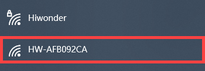

2)  打开VNC Viewer，在地址栏输入树莓派默认的IP地址：**192.168.149.1**，按下回车。如果出现安全连接相关的提示框，点击"**Continue**"按键即可。


3.  在账号登录窗口填写所需信息，账号栏（Username）输入"**pi**"，密码栏（Password）输入"**raspberrypi**"，并勾选记住密码（Remember password）。点击"**OK**"按键后，便可远程打开树莓派桌面。


4.  桌面若出现警告对话框（树莓派本身特性），点击"**确定**"按键即可。（如果出现黑屏，只显示鼠标指针，可尝试重启树莓派。）

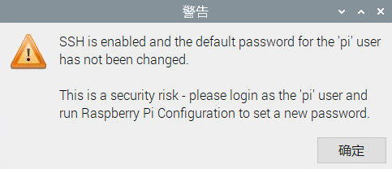

:::{Note}
各实验玩法详细启动步骤请参考随后章节的课程学习内容。
:::

## 2. 系统目录简要说明

:::{Note}
可在本节文件夹下观看讲解视频。
:::

### 2.1 桌面分布

通过VNC远程连接后，树莓派系统桌面如下图所示：


| **图标** | **功能** |
|----|----|
| 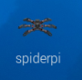 | SpiderPi上位机，集动作编辑、调用等功能 |
|  | 颜色模型参数调节工具 |
| 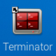 | 命令行终端，用于输入指令进行操作 |
|  | 回收站 |
| 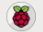 | 树莓派菜单栏 |
|  | 系统文件夹 |

### 2.2 程序结构说明

指令的输入需严格区分大小写及空格，关键词支持"**TAB**"键补齐。

1)  单击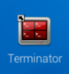图标，打开命令行终端。

2)  输入指令，然后按下回车，列出当前所有文件。主要来看这三个目录，如下图所示：

```commandline
ls
```

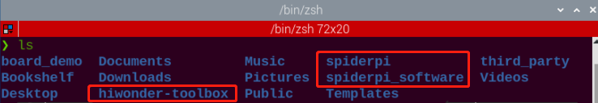

| **目录名**        | **作用**                         |
|-------------------|----------------------------------|
| spiderpi          | 存放所有玩法及涉及到的程序源码   |
| spiderpi_software | SpiderPi上位机源码（基于QT框架） |
| hiwonder-toolbox  | Wi-Fi管理工具                    |

:::{Note}
AI视觉玩法只需了解"**SpiderPi**"这个文件夹即可。
:::

3)  接下来进入玩法及程序源码目录，依次输入指令。列出该目录下的所有文件夹及文件。在SpiderPi内我们主要了解以下三个目录，如下图所示：

```commandline
cd spiderpi
```

```commandline
ls
```

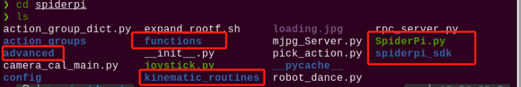

| 目录名             | 目录作用                           |
|--------------------|------------------------------------|
| functions          | AI视觉基础课程程序所在目录         |
| SpiderPi.py        | 主程序，处理玩法调用（已设置自启） |
| spiderpi_sdk       | 底层文件路径（用于硬件控制）       |
| advanced           | AI视觉进阶课程程序所在目录         |
| kinematic_routines | 机械臂正逆运动学课程程序所在目录   |

4)  我们再依次指令，了解一下视觉基础玩法程序所对应的玩法：

```commandline
cd functions
```

```commandline
ls
```

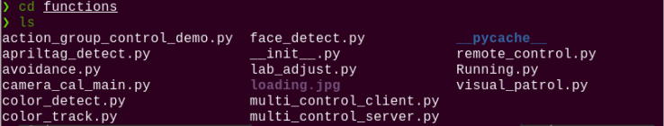

| **程序名**                   | **对应玩法**             |
|------------------------------|--------------------------|
| remote_control.py            | 遥控图传（仅作了解即可） |
| camera_cal_main.py           | 位置校准                 |
| color_detect.py              | 颜色识别                 |
| color_track.py               | 颜色跟踪                 |
| face_detect.py               | 人脸识别                 |
| visual_patrol.py             | 智能巡线                 |
| avoidance.py                 | 自动避障                 |
| apriltag_detect.py           | 标签识别                 |
| action_group_control_demo.py | 动作组调用               |
| multi_control_client.py      | 群控玩法客户端           |
| multi_control_server.py      | 群控玩法服务端           |

5)  我们再依次输入指令，了解一下视觉进阶玩法程序所对应的玩法：

```commandline
cd ..
```

```commandline
cd advanced
```

```commandline
ls
```

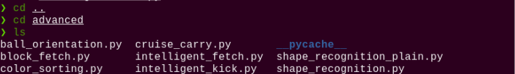

| **程序名**                 | **对应玩法**     |
|----------------------------|------------------|
| shape_recognition_plain.py | 单种颜色形状识别 |
| shape_recognition.py       | 形状识别         |
| ball_orientation.py        | 小球定位         |
| intelligent_kick.py        | 智能踢"球"       |
| block_fetch.py             | 色块定位夹取     |
| intelligent_fetch.py       | 智能取物         |
| color_sorting.py           | 色块分拣         |
| cruise_carry.py            | 巡线搬运         |

6)  我们再依次输入指令，了解一下视觉进阶玩法程序所对应的玩法：

```commandline
cd ..
```

```commandline
cd kinematic_routines
```

```commandline
ls
```

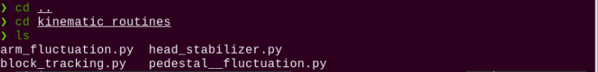

| **程序名**                 | **对应玩法**   |
|---------------------------|----------------|
| block_tracking.py          | 机械臂色块追踪 |
| arm_fluctuation.py         | 机械臂高度调节 |
| pedestal\_\_fluctuation.py | 底盘高度调节   |
| head_stabilizer.py         | 机械臂底盘联动 |
