# 4. Installing VNC Remote Connection Tool

<p id="anchor_1"></p>

## 1. VNC Installation and Connection

### 1.1 Getting Ready

**1.1.1 Hardware Preparation**

A laptop or a desktop computer is required. If you're using a desktop computer, please prepare your own wireless network card (supporting 5G frequency
band). If the network card 5G is not supported, you may not be able to search  for the hotspot launched by the Raspberry Pi.

**1.1.2 Install VNC**

VNC is a graphics remote control software. With VNC, we can control the Raspberry Pi directly from your computer by connecting the hotspot created by Raspberry Pi. Next, you will learn how to use VNC.

(1) Double-click "VNC-Viewer-6.17.731-Windows" file in this folder. In the pop-up dialogue box, select the installation language as "English" and then click the `OK` button.


(2) Then click the `Next` button on the pop-up interface.


(3) Then click `accept the terms in the License Agreement` in the prompt box, and click `Next` to enter the next step.


(4) click `Next` button to enter the next step. Then click `Install` .


(5) After VNC has been successfully installed, click the `Finish` button which completes the installation process.


(6) After installing completely, click  icon to open VNC.

**1.1.3 Turn on Device**

Please refer to the tutorial  [Getting Ready/Start SpiderPi Pro]()  to turn on the robot. Wait a moment, LED1 and LED2 of Raspberry Pi will be on firstly and then the LED2 will flash every 2 seconds, which means SpiderPi Pro is turned on successfully.

### 1.2 Connect Device

(1) SpiderPi Pro defaults to AP direct connection mode before shipping. After
turning on the robot, it will generate a hotspot starting with "HW" . You need to search and connect to this hotspot, as the figure shown below:

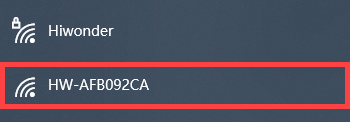

(2) Open VNC Viewer, and enter the default IP address of Raspberry Pi
(192.168.149.1), and then press "Enter" . If the software warns that the connection is not safe just Click `Continue` .


(4) Input the required information in the login window. Enter the Username `pi` and the password `raspberrypi` , and check  `Remember password` box. Then click `OK` to start Raspberry Pi.


(4) If a warning dialogue box pops up (this is normal), click `OK` to close it (if a black screen occurs, please restart the Raspberry Pi).

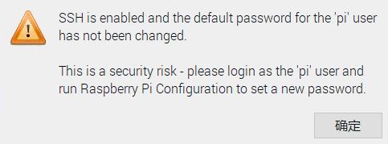

:::{Note}
Please refer to the following lessons to learn about detailed startup steps for each experimental game.
:::

## 2. System Introduction

### 2.1 Desktop Instruction

After remote connection via VNC, the Raspberry Pi system desktop is as shown in the figure below:


| **Icon**                                                     | **Function**                                                 |
| ------------------------------------------------------------ | ------------------------------------------------------------ |
| 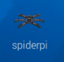 | SpiderPi PC software which includes action editing, calling, and etc. |
|  | Color model parameter adjustment tool.                       |
|  | Command line terminal is used to input instructions to operate. |
| 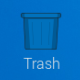 | Recycle bin.                                                 |
| 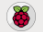 | Raspberry Pi menu bar.                                       |
|  | System file folder.                                          |

### 2.2 Programming Instruction

The input command must be case sensitive and space, and the keyword supports **"TAB"** key to fill.

(1) Click 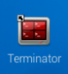 or press "Ctrl+Alt+T" to open the command line terminal.

(2) Enter "ls" command and then press "Enter" to list all the documents. Let's focus on the three directories shown in the figure below:

```bash
ls
```

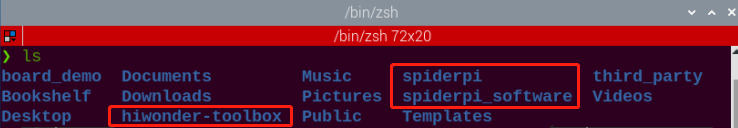

| **Directory**     | Function                                             |
| ----------------- | ---------------------------------------------------- |
| spiderpi          | Store all the games and related program source code. |
| spiderpi_software | SpiderPi PC software source code                     |
| hiwonder-toolbox  | Wi-Fi management tool.                               |

:::{Note}
For AI vision games, you only need to check the folder SpiderPi.
:::

(3) Enter `cd SpiderPi` to open all the games and program source code. In the SpiderPi, let's focus on the directories as shown below:

```bash
cd spiderpi
```

```bash
ls
```

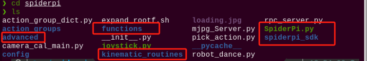

| Contents           | Function                                                                    |
| ------------------ | --------------------------------------------------------------------------- |
| functions          | The directory where the AI vision game program is located.                  |
| SpiderPi.py        | Main program for running the games<br/>(auto-start has been set).           |
| spiderpi_sdk       | Underlying file path<br/>(for hardware control).                            |
| advanced           | The directory where the AI vision<br/>advanced lesson programs are located. |
| kinematic_routines | The directory where the robotic arm forward and inverse kinematics lesson   |

(4) Enter the `cd functions` and `ls` instructions in turn again. Let's take a look at the corresponding games of the AI vision basic program:

```bash
cd functions
```

```bash
ls
```

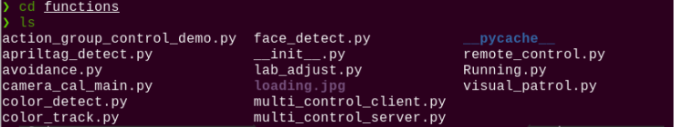

| Program Name                 | Game                 |
| ---------------------------- | -------------------- |
| remote_control.py            | Body remote control  |
| camera_cal_main.py           | Position calibration |
| color_detect.py              | Color recognition    |
| color_track.py               | Color tracking       |
| face_detect.py               | Facial recognition   |
| visual_patrol.py             | Line following       |
| avoidance.py                 | Obstacle avoidance   |
| apriltag_detect.py           | Tag recognition      |
| action_group_control_demo.py | Action group calling |
| multi_control_client.py      | Group control client |
| multi_control_server.py      | Group control server |

(5) Enter the `cd ..`, `cd advanced`, and `ls` instructions in turn again. Let's take a look at the corresponding games of the AI vision advanced program:

```bash
cd ..
```

```bash
cd advanced
```

```bash
ls
```

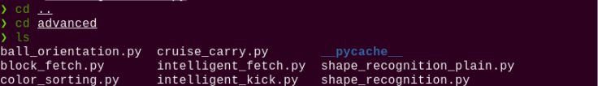

| Program                    | Game                                 |
| -------------------------- | ------------------------------------ |
| shape_recognition_plain.py | Shape recognition under single color |
| shape_recognition.py       | Shape recognition                    |
| ball_orientation.py        | Ball positioning                     |
| intelligent_kick.py        | Kick the ball                        |
| block_fetch.py             | Object picking                       |
| intelligent_fetch.py       | Intelligent picking                  |
| color_sorting.py           | Color sorting                        |
| cruise_carry.py            | Line following and transfer          |

(6) Enter the `cd ..`, `cd kinematic_routines`, and `ls` instructions in turn again. Let's take a look at the corresponding games of the program:

```bash
cd ..
```

```bash
cd kinematic_routines
```

```bash
ls
```

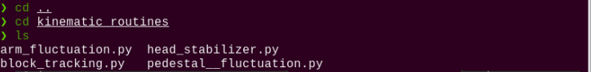

| Program                    | **Game**                      |
| -------------------------- | ----------------------------- |
| block_tracking.py          | Color tracking                |
| arm_fluctuation.py         | Robotic arm height adjustment |
| pedestal\_\_fluctuation.py | Chassis height adjustment     |
| head_stabilizer.py         | Synchronized adjustment       |
