# 5. Action Editing

## 1. PC Software Introduction

The functions of PC software are introduced in details for you to master it quickly.

Firstly, connect to VNC remote desktop and double-click PC software "**SpiderPi**" to start it. If window pops up, click "**Run**".


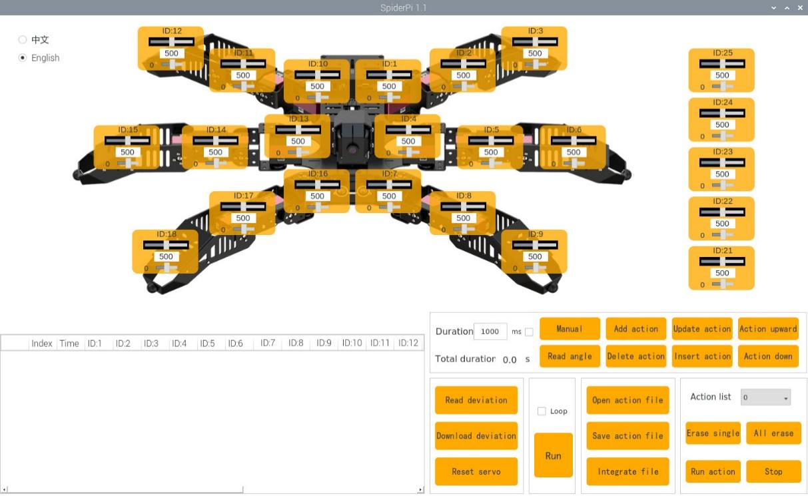

The interface is divided into 5 areas.

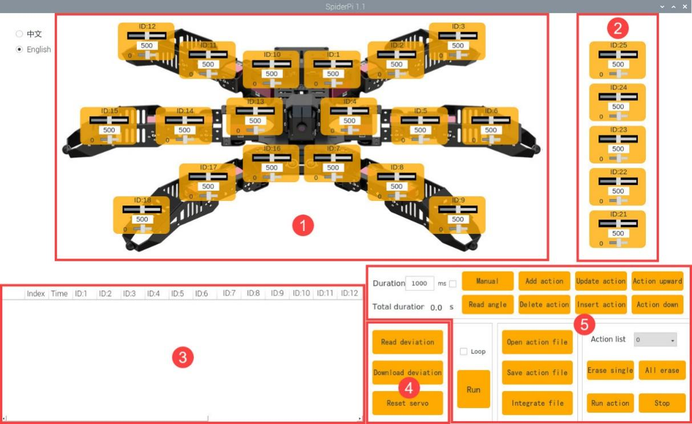

### 1.1 Body control area

You can drag the slider to control the position of the corresponding servo so as to switch the moving posture of the SpiderPi Pro.

|                             Icon                             |                 Function                 |
| :----------------------------------------------------------: | :--------------------------------------: |
|  |  ID number. Take NO.3 servo as example   |
|  |   Adjust servo position from 0 to 1000   |
|  | Adjust servo deviation from -125 to 125. |

### 1.2 Robotic arm control area

You can adjust the servo value in this area to control the posture of the robotic arm. Note: the ID of the servo on the robotic arm from the top to the bottom is 25 - 21.

|                             Icon                             |                 Function                 |
| :----------------------------------------------------------: | :--------------------------------------: |
|  |  ID number.Take NO.25 servo as example   |
|  |  Adjust servo position from 0 to 1000.   |
|  | Adjust servo deviation from -125 to 125. |

### 1.3 Action list

The running time and servo data of the current action are displayed on the action list.

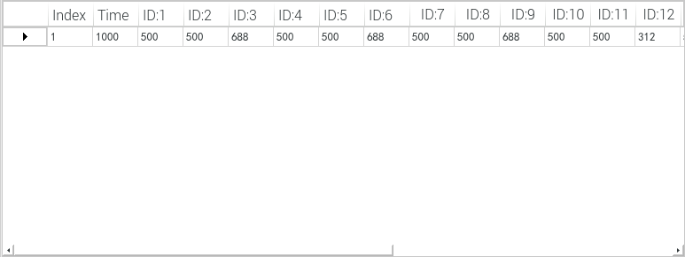

|                             Icon                             |                           Function                           |
| :----------------------------------------------------------: | :----------------------------------------------------------: |
| 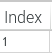 | The serial number of the action group. Here refer to NO.1 action. |
| 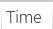 |                 Running time of the action.                  |
| 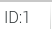 | Action data of the corresponding servo. Double click the figure to revise. |

### 1.4 Action group setting

|                             Icon                             |                           Function                           |
| :----------------------------------------------------------: | :----------------------------------------------------------: |
| 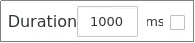 | Action running duration time. Click the value to modify. Note: you need to click the "Update Action" button to make the modified settings take effect. In addition, the value range of the time is 20-9999. |
| 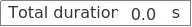 | The total running time taking for all the actions in an action group to complete running. |
|  | If you click this button, the joints of the robot will become loose, and you can drag the servo to form any posture. |
|  | Read the servo angle you have designed before. This button should be used with |
|  | Add the servo value as a action to the last line of the action list |
|  |        Delete the action selected in the action list         |
|  | Replace the angle value of the action selected in the action list with the servo value in the servo control area. And update the running time as the time set in "**Time**" |
|  | Insert a new action above the selected action. The running time of this new action is the time set in "**Time**" and angle value is the current value in servo control area. |
|  |             Move the selected action up one line             |
|  |            Move the selected action down one line            |
| 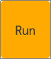 |     Click to run all the actions on the action list once     |
|  | If "**Loop**" is ticked, SpiderPi Pro will repeat the action. |
|  |  Load the data of the saved action group to the action list  |
|  | Save the current actions in the action list into the designated path. |
|  | Firstly, open one action group, then click this button, and then open other action group. And these two action groups will be integrated into one. |
| 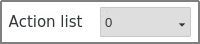 | Display the saved action groups. You can select the action to run |
|  |       Delete the currently selected action group file.       |
|  |     (**Be careful!**)Deleted all the action group files.     |
|  |             Run the selected action group once.              |
|  |                Stop running the action group.                |

### 1.5 Servo deviation setting area

|                             Icon                             |                          Function                           |
| :----------------------------------------------------------: | :---------------------------------------------------------: |
|  |          Click to read the saved servo deviation.           |
|  |   Click to download the adjusted deviation to the robot.    |
|  | Click to return all the servos to the middle position(500). |

<p id="anchor_2"></p>

## 2. Action Editing

### 2.1 Project outcome

Create an action group consisting of 26 independent actions to allow the SpiderPi Pro to "move forward and pick".

### 2.2 Action design

This action group is divided into two parts. The first part is to make SpiderPi Pro to move forward, and the second part is to pick the block.

**2.2.1 Move forward**

The robot body consists of 6 legs, that is 1-6 zones, as shown in the figure below.

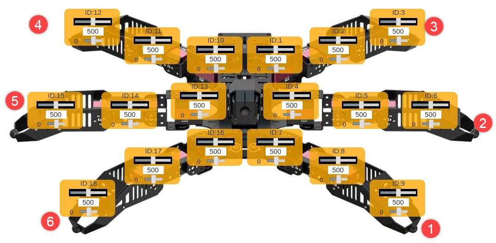

(1) Firstly, before starting the robot, set a initial posture for the robot. Click "**Open Action File**" and select the built-in action file "**stand_low.d6a**", and then click "**Open**". Then the first action is added to the action list.


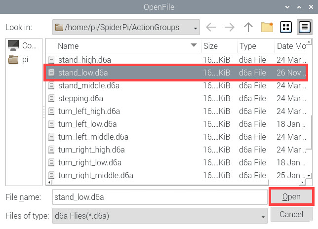

(2) click 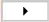 and update the action value to the servo control area.

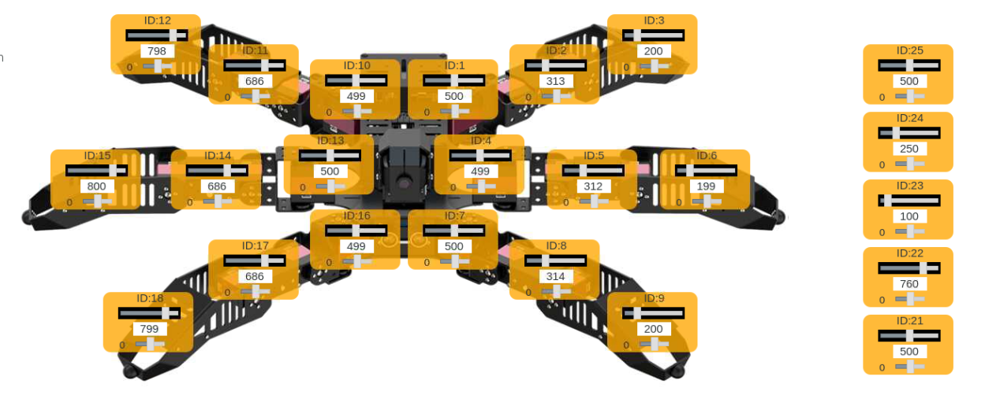

(3) Adjust the slider of ID1, ID2, ID7, ID8, ID13 and ID14 servos to make robot lift NO.1, 3 and 5 legs and tilt forward. The adjusted values are shown as follow.

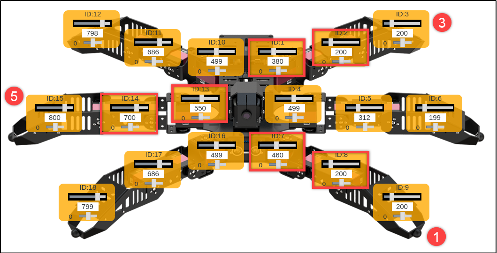

(4) Set the time as 300ms and click "**Add Action**". Then the second action is added to the action list.


(5) To make the transition between each action more fluent, it is necessary add transitional action between actions. Remain the servo value unchanged and modify the running time as 1000ms, and click "**Add Action**".


(6) Next, put down NO. 1, 3 and 5 legs. Modify the servo value of ID2, ID8 and ID14 according to the picture below.

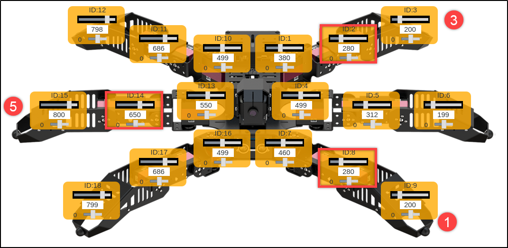

Set the time as 300ms, and click "**Add Action**" to add NO.4 action.


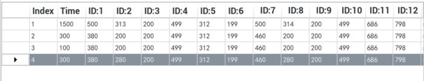

(7) Add other transitional action and set the time as 200ms, and then click "**Add Action**" to form NO.5 action.


(8) Next, lift NO.2, 4 and 6 legs and make the servos on NO.1, 3 and 5 return to the mid position to make the robot move forward. Set he servo value according to the below figure

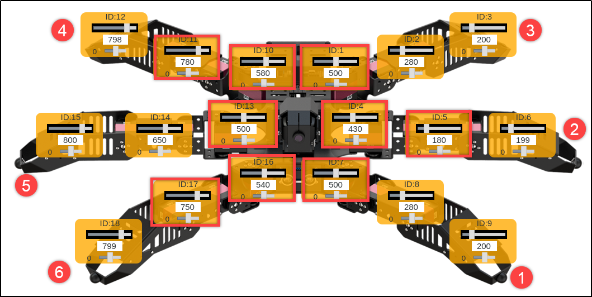

(9) Set the time as 400ms and click **"Add Action**" to obtain NO.6 action.


(10) Add a transitional action and set the time as 100ms and then click "Add Action". Then, NO.7 action is created.


(11) Lastly, put down NO 2, 4 and 6 legs. Please follow the picture below to set the value of ID5, 11 and 17 servos.

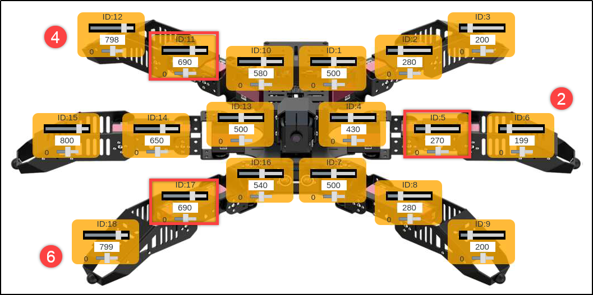

(12) Set the time as 600ms and click "**Add Action**" to add NO.8 action.


The action of moving forward is complete, which involves 8 independent actions. The servo values of each action are listed below.


**2.2.2 Pick the object**

After editing the action of "**moving forward**", design an action to make the robotic arm pick the block and place it to its right side. In the following steps, the values in robotic arm control area will be adjusted.

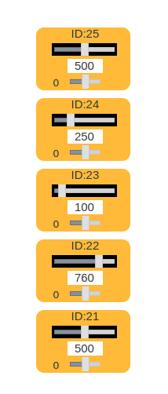

:::{Note}
robotic arm will move forward first and then pick the object, hence the action of picking object starts from NO.9 action.
You can take steps to set the servo value.
:::

(1) First, set the value of ID22 servo as 480 to make the robotic arm down.

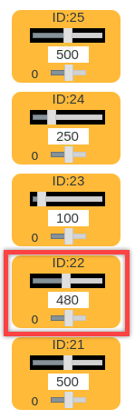

(2) Then set the time as 600ms and click "**Add Action**" to create NO.9 action.


(3) As before, we need to add a transitional action. Set the time as 200ms and click **"Add Action**".


(4) Next, adjust the servo value of ID22 and ID23 to make the gripper approach the block.

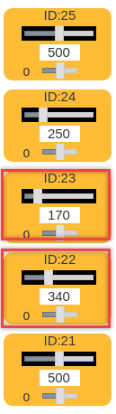

(5) Set the time as 500ms and click "**Add Action**" to get NO.11 action.


(6) Set a transitional action and set the time as 200ms to build NO.12 action.

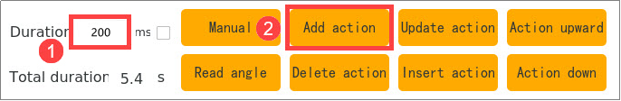

(7) When coming to the block, the robotic arm will start picking the block. Set the value of ID25 as 290 to make the gripper open.

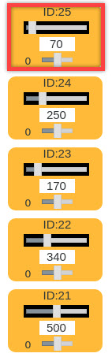

(8) Set the time as 600ms and click "**Add Action**" to form NO.13 action.


(9) Add a transitional action and set the time as 100ms to get NO.14 action.


(10) Adjust the servo value of ID22 to make the gripper approach the block.

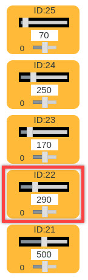

(11) Set the time as 400ms and click "**Add Action**" to design NO.15 action.

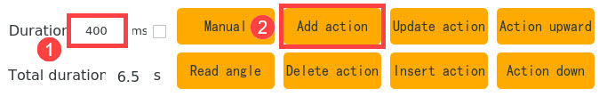

(12) Drag the slider of ID 25 to set the value as 510 making the gripper clamp the block.

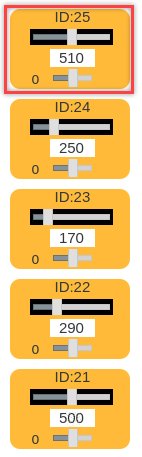

Set the time as 200ms and click "**Add Action**" to get NO.16 action.


(13) Set the time as 100ms and click "Add Action" to add a transitional action.


(14) Set the value of ID22 as 510 to make the robotic arm lift the block.

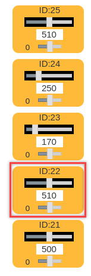

(15) Set the time as 700ms and click "**Add Action**" to obtain NO.18 action.


(16) Set the time as 300ms and click "**Add Action**" to add a transitional action.


(17) After the block is picked, control the robotic arm to transfer the block to the right side. Adjust the slider of ID21 to set the value as 200.

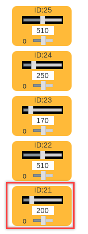

(18) Set the time as 1000ms and click "Add Action" to receive NO.20 action.

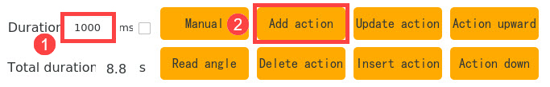

(19) Set the time as 600ms and click "Add Action" to create a transitional action.


(20) Next, put down the block and drag the slider of ID22 to lower down the robotic arm.

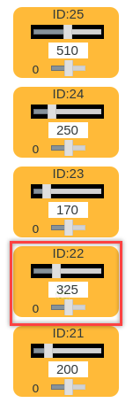

(21) Set the time as 1000ms and click "**Add Action"** to generate NO.22 action.


(22) Release the block. Set the value of ID25 servo as 200 to open the gripper.

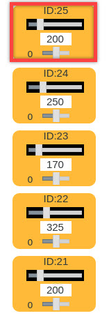

(23) Set the time as 800ms and click "**Add Action**" to add NO.23 action.


(24) Having released the block, the robotic arm should be lifted. Set the value of ID22 servo as 550.

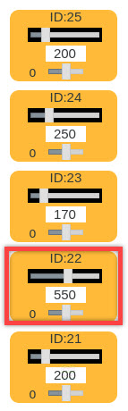

(25) Set the time as 1000ms and click "**Add Action**" to get NO.24 action.


(26) Set the time as 1000ms and click "**Add Action**" to add a transitional action.


(27) Lastly, make the robotic arm return to the initial posture. Move to the action list and select NO.8 action, and then clickto update the value of this action to the servo controlling area.

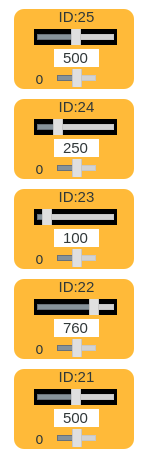

(28) Set the time as 1000ms and click "**Add Action**" to get NO.26 action.


The servo value of the whole action group is as follow.

### 2.3 Save the Action

For the convenience of later debugging and management, it is recommended to save the action. Click "**Save Action File**" and select the path to save, `/home/pi/SpiderPi/ActionGroups`, and the enter the action group name "**go_forward_and_grip**". Lastly, click "**Save**".

:::{Note}
when entering the action group name, please do not press "**Space**", otherwise it may fail to save the action group.
:::

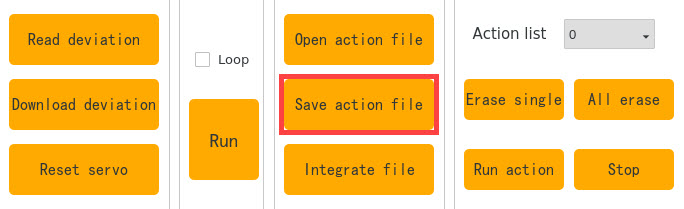

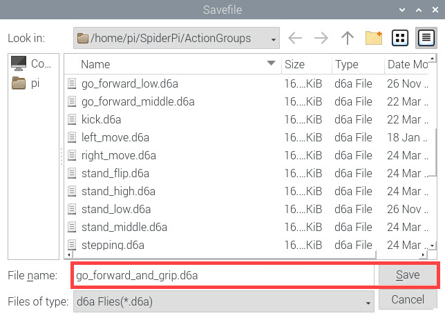

## 3. Action Calling

SpiderPi Pro has 15 built-in action groups which are stored in the path `/home/pi/spiderpi/action_groups/`. With PC software, you can check and call the built-in actions. You can follow the below steps to operate.

### 3.1 Operation steps

(1) According to the tutorial in "[Set Development Environment\1.VNC Installation and Connection]()", install VNC and remotely connect to Raspberry Pi system desktop.

(2) Double click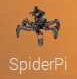and click "**Run**" in the pop-up window to enter the editing interface, as shown in the below figure.

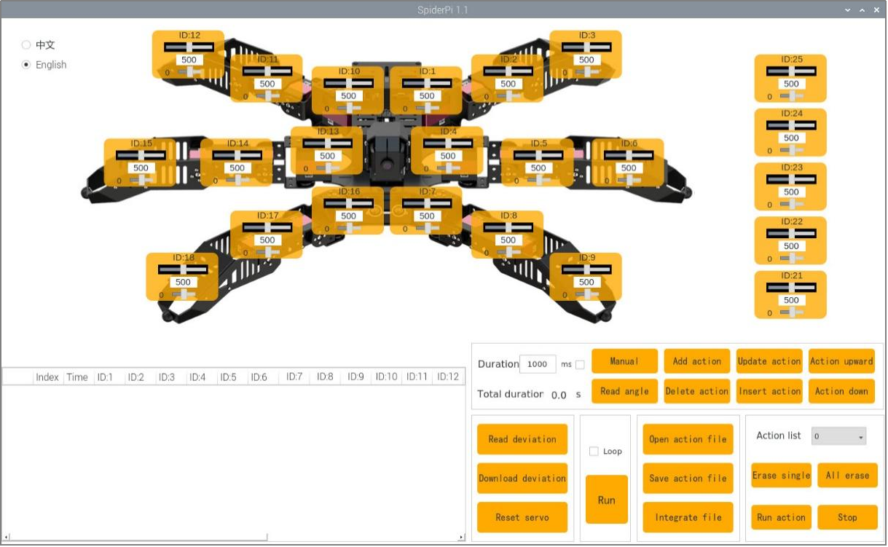

(3) Next, click "**Open Action File**" to select the action group to run. Then click "**Open**".


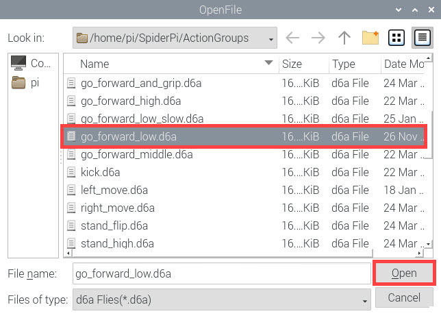

(4) The file path and servo value of each action in this action group will be displayed in the action list.

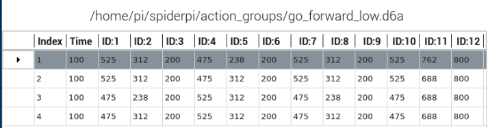

(5) Click "**Run**" to run all the actions in the action list. If you want to make the robot repeat the action group, you can tick "**Loop**".

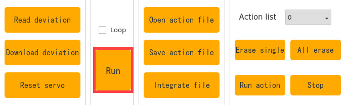

### 3.2 Import the external action group

If you want to call the external actions, you can follow these steps to operate. Take importing "**dance.d6a**" action group for example. Note: the action group file must end with "**.d6a**" suffix.

(1) Insert the U disk containing the action files into any USB interface on Raspberry Pi. And copy and paste the action group files to the system desktop.

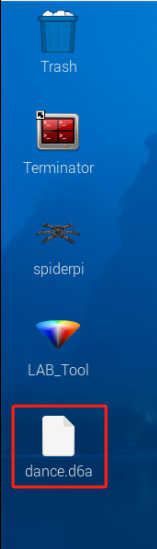

(2) Then save the action group file to this path `/home/pi/spiderpi/action_groups/`.

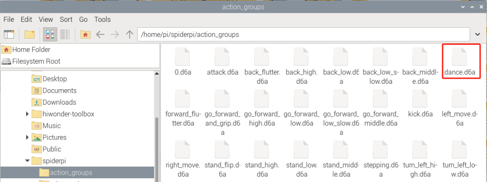

(3) Next, double click PC software iconand click "Run"

(4) Click "**Open Action File**" and select the action group file to import, and then click "**Open**".

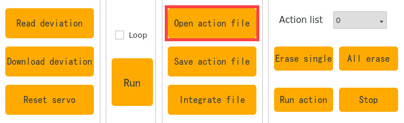

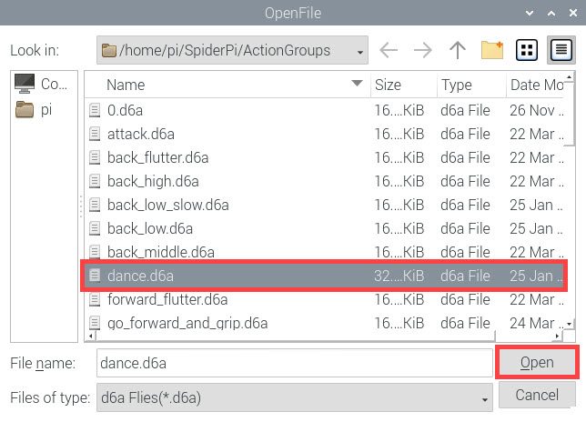

(5) At this time, the servo value and the running time of the imported action group are displayed on the action list.

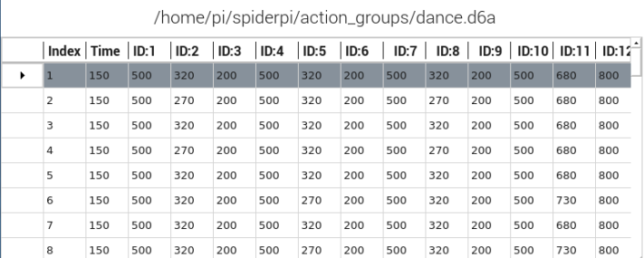

## 4. Integrate Action Files

### 4.1 Project outcome

Integrating action files is to integrate two actions to form a new action group. And, we will integrate "wave" and "**go_forward_and_grip**" for example.

### 4.2 Start integrating

(1) Having connected to VNC, open SpiderPi PC software.

(2) Click "**Open action file**"and select "**wave.d6a**"file in the pop-up window, and click **"Open**".


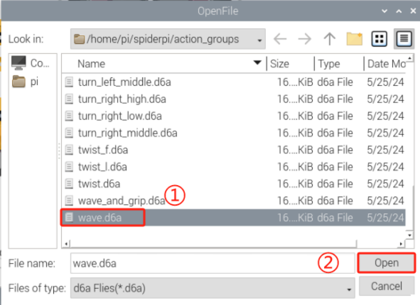

(3) Then the parameters of this action group are displayed on the action list.

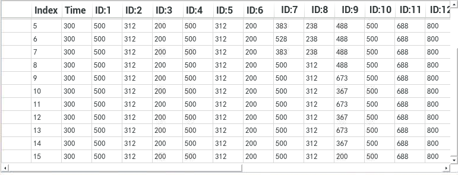

(4) Click "**Integrate file**" and select **"go_forward_and_grip**" action group, and then click "**Open**" again to integrate these two action groups.

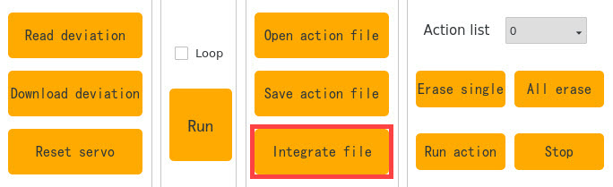

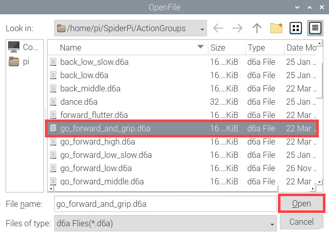


(5) Click "**Run**" to execute the new integrated actions online.


(6) Click "**Save action file**" button and enter new action group name (such as "**wave_and_grip**" ) to save the new integrated action group for the future debugging.


## 5. Call Action Group Using Command

### 5.1 Goal

Besides importing the action groups of SpiderPi Pro using PC software, user can execute the command on the terminal to run action group.

:::{Note}
action group files must be saved in this directory `/home/pi/spiderpi/action_groups/`.
:::

Click-on  and navigate to this folder `/home/pi/spiderpi/action_groups/` where all action files are saved here.


### 5.2 Call Action Group

(1) After accessing the system desktop using VNC, click-on  to open the terminal.

(2) Execute the command and press Enter to navigate to the folder where game programs are saved.

```bash
cd spiderpi/functions/
```

(3) Run the command  and press Enter to start the game.

```bash
python3 action_group_control_demo.py
```

At this time, SpiderPi Pro will execute "**stand**" action group, then execute "**go_forward**" action group twice. Once SpiderPi Pro completes running the action group, the program will be terminated automatically.

### 5.3 Change Action Group to be Called

**5.3.1 Call Individual Action**

User can modify the program to enable SpiderPi Pro to execute single action group. Detailed instructions are as below:

(1) After entering the robot system using VNC, click-on  to open the terminal.

(2) Execute the command and press Enter to switch the directory where game programs are saved.

```bash
cd spiderpi/functions
```

(3) Execute the command  and press Enter to open the program file.

```bash
sudo vim action_group_control_demo.py
```

(4) Press "I" key to enter program editing mode.


(5) Locate the following mode.


(6) Use the function `AGC.run_action_group()` to call action groups saved in "/home/pi/spiderpi/action_groups/". Enter the action group name within the single quotation mark, then save the command. After that, you can call the action group using command.

The 28th line of code introduces an extra runtime parameter 'time=2,' indicating that it will run twice. In this section, we'll illustrate using the 27th line as an example, and initially, you can comment out the 28th line of code.

To do this, you can navigate the mouse cursor using the keyboard's arrow keys and add the '#' symbol at the beginning of line 28 to comment out that line of code. This will retain only the code for executing the 'stand_low' action group. In this configuration, the remaining 29th line of code will execute the action group once. If you wish to run the action group multiple times, you can comment out the 29th line and keep the 30th line of code.


(7) Enter the action group to be executed within the single quotation mark of the 29th line of code. Take executing "attack" action group as example.


:::{Note}
the action group files must be saved in the directory `/home/pi/spiderpi/action_groups/`. If you want to call the customized action group, you need to edit the action group first according to the file saved in "[Action Editing\2.Action Editing]()".
:::


(8) After modification, press `Esc` to exit the editing mode. Then input `:wq` and press `Enter` to save and close the program file.

```bash
:wq
```

(9) Execute the command `python3 action_group_control_demo.py` and press `Enter` to start the game. SpiderPi Pro will execute the action group `attack` once.

```bash
python3 action_group_control_demo.py
```


**5.3.2 Call Multiple Action Groups**

:::{Note}

The following operation is carried out based on the preceding operation.

:::

User can enable SpiderPi Pro to execute several action groups through copying multiple lines of codes. Take calling action groups "**left_move**" and "**kick**" as example.

(1) Repeat steps 1-3 provided in "[5.3.1 Call Individual Action]()" to open the program file. Please note that never enter the editing mode, otherwise you will fail to copy the codes. If you find you are in editing mode, press `Esc` key to exit this mode.

(2) Position the cursor just before the 29th line using the arrow keys, and then press 'yy' on the keyboard. To copy 2 lines, use '2yy,' with '2' indicating the number of lines to be copied. You can specify the desired number of lines to copy; for instance, use '5yy' to copy 5 lines.

(3) Them move to the end of the 30th line and press `p` to paste the code.


(4) Press `i` key to enter the editing mode, and change the number of the 29th and 31st lines respectively to "left_move" and "kick".


:::{Note}
action group files are saved in the directory `/home/pi/spiderpi/action_groups/` The name of action group entered in the program should be consistent with the action groups saved in the "ActionGroups" folder.
:::

(5) After modification, press `Esc` key to exit the editing mode. Input `:wq` and press Enter to save and close the program file.

```bash
:wq
```

(6) Execute the command `python3 action_group_control_demo.py` to start the game. SpiderPi Pro will execute the action groups "**left_move**" and "**kick**" in sequence.

```bash
python3 action_group_control_demo.py
```


