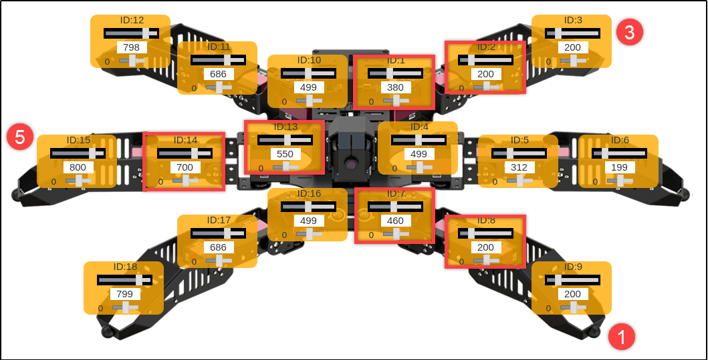
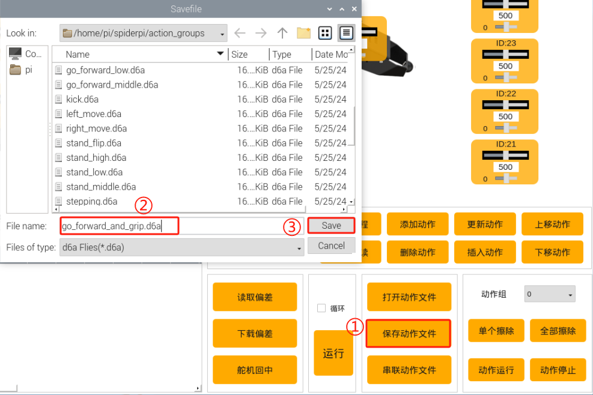
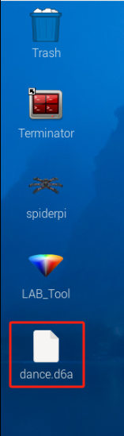
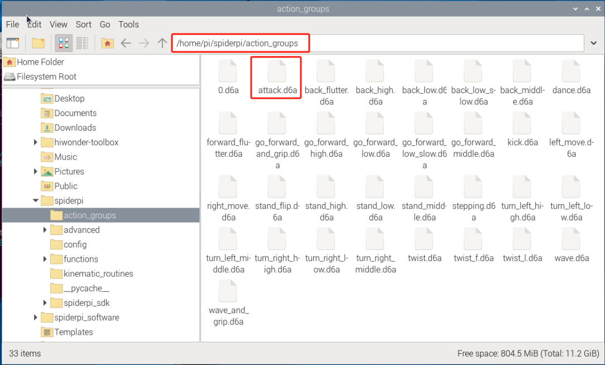
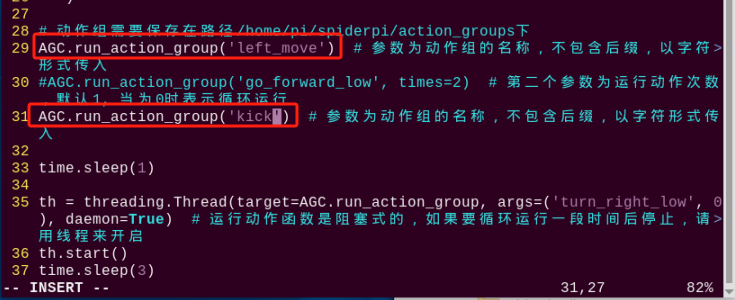

# 上位机动作编辑课程

## 1. 上位机功能说明

本节主要是对SpiderPi Pro机器人上位机软件进行介绍，让大家快速熟悉此上位机的使用。

首先连接VNC远程桌面，然后在桌面位置双击打开上位机软件"**SpiderPi**"。（出现弹窗提示时，直接点击"**执行**" 即可）


SpiderPi Pro机器人上位机软件"**中文**"模式下的主界面可分为以下区域：


### 1.1 机体控制区域

我们可以通过调整机体控制区域显示的对应舵机滑杆值，来调整舵机位置，从而控制机器人机体移动的姿态变换。

| 图标 | 功能说明 |
|:--:|:--:|
|  | 代表舵机的ID号，这里以3号舵机为例。 |
|  | 用于调整舵机位置，最小值为0，最大值为1000。 |
|  | 用于调整舵机偏差，最小值为-125，最大值为125。 |

### 1.2 机械臂控制区域

可通过调节此区域的舵机数值来控制机械臂的姿态

:::{Note}
机械臂从上到下分别对应25-21号舵机。
:::

| 图标 | 功能说明 |
|:--:|:--:|
|  | 代表舵机的ID号，这里以25号舵机为例。 |
|  | 用于调整舵机位置，最小值为0，最大值为1000。 |
|  | 用于调整舵机偏差，最小值为-125，最大值为125。 |

### 1.3 动作详情列表

动作详情列表显示了当前动作组内每个动作的执行时间，以及每个动作分布的舵机值。


| 图标 | 功能说明 |
|:--:|:--:|
|  | 动作组编号，这里表示1号动作。 |
|  | 动作运行的时间，即执行该动作所需时间。 |
|  | 对应该ID下的动作数值，双击下方数值可直接修改。 |

### 1.4 动作组设置区域

| 图标 | 功能说明 |
|:--:|:--:|
|  | 动作运行的持续时间，鼠标单击图标中数值，可进行修改。注意：需搭配"**更新动作**"按扭生效，另外时间数值范围为20-9999。 |
|  | 动作组中所有动作运行完成所需的总时间。 |
|  | 点击后机器人的关节会变得松弛，此时我们就可以用手把机器人掰成想要的造型了。 |
|  | 将掰成形状的角度信息读取出来。（需要搭配"**手掰编程**"按钮使用） |
|  | 将舵机操控区域的舵机数值以一个动作的形式，添加至动作详情列表的最后一行。 |
|  | 删除动作详情列表里选中的动作。 |
|  | 替换动作详情列表里面选中动作的角度数值。 （角度数值替换为舵机操控区域的舵机值，动作运行时间替换为"**时间**"内设定的时间） |
|  | 在选中的动作上面插入一行动作。 （其中动作的时间为"**时间**"内的时间，角度数值为舵机操控区域的舵机值） |
|  | 将选中的动作向上移动一行。（原上一行的动作将下移） |
|  | 将选中的动作向下移动一行。 （原下一行的动作将上移） |
|  | 单击该按钮后将会执行一次动作详情列表的所有动作。（需先选中第一个动作） |
|  | 如果勾选了"**循环**"，机器人便重复运行动作。 |
|  | 将已保存的动作组数据加载到动作详情列表中。 |
|  | 将动作详情列表里的动作保存到指定位置。 |
|  | 打开一个动作组后，点击此按钮，可继续打开另一个动作组文件，并将两个动作组文件合并为一个新动作组。 |
|  | 可显示已保存的动作组，且动作组在右侧菜单栏选中后，可配合"**动作运行**"在机器人上执行。 |
|  | 删除在动作组菜单栏中当前选中的动作组。 |
|  | （**慎点**）删除所有动作组文件。 |
|  | 执行动作组（在动作组菜单栏中选定的动作组）一次。 |
|  | 停止正在运行的动作组。 |

### 1.5 偏差设置区域（此区域功能按键了解即可）

| 图标 | 功能说明 |
|:--:|:--:|
|  | 单击后即可自动读取保存的偏差值。 |
|  | 单击后即可将将上位机调整好的偏差值下载到机器人中。 |
|  | 单击后即可将舵机操控区域的所有舵机数值恢复至500位置。 |

<p id="anchor_2"></p>

## 2. 动作编辑教学

### 2.1 实现目标

创建一个机器人执行"**向前夹取色块**"的动作组，该动作组由26个独立的动作组成。

### 2.2 动作设计

整套动作总共分为两个部分，让SpiderPi Pro机器人向前移动和夹取色块，下面我们就分别讲解这两部分的具体动作设计。

- #### 2.2.1 机体向前移动

为了更直观的描述机器人的运动，我们将机器人的腿部分为6个区域，编号为1-6，如下图所示：


1)  首先在机器人启动后，我们先为机器人设置一个初始姿态。点击"**打开动作文件**"按钮，选择"**stand_low.d6a**"内置动作文件,再点击"**Open**"，即得到1号动作。


2)  点击，将动作数值同步更新到舵机操控区，如下图所示：


3)  接着，让机器人抬起编号1、3、5号的腿并向前倾移，具体可通过滑动滑杆设置ID1、ID2、ID7、ID8、ID13、ID14舵机的数值，如下图所示：



4)  将运动时间设置为300ms，然后点击"**添加动作**"，即可得到2号动作。


5)  为了让动作衔接的更加自然流畅，我们需要在上下动作之间添加一个过渡动作，即舵机数值保持不变，改变运动的时间。将时间修改为100ms，点击"**添加动作**"，作为一个过渡动作。


6)  接下来，将编号1、3、5号腿放下。将ID2、ID8、ID14舵机数值如下图所示进行设置。


将时间设为300ms，点击"**添加动作**"，即可得到4号动作。


7)  再添加一个过渡动作，将时间设置为200ms，点击"**添加动作**"，得到5号动作。


8)  下面，我们再让2、4、6号腿抬起，并使1、3、5腿回正，实现向前移动的效果。如下图所示，对以下舵机数值进行设置。


9)  将时间设为400ms，点击"**添加动作**"，即可得到6号动作。


10) 再添加一个过渡动作，将时间设为100ms，点击"**添加动作**"，得到7号动作。


11) 最后，把2、4、6号腿放下来，设置ID5、ID11、ID17舵机的数值，如下图所示：


12) 将时间设置为600ms，点击"**添加动作**"，得到8号动作。


至此，向前移动一步的动作已经完成，共计8个动作，其舵机数值参数如下表所示：


- #### 2.2.2 机械臂夹取物品

在完成机体向前移动一步的动作后，我们再来对机械臂进行设计，实现夹取色块并放到机体右侧的动作效果。这一步主要对机械臂控制区域的舵机参数进行设置，如下图所示：


:::{Note}
机械臂夹取物品是接机体向前移动的后续动作，故动作组编号从9开始。
:::

夹取木块的具体设置步骤如下所示：

1)  首先让机械臂向下，设置ID22舵机数值，具体数值如下图所示：


2)  然后将时间设为600ms，再点击"**添加动作**"，得到9号动作。


3)  同样，我们再添加一个过渡动作，将时间设为200ms，点击"**添加动作**"，即可得到10号动作。


4)  接下来，调整ID22和ID23舵机数值，使机械爪靠近木块。


5)  将时间设为500ms，再点击"**添加动作**"，得到11号动作。


6)  再设置一个过渡动作，时间设为200ms，得到12号动作。


7)  机械爪靠近色块后，即可进行夹取。拖动ID25舵机的数值滑杆，将数值设为290，使机械爪张开。


8)  将运动时间设为600ms，再点击"**添加动作**"，就得到了13号动作。


9)  再添加一个过渡动作，时间为100ms，得到14号动作。


10) 滑动ID22舵机数值，使张开的机械爪靠近色块夹取位置，如下图所示：


 
11) 将时间设为400ms，点击"**添加动作**"，得到15号动作。


12) 使机械爪夹住色块，滑动ID25数值滑杆，数值如下：


将时间设为200ms，点击"添加动作"，即可得到16号动作。


13) 添加过渡动作，时间为100ms。


14) 再通过设置ID22的数值，使机械臂抬起色块。


15) 将时间设为700ms，再点击"添加动作"，得到18号动作组。


16) 添加一个过渡动作，时间设为300ms。


17) 夹取木块之后，需要将色块搬运至右侧。滑动ID21舵机滑杆，数值设置为200。


18) 将时间设为1000ms，点击"添加动作"，即可得到20号动作。


19) 再添加一个过渡动作，时间设为600ms。


20) 接下来将色块放下来，滑动ID22，使机械臂下降。


21) 时间设置为1000，然后点击"**添加动作**"，得到22号动作。


22) 下面就需要将色块松开。调节ID25的数值，使机械爪张开。


23) 时间设置为800ms，点击"**添加动作**"，得到23号动作。


24) 放下色块后，让机械臂抬高。设置ID22的数值，如下图所示：


25) 时间设为1000ms，点击"**添加动作**"，得到24号动作。


26) 添加一个过渡动作，时间设为200ms。


27) 最后，我们需要让机械臂回到初始姿态。选择8号动作组，然后点击前面的这个符号，将动作数值同步更新到舵机操控区，如下图所示：


28) 将时间设置为1000ms，再点击"**添加动作**"，得到26号动作组。


整个动作组的舵机参数如下表所示：

### 2.3 保存动作 

为了便于后期的调试和管理，我们可以将动作保存起来。单击"**保存动作文件**"按钮，在打开的界面中选择路径"**/home/pi/spiderpi/functions/**"，输入动作组名称（本节命名为"**go_forward_and_grip**"），然后，单击"**Save**"即可。

:::{Note}
在给动作组命名时，切勿使用空格键，否则会出现动作保存不成功的情况。
:::



## 3. 动作组调用教学

SpiderPi Pro机器人在出厂时内置有动作组，其动作组文件储存在"**/home/pi/spiderpi/action_groups/**"路径下，默认提供15个内置动作组。我们可通过上位机软件来查看并调用其内置动作。具体操作步骤如下：

### 3.1 操作步骤

1)  根据"**[远程工具安装及连接\1. 远程桌面工具安装与连接]()**"内容，安装VNC，远程连接树莓派系统桌面。

2)  双击系统桌面图标，在弹出的提示框中点击"**执行**"，即可进入上位机编辑界面，如下图所示：


3)  接下来，点击"**打开动作组**"按钮，选择想要执行的动作组，再点击"**Open**"。


4)  此时动作详情列表将显示动作组的各个动作的动作组文件路径和舵机数值。


5)  点击"**运行**"按钮，即可运行当前动作详情列表内的所有动作，若想重复当前动作组，可勾选"**循环**"选项。


### 3.2 导入外部动作组

若想通过上位机调用外部动作，可通过以下步骤实现。本节以导入"**dance.d6a**"动作组为例进行说明（动作组文件必须是以"**.d6a**"后缀结尾）。

1)  将带有动作文件的U盘安插至树莓派主板的任意一个USB接口，通过复制粘贴的形式将动作组文件复制到系统桌面，如下图所示：



2)  再将动作组文件放置在"**/home/pi/spiderpi/action_groups/**"路径下，如下图所示：


3)  接下来，双击击桌面的上位机图标，点击"**执行**"，打开上位机编辑界面。

4)  点击"**打开动作组**"，在动作组选择界面找到导入的动作组文件，选中后点击"**Open**"。


5)  此时，动作详情列表显示了新导入的动作组各舵机的数值和运行时间（此图仅展示部分动作）。


## 4. 串联动作文件

### 4.1 实现目标

串联动作文件即将两个动作组文件首尾串联起来组成一个新的动作组文件，这样可实现动作组文件之间的合并。本节以串联"**wave**"和上节课的"**go_forward_and_grip**"动作为例进行展示。

### 4.2 动手实现

1)  连接VNC后，打开SpiderPi上位机。

2)  点击动作组设置区的**"打开动作文件"**按钮，在打开的弹窗界面中选择"**wave.d6a**"，点击"**Open**"。(可前往"**/home/pi/spiderpi/action_groups/**"内打开SpiderPi动作列表参考对应关系)


3)  打开后即可看到动作组详情列表中该动作组的详细参数。


4)  点击"**串联文件**"，选择"**go_forward_and_grip**"动作组，再点击"**Open**"，即可将第二个动作串联进来。


5)  点击"**运行**"，将串联的新动作组在线运行一遍。


6)  点击"**保存动作文件**"按钮，输入新动作组的名称（如"**wave_and_grip**"），再点击"**Save**"，将新串联的动作组进行保存，以便后期调试。


## 5. 通过命令行调用动作组

### 5.1 实现目标

除了可以通过上位机调用来SpiderPi Pro的动作组之外，用户还可以通过在终端执行指令来运行动作组。

:::{Note}
动作组文件必须保存在目录"/home/pi/spiderpi/action_groups/"下。
:::

点击系统状态栏的图标，打开文件管理器，进入目录"**/home/pi/spiderpi/action_groups/**"，即可查看该目录下是否有所需的动作组文件。


### 5.2 调用动作组

1)  通过VNC远程连接SpiderPi Pro的系统桌面后，点击系统状态栏的图标，打开终端。

2)  输入指令，并按下回车，切换到玩法程序所在的路径下。

```commandline
cd spiderpi/functions/
```

3)  输入指令，并按下回车，启动玩法。

```commandline
python3 action_group_control_demo.py
```

此时，SpiderPi Pro会先执行"**stand**"动作组，然后执行两次"**go_forward**"动作组，运行完成后，终端会自动关闭程序。

### 5.3 修改调用动作组

<span id="anchor_5_3_1" class="anchor"></span>

- #### 5.3.1 调用单个动作组

用户可以通过修改程序，令SpiderPi Pro**仅执行单个动作组**，具体操作步骤如下：

1)  通过VNC远程连接SpiderPi Pro的系统桌面后，点击系统状态栏的图标，打开终端。

2)  输入指令，并按下回车，切换到玩法程序所在目录。

```commandline
cd spiderpi/functions
```

3)  输入指令，并按下回车，打开程序文件。

```commandline
sudo vim action_group_control_demo.py
```

4)  按下键盘的"**I**"键，进入程序编辑模式。


5)  找到如下图所示的代码：


6)  我们主要是通过"**AGC.run_action_group()**"函数来调用"**/home/pi/spiderpi/action_groups/**"路径下的动作组的，我们只需要在单引号里面输入动作组名称，然后保存，就可以通过指令来调用。

30行的代码比29行多了一个运行次数参数"**time=2**"（即运行两次），本节我们以29行为例，那第30行代码可以先注释掉。

我们可以通过键盘的上下左右按键，移动鼠标光标，然后在30行代码开头处添加符号"**\#**"，将此行代码注释掉，只保留执行"**stand_low**"动作组的代码即可（此时保留的29行代码只可运行动作组一次，如想运行多次动作组，可注释29行，保留30行代码）。


7)  然后可在保留的29行代码单引号内输入想要执行的动作组，以下以执行"**attack**"动作组为例。



:::{Note}
动作组文件必须保存在目录"/home/pi/spiderpi/action_groups/"下，若想调用自定义动作组，可先参照"[2. 动作编辑教学](#anchor_2)"来编辑动作。
:::


8)  修改完成后，按下键盘的"**Esc**"键，退出编辑模式。输入指令，并按下回车，保存并退出程序文件。

```commandline
:wq
```

9)  输入指令，并按下回车，启动玩法，SpiderPi Pro会执行一次"**attack**"动作组。

```commandline
python3 action_group_control_demo.py
```


- #### 5.3.2 调用多个动作组

**以下操作是基于"[5.3 修改调用动作组\ 调用单个动作组](#anchor_5_3_1)"基础上继续操作。**

用户可以通过复制粘贴多行调用代码的方法，令SpiderPi Pro**依次执行多个动作组**，本节以调用"**left_move**"、"**kick**"动作组为例，具体操作步骤如下：

1)  参照"[5.3 修改调用动作组\ 调用单个动作组](#anchor_5_3_1)"的步骤1-3，打开程序文件(不要进入编辑模式，否则会复制失败，若当前是编辑模式，可按下键盘上的"Esc"键)。

2)  使用方向键调整光标到第29行前，分别按下键盘"**yy**"。（若想复制2行，就按下2yy，2表示复制2行的意思，需要复制几行，数字就输入几，比如复制5行，就5yy）

3)  然后使用方向键将光标移动到30行尾，按下"**p**"，即可进行粘贴。


4)  按下"**i**"，进入编辑模式，将27行和28行代码内的数字修改为"**left_move**"和"**kick**"。



:::{Note}
动作组文件必须保存在目录"/home/pi/spiderpi/action_groups/"下，且程序内的动作组名称要与文件夹中存储的名称一致，否则将调用失败！
:::

5)  修改完成后，按下键盘的"**Esc**"键，退出编辑模式。输入"**:wq**"，并按下回车，保存并退出程序文件。

```commandline
:wq
```

6)  输入指令，并按下回车，启动玩法，SpiderPi Pro会执行依次执行"**left_move**"、"**kick**"动作组。

```commandline
python3 action_group_control_demo.py
```


## 6. APP自定义动作组

### 6.1 实现目标

此前在"**[2. 动作编辑教学](#anchor_2)**"学习了动作组"**go_forward_and_grip**"的编辑方法，本节课会通过手机APP的自定义功能来执行该动作组。

### 6.2 准备工作

1)  连接VNC后，单击桌面左上角的图标，打开文件管理器。

2)  前往"**/home/pi/spiderpi**"路径，找到action_group_dict.py 文件，然后右键打开。这里以Text Editor方式为例进行打开。


3)  然后，我们复制第 22 号动作所在行，选中右键复制或按下"Ctrl+C"即可。


4)  将程序粘贴至新的一行。序号设定为 35 号，名称填写为"**go_forward_and_grip**"（参考/home/pi/spiderpi/action_groups 内的动作组文件名称），注释改为前进一步夹取并放置。


:::{Note}
动作组序号请勿选用已定义序号和 255 号，动作组名称请与存储目录（/home/pi/spiderpi/action_groups）内的名称保持一致。
:::

5)  按下 Ctrl+S 保存，并退出。

6)  最后，输入命令，重启树莓派即可。（**此步骤一定要进行**）。

```commandline
sudo reboot
```

### 6.3 操作步骤

1)  打开手机APP"**WonderPi**"，连接SpiderPi六足，点击进入"**机体遥控**"界面。


2)  点击界面左下方的"**动作**"按键。


3)  点击"**自定义动作**"按键。


4)  点击"**增加**"按键，添加自定义动作。


5)  在弹出的界面中分别填写保存的动作组名称和序号，点击"**好的**"进行保存。


:::{Note}
动作名称可以任意填写，但动作组编号要填写正确，否则无法实现。
:::

6)  点击"**自定义**"按键，选择"**go forward and grip**"动作，SpiderPi便会执行设定动作。


7)  如需修改动作，可长按"**go forward and grip**"字样，并在弹窗内点击"**编辑**"按键，即可修改自定义动作的设定。点击"**删除**"按键，即可删除选择的自定义动作。


