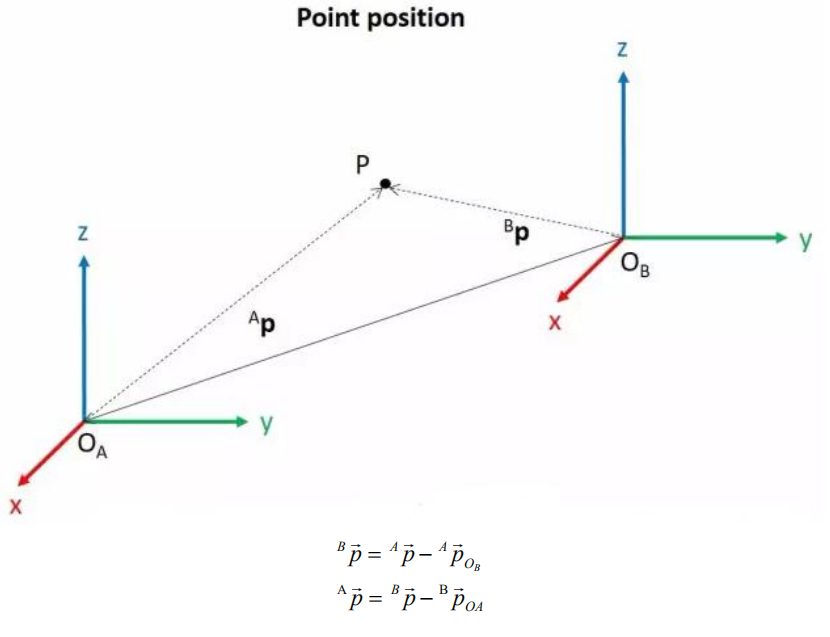
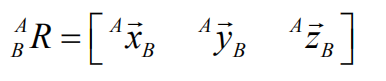
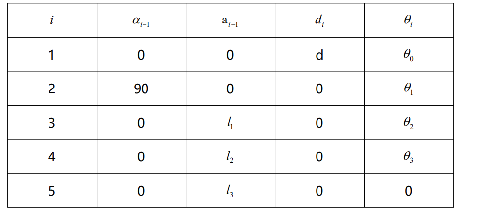
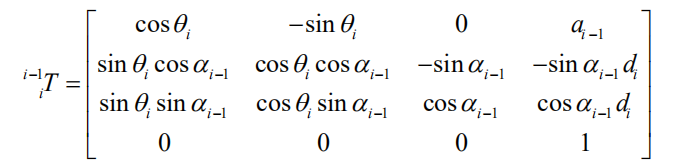
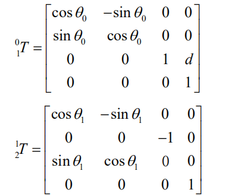
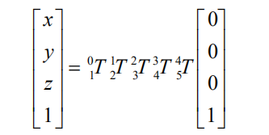
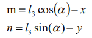
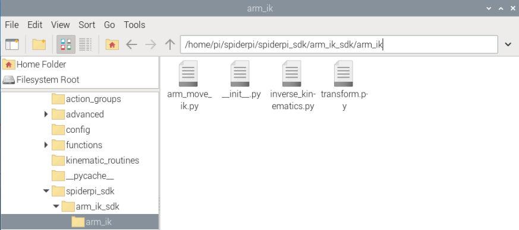
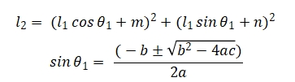
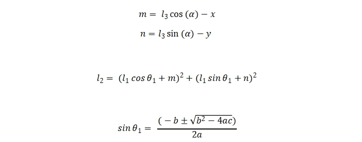

# 5. Forward & Inverse Kinematic

## 5.1 Establish Robotic Arm Coordinate System

### 5.1.1 Coordinate System

Most of the descriptions of spatial position, speed and acceleration are in Cartesian coordinate system, which is well known as a coordinate system composed of three mutually perpendicular coordinate axes. When we say how many angles to rotate around a certain axis, the right-hand rule is used to determine the positive direction, as shown below:


### 5.1.2 Position, Translation Swap

The position is represented by a three-dimensional vector, and the translation transformation is the transformation of the coordinate system space position, which can be represented by the position vector of the coordinate system origin O, as shown in the figure below. Multiple translation transformations are also very simple. You can find the coordinates of a point in space in the coordinate system {B} after translation transformation by adding directly between vectors.



### 5.1.3 Angle/Direction, Rotation Transformation

Compared with the position, the representation method of the bearing is relatively troublesome. Before discussing the bearing, it is necessary to explain one point: the three-dimensional position and orientation of an object are usually "**attached**" to the object with a coordinate system that moves and rotates with it, and then by describing the coordinate system and the reference coordinate system Relationship to describe this object.

Describing the position and orientation of an object in the coordinate system can be equivalently understood as describing the relationship between the coordinate systems. We talk about angle/direction notation here, as long as we talk about the relationship between two coordinate systems. To know how and how much a coordinate system is rotated relative to another coordinate system, what should be done? Let's start with the two-dimensional situation:


By coordinate axis unit vector with the reference coordinate system expressing, though reference the picture we can directly written the following formula:


We define a 2x2 matrix:


Obviously, each column of this matrix is the representation of the coordinate axis unit vector of coordinate system B in the coordinate system. With this matrix, we can draw the x-axis and y-axis of coordinate system B and determine the unique orientation of B.

### 5.1.4 Rotation Matrix

The three-dimensional orientation of space is relatively more complicated, because the orientation of the coordinates on the plane can only have one degree of freedom, that is, to rotate around the axis of the vertical plane. The orientation of objects in space will have three degrees of freedom. However, if we start from the first method in the figure above, we can easily write a 3×3 R matrix, which we call the rotation matrix:



This formula shows that in the rotation matrix from the coordinate system {B} to the coordinate system {A}, each column is the representation of the coordinate axis unit vector of the coordinate system {B} in the coordinate system {A}.

## 5.2 Brief Analysis of Forward Kinematics

### 5.2.1 DH Parameter Introduction

The DH parameter is a mechanical arm mathematical model and coordinate system determination system that uses four parameters to express the position and angle relationship between two pairs of joint links. As we will see below, it artificially reduces two degrees of freedom by limiting the position of the origin and the direction of the X axis, so it only needs four parameters to define a coordinate system with six degrees of freedom.

The four parameters selected by DH have very clear physical meanings, as follows:

**(1) link length :** The length of the common normal between the axes of the two joints (Rotation axis of rotation joint, translation axis of translation joint)

**(2) link twist:** The angle at which the axis of one joint rotates around their common normal relative to the axis of the other joint

**(3) link offset:** The common normal of one joint and the next joint and the distance between the common normal of one joint and the previous joint along this joint axis

**(4) joint angle:** The common normal of one joint and the next joint and the angle of rotation around the joint axis with the common normal of the previous joint

The above definition is very complicated, but it will be much clearer when combined with the coordinate system.

First of all you should pay attention to the two most important "**lines**": the joint axis, and the common normal between the axis joint and the adjacent joint.

In the DH parameter system, we set axis as the z axis; common normal as the x axis, and the direction of the x axis is: from this joint to the next joint.

Of course, these two rules alone are not enough to completely determine the coordinate system of each joint. Let's talk about the steps to determine the coordinate system in detail below.

In applications such as the simulation of the robotic arm, we often adopt other methods to establish the coordinate system, but mastering the methods mentioned here is necessary for you to understand the mathematical expression of the robotic arm and understand our subsequent analysis.

The figure below shows two typical robot joints. Although such joints and links are not necessarily similar to the joints and links of any actual robot, they are very common and can easily represent any joint of the actual robot.


### 5.2.2 Determine the Coordinate System

To determine the coordinate system, there are generally the following steps:

In order to model the robot with DH notation, the first thing is to specify a local ground reference coordinate system for each joint, so a Z axis and an X axis must be specified for each joint.

Specify the Z axis. If the joint is rotating, the Z axis is in the direction of rotation according to the right-hand rule. The rotation angle around the Z axis is a variable of the joint; if the joint is a sliding joint, the Z axis is the direction of movement along a straight line. The link length d along the Z axis is the joint variable.

Specify the X axis.When the two joints are not parallel or intersect, the Z axis is usually a diagonal line, but there is always a common vertical line with the shortest distance, which is orthogonal to any two diagonal lines. Define the X axis of the local reference coordinate system in the direction of the common perpendicular. If an represents the common perpendicular between Zn1, the direction of Xn will be along an.

Of course there are special circumstances. When the Z axes of the two joints are parallel, there will be countless common perpendiculars. At this time, you can select the one that is collinear with the common perpendicular of the previous joint, which can simplify the model; if two joints intersect, there is no common perpendicular between them. In this case, the line perpendicular to the plane formed by the two axes can be defined as X Shaft can simplify the model.

After attaching the corresponding coordinate system to each joint, as shown in the following figure:


After determining the coordinate system, we can express the above four parameters in a more concise way:

link length a<sub>i- 1</sub>: the distance from Z<sub>i- 1</sub>  to Z<sub>i</sub>  along X<sub>i- 1</sub>

link twist  a<sub>i- 1</sub> : Z<sub>i</sub>  the angle of  Z<sub>i</sub>  relative to  Z<sub>i-1</sub> to rotate around  X<sub>i-1</sub> 

link offset d<sub>i</sub> : the distance from X<sub>i-1</sub>  to  X<sub>i-1</sub>  along  Z<sub>i</sub> 

joint angle  θ<sub>i</sub>  : X<sub>i</sub> relative to X<sub>i-1</sub>around Z<sub>i</sub>

Next we can write the DH parameter table of the robotic arm:



According to the formula:



We can calculate each joint at once, and finally get the positive kinematics formula of the robotic arm:



After obtaining the rotation matrix of each joint, the coordinates of the end can be obtained according to the following formula:



## 5.3 Brief Analysis of Inverse Kinematics

### 5.3.1 Inverse Kinematics Introduction

Inverse kinematics is the process of determining the parameters of the joint movable object to be set to achieve the required posture.

The inverse kinematics of the robotic arm is an important foundation for its trajectory planning and control. Whether the inverse kinematics solution is fast and accurate will directly affect the accuracy of the robotic arm's trajectory planning and control. Therefore, for the six-degree-of-freedom robotic arm, a fast and accurate The inverse kinematics solution method of is very important.

### 5.3.2 Brief Analysis of Inverse Kinematics

For the robot arm, the position and orientation of the gripper are given to obtain the rotation angle of each joint. The three-dimensional motion of the robotic arm is more complicated. In order to simplify the model, we remove the rotation joint of the station so that the kinematics analysis can be performed on a two-dimensional plane.

Inverse kinematics analysis generally requires a large number of matrix operations, and the process is complex and computationally expensive, so it is difficult to implement. In order to better meet our needs, we use geometric methods to analyze the robotic arm.


We simplify the model of the robotic arm, remove the base pan/tilt, and the actuator part to get the main body of the robotic arm. From the figure above, you can see the coordinates (x, y) of the end point P of the robotic arm, which ultimately consists of three parts (x1+x2+x3, y1+y2+y3).

Among them θ1, θ2,θ3 in the above figure are the angles of the servo that we need to solve, and α is the angle between the paw and the horizontal plane. From the figure, it is obvious that the top angle of the claw α=θ1+θ2+θ3, based on which we can formulate the following formula:


Among them, x and y are given by the user, and l1, l2, and l3 are the inherent properties of the mechanical structure of the robotic arm.

In order to facilitate the calculation, we will deal with the known part and consider the whole:



Substituting m and n into the existing equation, and then simplifying can get:


Through calculation:


We see that the above formula is the root-finding formula of a quadratic equation in one variable:


Based on this, we can find the angle of θ1, and similarly we can also find θ2. From this we can obtain the angles of the three steering gears, and then control the steering gears according to the angles to realize the control of the coordinate position.

### 5.3.3 Inverse Kinematics Program Position

The inverse kinematics program has been packaged, and the path can be found in "**/home/pi/spiderpi/spiderpi_sdk/arm_ik_sdk/arm_ik**".



## 5.4 Color Tracking

### 5.4.1 Program Logic

Color tracking is mainly divided into two parts, including recognition and tracking.

Firstly, program SpiderPi Pro to perform color recognition.

Color recognition is realized through Lab color space. Initially, convert the RGB color space to Lab, and then perform image binarization, expansion, corrosion and other operations in sequence to obtain an outline only containing the target color. Then, circle the color contour to realize color recognition.

After recognition, the robotic arm will move with the red block.

### 5.4.2 Operation Steps

:::{Note}
The input command should be case sensitive and space sensitive.
:::

(1) Boot up SpiderPi Pro, then remotely connect to Raspberry Pi desktop through VNC.

(2) Click  at upper left corner of desktop to open the Terminator.

(3) Enter the command and press "**Enter**" to navigate to the directory where the game program is located.

```bash
cd spiderpi/kinematic_routines
```

(4) Input the command and then press "**Enter**" to start the game.

```bash
python3 block_tracking.py
```

(5) If want to close this game, press "**Ctrl+C**" on LX terminal. If the game cannot be quit, please try again.

### 5.4.3 Projtect Outcome

Please start this game in well-lit indoor.

After the game starts, place the red block within the filed of view of the robotic arm. When the colored block is recognized by the camera, the target will be framed on the camera returned image. When you move the block slowly, the robotic arm will move with the colored block.

### 5.4.4 Program Analysis

The source codes of this program are stored in: **[/home/pi/spiderpi/kinematic_routines/block_tracking.py](https://store.hiwonder.com.cn/docs/spiderpi_pro/source_code/forward_inverse_kinematic/block_tracking.zip)**

* **Import Function Library** 

{lineno-start=4}

```python
import sys
import cv2
import math
import time
import threading
import numpy as np
from common import misc
from common.pid import PID
from common import yaml_handle
from common import kinematics
from common.ros_robot_controller_sdk import Board
from calibration.camera import Camera
import arm_ik.arm_move_ik as AMK
from sensor.ultrasonic_sensor import Ultrasonic
```

(1) Import the libraries related to OpenCV, time, math, and threads. If want to call a function in library, you can use "**library name+function name (parameter, parameter)**". For example:

{lineno-start=122}

```
            time.sleep(0.01)
```

Call `sleep` function in `time` library. The function `sleep ()` is used to delay. There are some built-in libraries in Python, so they can be called directly. For example, `time`, "**cv2**" and "**math**". You can also write a new library like "**yaml_handle**".

(2) Instantiate Function Library

The name of function library is too long to memorize. For calling function easily, the library can be instantiated. For example:

{lineno-start=14}

```python
from common.ros_robot_controller_sdk import Board
```

After instantiating, you can directly input and call the function `Board.function name (parameter, parameter)`.

* **Define Global Variable** 

{lineno-start=20}

```python
board = Board()
ik = kinematics.IK(board)
ultrasonic = Ultrasonic()
ak = AMK.ArmIK()

# 机械臂色块追踪(robotic arm tracks the block)

if sys.version_info.major == 2:
    print('Please run this program with python3!')
    sys.exit(0)
    


range_rgb = {
    'red': (0, 0, 255),
    'blue': (255, 0, 0),
    'green': (0, 255, 0),
    'black': (0, 0, 0),
    'white': (255, 255, 255)}

# 变量定义(define variables)
size = (640, 480)
x,y,z = (0, 15, 5)
world_x, world_y = -1, -1
lab_data = None
K,R,T = None,None,None
```

* **Main Function Analysis** 

The python program  `__name__ == '__main__:'`  is the main function of program. Firstly, the function `init()` is called to initialize. The initialization in this program includes: return the servo to the initial position, read the color threshold file. Generally there are also configurations for ports, peripherals, timing interrupts, etc., which are all done in the process of initialization.

{lineno-start=173}

```python
if __name__ == '__main__':

    init_move()
    load_config()
    camera = Camera()
    camera.camera_open()
    while True:
        img = camera.frame
        if img is not None:
            frame = img.copy()
            Frame = run(frame)
            cv2.imshow('Frame', Frame)
            key = cv2.waitKey(1)
            if key == 27:
                break
        else:
            time.sleep(0.01)
    camera.camera_close()
    cv2.destroyAllWindows()
```

**4.4.4 Read the Captured Image**

{lineno-start=179}

```python
    while True:
        img = camera.frame
```

When the the game is started, store the image in `img`.

**(1) Enter Image Processing**

When the captured image is read, call `run` function to process the image.

{lineno-start=182}

```python
            frame = img.copy()
            Frame = run(frame)
```

The function `img.copy()` is used to copy the content of "**img**" to "**frame**".

Use the `run()` function to process the image.

{lineno-start=132}

```python
def color_detect(img, color='red'): 
    global world_x, world_y
    
    img_copy = img.copy()
    img_h, img_w = img.shape[:2]
    frame_resize = cv2.resize(img_copy, size, interpolation=cv2.INTER_NEAREST)
    frame_gb = cv2.GaussianBlur(frame_resize, (3, 3), 3)      
    frame_lab = cv2.cvtColor(frame_gb, cv2.COLOR_BGR2LAB)  # 将图像转换到LAB空间(convert the image to LAB space)
    frame_mask = cv2.inRange(frame_lab,
                             (lab_data[color]['min'][0],
                              lab_data[color]['min'][1],
                              lab_data[color]['min'][2]),
                             (lab_data[color]['max'][0],
                              lab_data[color]['max'][1],
                              lab_data[color]['max'][2]))  #对原图像和掩模进行位运算(perform bitwise operation to original image and mask)
    eroded = cv2.erode(frame_mask, cv2.getStructuringElement(cv2.MORPH_RECT, (3, 3)))  #腐蚀(erode)
    dilated = cv2.dilate(eroded, cv2.getStructuringElement(cv2.MORPH_RECT, (3, 3))) #膨胀(dilate)
    contours = cv2.findContours(dilated, cv2.RETR_EXTERNAL, cv2.CHAIN_APPROX_NONE)[-2]  #找出轮廓(find contours)
    areaMaxContour, area_max = get_area_maxContour(contours)  #找出最大轮廓(find the largest contour)
    
    if area_max > 500:  # 有找到最大面积(the maximum area has been found)
        ((centerX, centerY), radius) = cv2.minEnclosingCircle(areaMaxContour)  # 获取最小外接圆(obtain the minimum circumscribed circle)
        centerX = int(misc.map(centerX, 0, size[0], 0, img_w))
        centerY = int(misc.map(centerY, 0, size[1], 0, img_h))
        radius = int(misc.map(radius, 0, size[0], 0, img_w))
        
        cv2.circle(img, (centerX, centerY), radius, range_rgb[color], 2)#画圆(draw the circle)
        cv2.putText(img, "Color: " + color, (10, img.shape[0] - 10), cv2.FONT_HERSHEY_SIMPLEX, 0.65, range_rgb[color], 2)
        
        world_x, world_y = centerX, centerY
    else:
        world_x, world_y = -1, -1
            
    return img
```

**① Gaussian filtering**

Noise is always mixed into images, affecting their quality and making features unclear. Different filtering methods should be chosen according to the type of noise, including Gaussian filtering, median filtering, and mean filtering. Gaussian filtering is a linear smoothing filter that is suitable for eliminating Gaussian noise and is widely used in image processing for noise reduction.

{lineno-start=138}

```python
    frame_gb = cv2.GaussianBlur(frame_resize, (3, 3), 3)      
```

The first parameter  `img`  is the input image.

The second parameter `(3, 3)` is the size of Gaussian kernel.

The third parameter `3` is Gaussian kernel's standard deviation in X-axis direction.

**② Convert the image to LAB space**

The  `cv2.cvtColor()`  is the function for converting the color space.

{lineno-start=139}

```python
	frame_lab = cv2.cvtColor(frame_gb, cv2.COLOR_BGR2LAB)  # 将图像转换到LAB空间(convert the image to LAB space)
```

The first parameter  `blobs`  is the input image.

The second parameter `cv2.COLOR_BGR2LAB`  is the conversion format. `cv2.COLOR_BGR2LAB` converts the BGR format to the LAB format.

**③ Binarization processing**

When there are only 0 and 1, the image becomes simpler and the data volume decreases, making it easier to process. Adopt "**inRange()**" function in cv2 library to perform binarization on the image.

{lineno-start=140}

```python
    frame_mask = cv2.inRange(frame_lab,
                             (lab_data[color]['min'][0],
                              lab_data[color]['min'][1],
                              lab_data[color]['min'][2]),
                             (lab_data[color]['max'][0],
                              lab_data[color]['max'][1],
                              lab_data[color]['max'][2]))  #对原图像和掩模进行位运算(perform bitwise operation to original image and mask)
```

The first parameter in the bracket is the input image.

The second and the third parameters respectively are the lower limit and upper limit of the threshold.

**④ Corrosion and dilation**

The  `erode()`  function is used for corrosion.

Take  `eroded = cv2.erode(frame_mask,cv2.getStructuringElement (cv2.MORPH_RECT, (3, 3)))` for example. The meanings of the parameters in bracket are as follow.

{lineno-start=147}

```python
    eroded = cv2.erode(frame_mask, cv2.getStructuringElement(cv2.MORPH_RECT, (3, 3)))  #腐蚀(erode)
    dilated = cv2.dilate(eroded, cv2.getStructuringElement(cv2.MORPH_RECT, (3, 3))) #膨胀(dilate)
```

The first parameter `frame_mask` is the input image.

The second parameter  `cv2.getStructuringElement(cv2.MORPH_RECT, (3, 3))`  is the structural element and kernel deciding the nature of the operation. And the first parameter in the parenthesis is the kernel shape and the second parameter is the kernel dimension.

The `dilate()`  function is used for image dilation.

The meanings of its parameters in parenthesis are the same as that of the `erode()` function.

**(2) Display transmitted image**

{lineno-start=184}

```python
            cv2.imshow('Frame', Frame)
            key = cv2.waitKey(1)
            if key == 27:
                break
```

The function `cv2.imshow()` is used to display an image in a window. `'frame'` is the window name, and`'Frame'` is the content to be displayed. The function `cv2.waitKey()` must be used afterwards, otherwise the image cannot be displayed. The function `cv2.waitKey()` is used to wait for keyboard input, with a delay time of `1` millisecond specified as the parameter `1`.

**(3) Control robotic arm to track blocks with PID algorithm**

{lineno-start=90}

```python
def move():
    global x,y,z
    global world_x, world_y
    
    while True:
        if world_x > 0 or world_y > 0:
            # X轴PID处理(X-axis PID processing)
            if abs(world_x-centre_x) >= 10:
                x_pid.SetPoint = centre_x  #设定(set)
            else:
                x_pid.SetPoint = world_x
            x_pid.update(world_x)  #当前(current)
            dx = int(x_pid.output)/10 # 输出(output)
            x -= dx
            
            # Y轴PID处理(Y-axis PID processing)
            if abs(world_y-centre_y) >= 10:
                y_pid.SetPoint = centre_y  #设定(set)
            else:
                y_pid.SetPoint = world_y
            y_pid.update(world_y)  #当前(current)
            dy = int(y_pid.output)/10 # 输出(output)
            y += dy
            if x > 10 : x = 10
            if x < -10 : x = -10
            if y > 24 : y = 24
            if y < 6 : y = 6
            ak.setPitchRangeMoving((x, y, 5), -90, -90, 100, 0.08) # 移动到目标位置(move to the target position)
            time.sleep(0.05)
            world_x, world_y = -1, -1
            
        else:
            time.sleep(0.01)
```

### 5.4.5 Inverse Kinematics Implementation Analysis

Before solving the inverse kinematics, relevant libraries need to be imported:

{lineno-start=16}

```python
import arm_ik.arm_move_ik as AMK
```

Then call `setPitchRangeMoving()` function to control the robotic arm to move to the target position.

Based on the given coordinate `coordinate_data`, pitch angle "**alpha**", and pitch angle ranges "**alpha 1**" and "**alpha 2**", this function will automatically search for the solution closest to the given pitch angle. When there is no solution, "**False**" will be return. Otherwise, the servo angle and pitch angle will be returned.

{lineno-start=83}

```python
    ak.setPitchRangeMoving((x,y,z), -90, -90, 100, 2)
```

Take the source code above for example, and the meaning of the parameter is as follow.

The first parameter  `(x,y,z)`  is the given coordinate;

The second parameter  `-90`  is the pitch angle;

The third parameter  `-90`  and the fourth parameter  `100`  is the pitch angle range.

The fifth parameter  `2`  is the servo rotation duration in s.

**4.5.1 Inverse Kinematics Code Analysis**

The detailed analysis of the function is given below, and the related source code is saved in:**[/home/pi/spiderpi/spiderpi_sdk/arm_ik_sdk/arm_ik/arm_move_ik.py](https://store.hiwonder.com.cn/docs/spiderpi_pro/source_code/forward_inverse_kinematic/arm_move_ik.zip)**

Detailed information of the `setPitchRangeMoving()` is as below:

{lineno-start=107}

```python
        x, y, z = coordinate_data
        result1 = self.setPitchRange((x, y, z), alpha, alpha1)
        result2 = self.setPitchRange((x, y, z), alpha, alpha2)
        if result1 != False:
            data = result1
            if result2 != False:
                if abs(result2[1] - alpha) < abs(result1[1] - alpha):
                    data = result2
        else:
            if result2 != False:
                data = result2
            else:
                return False
        servos, alpha = data[0], data[1]

        movetime = self.servosMove((servos["servo24"], servos["servo23"], servos["servo22"], servos["servo21"]), movetime)

        return servos, alpha, movetime
```

**(1) Pass coordinate parameter**

Pass the coordinate parameters to `self.setPitchRange` function for coordinate and angle conversion.

{lineno-start=108}

```python
        result1 = self.setPitchRange((x, y, z), alpha, alpha1)
        result2 = self.setPitchRange((x, y, z), alpha, alpha2)
```

The first parameter in the bracket is the given coordinate in cm, that is the coordinate of gripper end. It is passed as tuple.

The second and the third parameters are the pitch angle ranges.

**(2) Perform inverse kinematic calculation**

Large amount of matrix operations are required in the calculation of inverse kinematic. For your better understanding, we will use geometry to analyze the robotic arm.


To simplify the model of the robotic arm, we remove the pan--tilt and actuator parts and only remain the body part. From the above picture, you will find that the coordinates of the endpoint P of the robotic arm (x,y) can also be regarded as (x1+x2+x3, y1+y2+y3).

θ<sub>1</sub>, θ<sub>2</sub> and θ<sub>3</sub> are the servo angle to be solved. α is the angle between the gripper and the horizontal plane. From the above picture, the pitch angle of gripper α=θ1+θ2+θ3. Based on that, these formulas can be formed.


Among them, x and y are given by the user, and l<sub>1</sub>,l<sub>2</sub> and l<sub>3</sub> are the inherent properties of the mechanical structure of the robotic arm.

To facilitate calculation, process the known parts and consider them as a whole.


Substitute m and n into the existing equation, and then simplify to get:



The above formula is for finding the root of a quadratic equation in one variable. And according to below formulas, a, b and c can be obtained.


Hence, we can get  θ<sub>1</sub>, θ<sub>2</sub> and  θ<sub>3</sub>  angle, and get the angle of three servos.

**(3) Drive servo to rotate**

Call  `servosMove()` function to drive the servo to the designated position.

{lineno-start=122}

```python
        movetime = self.servosMove((servos["servo24"], servos["servo23"], servos["servo22"], servos["servo21"]), movetime)
```

<p id="anchor_5_5"></p>

## 5.5 Robotic Arm Height Adjustment

### 5.5.1 Program Logic

The robotic arm involves 5 servos whose ID are 21, 22, 23, 24 and 25 from the bottom to top. And the servo of ID25 is used to control the gripper.

According to inverse kinematic, we can set a coordinate and convert it into the servo value of 21, 22, 23 and 24 servos.

As the same, adjust the height of the robotic arm through adjusting the value of Z axis.

### 5.5.2 Operation Steps

:::{Note}
The input command should be case sensitive and space sensitive.
:::

(1) Boot up SpiderPi Pro, then remotely connect to Raspberry Pi desktop through VNC.

(2) Click  at upper left corner of desktop to open the Terminator.

(3) Enter the command and press "**Enter**" to navigate to the directory where the game program is located.

```bash
cd spiderpi/kinematic_routines
```

(4) Input the command and then press "**Enter**" to start the game.

```bash
python3 arm_fluctuation.py
```

(5) If want to close this game, press "**Ctrl+C**" on LX terminal. If the game cannot be quit, please try again.

### 5.5.3 Project Outcome

After the game starts, the robotic arm will adjust its height continuously in three recycles.

### 5.5.4 Analysis of Inverse Kinematics

The source codes of this program lie in：[/home/pi/spiderpi/kinematic_routines/arm_fluctuation.py](https://store.hiwonder.com.cn/docs/spiderpi_pro/source_code/forward_inverse_kinematic/arm_fluctuation.zip)

Before solving the inverse kinematics, relevant libraries need to be imported:

{lineno-start=7}

```python
import arm_ik.arm_move_ik as AMK
```

Based on the given coordinate `coordinate_data`, pitch angle `alpha`, and pitch angle ranges `alpha 1` and  `alpha 2`, this function will automatically search for the solution closest to the given pitch angle. When there is no solution, "**False**" will be return. Otherwise, the servo angle and pitch angle will be returned.

{lineno-start=19}

```python
    ak.setPitchRangeMoving((0, 15, 30), 0, -90, 100, 2)
    ik.stand(ik.initial_pos)
    time.sleep(2)
```

Take the source code above for example, and the meaning of the parameter is as follow.

The first parameter `(x,y,z)` is the given coordinate;

The second parameter `-90` is the pitch angle;

The third parameter `-90` and the fourth parameter "**100**" is the pitch angle range.

The fifth parameter `2`  is the servo rotation duration in the unit of s.

The detailed analysis of the function is given below, and the related source code is saved in:

[/home/pi/spiderpi/spiderpi_sdk/arm_ik_sdk/arm_ik/arm_move_ik.py](https://store.hiwonder.com.cn/docs/spiderpi_pro/source_code/forward_inverse_kinematic/arm_move_ik.zip).

Detailed information of the `setPitchRangeMoving()` is as below:

{lineno-start=107}

```python
        x, y, z = coordinate_data
        result1 = self.setPitchRange((x, y, z), alpha, alpha1)
        result2 = self.setPitchRange((x, y, z), alpha, alpha2)
        if result1 != False:
            data = result1
            if result2 != False:
                if abs(result2[1] - alpha) < abs(result1[1] - alpha):
                    data = result2
        else:
            if result2 != False:
                data = result2
            else:
                return False
        servos, alpha = data[0], data[1]

        movetime = self.servosMove((servos["servo24"], servos["servo23"], servos["servo22"], servos["servo21"]), movetime)

        return servos, alpha, movetime
```

**① Pass coordinate parameter**

Pass the coordinate parameters to `self.setPitchRange`  function for coordinate and angle conversion.

{lineno-start=108}

```python
        result1 = self.setPitchRange((x, y, z), alpha, alpha1)
        result2 = self.setPitchRange((x, y, z), alpha, alpha2)
```

The first parameter in the bracket is the given coordinate in cm, that is the coordinate of gripper end. It is passed as tuple.

The second and the third parameter is the pitch angle range.

**② Perform inverse kinematic calculation**

Large amount of matrix operations are required in the calculation of inverse kinematic. For your better understanding, we will use geometry to analyze the robotic arm.


To simplify the model of the robotic arm, we remove the pan--tilt and actuator parts and only remain the body part. From the above picture, you will find that the coordinates of the endpoint P of the robotic arm (x,y) can also be regarded as (x1+x2+x3, y1+y2+y3).

θ<sub>1</sub>, θ<sub>2</sub> and θ<sub>3</sub>  are the servo angle to be solved. α is the angle between the gripper and the horizontal plane. From the above picture, the pitch angle of gripper α=θ1+θ2+θ3. Based on that, these formulas can be formed.


Among them, x and y are given by the user, and l<sub>1</sub>, l<sub>2</sub> and l<sub>3</sub> are the inherent properties of the mechanical structure of the robotic arm.

To facilitate calculation, process the known parts and consider them as a whole.



The above formula is for finding the root of a quadratic equation in one variable. And according to below formulas, a, b and c can be obtained.


Hence, we can get θ<sub>1</sub>, θ<sub>2</sub> and θ<sub>3</sub> angle, and get the angle of three servos.

**③ Drive servo to rotate**

Call `servosMove()` function to drive the servo to the designated position.

{lineno-start=122}

```python
        movetime = self.servosMove((servos["servo24"], servos["servo23"], servos["servo22"], servos["servo21"]), movetime)
```

<p id="anchor_5_6"></p>

## 5.6 Chassis Height Adjustment

### 5.6.1 Program Logic

SpiderPi Pro's chassis is controlled by its 6 legs. It can be controlled to go forward, go backward, turn left, turn right, and stand.

When it is in "**Stand**" mode, we can adjust the standing height to adjust the height of the chassis.

The robotic arm involves 5 servos whose ID are 21, 22, 23, 24 and 25 from the bottom to top. And the servo of ID25 is used to control the gripper.

According to inverse kinematic, we can set a coordinate and convert it into the servo value of 21, 22, 23 and 24 servos.

### 5.6.2 Operation Steps

:::{Note}
The input command should be case sensitive and space sensitive.
:::

(1) Boot up SpiderPi Pro, then remotely connect to Raspberry Pi desktop through VNC.

(2) Click  at upper left corner of desktop to open the Terminator.

(3) Enter the command  and press "**Enter**" to navigate to the directory where the game program is located.

```bash
cd spiderpi/kinematic_routines
```

(4) Input the command and then press Enter to start the game.

```bash
python3 pedestal__fluctuation.py
```

(5) If want to close this game, press "**Ctrl+C**" on LX terminal. If the game cannot be quit, please try again.

### 5.6.3 Project Outcome

After the game starts, the posture of its robotic arm will not change. The height of the robot chassis will change continuously. After height adjustment, the robot will stand still.

### 5.6.4 Analysis of Inverse Kinematics

The source codes of this program lie in:[/home/pi/spiderpi/kinematic_routines/pedestal_fluctuation.py](https://store.hiwonder.com.cn/docs/spiderpi_pro/source_code/forward_inverse_kinematic/pedestal__fluctuation.zip)

* **Analysis of chassis kinematics** 

The height of the robot chassis will change continuously. The corresponding source code is as follow.

{lineno-start=36}

```python
    Stand(50,2,1000)
    for i in range(3):
        Stand(150,2,2000)
        
        Stand(50,2,2000)
```

`3`  represents the number of the height change. Take `Stand(150, 2, 2000)` for example.

The first parameter `150` represents the height in mm.

The second parameter `2` represents Hexapod robot mode.

The third parameter `2000` represents the time in ms spent on standing.

* **Analysis of inverse kinematics** 

Before solving the inverse kinematics, relevant libraries need to be imported:

{lineno-start=8}

```python
import arm_ik.arm_move_ik as AMK
```

Then call  `setPitchRangeMoving()` function to control the robotic arm to move to the target position.

Based on the given coordinate, coordinate_data, pitch angle, alpha, and pitch angle range, this function will search for the solution closest to the given pitch angle. When there is no solution, "**False**" will be return. Otherwise, the servo angle and pitch angle will be returned.

{lineno-start=32}

```python
    ak.setPitchRangeMoving((0, 15, 30), 0, -90, 100, 2)
```


Take the source code above for example, and the meaning of the parameter is as follow.

The first parameter `(x,y,z)` is the given coordinate;

The second parameter `0` is the pitch angle;

The third parameter `-90` and the fourth parameter "**100**" is the pitch angle range.

The fifth parameter `2` is the servo rotation duration in the unit of s.

The detailed analysis of the function is given below, and the related source code is saved in:

**[/home/pi/spiderpi/spiderpi_sdk/arm_ik_sdk/arm_ik/arm_move_ik.py](https://store.hiwonder.com.cn/docs/spiderpi_pro/source_code/forward_inverse_kinematic/arm_move_ik.zip)**

Detailed information of the  `setPitchRangeMoving()`  is as below:

{lineno-start=107}

```python
        x, y, z = coordinate_data
        result1 = self.setPitchRange((x, y, z), alpha, alpha1)
        result2 = self.setPitchRange((x, y, z), alpha, alpha2)
        if result1 != False:
            data = result1
            if result2 != False:
                if abs(result2[1] - alpha) < abs(result1[1] - alpha):
                    data = result2
        else:
            if result2 != False:
                data = result2
            else:
                return False
        servos, alpha = data[0], data[1]

        movetime = self.servosMove((servos["servo24"], servos["servo23"], servos["servo22"], servos["servo21"]), movetime)

        return servos, alpha, movetime
```

**(1) Pass coordinate parameter**

Pass the coordinate parameters to `self.setPitchRange`  function for coordinate and angle conversion.

{lineno-start=108}

```python
        result1 = self.setPitchRange((x, y, z), alpha, alpha1)
        result2 = self.setPitchRange((x, y, z), alpha, alpha2)
```

The first parameter in the bracket is the given coordinate in cm, that is the coordinate of gripper end. It is passed as tuple.

The second and the third parameter is the pitch angle range.

**(2) Perform inverse kinematic calculation**

Large amount of matrix operations are required in the calculation of inverse kinematic. For your better understanding, we will use geometry to analyze the robotic arm.


To simplify the model of the robotic arm, we remove the pan--tilt and actuator parts and only remain the body part. From the above picture, you will find that the coordinates of the endpoint P of the robotic arm (x,y) can also be regarded as (x1+x2+x3, y1+y2+y3).

θ<sub>1</sub>, θ<sub>2</sub> and θ<sub>3 </sub>are the servo angle to be solved. α is the angle between the gripper and the horizontal plane. From the above picture, the pitch angle of gripper α=θ1+θ2+θ3. Based on that, these formulas can be formed.


Among them, x and y are given by the user, and l<sub>1</sub>,l<sub>2</sub> and l<sub>3</sub> are the inherent properties of the mechanical structure of the robotic arm.

To facilitate calculation, process the known parts and consider them as a whole.


The above formula is for finding the root of a quadratic equation in one variable. And according to below formulas, a, b and c can be obtained.


Hence, we can get θ<sub>1</sub>, θ<sub>2</sub> and θ<sub>3</sub> angle, and get the angle of three servos.

**(3) Drive servo to rotate**

Call `servosMove()` function to drive the servo to the designated position.

{lineno-start=122}

```python
        movetime = self.servosMove((servos["servo24"], servos["servo23"], servos["servo22"], servos["servo21"]), movetime)
```

## 5.7 Synchronized Adjustment

### 5.7.1 Program Logic

This lesson is the combination of "[**5.5 Robotic Arm Height Adjustment**](#anchor_5_5)" and "[**5.6 Chassis Height Adjustment**](#anchor_5_6)". After adjusting the height of the robotic arm, adjust the height of robot chassis to make the overall height of robot unchanged.

According to inverse kinematics, adjust the value of Z axis and convert it into the servo value of 21, 22, 23 and 24 servos to realize robotic arm height adjustment.

Set the robot chassis as "**Stand**" mode and then adjust the height of the robot chassis.

### 5.7.2 Operation Steps

:::{Note}
The input command should be case sensitive and space sensitive
:::

(1) Boot up SpiderPi Pro, then remotely connect to Raspberry Pi desktop through VNC.

(2) Click  at upper left corner of desktop to open the Terminator.

(3) Enter the command and press "**Enter**" to navigate to the directory where the game program is located.

```bash
cd spiderpi/kinematic_routines
```

(4) Input the command, and then press "**Enter**" to start the game.

```bash
python3 head_stabilizer.py
```

(5) If want to close this game, press "**Ctrl+C**" on LX terminal. If the game cannot be quit, please try again.

### 5.7.3 Project Outcome

After the game starts, the height of the robotic arm and chassis will change continuously. At the same time, the overall height of the robot remains unchanged. Then the robot will stand still.

### 5.7.4 Analysis of Inverse Kinematics

The source codes of this program are stored in：**[/home/pi/spiderpi/kinematic_routines/head_stabilizer.py](https://store.hiwonder.com.cn/docs/spiderpi_pro/source_code/forward_inverse_kinematic/head_stabilizer.zip)**

* **Analysis of chassis kinematics** 

The height of the robot chassis and robotic arm will change continuously.

{lineno-start=39}

```python
    for i in range(3):
        ak.setPitchRangeMoving((0, 15, 25), 0, -90, 100, 2)
        Stand(150,2,2000)
        
        ak.setPitchRangeMoving((0, 15, 35), 0, -90, 100, 2)
        Stand(50,2,2000)
```


In the code, `3`  represents the number of the height change. Take `Stand(150 ,2, 2000)` for example.

The first parameter `150`  represents the height in mm.

The second parameter `2` represents Hexapod robot mode.

The third parameter `2000` represents the time in ms spent on standing.

* **Analysis of inverse kinematics**

Before solving the inverse kinematics, relevant libraries need to be

imported:

{lineno-start=8}

```python
import arm_ik.arm_move_ik as AMK
```

Then call  `setPitchRangeMoving()`  function to control the robotic arm to move to the target position.

Based on the given coordinate, coordinate\_data, pitch angle, alpha, and pitch angle range, this function will search for the solution closest to the given pitch angle. When there is no solution ,  **False**  will be return. Otherwise, the servo angle and pitch angle will be returned.

{lineno-start=33}

```python
    ak.setPitchRangeMoving((0, 15, 30), 0, -90, 100, 2)
```

Take the source code above for example, and the meaning of the parameter is as follow.

The first parameter `(x,y,z)` is the given coordinate;

The second parameter `-90` is the pitch angle;

The third parameter `-90` and the fourth parameter `100` is the pitch angle range.

The fifth parameter `2` is the servo rotation duration in s.

The detailed analysis of the function is given below, and the related source code is saved in:

[/home/pi/spiderpi/spiderpi_sdk/arm_ik_sdk/arm_ik/arm_move_ik.py](https://store.hiwonder.com.cn/docs/spiderpi_pro/source_code/forward_inverse_kinematic/arm_move_ik.zip)

Detailed information of the  `setPitchRangeMoving()` is as below:

{lineno-start=107}

```python
        x, y, z = coordinate_data
        result1 = self.setPitchRange((x, y, z), alpha, alpha1)
        result2 = self.setPitchRange((x, y, z), alpha, alpha2)
        if result1 != False:
            data = result1
            if result2 != False:
                if abs(result2[1] - alpha) < abs(result1[1] - alpha):
                    data = result2
        else:
            if result2 != False:
                data = result2
            else:
                return False
        servos, alpha = data[0], data[1]

        movetime = self.servosMove((servos["servo24"], servos["servo23"], servos["servo22"], servos["servo21"]), movetime)

        return servos, alpha, movetime
```

**(1) Pass coordinate parameter**

Pass the coordinate parameters to `self.setPitchRange` function for coordinate and angle conversion.

The first parameter in the bracket is the given coordinate in cm, that is the coordinate of gripper end. It is passed as tuple.

The second and the third parameters are the pitch angle range.

**(2) Perform inverse kinematic calculation**

Large amount of matrix operations are required in the calculation of inverse kinematic. For your better understanding, we will use geometry to analyze the robotic arm.


To simplify the model of the robotic arm, we remove the pan--tilt and actuator parts and only remain the body part. From the above picture, you will find that the coordinates of the endpoint P of the robotic arm (x,y) can also be regarded as (x1+x2+x3, y1+y2+y3).

θ<sub>1</sub>,θ<sub>2</sub> and θ<sub>3</sub> are the servo angle to be solved. α is the angle between the gripper and the horizontal plane. From the above picture, the pitch angle of gripper α=θ1+θ2+θ3. Based on that, these formulas can be formed.


Among them, x and y are given by the user, and l<sub>1</sub>,l<sub>2</sub> and l<sub>3</sub> are the inherent properties of the mechanical structure of the robotic arm.

To facilitate calculation, process the known parts and consider them as a whole.


The above formula is for finding the root of a quadratic equation in one variable. And according to below formulas, a, b and c can be obtained.


Hence, we can get θ<sub>1</sub>,θ<sub>2</sub> and θ<sub>3</sub>  angle, and get the angle of three servos.

**(3) Drive servo to rotate**

Call  `servosMove()`  function to drive the servo to the designated position.

{lineno-start=122}

```python
        movetime = self.servosMove((servos["servo24"], servos["servo23"], servos["servo22"], servos["servo21"]), movetime)
```

**(4) Perform inverse kinematic calculation**

Large amount of matrix operations are required in the calculation of inverse kinematic. For your better understanding, we will use geometry to analyze the robotic arm.


To simplify the model of the robotic arm, we remove the pan--tilt and actuator parts and only remain the body part. From the above picture, you will find that the coordinates of the endpoint P of the robotic arm (x,y) can also be regarded as (x1+x2+x3, y1+y2+y3).

θ<sub>1</sub>,θ<sub>2</sub> and θ<sub>3</sub> are the servo angle to be solved. α is the angle between the gripper and the horizontal plane. From the above picture, the pitch angle of gripper α=θ1+θ2+θ3. Based on that, these formulas can be formed.


Among them, x and y are given by the user, and l<sub>1</sub>,l<sub>2</sub> and l<sub>3</sub> are the inherent properties of the mechanical structure of the robotic arm.

To facilitate calculation, process the known parts and consider them as a whole.


The above formula is for finding the root of a quadratic equation in one variable. And according to below formulas, a, b and c can be obtained.


Hence, we can get θ<sub>1</sub>,θ<sub>2</sub> and θ<sub>3</sub>  angle, and get the angle of three servos.

**(5) Drive servo to rotate**

Call `servosMove()` function to drive the servo to the designated position.

{lineno-start=122}

```python
        movetime = self.servosMove((servos["servo24"], servos["servo23"], servos["servo22"], servos["servo21"]), movetime)
```
