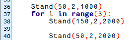
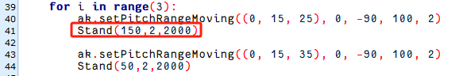

# 机械臂正逆运动学课程

## 1. 机械臂坐标系的建立

### 1.1 坐标系介绍

描述空间位置、速度和加速度，大部分都是用笛卡尔坐标系，也就是大家熟知由三个互相垂直的坐标轴所组成的坐标系。当我们说绕某一个轴旋转多少角度时，正方向的确定使用右手定则，如下图：


### 1.2 位置、平移交换

位置是使用一个三维向量来表示，平移变换是坐标系空间位置的变换，可以用坐标系原点 O 的位置向量表示，如下图所示。多次平移变换也很简单，向量之间直接相加就可以求空间中一个点的位置在经过平移变换后的坐标系{B} 中的坐标。


### 1.3 角度/方向、旋转变换

相比于位置，方位的表示方法相对会麻烦一些。在讨论方位之前，有必要先说明一点：一个物体的三维位置和朝向，通常都会在物体上"**附上**"一个跟着它动跟着它转的坐标系，然后通过描述这个坐标系与参考坐标系的关系来描述这个物体。

描述一个物体在坐标系中的位置和朝向，可以等效理解为描述坐标系之间的关系。我们这里讲角度/方向表示法，只要讲两个坐标系之间的关系就可以了。 要知道一个坐标系相对于另一个坐标系如何旋转、旋转了多少，应该怎么做呢？我们先从二维的情况看起：


通过将坐标轴单位向量用参考坐标系表示，看图可以直接写出下列公式：


我们再定义一个2x2的矩阵：


显然，这个矩阵的每一列为坐标系B的坐标轴单位向量在坐标系中的表示，有了这个矩阵我们就能画出坐标系B的x轴y轴，确定B的唯一朝向。

### 1.4 旋转矩阵

空间三维朝向相对来讲更加复杂，因为平面上坐标的朝向只能有一个自由度，即绕垂直平面的轴旋转。而空间中物体的朝向会有三个自由度。不过如果我们从上图的第一种方法出发，就可以轻松写出一个3×3的R矩阵，我们称它为旋转矩阵：


这个式子表明从坐标系{B}到坐标系{A}的旋转矩阵中，每一列都是坐标系{B}的坐标轴单位向量在坐标系{A}中的表示。

## 2. 正运动学简要分析

### 2.1 DH参数介绍

DH参数就是一个用四个参数表达两对关节连杆之间位置角度关系的机械臂数学模型和坐标系确定系统。通过下文我们会看到，它通过限制原点位置和 X 轴的方向，人为减少了两个自由度，因此它只需要用四个参数即可定义为一个具有六自由度的坐标系。

DH选的四个参数都有非常明确的物理含义，如下：

1.  link length（连杆长度）：两个关节的轴（旋转关节的旋转轴，平移关节的平移轴）之间的公共法线长度

2.  link twist（连杆扭转）：一个关节的轴相对于另一个关节的轴绕它们的公共法线旋转的角度

3.  link offset（连杆偏移）：一个关节与下一个关节的公共法线和它与上一个关节的公共法线沿这个关节轴的距离

4.  joint angle（关节转角）：一个关节与下一个关节的公共法线和它与上一个关节的公共法线绕这个关节轴的转角

以上定义看了很绕口，但是结合坐标系看就会清楚许多。

首先你应该注意到最重要的两条"线"：一个关节的轴（axis），和一个关节的轴与相邻关节的轴之间的公共法线（common normal）。

在 DH 参数体系里，我们把 axis 定为 z 轴；common normal 定为 x 轴，且 x 轴的方向为：从本关节指向下一个关节。

当然，仅仅这两个规则还不足以完全确定每个关节的坐标系。下面我们就来详细讲确定坐标系的步骤。

在机械臂的仿真等应用中，我们也常常会采取其他方法来确立坐标系，但是掌握这里讲的方法，对你理解机械臂的数学表达和理解我们后续的分析是很有必要的。

下图是两个典型的机器人关节。虽然这种关节和连杆不一定与任何实际机器人的关节和连杆相似，但是他们非常常见，且能很容易地表示实际机器人地任何关节。


### 2.2 坐标系确定

确定坐标系，一般有以下几个步骤：

为了用DH表示法对机器人进行建模，第一件事是为每个关节指定一个本地地参考坐标系，因此对于每个关节都必须指定一个Z轴和X轴。

指定Z轴，如果关节是旋转地，Z轴位于按右手规则旋转的方向。绕Z轴的旋转角是关节的变量；如果关节是滑动关节，则Z轴为沿直线运动的方向。沿Z轴的连杆长度d是关节变量。

指定X轴，当两关节不平行或相交时，Z轴通常是斜线，但总有一条距离最短的公垂线，它正交于任意两条斜线。在公垂线方向上定义本地参考坐标系的X轴。如果a n表示Zn1之间的公垂线，则Xn的方向将沿an 。

当然也有特殊情况。当两关节的Z轴平行，就会有无数条公垂线。此时可挑选与前一关节的公垂线共线的一条，可简化模型；两关节相交，他们之间没有公垂线，这时可将垂直于两条轴线构成的平面的直线定义为 X 轴，可简化模型。

给每个关节都附上对应坐标系之后，如下图所示：


确定好坐标系后，我们可以用更简洁的方法来表示上面很绕口的四个参数：

link length（连杆长度）*α*<sub>i-1</sub> ：沿 X<sub>i-1</sub> 的 Z<sub>i-1</sub> 到 Z<sub>i</sub> 的距离

link twist（连杆扭转）*α*<sub>i-1</sub> ：Z<sub>i</sub> 相对于Z<sub>i-1</sub>绕 X<sub>i-1</sub>旋转的角度

link offset（连杆偏移） *d*i ：沿 *Zi*的 *Xi*−1到 *Xi*的距离

joint angle（关节转角）θ<sub>i</sub> ： X<sub>i</sub> 相对于 X<sub>i-1</sub> 绕 Z<sub>i</sub>

接下来我们就可以写出机械臂的 DH 参数表了：


根据公式：


我们能一次计算每个关节，最后得到机械臂的正运动学公式：


得到各关节的旋转矩阵后即可根据下面公式得到末端的坐标：


## 3. 逆运动学简要分析

### 3.1 逆运动学简介

逆运动学是决定要达成所需要的姿势所要设置的关节可活动对象的参数的过程。

机械臂的逆运动学问题是其轨迹规划与控制的重要基础，逆运动学求解是否快速准确将直接影响到机械臂轨迹规划与控制的精度，因此针对六自由度机械臂，设计一种快速准确的逆运动学求解方法是十分重要的。

### 3.2 逆运动学简析

对于机械臂而言，就是给出夹持器的位置和朝向后求出每个关节的旋转角度。机械臂的三维运动是比较复杂的，这里为了简化模型，我们去掉下方云台的旋转关节，这样就可以在二维的平面上进行运动学分析了。

进行逆运动学分析一般要进行大量的矩阵运算，过程复杂计算量大所以实现起来较难。为了更好的适应我们的需要，我们使用几何法对机械臂进行分析。


我们将机械臂的模型简化，去掉底座云台，和执行器部分得到机械臂的主体。从上图可以看到机械臂的端点P的坐标（x,y），最终由三个部分组成（x1+x2+x3，y1+y2+y3）。

其中上图的θ1，θ2 ，θ3就是我们要求解的舵机的角度，α是爪子与水平面的夹角。从图上来看显然爪子的俯视角度α=θ1+θ2+θ3，据此我们可以列出下式：


其中x，y由使用者给出，l1、l2、l3为机械臂的机械结构固有属性。

为了方便计算，我们将已知部分处理一下，作整体考虑：


将m、n代入已有方程，再化简可得：


通过计算可得：


我们看到上式为一元二次方程的求根公式，其中：


据此我们可以求出θ1的角度，同理我们也可以求出θ2。由此我们便可求出三个舵机的角度，然后根据角度控制舵机即可实现坐标位置的控制。

### 3.3 逆运动学程序位置

逆运动学程序已经封装好了，相关介绍可以参考路径"**/home/pi/spiderpi/spiderpi_sdk/arm_ik_sdk/arm_ik**"中内容。


## 4. 机械臂色块追踪

### 4.1 实验原理

机械臂色追踪实验主要涉及两大部分：**识别、追踪**。

首先，需要进行颜色识别。颜色识别通过Lab颜色空间来实现。先将RGB颜色空间转换为Lab，然后进行二值化处理，再经过膨胀腐蚀等操作，可获得只包含目标颜色的轮廓，然后将该颜色轮廓用圆圈框起，便实现了物体颜色的识别。

识别完成后，机械臂会随着红色色块的移动而移动。

### 4.2 玩法开启及关闭步骤

:::{Note}
指令输入需严格区分大小写及空格。
:::

1)  将机器人开机，然后通过VNC远程连接树莓派桌面。

2)  点击系统桌面左上角的图标，打开Terminator终端。

3)  输入指令，按下回车键则可定位到存放玩法程序的目录。

```commandline
cd spiderpi/kinematic_routines
```

4)  输入指令，然后按下回车键将玩法启动。

```commandline
python3 block_tracking.py
```

5)  如需关闭此玩法，只需在终端界面按下"**Ctrl+C**"。如果关闭失败，可多次按下。

### 4.3 功能实现

由于颜色识别的需求，建议在光线明亮下的室内进行操作。

玩法开启后，将红色色块放置在机械臂的视野范围内。摄像头识别到色块后，回传画面内会将目标框出，缓慢移动色块，机械臂将随着色块的移动而移动。

### 4.4 程序说明

该程序的源代码位于：**/home/pi/spiderpi/kinematic_routines/block_tracking.py**

根据实现的效果，梳理程序的过程逻辑，如下图所示：


- #### 4.4.1 导入库文件


1)  导入opencv、时间、数学、线程相关的库。我们如果想要调用功能库里的函数，就可以使用"**功能库名+函数名（参数，参数...）**"如：


就是调用"**time**"库中的"**sleep**"函数，sleep()的作用是延时。

在python中有一些已经内置的库，我们直接导入调用就可以，比如"**time**"、"**cv2**"、"**math**"等。我们也可以自己写一个库，比如上面的"**yaml_handle**"文件读取库。

2)  实例化函数库。

我们有些函数库的名称太长，并且不容易记忆，为了方便调用函数，我们经常会对函数库进行实例化，如：


进行实例化后，在使用Board库中的函数，就可以像这样"**Board.函数名(参数,参数...)**"直接调用了，非常方便。

- #### 4.4.2 定义全局变量


- #### 4.4.3 主函数分析

python程序中"**\_\_name\_\_ == ’\_\_main\_\_:’**"就是程序的主函数。首先调用函数init()进行初始化配置。本程序中初始化包括：舵机回到初始位置、读取颜色阈值文件。一般还有端口、外设、定时中断等配置，这些都要在初始化内容中完成。


- #### 4.4.4 读取摄像头图像


当玩法启动时，将图像存储在"**img**"中。

1. **进入图像处理**

读取到图像时，调用run()函数进行图像处理。


函数img.copy()的作用是将"**img**"的内容复制给"**frame**"。

函数run()进行图像处理。


- **高斯滤波**

图像中总是会混入噪声，影响图像的质量，让特征不明显。根据不同的噪声种类选择对应的滤波方法，常见的有：高斯滤波、中值滤波、均值滤波等。

高斯滤波是一种线性平滑滤波，适用于消除高斯噪声，广泛应用于图像处理的减噪过程。


第一个参数"**img**"是输入图像。

第二个参数"**(3, 3)**"是高斯内核大小。

第三个参数"**3**"是X方向上的高斯核标准偏差。

- 将图像转换到LAB空间，其中函数cv2.cvtColor()是颜色空间转换函数。


第一个参数"**blobs**"是输入图像。

第二个参数"**cv2.COLOR_BGR2LAB**"是转换格式。"**cv2.COLOR_BGR2LAB**"是将BGR格式转换到LAB格式。如果要转换到RGB就可以使用"**cv2.COLOR_BGR2RGB**"。

- 将图像转换成二值图像，只有0和1，图像变得简单并且数据量减小，更容易处理。

采用cv2库中的inRange()函数对图像进行二值化处理。


第一个参数"**frame_lab**"是输入图像；

第二个参数"**(lab_data\[i\]\['min'\]\[0\],lab_data\[i\]\['min'\]\[1\],lab_data\[i\]\['min'\]\[2\])**"是颜色阈值下限；

第三个参数"**(lab_data\[i\]\['max'\]\[0\],lab_data\[i\]\['max'\]\[1\],lab_data\[i\]\['max'\]\[2\])**"是颜色阈值上限；

- erode()函数用于对图像进行腐蚀操作。

以代码"**eroded = cv2.erode(frame_mask, cv2.getStructuringElement(cv2.MORPH_RECT, (3, 3))**"为例，括号内的参数含义如下：


第一个参数"**frame_mask**"是输入图像；

第二个参数"**cv2.getStructuringElement(cv2.MORPH_RECT, (3, 3))**"是决定操作性质的结构元素或内核。其中，括号内的第一个参数是内核形状，第二个参数是内核尺寸。

dilate()函数用于对图像进行膨胀操作。此函数括号内参数的含义与erode()函数的相同。

2. **显示回传画面**


函数cv2.imshow()的作用是在窗口显示图像，"**’frame’**"是窗口名称、"**Frame**"是显示内容。后面一定要有cv2.waitKey()，否则无法显示。

函数cv2.waitKey()的作用是等待按键输入，参数"**1**"是延迟时间。

3. **通过PID算法移动机械臂进行色块追踪**


### 4.5 逆运动学实现分析

在进行逆运动学求解之前，需要先将相关的库导入：


通过调用setPitchRangeMoving()函数，可以控制机械臂移动到目标位置。

该函数会根据给定坐标coordinate_data、俯仰角alpha，以及俯仰角范围的范围alpha1和alpha2，自动寻找最接近给定俯仰角的解。当函数无解时则返回False，否则返回舵机角度和俯仰角。


以上图代码为例，括号内的参数含义如下：

第一个参数"**(x,y,z)**"是给定坐标；

第二个参数"**-90**"是俯仰角；

第三个参数"**-90**"和第四个参数"**100**"是俯仰角的取值范围；

第五个参数"**2**"是舵机转动时间，单位为s（秒）。

- #### 4.5.1 逆运动学源码分析

下面会对该函数进行具体分析，相关程序的源代码位于：**/home/pi/spiderpi/spiderpi_sdk/arm_ik_sdk/arm_ik//arm_move_ik.py**

下图是setPitchRangeMoving()函数的具体内容：


- **传递坐标参数**

将坐标位置参数传递给self.setPitchRange()函数，进行坐标和角度的转换。


括号内的第一个参数是给定坐标，即夹持器末端坐标，单位为厘米，以元组形式传入。第二个与第三个参数是俯仰角范围。

- **逆运动学计算**

逆运动学的计算过程需要使用大量的矩阵运算，由于篇幅过长，这里不做详细讲解。但是为了让大家更好地理解逆运动学原理，此处使用几何法对机械臂进行分析。


将机械臂的模型简化，去掉底座云台和执行器部分，得到机械臂的主体。由上图可得，机械臂的端点P的坐标（x,y），也可看作是（x1+x2+x3，y1+y2+y3）。

图中的θ<sub>1</sub>、θ<sub>2</sub>、θ<sub>3</sub>即为需要求解的舵机角度，α是爪子与水平面的夹角。由上图可知，爪子的俯视角度α=θ<sub>1</sub>+θ<sub>2</sub>+θ<sub>3</sub>，据此可以列出下式：


其中，x、y由使用者给定，l<sub>1</sub>、l<sub>2</sub>、l<sub>3</sub>为机械臂的机械结构固有属性。

为了方便计算，将已知部分处理一下，作整体考虑：


将m、n代入已有方程，再化简可得：


上式为一元二次方程的求根公式，其中：


据此可以求出θ<sub>1</sub>的角度，同理可得θ<sub>2</sub>和θ<sub>3</sub>，由此便解得三个舵机的角度。

- **驱动舵机转动**

通过调用servosMove()函数，驱动舵机转动到指定位置。


## 5. 机械臂高度调节

### 5.1 实验原理

机械臂由下往上包含ID为21、22、23、24和25共5个舵机，其中ID为25的舵机是用于控制机械爪的状态。

根据逆运动学原理，可以通过设置一个坐标值，将它转换为ID为21、22、23和24舵机的数值，达到控制机械臂状态效果。

同样，可以通过调节坐标Z轴的数值，达到调节机械臂高度的效果。

### 5.2 实验步骤

:::{Note}
指令输入需严格区分大小写及空格。
:::

1)  将机器人开机，然后通过VNC远程连接树莓派桌面。

2)  点击系统桌面左上角的图标，打开Terminator终端。


3)  输入指令，按下回车键则可定位到存放玩法程序的目录。

```commandline
cd spiderpi/kinematic_routines
```

4)  输入指令，然后按下回车键将玩法启动。
```commandline
python3 arm_fluctuation.py
```

5)  如需关闭此玩法，只需在终端界面按下"**Ctrl+C**"。如果关闭失败，可多次按下。

### 5.3 功能实现

玩法开启后，机器人上机械臂循环3次不断变换高度。

### 5.4 逆运动学实现分析

该程序的源代码位于：**/home/pi/spiderpi/kinematic_routines/arm_fluctuation.py**

在进行逆运动学求解之前，需要先将相关的库导入：


通过调用setPitchRangeMoving()函数，可以控制机械臂移动到目标位置。

该函数会根据给定坐标coordinate_data、俯仰角alpha，以及俯仰角范围的范围alpha1和alpha2，自动寻找最接近给定俯仰角的解。当函数无解时则返回False，否则返回舵机角度和俯仰角。


以上图代码为例，括号内的参数含义如下：

第一个参数"**(x,y,z)**"是给定坐标；

第二个参数"**-90**"是俯仰角；

第三个参数"**-90**"和第四个参数"**100**"是俯仰角的取值范围；

第五个参数"**2**"是舵机转动时间，单位为s（秒）。

下面会对该函数进行具体分析，相关程序的源代码位于：**/home/pi/spiderpi/spiderpi_sdk/arm_ik_sdk/arm_ik//arm_move_ik.py**

下图是setPitchRangeMoving()函数的具体内容：


- **传递坐标参数**

将坐标位置参数传递给self.setPitchRange()函数，进行坐标和角度的转换。


括号内的第一个参数是给定坐标，即夹持器末端坐标，单位为厘米，以元组形式传入。第二个与第三个参数是俯仰角范围。

- **逆运动学计算**

逆运动学的计算过程需要使用大量的矩阵运算，由于篇幅过长，这里不做详细讲解。但是为了让大家更好地理解逆运动学原理，此处使用几何法对机械臂进行分析。


将机械臂的模型简化，去掉底座云台和执行器部分，得到机械臂的主体。由上图可得，机械臂的端点P的坐标（x,y），也可看作是（x1+x2+x3，y1+y2+y3）。

图中的θ<sub>1</sub>、θ<sub>2</sub>、θ<sub>3</sub>即为需要求解的舵机角度，α是爪子与水平面的夹角。由上图可知，爪子的俯视角度α=θ<sub>1</sub>+θ<sub>2</sub>+θ<sub>3</sub>，据此可以列出下式：


其中，x、y由使用者给定，l<sub>1</sub>、l<sub>2</sub>、l<sub>3</sub>为机械臂的机械结构固有属性。

为了方便计算，将已知部分处理一下，作整体考虑：


上式为一元二次方程的求根公式，其中：


据此可以求出θ<sub>1</sub>的角度，同理可得θ<sub>2</sub>和θ<sub>3</sub>，由此便解得三个舵机的角度。

- **驱动舵机转动**

通过调用servosMove()函数，驱动舵机转动到指定位置。


## 6. 底盘高度调节

### 6.1 玩法简要说明

机器人的底盘主要由6条腿控制，控制时可分为前进、后退、左转、右转和站立等模式。在对应模式中，设置对应参数，就可控制底盘进行不同运动。

当设置成站立模式后，不断调节站立的高度，即可调节底盘高度。

机器人的机械臂由下往上包含ID为21、22、23、24和25共5个舵机，其中ID为25的舵机是用于控制机械爪的状态。

根据逆运动学原理，可以通过设置一个坐标值，将它转换为ID为21、22、23和24舵机的数值，达到控制机械臂状态的效果。

### 6.2 玩法开启及关闭步骤

:::{Note}
指令的输入需严格区分大小写，另外可按键盘"**Tab**"键进行关键词补齐。
:::

1)  将机器人开机，然后通过VNC远程连接树莓派桌面。

2)  点击系统桌面左上角的图标，打开Terminator终端。

3)  输入指令，按下回车键则可定位到存放玩法程序的目录。

```commandline
cd spiderpi/kinematic_routines
```

4)  输入指令，然后按下回车键将玩法启动。

```commandline
    python3 pedestal__fluctuation.py
```

5)  如需关闭此玩法，只需在终端界面按下"**Ctrl+C**"。如果关闭失败，可多次按下。

### 6.3 功能实现

玩法开启后，机器人的机械臂保持固定姿态不变；机器人的底盘不断进行高度变化，然后保持站立不动。

### 6.4 运动学实现分析

该程序的源代码位于：**/home/pi/spiderpi/kinematic_routines/pedestal_fluctuation.py**

- #### 6.4.1 底盘运动学实现分析

机器人的底盘不断进行高度变化，代码如下图：



代码中"**3**"代表高度变化的次数；"**Stand**"代表站立，以"**Stand(150,2,2000)**"为例；

第一个参数"**150**"代表高度，单位为mm；

第二个参数"**2**"代表模式为六足模式；

第三个参数"**2000**"代表控制站立的所需时间，单位为ms。

4.2机械臂逆运动学实现分析

在进行逆运动学求解之前，需要先将相关的库导入：


通过调用setPitchRangeMoving()函数，可以控制机械臂移动到目标位置。

该函数会根据给定坐标coordinate_data、俯仰角alpha，以及俯仰角范围的范围alpha1和alpha2，自动寻找最接近给定俯仰角的解。当函数无解时则返回False，否则返回舵机角度和俯仰角。


以上图代码为例，括号内的参数含义如下：

第一个参数"**(x,y,z)**"是给定坐标；

第二个参数"**0**"是俯仰角；

第三个参数"**-90**"和第四个参数"**100**"是俯仰角的取值范围；

第五个参数"**2**"是舵机转动时间，单位为s（秒）。

下面会对该函数进行具体分析，相关程序的源代码位于：**/home/pi/spiderpi/spiderpi_sdk/arm_ik_sdk/arm_ik//arm_move_ik.py**

下图是setPitchRangeMoving()函数的具体内容：


- **传递坐标参数**

  将坐标位置参数传递给self.setPitchRange()函数，进行坐标和角度的转换。


括号内的第一个参数是给定坐标，即夹持器末端坐标，单位为厘米，以元组形式传入。第二个与第三个参数是俯仰角范围。

- **逆运动学计算**

逆运动学的计算过程需要使用大量的矩阵运算，由于篇幅过长，这里不做详细讲解。但是为了让大家更好地理解逆运动学原理，此处使用几何法对机械臂进行分析。


将机械臂的模型简化，去掉底座云台和执行器部分，得到机械臂的主体。由上图可得，机械臂的端点P的坐标（x,y），也可看作是（x1+x2+x3，y1+y2+y3）。

图中的θ1、θ2、θ3即为需要求解的舵机角度，α是爪子与水平面的夹角。由上图可知，爪子的俯视角度α=θ1+θ2+θ3，据此可以列出下式：


其中，x、y由使用者给定，l1、l2、l3为机械臂的机械结构固有属性。

为了方便计算，将已知部分处理一下，作整体考虑：


据此可以求出θ1的角度，同理可得θ2和θ3，由此便解得三个舵机的角度。

- **驱动舵机转动**

通过调用**servosMove()** 函数，驱动舵机转动到指定位置。


## 7. 机械臂底盘联动

### 7.1 玩法简要说明

本节课将前面第二课和第三课结合在一起。课程中，在调节机器人的机械臂高度后，同时调节机器人底盘的高度，从而达到保持机器人整体高度不变的效果。

设置时，根据逆运动学原理，通过调节坐标Z轴的数值，转换为ID为21、22、23和24舵机的数值调节，达到调节机械臂高度的效果。

底盘设置成站立模式，调节对应的站立高度，即调节底盘高度。


### 7.2 玩法开启及关闭步骤

:::{Note}
指令的输入需严格区分大小写，另外可按键盘"**Tab**"键进行关键词补齐。
:::

1)  将机器人开机，然后通过VNC远程连接树莓派桌面。

2)  点击系统桌面左上角的图标，打开Terminator终端。

3)  输入指令，按下回车键则可定位到存放玩法程序的目录。

```commandline
cd spiderpi/kinematic_routines
```

4)  输入指令，然后按下回车键将玩法启动。

```commandline
python3 head_stabilizer.py
```

5)  如需关闭此玩法，只需在终端界面按下"Ctrl+C"。如果关闭失败，可多次按下。

### 7.3 功能实现

玩法开启后，机器人的机械臂和底盘不断进行高度变化，同时机器人整体高度不变，然后保持站立不动。

### 7.4 运动学实现分析

该程序的源代码位于：**/home/pi/spiderpi/kinematic_routines/head_stabilizer.py**

- #### 7.4.1 底盘运动学实现分析

机器人的机械臂和底盘不断进行高度变化，代码如下图：



代码中"**3**"代表高度变化的次数；"**Stand**"代表站立，以"**Stand(150,2,2000)**"为例；

第一个参数"**150**"代表高度，单位为mm；

第二个参数"**2**"代表模式为六足模式；

第三个参数"**2000**"代表控制站立的所需时间，单位为ms。

- #### 7.4.2 机械臂逆运动学实现分析

在进行逆运动学求解之前，需要先将相关的库导入：


在机械臂色块追踪玩法程序中，通过调用setPitchRangeMoving()函数，可以控制机械臂移动到目标位置。

该函数会根据给定坐标coordinate_data、俯仰角alpha，以及俯仰角范围的范围alpha1和alpha2，自动寻找最接近给定俯仰角的解。当函数无解时则返回False，否则返回舵机角度和俯仰角。


以上图代码为例，括号内的参数含义如下：

第一个参数"**(x,y,z)**"是给定坐标；

第二个参数"**-90**"是俯仰角；

第三个参数"**-90**"和第四个参数"100"是俯仰角的取值范围；

第五个参数"**2**"是舵机转动时间，单位为s（秒）。

下面会对该函数进行具体分析，相关程序的源代码位于：**/home/pi/spiderpi/spiderpi_sdk/arm_ik_sdk/arm_ik//arm_move_ik.py**

下图是setPitchRangeMoving()函数的具体内容：


- **传递坐标参数**

将坐标位置参数传递给**self.setPitchRange()** 函数，进行坐标和角度的转换。


括号内的第一个参数是给定坐标，即夹持器末端坐标，单位为厘米，以元组形式传入。第二个与第三个参数是俯仰角范围。

- **逆运动学计算**

逆运动学的计算过程需要使用大量的矩阵运算，由于篇幅过长，这里不做详细讲解。但是为了让大家更好地理解逆运动学原理，此处使用几何法对机械臂进行分析。


将机械臂的模型简化，去掉底座云台和执行器部分，得到机械臂的主体。由上图可得，机械臂的端点P的坐标（x,y），也可看作是（x1+x2+x3，y1+y2+y3）。

图中的θ1、θ2、θ3即为需要求解的舵机角度，α是爪子与水平面的夹角。由上图可知，爪子的俯视角度α=θ1+θ2+θ3，据此可以列出下式：


其中，x、y由使用者给定，l1、l2、l3为机械臂的机械结构固有属性。

为了方便计算，将已知部分处理一下，作整体考虑：


将m、n代入已有方程，再化简可得：


据此可以求出θ1的角度，同理可得θ2和θ3，由此便解得三个舵机的角度。

- **驱动舵机转动**

通过调用**servosMove()** 函数，驱动舵机转动到指定位置。


