# 6. AI Vision Basic Lesson

## 6.1 Single Color Recognition

In this section, the camera detects colors. When a red ball is recognized, the buzzer will emit a beep, and the red ball will be highlighted in the transmitted image with "Color: red" displayed.

### 6.1.1 Program Description

The implementation of color recognition consists of two parts: color detection and execution feedback after recognition.

First, for the color detection part, Gaussian filtering is applied to the image to reduce noise. The Lab color space is then used to convert the color of the object (you can learn more about the Lab color space in the "[OpenCV Vision Basic Course]()" section of the tutorial materials). 

Next, the object's color within the circle is recognized using color thresholding, followed by masking (masking involves using selected images, shapes, or objects to globally or locally obscure the image being processed). 

After performing morphological operations such as opening and closing on the object image, the object with the largest contour is circled. 

Opening: The image undergoes erosion followed by dilation. This operation removes small objects, smooths shape boundaries, and preserves the area. It can eliminate small noise particles and separate connected objects.  

Closing: The image undergoes dilation followed by erosion. This operation fills small holes within objects, connects nearby objects, closes broken contour lines, and smooths boundaries while preserving the area.

After recognition, the servo and buzzer are set up to provide feedback based on the detected color. For example, when red is detected, the buzzer will emit a sound.

For detailed feedback behavior, please refer to  [6.1.3 Program Outcome]()  of this document.

### 6.1.2 Start and Close the Game

:::{Note}
The input command is case-sensitive, and keywords can be auto-completed using the Tab key.
:::

(1) Power on the device and, following the instructions in "[Remote Desktop Installation and Connection\3.1 VNC Installation and Connection]()", use the VNC remote connection tool to connect.

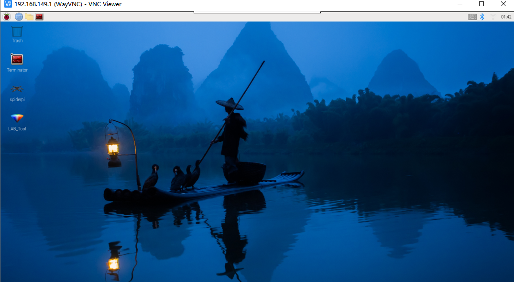

(2) Click the icon，in the top left corner of the system desktop or press the shortcut "**Ctrl+Alt+T**" to open the Terminator terminal.

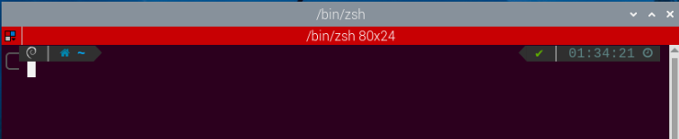

(3) Execute the command to navigate to the directory where the program is located, then press Enter: 

```commandline
cd spiderpi/functions
```

(4) Enter the command and press Enter to start the program:

```commandline
python3 color_recognition.py
```

(5) To close the program, simply press "**Ctrl+C**" in the LX terminal. If it does not close, press it multiple times.

<p id="anchor_1_3"></p>

### 6.1.3 Program Outcome

After starting the game, the camera will be used to detect colors. When a red ball is recognized, the buzzer will emit a beep sound, and the ball will be circled in the transmitted image, with "Color: red" printed.

:::{Note}

* During the recognition process, ensure the environment is well-lit to avoid inaccurate recognition due to poor lighting conditions.

* Ensure that no objects with similar or matching colors to the target are present in the background within the cameras visual range, as this may cause misrecognition.

* If color recognition is inaccurate, refer to the section "[6.1.5 Function Extensions -> Adjusting Color Thresholds]()" in this document to adjust the color threshold settings.

:::

### 6.1.4 Program Analysis

The source code of this program is saved in: [/home/pi/spiderpi/functions/color_recognition.py]()

* **Import Function Library** 

{lineno-start=4}

```
import sys
import cv2
import math
import time
import threading
import numpy as np
from common import misc
from common import yaml_handle
from calibration.camera import Camera
from sensor.ultrasonic_sensor import Ultrasonic
```

(1) Import Libraries for OpenCV, Time, Math, and Threading

To use functions from a library, we can call them with the syntax:

**library_name.function_name(parameter1, parameter2, ..**.) 

{lineno-start=199}

```
            time.sleep(0.01)
```

For example, to call the  `sleep` function from the `time` library, we use: 

In Python, several libraries like  `time`, `cv2`, and `math` are built-in and can be directly imported and used. You can also create your own libraries, like the `yaml_handle`  file-reading library mentioned above.

(2) Instantiate a Library

Some library names can be long and hard to remember. To simplify function calls, we often instantiate libraries. For example: 

{lineno-start=12}

```
from calibration.camera import Camera
```

After instantiating the library, we can call functions from the `Board` library using the shorter syntax:  

Board.function_name(parameter1, parameter2, ...)

This makes it much easier and more convenient to use.

**1.4.2 Main Function Analysis**

In a Python program, `__name__ == '__main__'` indicates the main function of the program, where the program starts by reading an image.

(1) Image Processing

{lineno-start=186}

```
    camera = Camera()
```

When the play mode starts, the video stream is obtained and stored in "cap".

(2) Entering Image Processing

When an image is read, the  `run()` function is called for image processing.

{lineno-start=189}

```
    while True:
        img = camera.frame
        if img is not None:
            frame = img.copy()
            Frame = run(frame)
            cv2.imshow('Frame', Frame)
            key = cv2.waitKey(1)
            if key == 27:
                break
```

① The function `img.copy()` is used to copy the content of `img` to `frame`.

② The function `run()` performs image processing.

{lineno-start=108}

```
def run(img):
    global draw_color
    global color_list
    global detect_color
    global action_finish
    global count
    img_copy = img.copy()
    img_h, img_w = img.shape[:2]

    

    frame_resize = cv2.resize(img_copy, size, interpolation=cv2.INTER_NEAREST)
    frame_gb = cv2.GaussianBlur(frame_resize, (3, 3), 3)      
    frame_lab = cv2.cvtColor(frame_gb, cv2.COLOR_BGR2LAB)  # 将图像转换到LAB空间(convert the image to LAB space)
```

(3) Resizing the image for easier processing.

{lineno-start=119}

```
    frame_resize = cv2.resize(img_copy, size, interpolation=cv2.INTER_NEAREST)
```

The first parameter `img_copy` is the input image.

The second parameter `size` is the size of the output image. The size can be set by yourself.

The third parameter `interpolation=cv2.INTER_NEAREST` is the interpolation method. `INTER_NEAREST`: Nearest-neighbor interpolation.

` INTER_LINEAR`: Bilinear interpolation. If you do not specify the last parameter, this method will be used by default. 

`INTER_CUBIC`: Bicubic interpolation within a 4x4 pixel neighborhood. 

`INTER_LANCZOS4`: Lanczos interpolation within an 8x8 pixel neighborhood.

(4) Gaussian Filtering

There is always noise mixed in the image, which affects the image quality and makes the features less prominent. Different filtering methods are selected according to different types of noise, common ones include: Gaussian filtering, median filtering, mean filtering, etc.

Gaussian filtering is a linear smoothing filter, suitable for eliminating Gaussian noise and widely used in the noise reduction process of image processing.

{lineno-start=120}

```
    frame_gb = cv2.GaussianBlur(frame_resize, (3, 3), 3) 
```

he first parameter `frame_resize` is the input image.

The second parameter `(3, 3)` is the size of the Gaussian kernel.

The third parameter `3` is the standard deviation of the Gaussian kernel in the X direction.

(5) Converting the Image to LAB Color Space, where the function cv2.cvtColor() is a color space conversion function.

{lineno-start=121}

```
    frame_lab = cv2.cvtColor(frame_gb, cv2.COLOR_BGR2LAB)  # 将图像转换到LAB空间(convert the image to LAB space)
```

The first parameter `frame_gb` is the input image.

The second parameter `cv2.COLOR_BGR2LAB` is the conversion format. `cv2.COLOR_BGR2LAB`converts from BGR format to LAB format. If you want to convert to RGB, you can use `cv2.COLOR_BGR2RGB`.

(6) Converting the Image into a Binary Image, which only has 0 and 1, making the image simpler and reducing the data volume, and thus easier to process.

The `inRange()` function in the cv2 library is used to binarize the image.

{lineno-start=131}

```
                frame_mask = cv2.inRange(frame_lab,
                                         (lab_data[i]['min'][0],
                                          lab_data[i]['min'][1],
                                          lab_data[i]['min'][2]),
                                         (lab_data[i]['max'][0],
                                          lab_data[i]['max'][1],
                                          lab_data[i]['max'][2]))  #对原图像和掩模进行位运算(perform bitwise operation to original image and mask)
```

The first parameter `frame_lab` is the input image;

The second parameter `(lab_data[i]['min'][0],lab_data[i]['min'][1],lab_data[i]['min'][2])` is the lower color threshold;

The third parameter `(lab_data[i]['max'][0],lab_data[i]['max'][1],lab_data[i]['max'][2])` is the upper color threshold;

(7) To reduce interference and make the image smoother, erosion and dilation operations need to be performed on the image. Erosion and dilation are two basic morphological operations, often used in image processing, especially in binary image processing. These two operations are usually used to remove small noise, separate and identify objects in the image, and adjust the size of the image, etc.

{lineno-start=138}

```
                eroded = cv2.erode(frame_mask, cv2.getStructuringElement(cv2.MORPH_RECT, (3, 3)))  #腐蚀(erode)
                dilated = cv2.dilate(eroded, cv2.getStructuringElement(cv2.MORPH_RECT, (3, 3))) #膨胀(dilate)
```

he first parameter is the input image;

The second parameter is the structural element (also known as the kernel), which defines the nature of the operation. The size and shape of the kernel determine the degree of erosion and dilation.

(8) Obtaining the Contour with the Largest Area

The first parameter `dilated` is the input image;

{lineno-start=142}

```
                contours = cv2.findContours(dilated, cv2.RETR_EXTERNAL, cv2.CHAIN_APPROX_NONE)[-2]  #找出轮廓(find contours)
```

The second parameter `cv2.RETR_EXTERNAL` is the contour retrieval mode;

The third parameter `cv2.CHAIN_APPROX_NONE)[-2]` is the contour approximation method.

Among the obtained contours, the contour with the largest area is searched for, and in order to avoid interference, a minimum value needs to be set, and the target contour is valid only when the area is larger than this value.

{lineno-start=143}

```
                areaMaxContour, area_max = get_area_max_contour(contours)  #找出最大轮廓(find the largest contour)
                if areaMaxContour is not None:
                    if area_max > max_area:#找最大面积(find the maximum area)
                        max_area = area_max
                        color_area_max = i
                        areaMaxContour_max = areaMaxContour
```

(9) Displaying the Returned Imag

{lineno-start=192}

```
            frame = img.copy()
            Frame = run(frame)
            cv2.imshow('Frame', Frame)
            key = cv2.waitKey(1)
            if key == 27:
                break
```

The function `cv2.imshow()` is used to display the image in a window, `'Frame'` is the window name, and `Frame` is the display content. There must be cv2.waitKey() afterwards, otherwise, it cannot be displayed.

The function `cv2.waitKey()` is used to wait for key input, and the parameter "**1**" is the delay time.

**1.4.3 drive the buzzer**

{lineno-start=91}

```
                board.set_buzzer(2400, 0.1, 0.2, 1)
                time.sleep(0.2)
```

The function `set_buzzer()` is used to drive the buzzer.

The code `time.sleep(0.2)` is a delay function, and `0.2` is the buzzing time.
### 6.1.5 Function Extensions

* **Adjusting Color Thresholds** 

The color recognition program is pre-configured to recognize three colors: red, green, and blue. By default, the program identifies red, triggering the buzzer to emit a beep and drawing a circle around the red ball in the transmitted image, displaying “Color: red.”

**To change the recognized color to green, follow these steps:**

(1) Enter the following command and press Enter to navigate to the source code directory:

```commandline
cd spiderpi/functions
```

(2) Then, enter the following command and press Enter to open the program file:

```commandline
sudo vim color_recognition.py
```

(3) Locate the code shown in the image below:

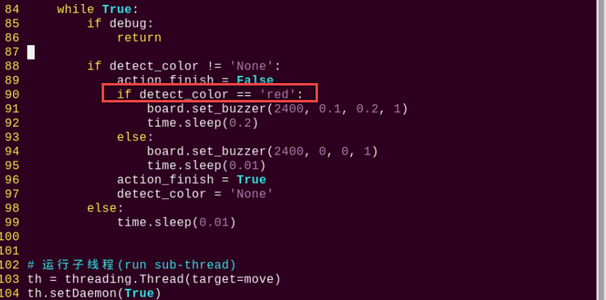

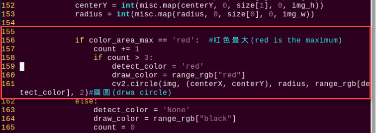

(4) Press the “i” key on the keyboard to enter edit mode.

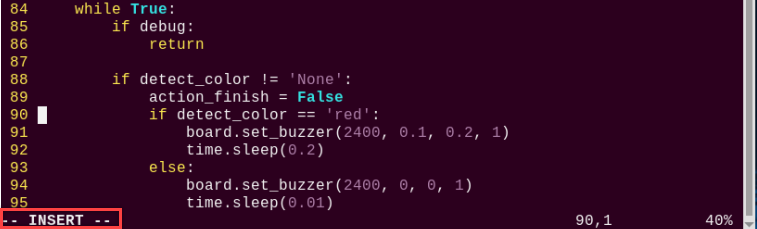

(5) Replace “red” (highlighted in red in the image) with “green,” as shown in the image below:

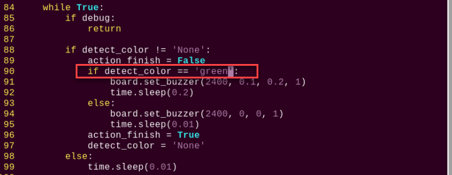

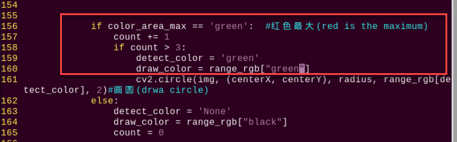

(6) To save your changes, press the “Esc” key, then type “:wq” (note the colon before "wq") and press Enter to save and exit.

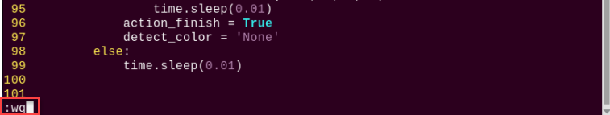

(7) Enter the following command and press Enter to start the color recognition functionality: 

```commandline
sudo python3 color_recognition.py
```

## 6.2 Color Recognition

### 6.2.1 Program Logic

For humans, it is easy to distinguish different colors in the world. How can robots recognize object colors? For SpiderPi Pro, we can install a camera vision module to it and control it to identify different colors through visual recognition.

The overall implementation process is as follows: 

First, program SpiderPi Pro to recognize colors with Lab color space. Convert the RGB color space to Lab, and then perform image binarization and operations such as dilation and corrosion to obtain an outline containing only the target color. 

Lastly, circle the obtained color outline and control the robot to take action according to the result of color recognition.

<p id="anchor_2_2"></p>

### 6.2.2 Start and Close the Game

:::{Note}
The input command should be case sensitive and space sensitive.
:::

(1) Start the SpiderPi Pro robot and connect to the Raspberry Pi desktop remotely via VNC.

(2) Click   at upper left corner of desktop, or press **“Ctrl+Alt+T”** to open LX terminal.

(3) Enter the command “cd spiderpi/functions” and press “Enter” to navigate to the directory where the game program is located.

```
cd spiderpi/functions
```

(4) Enter command “python3 color_detect.py”, then press “Enter” to start the game.

```commandline
python3 color_detect.py
```

(5) If you want to exit the game programming, press “Ctrl+C” in the LX terminal interface. If the exit fails, please try it a few more times.

### 6.2.3 Project Outcome

:::{Note}
The default recognition color is red. If you want to change it to blue or green, please refer to “[6.2.5 Function Extension -> Modify Default Recognition Color]()”.
:::

Place the red ball in front of SpiderPi Pro’s camera and it will nod when recognizing the red ball. It will “shake head” when detecting the green and blue balls.

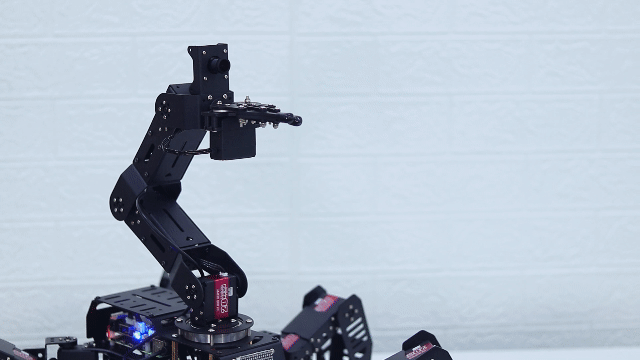


### 6.2.4 Program Analysis

The source code of this program is located at: [/home/pi/spiderpi/functions/color_detect.py]()

* **Import Function Libraries** 

{lineno-start=4}

```
import sys
import cv2
import math
import time
import threading
import numpy as np
from common import misc
from common import yaml_handle
from calibration.camera import Camera
from sensor.ultrasonic_sensor import Ultrasonic
```

**2.4.2 Image Processing**

**(1) Gaussian Filtering**

Before converting the image from RGB into LAB space, denoise the image and use `GaussianBlur()` function in cv2 library for Gaussian filtering.

{lineno-start=179}

```
    frame_gb = cv2.GaussianBlur(frame_resize, (3, 3), 3)    
```

The meaning of the parameters in bracket is as follows:

The first parameter `frame_resize` is the input image;

The second parameter `(3, 3)` is the size of the Gaussian kernel;

The third parameter `3` is the variance allowed near the average value in Gaussian filtering. The larger this value, the larger the variance allowed around the average value; the smaller the value, the smaller the variance allowed around the average value.

**(2) Binarization Processing**

The `inRange()` function in the cv2 library is used to perform binarization processing on the image.

{lineno-start=189}

```
                frame_mask = cv2.inRange(frame_lab,
                                         (lab_data[i]['min'][0],
                                          lab_data[i]['min'][1],
                                          lab_data[i]['min'][2]),
                                         (lab_data[i]['max'][0],
                                          lab_data[i]['max'][1],
                                          lab_data[i]['max'][2]))  #对原图像和掩模进行位运算(perform bitwise operation to original image and mask)
```

The first parameter in the bracket is the input image. 

The second and the third parameters respectively are the lower limit and upper limit of the threshold. When the RGB value of the pixel is between the upper limit and lower limit, the pixel is assigned a value of 1, otherwise, 0.

**(3) Corrosion and dilation**

To reduce the interference and make the image smoother, it is necessary to perform corrosion and dilation on the image.

{lineno-start=196}

```
                eroded = cv2.erode(frame_mask, cv2.getStructuringElement(cv2.MORPH_RECT, (3, 3)))  #腐蚀(erode)
                dilated = cv2.dilate(eroded, cv2.getStructuringElement(cv2.MORPH_RECT, (3, 3))) #膨胀(dilate)
```

`erode()` function is used for corrosion. Take `eroded = cv2.erode(frame_mask, cv2.getStructuringElement(cv2.MORPH_RECT, (3, 3)))` for example. 

The meaning of the parameters in bracket are as follow.

The first parameter `frame_mask` is the input image.

The second parameter `cv2.getStructuringElement(cv2.MORPH_RECT, (3, 3))` is the structural element and kernel deciding the nature of the operation. And the first parameter in the parenthesis is the kernel shape and the second parameter is the kernel dimension.

`dilate()` function is used for image dilation. And the meaning of the parameters in parenthesis is the same as that of `erode()` function.

**(4) Acquire the maximum contour**

After processing the image, acquire the contour of the target to be recognized, which involves `findContours()` function in cv2 library.

{lineno-start=200}

```
                contours = cv2.findContours(dilated, cv2.RETR_EXTERNAL, cv2.CHAIN_APPROX_NONE)[-2]  #找出轮廓(find contours)
```

The first parameter in parentheses is the input image;

The second parameter is the retrieval mode of the contour; 

The third parameter is the approximation method of the contour.

Find the contour of the maximum area among the obtained contours. To avoid interference, please set a minimum value. Only when the area is larger than this value, the target contour is valid.

{lineno-start=205}

```
        if max_area > 100:  # 有找到最大面积(the maximum area has been found)
            ((centerX, centerY), radius) = cv2.minEnclosingCircle(areaMaxContour_max)  # 获取最小外接圆(obtain the minimum circumscribed circle)
            centerX = int(misc.map(centerX, 0, size[0], 0, img_w))
            centerY = int(misc.map(centerY, 0, size[1], 0, img_h))
            radius = int(misc.map(radius, 0, size[0], 0, img_w))            
            cv2.circle(img, (centerX, centerY), radius, range_rgb[color_area_max], 2)#画圆(drwa circle)
```

**2.4.3 Feedback Information**

After the contour of the maximum area is obtained, call `circle()` function in cv2 library, and circle the recognized target. The color of the circle is in line with the color of the object. 

{lineno-start=210}

```
            cv2.circle(img, (centerX, centerY), radius, range_rgb[color_area_max], 2)#画圆(drwa circle)

```

To improve the accuracy of the recognition result, it is necessary to make several judgments.

{lineno-start=212}

```
            if color_area_max == 'red':  #红色最大(red is the maximum)
                color = 1
            elif color_area_max == 'green':  #绿色最大(green is the maximum)
                color = 2
            elif color_area_max == 'blue':  #蓝色最大(blue is the maximum)
                color = 3
            else:
                color = 0
            color_list.append(color)

            if len(color_list) == 3:  #多次判断(multiple judgements)
                # 取平均值(get mean)
                color = int(round(np.mean(np.array(color_list))))
                color_list = []
                if color == 1:
                    detect_color = 'red'
                    draw_color = range_rgb["red"]
                elif color == 2:
                    detect_color = 'green'
                    draw_color = range_rgb["green"]
                elif color == 3:
                    detect_color = 'blue'
                    draw_color = range_rgb["blue"]
                else:
                    detect_color = 'None'
                    draw_color = range_rgb["black"]               
        else:
            detect_color = 'None'
            draw_color = range_rgb["black"]
            
    cv2.putText(img, "Color: " + detect_color, (10, img.shape[0] - 10), cv2.FONT_HERSHEY_SIMPLEX, 0.65, draw_color, 2)
```

After the judgment is completed, the color of the recognition target is printed in the feedback image. Here, the  `putText()` function in the cv2 library is involved.

{lineno-start=244}

```
    cv2.putText(img, "Color: " + detect_color, (10, img.shape[0] - 10), cv2.FONT_HERSHEY_SIMPLEX, 0.65, draw_color, 2)
```

The meaning of the parameters is as follow.

The first parameter `img` is the input image. 

The second parameter `"Color: " + detect_color` represents the displayed content. 

The third parameter `(10, img.shape[0] - 10)` is the displayed position. 

The fourth parameter `cv2.FONT_HERSHEY_SIMPLEX` represents the font type.

The fifth parameter `0.65` represents the font size.

The sixth parameter `draw_color` represents the color of the font.

The seventh parameter `2` represents the font weight.

**2.4.4 Main Function Analysis**

The python program `__name__ == ’__main__:’` is the main function of program. Firstly, the function `init()` is called to initialize. The initialization in this program includes: return the servo to the initial position, read the color threshold file. Generally there are also configurations for ports, peripherals, timing interrupts, etc., which are all done in the process of initialization.

{lineno-start=248}

```
if __name__ == '__main__':
    from common.ros_robot_controller_sdk import Board
```

**(1) Read the Camera Image**

{lineno-start=263}

```
    while True:
        img = camera.frame
        if img is not None:
            frame = img.copy()
```

When the game starts, the image is stored in "img".

**(2) Enter Image Processing**

When the captured image is read, call `run` function to process the image.

{lineno-start=266}

```
            frame = img.copy()
            Frame = run(frame)
            cv2.imshow('Frame', Frame)
            key = cv2.waitKey(1)
            if key == 27:
                break
```

① The function `img.copy()` is used to copy the content of `img` to `frame`.

② The function `run()` performs image processing.

{lineno-start=248}

```
if __name__ == '__main__':
    from common.ros_robot_controller_sdk import Board

    board = Board()
    ultrasonic = Ultrasonic()

    debug = False
    if debug:
        print('Debug Mode')

    init()
    start()
    camera = Camera()
    camera.camera_open(correction=True) # 开启畸变矫正,默认不开启(enable the distortion correction which is not started by default)
    
    while True:
        img = camera.frame
        if img is not None:
            frame = img.copy()
            Frame = run(frame)
            cv2.imshow('Frame', Frame)
            key = cv2.waitKey(1)
            if key == 27:
                break
        else:
            time.sleep(0.01)
    camera.camera_close()
    cv2.destroyAllWindows()
```

**2.4.5 Subthread Analysis**

Run the  `move()`  function of the SpiderPi Pro as a subthread. When a color is recognized, the  `move()`  function is executed. 
The function mainly involves processing the image results, making a judgment, and executing different feedback accordingly.

{lineno-start=112}

```
def move():
    global draw_color
    global detect_color
    global action_finish

    while True:
        if debug:
            return
        if __isRunning:
            if detect_color != 'None':
                action_finish = False
                if detect_color == 'red':
                    board.pwm_servo_set_position(0.2, [[1, 1200]])
                    time.sleep(0.2)
                    board.pwm_servo_set_position(0.2, [[1, 1800]])
                    time.sleep(0.2)
                    board.pwm_servo_set_position(0.2, [[1, 1200]])
                    time.sleep(0.2)
                    board.pwm_servo_set_position(0.2, [[1, 1800]])
                    time.sleep(0.2)
                    board.pwm_servo_set_position(0.2, [[1, 1500]])
                    time.sleep(0.1)
                    detect_color = 'None'
                    draw_color = range_rgb["black"]                    
                    time.sleep(1)
                elif detect_color == 'green' or detect_color == 'blue':
                    board.pwm_servo_set_position(0.2, [[2, 1200]])
                    time.sleep(0.2)
                    board.pwm_servo_set_position(0.2, [[2, 1800]])
                    time.sleep(0.2)
                    board.pwm_servo_set_position(0.2, [[2, 1200]])
                    time.sleep(0.2)
                    board.pwm_servo_set_position(0.2, [[2, 1800]])
                    time.sleep(0.2)
                    board.pwm_servo_set_position(0.2, [[2, 1500]])
                    time.sleep(0.1)
                    detect_color = 'None'
                    draw_color = range_rgb["black"]                    
                    time.sleep(1)
                else:
                    time.sleep(0.01)                
                action_finish = True                
                detect_color = 'None'
            else:
               time.sleep(0.01)
        else:
            time.sleep(0.01)
```
### 6.2.5 Function Extensions

* **Change the Default Recognition Color** 

There are three built-in colors, including red, green and blue, in the color recognition program. The robot defaults to nod when recognizing red.

Take modifying the default recognition color as green as an example. The specific operation steps are as follow. 

(1) Input command **“cd spiderpi/functions”** and press **“Enter”** to navigate to the directory where the game programs are stored. 

```commandline
cd spiderpi/functions
```

(2) Enter the command **“vim color_detect.py”** and press **“Enter”** to open the program file.

```commandline
vim color_detect.py
```

(3) Locate the codes shown below:

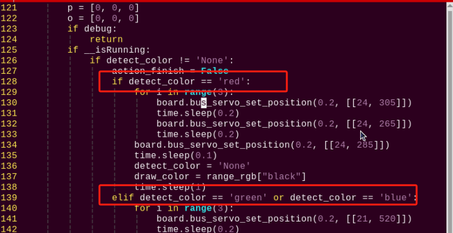

:::{Note}
We can input the serial number of the line and press “Shift+G” to jump to the corresponding position. This section aims to introduce the quick jump method, therefore, the code location numbers are for reference only. Please refer to the actual situation.
:::

(4) Press “i” to enter the editing mode, then modify “red” in `if detect_color == 'red':` to “green”. And replace “green” with “red” in `elif detect_color == 'green' or detect_color == 'blue':`. And you can modify it as blue in the same way.

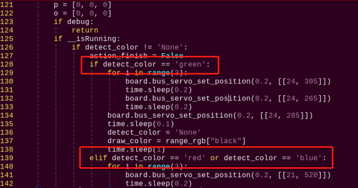

After modification, Press “Esc” and input “:wq” and then press “Enter” to save the file and exit the editor.

```commandline
:wq
```

(5) After the modification is completed, you can follow the steps in “[6.2.2 Operation Steps]()” to check the game performance. 

* **Add New Recognition Colors** 

In addition to the built-in recognition colors, you can set other recognition colors in the program. Take orange as example.

(1) Open VNC, input command “vim spiderpi/config/lab_config.yaml” to open Lab color setting document.

```commandline
Vim spiderpi/config/lab_config.yaml
```

:::{Note}

It is recommended to screenshot the initial value for recording. 

:::


(2) Double click the icon of debugging tool  in the system desktop. If the prompt box pops up, choose “Execute”.


Click “Connect” button. When the interface displays the camera returned image, the connection is successful. Select "red" in the drop-down box.

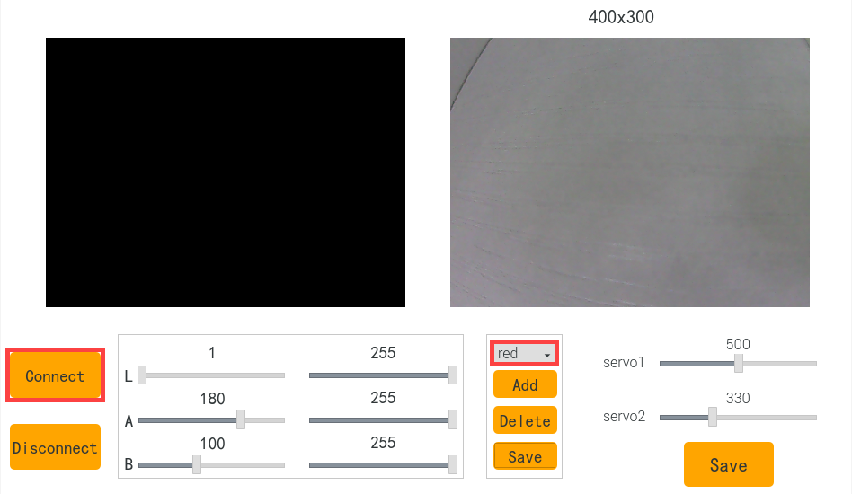

(3) Face the camera to the color to recognize. Drag the sliders of L, A, and B until the object to be recognized in the left screen becomes white and other areas become black.

For example, if you want to recognize orange, you can put the orange ball within camera’s vision. Adjust the corresponding sliders of L, A, and B until the orange part in the left screen turns white and other colors become black, and then click "Save" button to keep the modified data.

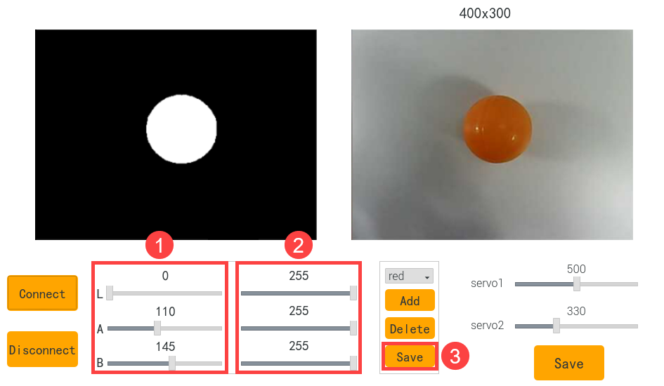

(4) After the modification is completed, check whether the modified data was successfully written in. Enter the command again “vim spiderpi/config/lab config.yaml” to open file of Lab color setting.

```commandline
Vim spiderpi/config/lab_config.yaml
```

:::{Note}
In order to avoid the game performance, it’s recommended to use the LAB_Tool tool to modify the value back to the initial value after the modification.
:::

(5) The modified data is written successfully into the configuration program. Then you can press “Esc” and input “:wq” and then press “Enter” to save and exit.

```commandline
:wq
```

(6) According to the steps in “[6.2.5 Function Extension -> Modify Default Recognition Color]()”, set the default recognition color as red.


(7) Start the game again and put the orange object in front of the camera. SpiderPi Pro will nod when recognizing the color. If you want to add other color as recognition color, you can follow the previous steps to set.

## 6.3 Target Position Recognition

In this lesson, the camera will be used to recognize red, green, and blue balls. The detected balls will be highlighted in the live feed, and their XY coordinates will be displayed.

### 6.3.1 Brief Analysis of the Task

The implementation of target tracking can be divided into two parts: color recognition and position marking.

First, for the color recognition part, Gaussian filtering is applied to the image for noise reduction. The Lab color space is then used to convert the color of the objects (for more details on the Lab color space, please refer to the “[OpenCV Vision Basic Course]()”).

Next, color thresholding is used to identify the color of objects within the circle. The image is then masked (masking involves using a selected image, shape, or object to globally or locally occlude the processed image).

After performing morphological operations (open and close operations) on the object’s image, the largest contour is outlined with a circle.

**Opening operation:** The image is eroded first and then dilated. This operation is used to remove small objects, smooth shape boundaries, and preserve the overall area. It helps remove small noise particles and separate objects that are connected.

**Closing operation:** The image is dilated first and then eroded. This operation is used to fill small holes within the objects, connect adjacent objects, and reconnect broken contour lines while smoothing the boundaries without changing the area.

Position marking requires specific detection algorithms. The basic principle is to search for areas in the image that match predefined features or patterns, then return the position and bounding box of these areas.

### 6.3.2 Start and Close the Game

:::{Note}
The input of commands must strictly distinguish between uppercase and lowercase letters, as well as spaces. Additionally, you can use the "Tab" key on the keyboard to auto-complete keywords.
:::

(1) Power on the device and, following the instructions in "[Remote Desktop Installation and Connection\3.1 VNC Installation and Connection]()", use the VNC remote connection tool to connect.


(2) Click the iconin the top left corner of the system desktop or press the shortcut "**Ctrl+Alt+T**" to open the LX terminal.


(3) In the terminal, enter the command to navigate to the directory where the program is located, then press Enter:

```commandline
cd spiderpi/functions
```

(4) Enter the command and press Enter to start the program:

```commandline
python3 color_position_recognition.py
```

(5) To close the program, simply press "**Ctrl+C**" in the LX terminal. If it does not close, press it multiple times.

### 6.3.3 Program Outcome

The program defaults to recognizing red, green, and blue balls. After recognition, it will highlight the objects in the transmitted image and display their XY coordinates.

:::{Note}

* During the recognition process, ensure the environment is well-lit to avoid inaccurate recognition due to lighting issues.

* Ensure there are no objects with similar or identical colors to the target colors within the camera's field of view to prevent misrecognition.

* If color recognition is inaccurate, refer to the section "[6.3.5 Function Extension ->Adjusting Color Threshold]()" in this document to adjust the color threshold settings.
  :::


### 6.3.4 Program Description

The source code for this program is located at：[/home/pi/spiderpi/functions/color_position_recognition.py]()

* **Importing Libraries** 

{lineno-start=4}

```
import sys
import cv2
import math
import time
import threading
import numpy as np
from common import misc
from common import yaml_handle
from calibration.camera import Camera
from sensor.ultrasonic_sensor import Ultrasonic
```

(1) Import the necessary libraries, including OpenCV, time, math, threading, and inverse kinematics. 

To call a function from a library, use the format `LibraryName.FunctionName(Parameters)`. For example:

{lineno-start=189}

```
            time.sleep(0.01)
```

This calls the  `sleep`  function from the  `time`  library, which is used for adding delays.

Python comes with several built-in libraries like  `time`, `cv2`, `math`, which can be imported directly. You can also create your own libraries, such as the "yaml_handle" file reading library.

(2) Instantiating Libraries  

Sometimes, library names are long and hard to remember. To make function calls more convenient, we often instantiate libraries using shorter names. For example:

{lineno-start=12}

```
from calibration.camera import Camera
```

After instantiation, functions from the `Board` library can be called as:

Board.FunctionName(Parameters)

This makes calling functions much easier.

* **Main Function Analysis** 

In a Python program, the  `if __name__ == '__main__':` block indicates the main function. The program starts by opening the camera and reading the video stream. The  `read()`  method captures each frame of the image, where the program searches for and marks the color of the ball, then displays the result. The video is displayed through a loop, and once the display is finished, the  `release()` function is called to release the resources.

{lineno-start=167}

```
if __name__ == '__main__':
    from common.ros_robot_controller_sdk import Board

    board = Board()
    ultrasonic = Ultrasonic()

    load_config()
    init_move()
    reset()
    camera = Camera()
    camera.camera_open(correction=True) # 开启畸变矫正,默认不开启(enable the distortion correction which is not started by default)
```

**(1) Capturing Camera Image**

{lineno-start=176}

```
    camera = Camera()
```

When the program starts, the camera is initialized.

**(2) Image Processing**

① The `run()` function handles image processing.

{lineno-start=183}

```
            Frame = run(frame)
```

{lineno-start=85}

```
def run(img):
    global draw_color
    global color_list
    global detect_color
    global action_finish
    
    img_copy = img.copy()
    img_h, img_w = img.shape[:2]


    frame_resize = cv2.resize(img_copy, size, interpolation=cv2.INTER_NEAREST)
    frame_gb = cv2.GaussianBlur(frame_resize, (3, 3), 3)      
    frame_lab = cv2.cvtColor(frame_gb, cv2.COLOR_BGR2LAB)  # 将图像转换到LAB空间(convert the image to LAB space)
```

② Resize the image to make it easier to process.

{lineno-start=95}

```
    frame_resize = cv2.resize(img_copy, size, interpolation=cv2.INTER_NEAREST)
```

The first parameter `img_copy` is the input image.

The second parameter `size` is the size of the output image, which can be set as needed.

The third parameter `interpolation=cv2.INTER_NEAREST` is the interpolation method. 

Options include:

`INTER_NEAREST`: Nearest-neighbor interpolation.

`INTER_LINEAR`: Bilinear interpolation (default if no other method is specified).

`INTER_CUBIC`: Bicubic interpolation in a 4x4 pixel neighborhood.

`INTER_LANCZOS4`: Lanczos interpolation in an 8x8 pixel neighborhood.

③ Apply Gaussian Blur to reduce noise

Gaussian blur is a linear smoothing filter used to eliminate Gaussian noise and is widely used in image denoising.

{lineno-start=96}

```
    frame_gb = cv2.GaussianBlur(frame_resize, (3, 3), 3) 
```

The first parameter `frame_resize` is the input image.

The second parameter `(3, 3)` is the size of the Gaussian kernel.

The third parameter `3` is the standard deviation of the Gaussian kernel in the X-direction.

④ Convert the image to LAB color space.

{lineno-start=97}

```
    frame_lab = cv2.cvtColor(frame_gb, cv2.COLOR_BGR2LAB)  # 将图像转换到LAB空间(convert the image to LAB space)
```

The first parameter `frame_gb` is the input image.

The second parameter `cv2.COLOR_BGR2LAB` specifies the conversion from BGR to LAB format. To convert to RGB, use `cv2.COLOR_BGR2RGB`.

⑤ Convert the image to a binary image with only 0s and 1s, simplifying the image and reducing data for easier processing.

The `cv2.inRange()` function is used for binarization:

{lineno-start=}

```
                frame_mask = cv2.inRange(frame_lab,
                                         (lab_data[i]['min'][0],
                                          lab_data[i]['min'][1],
                                          lab_data[i]['min'][2]),
                                         (lab_data[i]['max'][0],
                                          lab_data[i]['max'][1],
                                          lab_data[i]['max'][2]))  #对原图像和掩模进行位运算(perform bitwise operation to original image and mask)
```

The first parameter `frame_lab` is the input image.

The second parameter `(lab_data[i]['min'][0], lab_data[i]['min'][1], lab_data[i]['min'][2])` is the lower threshold for the color.

The third parameter `(lab_data[i]['max'][0], lab_data[i]['max'][1], lab_data[i]['max'][2])` is the upper threshold for the color.

⑥ Perform erosion and dilation to smooth the image and reduce interference.

Erosion reduces the size of foreground objects and eliminates small objects, while dilation increases the size of foreground objects and fills small holes.

{lineno-start=113}

```
                eroded = cv2.erode(frame_mask, cv2.getStructuringElement(cv2.MORPH_RECT, (3, 3)))  #腐蚀(erode)
                dilated = cv2.dilate(eroded, cv2.getStructuringElement(cv2.MORPH_RECT, (3, 3))) #膨胀(dilate)
```

⑦ Find the contour with the largest area

After the image processing steps, use the `cv2.findContours()` function to find contours:

{lineno-start=117}

```
                contours = cv2.findContours(dilated, cv2.RETR_EXTERNAL, cv2.CHAIN_APPROX_NONE)[-2]  #找出轮廓(find contours)
```

The first parameter `dilated` is the input image.

The second parameter `cv2.RETR_EXTERNAL` specifies the contour retrieval mode.

The third parameter `cv2.CHAIN_APPROX_NONE)[-2]` specifies the contour approximation method.

The program searches for the largest contour and sets a threshold area to ensure the detected contour is valid.

{lineno-start=118}

```
                areaMaxContour, area_max = get_area_max_contour(contours)  #找出最大轮廓(find the largest contour)
                if areaMaxContour is not None:
                    if area_max > max_area:#找最大面积(find the maximum area)
                        max_area = area_max
                        color_area_max = i
                        areaMaxContour_max = areaMaxContour
        if max_area > 100:  # 有找到最大面积(the maximum area has been found)
```

⑧ Extract the position information

Use `cv2.putText()` to draw text on the image:

{lineno-start=162}

```
    cv2.putText(img, "Color: " + detect_color, (10, img.shape[0] - 10), cv2.FONT_HERSHEY_SIMPLEX, 0.65, draw_color, 2)
```

The first parameter `img` is the input image.

The second parameter `"Color: " + detect_color` is the text to display (e.g., the detected color).

The third parameter `(10, img.shape[0] - 10)` and `(centerX, centerY - 20)` specify the starting coordinates for the text (bottom-left position).

The fourth parameter `cv2.FONT_HERSHEY_SIMPLEX` specifies the font type.

The fifth parameter `0.65` is the scaling factor for the font size.

The sixth parameter `draw_color` is the color of the text.

The seventh parameter `2` specifies the thickness of the text line.

(3) Displaying the Return Image

{lineno-start=179}

```
    while True:
        img = camera.frame
        if img is not None:
            frame = img.copy()
            Frame = run(frame)
            cv2.imshow('Frame', Frame)
            key = cv2.waitKey(1)
            if key == 27:
                break
```

The `cv2.imshow()` function is used to display the image in a window. The first parameter is the window name (e.g., 'Frame'), and the second parameter is the image to display.  

The function `cv2.waitKey()` is used to wait for a key press; the parameter `1` specifies the delay time.
### 6.3.5 Function Extension

* **Adjusting Color Threshold** 

During the game experience, if the color recognition of objects is not accurate, you may need to adjust the color threshold. This section uses adjusting the red color as an example; the process for adjusting other colors is similar. Follow the steps below:

(1) Double-click the system desktop icon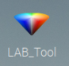and click "Execute" in the pop-up window.

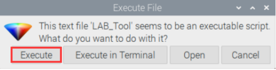

(2) Once the interface opens, click "**Connect**."

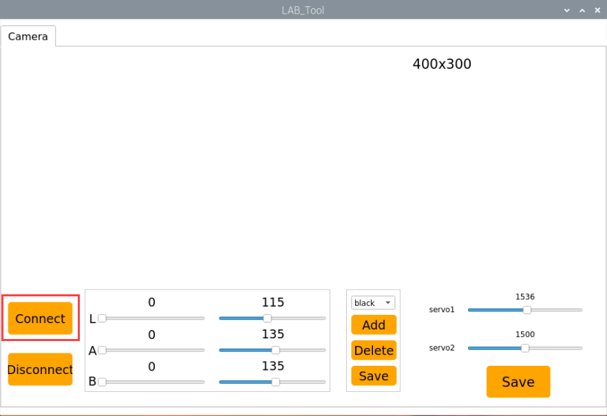

(3) After a successful connection, select "red" from the color options in the bottom-right corner of the interface.

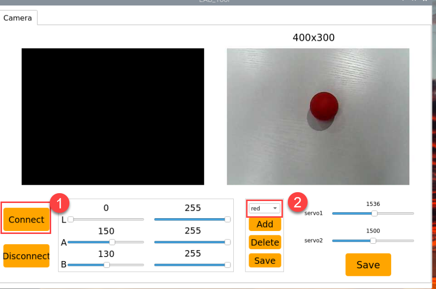

(4) If the transmitted image does not appear in the pop-up window, it indicates the camera is not connected properly. Check the camera connection cable to ensure it is securely connected.

The image on the right side of the interface shows the real-time transmitted video, and the left side shows the color to be captured.

Point the camera at the red color block, and then adjust the six sliders at the bottom to ensure that the red color block on the left side of the screen turns completely white, while other areas remain black.

Finally, click the "Save" button to save the data.

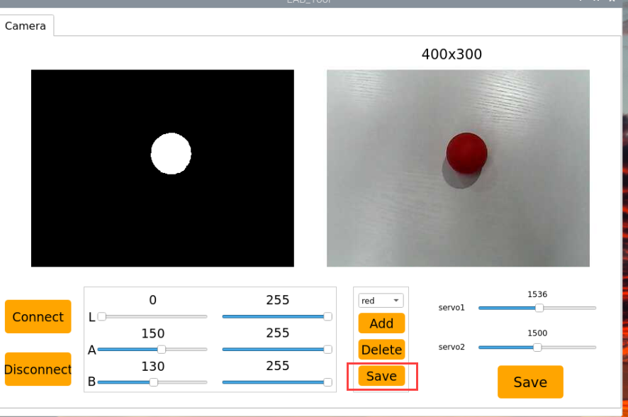

## 6.4 Target Tracking

### 6.4.1 Program logic

First, program SpiderPi Pro to recognize colors with Lab color space. Convert the RGB color space to Lab, perform image binarization, and then operations such as expansion and corrosion to obtain an outline containing only the target color. And circle the obtained outline.

After color recognition, take X and Y coordinate of the image center as setting value. And take the X and Y coordinate of the target as input value to update PID.

Lastly, calculate according to the feedback about the image position and control SpiderPi Pro to move with the target, so as to realize color tracking.

### 6.4.2 Operation steps

:::{Note}
The input command should be case sensitive and space sensitive. 
:::

(1) Boot up SpiderPi Pro, then remotely connect to Raspberry Pi desktop through VNC. 

(2) Click  at upper left corner of desktop, or press “Ctrl+Alt+T” to open LX terminal.

(3) Enter the command “cd spiderpi/functions” and press “Enter” to navigate to the directory where the game program is located.

```commandline
cd spiderpi/functions
```

(4) Enter “python3 color_track.py”, then press “Enter” to start the game.

```
python3 color_track.py
```

(5) If you want to exit the game programming, press “Ctrl+C” in the LX terminal interface. If the exit fails, please try it few more times.

### 6.4.3 Project outcome

:::{Note}
The default recognized and tracking color is green. If you want to change it to blue, please refer to “4.4.1 Modify Default Recognition Color”. And, please don’t move the ball too fast and out of the camera vision. 
:::

After the game starts, move the green ball slowly, and the robotic arm of SpiderPi Pro will move with the green ball. 

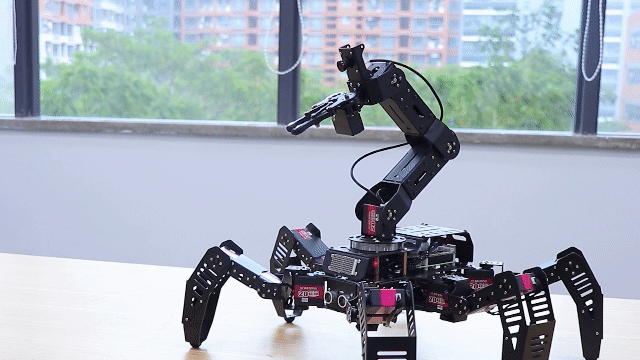


### 6.4.4 Program Analysis

The source code of this program is located in：[/home/pi/spiderpi/functions/color_track.py]()

* **Import Function Library** 

{lineno-start=4}

```
import sys
import cv2
import math
import time
import numpy as np
from common import misc
from common.pid import PID
from common import yaml_handle
from calibration.camera import Camera 
from calibration.CalibrationConfig import *
from sensor.ultrasonic_sensor import Ultrasonic
import arm_ik.arm_move_ik as AMK
```

**(1) Gaussian filtering**

Before converting the image from RGB into LAB space, denoise the image and use “GaussianBlur()” function in cv2 library for Gaussian filtering.

{lineno-start=146}

```
    frame_gb = cv2.GaussianBlur(frame_resize, (5, 5), 5) 
```

The meaning of the parameters in bracket is as follow

The first parameter `frame_resize` is the input image

The second parameter `(5, 5)` is the size of Gaussian kernel.

The third parameter  `5`  is the allowable variance around the average in Gaussian filtering. The larger the value, the larger the allowable variance around the average value; The smaller the value, the smaller the allowable variance around the average value.

**(2)  Binaryzation processing**

Adopt `inRange()` function in cv2 library to perform binaryzation on the image.

{lineno-start=187}

```
            frame_mask = cv2.inRange(frame_lab,
                                         (lab_data[i]['min'][0],
                                          lab_data[i]['min'][1],
                                          lab_data[i]['min'][2]),
                                         (lab_data[i]['max'][0],
                                          lab_data[i]['max'][1],
                                          lab_data[i]['max'][2]))  #对原图像和掩模进行位运算(perform bitwise operation to original image and mask)
```

The first parameter in the bracket is the input image. The second and the third parameters respectively are the lower limit and upper limit of the threshold. When the RGB value of the pixel is between the upper limit and lower limit, the pixel is assigned a value of 1, otherwise, 0.

**(3)  Corrosion and dilation**

To reduce the interference and make the image smoother, it is necessary to perform corrosion and dilation on the image.

{lineno-start=161}

```
            eroded = cv2.erode(frame_mask, cv2.getStructuringElement(cv2.MORPH_RECT, (3, 3)))  #腐蚀(erode)
            dilated = cv2.dilate(eroded, cv2.getStructuringElement(cv2.MORPH_RECT, (3, 3))) #膨胀(dilate)
```

The `erode()` function is used for corrosion. Take `eroded = cv2.erode(frame_mask, cv2.getStructuringElement(cv2.MORPH_RECT, (3, 3)))`  for example. The meaning of the parameters in bracket are as follow.

The first parameter `frame_mask` is the input image.

The second parameter `cv2.getStructuringElement(cv2.MORPH_RECT, (3, 3))` is the structural element and kernel deciding the nature of the operation. And the first parameter in the parenthesis is the kernel shape and the second parameter is the kernel dimension.

The `dilate()`function is used for image dilation. And the meaning of the parameters in parenthesis is the same as that of `erode()` function.

**(4) Acquire the maximum contour**

After processing the image, acquire the contour of the target to be recognized, which involves findContours() function in cv2 library.

{lineno-start=165}

```
            contours = cv2.findContours(dilated, cv2.RETR_EXTERNAL, cv2.CHAIN_APPROX_NONE)[-2]  # 找出轮廓(find contours)
```

The first parameter in parentheses is the input image; the second parameter is the retrieval mode of the contour; the third parameter is the approximation method of the contour.

Find the contour of the maximum area among the obtained contours. To avoid interference, please set a minimum value. Only when the area is larger than this value, the target contour is valid.

{lineno-start=168}

```
    if area_max > 50:  # 有找到最大面积(the maximum area has been found)
        (centerX, centerY), radius = cv2.minEnclosingCircle(areaMaxContour) #获取最小外接圆(obtain the minimum circumscribed circle)
        centerX = int(misc.map(centerX, 0, size[0], 0, img_w))
        centerY = int(misc.map(centerY, 0, size[1], 0, img_h))
        radius = int(misc.map(radius, 0, size[0], 0, img_w))
        cv2.circle(img, (int(centerX), int(centerY)), int(radius), range_rgb[detect_color], 2)
```

**4.5.2 Feedback Information**

After the contour of the maximum area is obtained, call `minEnclosingCircle()` function in cv2 library to obtain the smallest circumscribed circle of the target contour.

{lineno-start=169}

```
        (centerX, centerY), radius = cv2.minEnclosingCircle(areaMaxContour) #获取最小外接圆(obtain the minimum circumscribed circle)
```

Then circle the recognized target, which involves `circle()` function in cv2 library. 

{lineno-start=173}

```
        cv2.circle(img, (int(centerX), int(centerY)), int(radius), range_rgb[detect_color], 2)
```

**4.5.3 Drive the servo**

Take X and Y coordinate of the center of the image as setting value. And take the X and Y coordinate of the recognized target as the input value to update PID.

{lineno-start=175}

```
        # use_time = 0
        x_pid.SetPoint = img_w/2  #设定(set)
        x_pid.update(centerX)  #当前(current)
        dx = int(x_pid.output)
        # use_time = abs(dx*0.00025)
        x_dis += dx  #输出(output)
        
        x_dis = 0 if x_dis < 0 else x_dis          
        x_dis = 1000 if x_dis > 1000 else x_dis
            
        y_pid.SetPoint = img_h/2
        y_pid.update(centerY)
        dy = int(y_pid.output)
        # use_time = round(max(use_time, abs(dy*0.00025)), 5)
        y_dis += dy
        
        y_dis = 0 if y_dis < 0 else y_dis
        y_dis = 1000 if y_dis > 1000 else y_dis    
        
        if not debug:
            board.bus_servo_set_position(0.02, [[24, y_dis], [21, x_dis]])
            time.sleep(0.02)
```

Drive the specific servo to rotate to the designated position through calling the `bus_servo_set_position()` function in Board library

{lineno-start=194}

```
        if not debug:
            board.bus_servo_set_position(0.02, [[24, y_dis], [21, x_dis]])
            time.sleep(0.02)
```

Take `bus_servo_set_position(0.02, [[24, y_dis], [21, x_dis]])` function for example. 

The meaning of the parameter in bracket is as follow.

The first parameter `0.02` is the rotation time in the unit of “24”. 

The second parameter `24` is the servo ID to be driven.

The third parameter `y_dis` is the rotation position.
### 6.4.5 Function extension

<span id="anchor_4_4_1" class="anchor"></span>

* **Modify Default Recognized Color** 

There are two built-in colors in the program of color tracking, including green and blue. And its robotic arm will move with the target. 

Take modifying the default recognition color as blue for example. The specific operation steps are as follow.

(1) Input command “cd spiderpi/functions/” and press “Enter” into the directory where the game programs are stored.

```commandline
cd spiderpi/functions
```

(2) Enter command “vim color_track.py” and press “Enter” to open the program file.

```commandline
vim color_track.py
```

(3) Locate the code shown below:

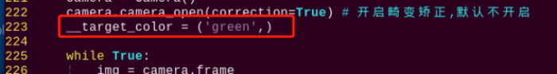

:::{Note}
press “Shift+G” after inputting the line number to directly jump to the corresponding line. This section aims to introduce the quick jump method, therefore, the code location numbers are for reference only. Please refer to the actual situation.
:::

(4) Press “i” to enter the editing mode. And modify “green” in “__target_color = ('green',)” as “blue”.

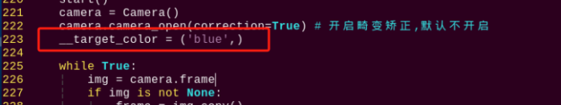

(5) After modification, press “Esc” and input “:wq” and then press Enter to save and exit. 

```commandline
:wq
```

* **Add New Recognition Color** 

:::{Note}
 for better game performance, please do not add red as the recognition color.
:::

In addition to the built-in recognition colors, you can set other recognition colors in the program. Take orange as example

(1) Open VNC, input command “vim spiderpi/config/lab_config.yaml” to open Lab color setting document.

```commandline
Vim spiderpi/config/lab_config.yaml
```

:::{Note}

It is recommended to screenshot the initial value for recording.

:::


(2) Double click the icon of debugging tool  in the system desktop. If the prompt box pops up, choose **“Execute”**.


(3) Click **“Connect”** button. When the interface displays the camera returned image, the connection is successful. Select "green" in the drop-down box.

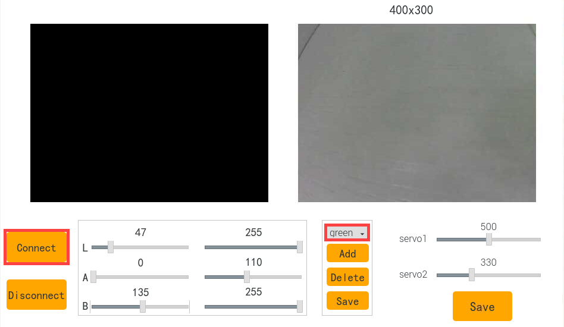

Face the camera to the color to recognize. Drag the sliders of L, A, and B until the target color in the left screen becomes white and other areas become black.

For example, if you want to recognize orange, you can put the orange ball within camera’s vision. Adjust the corresponding sliders of L, A, and B until the orange part in the left screen turns white and other colors become black, and then click “Save” button to keep the modified data.

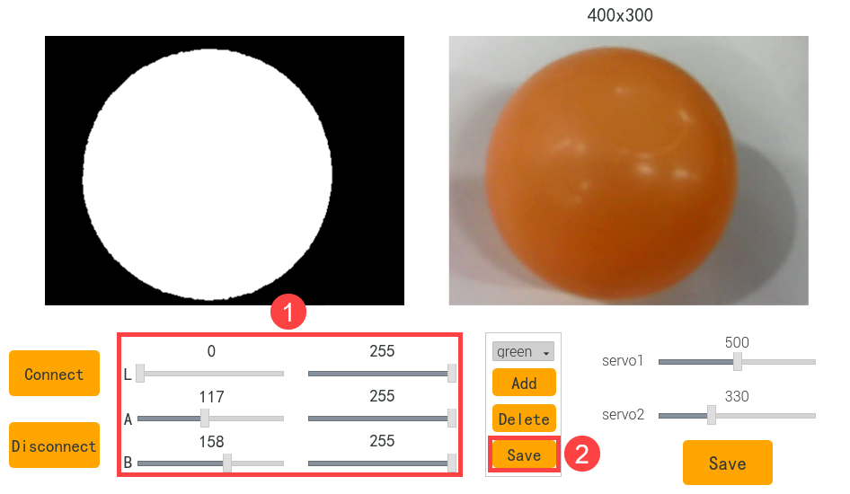

(4) After the modification is completed, check whether the modified data was successfully written in. Enter the command again “Vim spiderpi/config/lab_config.yaml” to open file of Lab color setting.

```commandline
Vim spiderpi/config/lab_config.yaml
```

:::{Note}

In order to avoid the game performance, it’s recommended to use the LAB_Tool tool to modify the value back to the initial value after the modification.

:::

(5) The modified data is written successfully into the configuration program. Then you can press “Esc” and input “:wq” and then press Enter to save and exit.

```commandline
:wq
```

(6) According to the steps in “[6.4.5 Function Extension ->Modify Default Recognition Color]()”, set the default recognition color as green.


(7) Start the game again and put the orange object in front of the camera. SpiderPi Pro will nod when recognizing the color. If you want to add other color as recognition color, you can follow the previous steps to set.


## 6.5 Line Following

### 6.5.1 Program Logic

Line following is common in robot competitions which is implemented by two-channel or four-channel line follower. Different from this, SpiderPi Pro can recognize the line color through visual module, and process with image algorithms, to realize line following.

First, program SpiderPi Pro to recognize colors with Lab color space. Convert the RGB color space to Lab, then perform image binarization, and then operations such as expansion and corrosion to obtain an outline containing only the target color. Next, circle color outline.

After color recognition, calculate according to the the position feedback of the line in the image, and then program SpiderPi Pro to move along the line so as to realize line following.

<p id="anchor_5_2"></p>

### 6.5.2 Operation Steps

:::{Note}
The input command should be case sensitive and space sensitive.
:::

(1) Boot up SpiderPi Pro, then remotely connect to Raspberry Pi desktop through VNC. 

(2) Click at upper left corner of desktop, or press **“Ctrl+Alt+T”** to open LX terminal.

(3)  Enter the command **“cd spiderpi/functions”** and press **“Enter”** to navigate to the directory where the game program is located.

```commandline
cd spiderpi/functions
```

(4) Enter **“python3 visual_patrol.py”**, then press **“Enter”** to start the game.

```commandline
python3 visual_patrol.py
```

(5) If you want to exit the game program, press **“Ctrl+C”** in the LX terminal interface. If the exit fails, please try it a few more times.

### 6.5.3 Project Outcome

:::{Note}
The default recognition color is red. If you want to change it to white or black, please refer to “[6.5.5 Function Extension -> Modify Default Recognition Color]()”.
:::

Paste red electrical tape to form a path. Then place SpiderPi Pro on the red line. After the game starts, the robot will move along the red line.


### 6.5.4 Program Analysis

The source code of this program is stored in：[/home/pi/spiderpi/functions/visual_patrol.py]()

* **Import Function Library** 

{lineno-start=4}

```
import sys
import cv2
import time
import math
import threading
import numpy as np
from common import yaml_handle
from calibration.camera import Camera 
from calibration.CalibrationConfig import *
from common import kinematics
from sensor.ultrasonic_sensor import Ultrasonic
import arm_ik.arm_move_ik as AMK
```

(1) Import the libraries related to OpenCV, time, math, and threads. 

If want to call a function in library, you can use “library name+function name (parameter, parameter)”. For example:

{lineno-start=218}

```
            time.sleep(0.01)
```

Call `sleep` function in `time` library. The function  `sleep ()` is used to delay. There are some built-in libraries in Python, so they can be called directly. For example, `time`, `cv2` and `math`. You can also write a new library like  `yaml_handle`.

(2) Instantiate Function Library

The name of function library is too long to memorize. For calling function easily, the library can be instantiated. For example:

{lineno-start=11}

```
from calibration.camera import Camera 
```

After instantiating, you can directly input and call the function `Board.function name (parameter, parameter)`.

**5.4.2 Define Global Variable**

{lineno-start=17}

```
if sys.version_info.major == 2:
    print('Please run this program with python3!')
    sys.exit(0)

lab_data = None
servo_data = None
def load_config():
    global lab_data, servo_data
    
    lab_data = yaml_handle.get_yaml_data(yaml_handle.lab_file_path)

load_config()

__target_color = ('red',)
# 设置检测颜色(set target color)
def setLineTargetColor(target_color):
    global __target_color

    __target_color = target_color
    return (True, ())
```

**5.4.3 Main Function Analysis**

The python program `__name__ == ’__main__:’` is the main function of program. Firstly, the function “init()” is called to initialize. The initialization in this program includes: return the servo to the initial position, read the color threshold file. Generally there are also configurations for ports, peripherals, timing interrupts, etc., which are all done in the process of initialization.

{lineno-start=182}

```
if __name__ == '__main__':
    from common.ros_robot_controller_sdk import Board
    from sensor.ultrasonic_sensor import Ultrasonic
    
    board = Board()
    ik = kinematics.IK(board)  # 实例化逆运动学库(instantiate inverse kinematics library)
    ultrasonic = Ultrasonic()
    ak = AMK.ArmIK()
```

**(1) Read the Captured Image**

{lineno-start=207}

```
    while True:
        img = camera.frame
        if img is not None:
```

When the the game is started, store the image in  `img`.

**(2)  Enter Image Processing**

When the captured image is read, call `run` function to process the image

{lineno-start=209}

```
        if img is not None:
            frame = img.copy()
            frame = cv2.remap(frame, mapx, mapy, cv2.INTER_LINEAR)  # 畸变矫正(distortion correction)
            Frame = run(frame)           
            cv2.imshow('Frame', Frame)
            key = cv2.waitKey(1)
            if key == 27:
                break
```

The function `img.copy()` is used to copy the content of `img` to `frame`. 

**(3) Gaussian filtering**

Before converting the image from RGB into LAB space, denoise the image and use GaussianBlur() function in cv2 library for Gaussian filtering.

{lineno-start=141}

```
    frame_gb = cv2.GaussianBlur(img, (3, 3), 3)
```

The meaning of the parameters in bracket is as follow

The first parameter `img` is the input image

The second parameter `(3, 3)` is the size of Gaussian kernel

The third parameter `3` is the allowable variance around the average in Gaussian filtering. The larger the value, the larger the allowable variance around the average value; The smaller the value, the smaller the allowable variance around the average value.

**(4) Binaryzation processing**

Adopt inRange() function in cv2 library to perform binaryzation on the image.

{lineno-start=150}

```
                frame_mask = cv2.inRange(frame_lab,
                                         (lab_data[i]['min'][0],
                                          lab_data[i]['min'][1],
                                          lab_data[i]['min'][2]),
                                         (lab_data[i]['max'][0],
                                          lab_data[i]['max'][1],
                                          lab_data[i]['max'][2]))  #对原图像和掩模进行位运算(perform bitwise operation to original image and mask)
```

The first parameter in the bracket is the input image. The second and the third parameters respectively are the lower limit and upper limit of the threshold. When the RGB value of the pixel is between the upper limit and lower limit, the pixel is assigned a value of 1, otherwise, 0.

**(5) Corrosion and dilation**

To reduce the interference and make the image smoother, it is necessary to perform corrosion and dilation on the image.

{lineno-start=157}

```
                eroded = cv2.erode(frame_mask, cv2.getStructuringElement(cv2.MORPH_RECT, (3, 3)))  #腐蚀(erode)
                dilated = cv2.dilate(eroded, cv2.getStructuringElement(cv2.MORPH_RECT, (3, 3)))  #膨胀(dilate)
```

erode() function is used for corrosion. Take `eroded = cv2.erode(frame_mask, cv2.getStructuringElement(cv2.MORPH_RECT, (3, 3)))` for example.

 The meaning of the parameters in bracket are as follow.

The first parameter `frame_mask` is the input image.

The second parameter `cv2.getStructuringElement(cv2.MORPH_RECT, (3, 3))` is the structural element and kernel deciding the nature of the operation. And the first parameter in the parenthesis is the kernel shape and the second parameter is the kernel dimension.
`dilate()` function is used for image dilation. And the meaning of the parameters in parenthesis is the same as that of `erode()` function.

**(6) Acquire the maximum contour**

After processing the image, acquire the contour of the target to be recognized, which involves findContours() function in cv2 library.

{lineno-start=159}

```
                cnts = cv2.findContours(dilated, cv2.RETR_EXTERNAL, cv2.CHAIN_APPROX_TC89_L1)[-2]  #找出所有轮廓(find all contours)
```

The first parameter in parentheses is the input image; 

the second parameter is the retrieval mode of the contour; the third parameter is the approximation method of the contour.

{lineno-start=160}

```
                cnt_large, area = get_area_maxContour(cnts)  #找到最大面积的轮廓(find the largest contour)
                if area > 10:
                    rect = cv2.minAreaRect(cnt_large)  #最小外接矩形(the minimum bounding rectangle)
                    
                    box = np.intp(cv2.boxPoints(rect))  #最小外接矩形的四个顶点(the four corner points of the minimum bounding rectangle)
                    for j in range(4):
                        box[j, 1] = box[j, 1] + r[0]

                    cv2.drawContours(img, [box], -1, (0, 255, 255), 2)  #画出四个点组成的矩形(draw the rectangle composed of the four points)
```

**(7)  Obtain location**

`minAreaRect()` function in cv2 library is used to obtain the smallest circumscribed rectangle of the target outline and the coordinate of 4 vertexes will be obtained by `boxPoints()` function. Next, the coordinates of the center point of the rectangle can be deduced from the coordinates of the vertex.

{lineno-start=164}

```
                    box = np.intp(cv2.boxPoints(rect))  #最小外接矩形的四个顶点(the four corner points of the minimum bounding rectangle)
                    for j in range(4):
                        box[j, 1] = box[j, 1] + r[0]

                    cv2.drawContours(img, [box], -1, (0, 255, 255), 2)  #画出四个点组成的矩形(draw the rectangle composed of the four points)

                    #获取矩形的对角点(obtain the diagonal points of the rectangle)
                    pt1_x, pt1_y = box[0, 0], box[0, 1]
                    pt3_x, pt3_y = box[2, 0], box[2, 1]
                    line_center_x, line_center_y = (pt1_x + pt3_x) / 2, (pt1_y + pt3_y) / 2  #中心点(center point)
                    cv2.circle(img, (int(line_center_x), int(line_center_y)), 5, (0, 0, 255), -1)  #画出中心点(draw the center point)
                    line_center = line_center_x
```

**5.4.4 Line following**

After the image processing, control SpiderPi Pro to move through calling the function in kinematics.IK library.

{lineno-start=111}

```
            if line_center >= 0:              
                if abs(line_center -img_center_x) < 60:
                    ik.go_forward(ik.initial_pos, 2, 60, 50, 1)
                elif line_center -img_center_x >= 60:
                    ik.turn_right(ik.initial_pos, 2, 30, 50, 1)
                else:
                    ik.turn_left(ik.initial_pos, 2, 30, 50, 1)
                last_line_center = line_center

            elif line_center == -1:
                if last_line_center >= img_center_x:
                    ik.turn_left(ik.initial_pos, 2, 30, 50, 1)
                else:
                    ik.turn_right(ik.initial_pos, 2, 30, 50, 1)
        else:
            time.sleep(0.01)
```

The functions used to control the SpiderPi Pro’s movement are listed below.

| **Function**                                  | **Usage**                           |
| --------------------------------------------- | ----------------------------------- |
| ik.go_forward(ik.initial_pos, 2, 50, 80, 1)   | robot moves straight forward 50mm   |
| ik.back(ik.initial_pos, 2, 100, 80, 1)        | robot moves straight backward 100mm |
| ik.turn_left(ik.initial_pos, 2, 30, 100, 1)   | turn left on the spot 30 degrees    |
| ik.turn_right(ik.initial_pos, 2, 30, 100, 1)  | turn right on the spot 30 degrees   |
| ik.left_move(ik.initial_pos, 2, 100, 100, 1)  | move left 100mm                     |
| ik.right_move(ik.initial_pos, 2, 100, 100, 1) | move right 100mm                    |

Take `ik.go_forward(ik.initial_pos, 2, 50, 80, 1)` for example. The meaning of the parameter in bracket is as follow.

The first parameter `ik.initial_pos` represents the posture.

The second parameter `2` is the mode, and `2` is spider mode.

The third parameter `50` is the stride and the unit is mm when it goes straight, and degree when it turns.

The fourth parameter `80` is the speed in mm/s.

The fifth parameter `1` is the number of execution. When it is “0”, it means that the robot will perform one action at loop.
### 6.5.5 Function Extension

<span id="anchor_5_4_1" class="anchor"></span>

* **Modify Default Recognition Color** 

There are three built-in colors, including red, black and white, in the program. Take modify the default recognition color as white for example.

(1) Input command “cd spiderpi/functions” and press Enter into the directory where the game programs are stored.

```commandline
cd spiderpi/functions
```

(2) Enter command “vim visual_patrol.py” and press Enter to open the program file.

```commandline
vim visual_patrol.py
```

(3) Locate the code shown below:

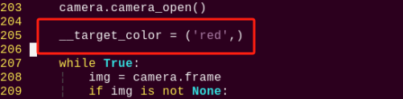

:::{Note}
press “Shift+G” after inputting the line number to directly jump to the corresponding line. This section aims to introduce the quick jump method, therefore, the code location numbers are for reference only. Please refer to the actual situation.
:::

(4) Press “i” key to enter the editing mode. And modify “red” in “__target_color = ('red',)” as “white”. Or you can modify it as black if you want. 

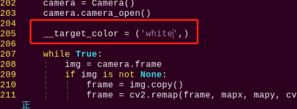

(5) After modification, press “Esc” key and input “:wq” and then press Enter to save and exit.

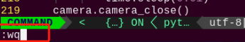

* **Add New Recognition Color** 

In addition to the three built-in tracked colors, you can set other colors in the program. Take blue as example

(1) Open VNC, input command “vim spiderpi/config/lab_config.yaml” to open Lab color setting document.

```commandline
Vim spiderpi/config/lab_config.yaml
```

:::{Note}

It is recommended to screenshot the initial value for recording.

:::

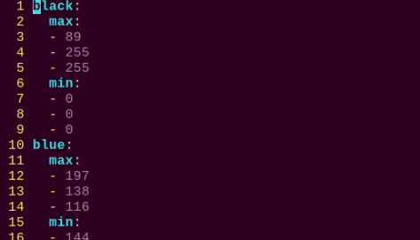

(2) Double click the icon of debugging tool 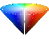in the system desktop. If the prompt box pops up, choose “Execute”.

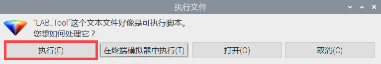

(3) Click “Connect” button. When the interface displays the camera returned image, the connection is successful. Select "red" in the drop-down box.

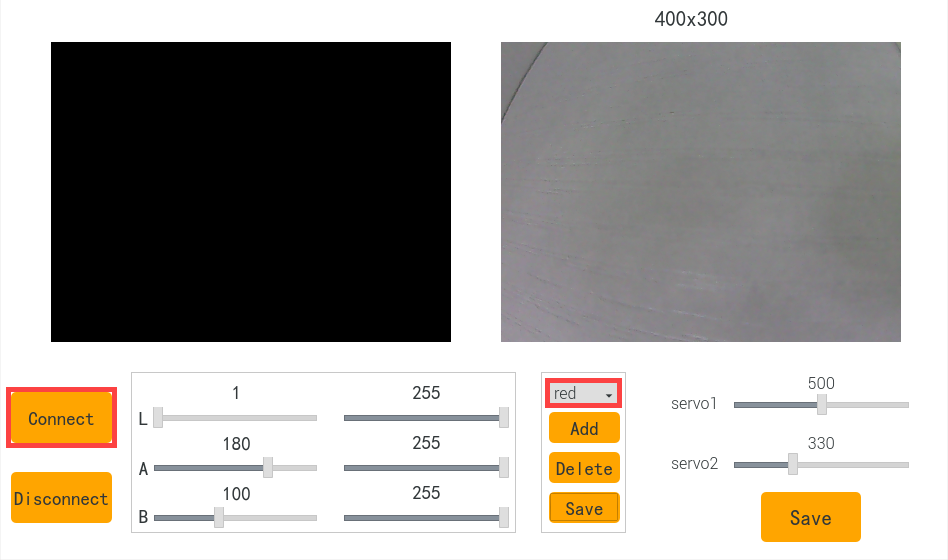

(4) Face the camera to the color to recognize. Drag the sliders of L, A, and B until the target color area in the left screen becomes white and other areas become black.

For example, if you want to modify the default color as blue, you can put the blue line within camera’s vision. Adjust the corresponding sliders of L, A, and B until the blue part in the left screen turns white and other colors become black, and then click “Save” button to keep the modified data.

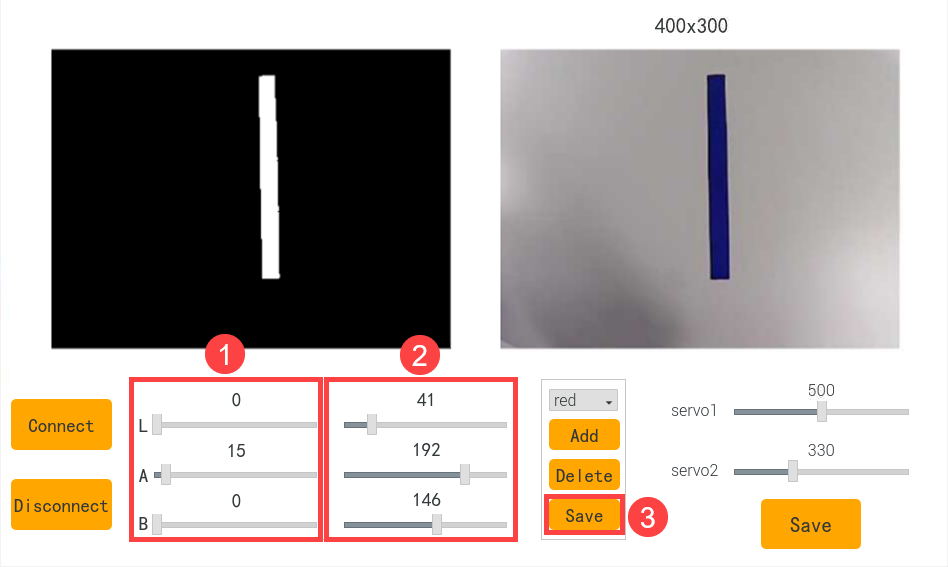

:::{Note}

In order to avoid the influence on game performance, it’s recommended to use the “LAB_Tool” tool to modify the value back to the initial value after the modification.

:::

(5) After the modification is completed, check whether the modified data was successfully written in. Enter the command again “vim spiderpi/config/lab_config.yaml” to open file of Lab color setting.

```commandline
Vim spiderpi/config/lab_config.yaml
```

(6) The modified data is written successfully into the configuration program. Then you can press “Esc” and input “:wq” and then press Enter to save and exit.

```commandline
:wq
```

(7) According to the steps in “[6.5.5 Function Extension -> Modify Default Recognition Color]()”, set the default recognition color as red.


(8) Start the line following game again according to the steps in “[6.5.2 Operation Steps]()”. Then SpiderPi Pro will move along the blue line.


## 6.6 Tag Detection

### 6.6.1 Brief Game Description

When the robot detects a tag, the buzzer emits a sound, and the feedback image is returned.

AprilTag, a visual fiducial marker, is similar to a QR code or barcode. It can be used to quickly detect markers and calculate relative positions, meeting real-time requirements. It is widely used in various applications such as augmented reality (AR), robotics, and camera calibration. Currently, AprilTags can be printed using a standard printer, and their detection programs can calculate precise 3D position, orientation, and ID relative to the camera.

In this lesson, we will combine OpenCV with AprilTag to complete a small project for detecting AprilTag markers. When the camera detects the tag, the robot's onboard buzzer will sound as a prompt, and the feedback image will be displayed.

### 6.6.2 Start and Close the Game

:::{Note}
The input of commands must strictly distinguish between uppercase and lowercase letters, as well as spaces.
:::

(1) Power on the device and, following the instructions in "[Remote Desktop Installation and Connection\3.1 VNC Installation and Connection]()", use the VNC remote connection tool to connect.


(2) Click the iconin the top left corner of the system desktop or press the shortcut "Ctrl+Alt+T" to open the LX terminal.

(3) In the terminal, enter the command to navigate to the directory where the program is located, then press Enter:

```commandline
cd spiderpi/functions
```

(4) Enter the command and press Enter to start the program:

```commandline
python3 apriltag_recognition.py
```

(5) To close the program, simply press "Ctrl+C" in the LX terminal. If it does not close, press it multiple times.

### 6.6.3 Program Outcome

:::{Note}
For optimal tag detection, place the tag against a solid-colored or white background. Dark backgrounds (e.g., black) may interfere with tag recognition.
:::

Once the game is activated, position the included AprilTag tag in front of the camera. When the robot detects the tag, the buzzer will sound as a prompt. The feedback image will display the captured tag, outline it, and show the tag's tag_id and tag_family information.

### 6.6.4 Program Parameter Explanation

The source code for this program is located at：[/home/pi/spiderpi/functions/apriltag_recognition.py]()

**(1) Image Acquisition and Processing**

The first step is image processing, which involves working with digital image data. We begin by importing the necessary packages.

{lineno-start=4}

```
import sys
import time
import cv2
import numpy as np
from common import yaml_handle
from calibration.camera import Camera 
import common.apriltag as apriltag
from common.ros_robot_controller_sdk import Board
from sensor.ultrasonic_sensor import Ultrasonic
```

Next, we initialize and start the camera to acquire the image, then proceed to copy, remap, and display the image.

{lineno-start=95}

```
    while True:
        img = camera.frame
        if img is not None:
            frame = img.copy()
            Frame = run(frame)          
            cv2.imshow('Frame', Frame)
```

Afterward, we need to convert the image from RGB format to grayscale. The corresponding code is as follows:

{lineno-start=54}

```
    gray = cv2.cvtColor(img, cv2.COLOR_BGR2GRAY)
```

**(2) Tag Detection**

Once the image has been processed, we need to detect the tag. This is done by using the `tag` library to detect the tag in the acquired image. The code implementation is as follows:

{lineno-start=51}

```
# 检测apriltag(detect apriltag)
detector = apriltag.Detector(searchpath=apriltag._get_demo_searchpath())
```

After detection, the program will obtain the four corner points of the tag.

{lineno-start=59}

```
            corners = np.rint(detection.corners)  # 获取四个角点(obtain the four corner points)
```

Next, we need to draw the contours of the tag. In OpenCV, we use the `cv2.drawContours` function to accomplish this. The program code is as follows:

{lineno-start=62}

```
            cv2.drawContours(img, [np.array(corners, np.intp)], -1, (0, 255, 255), 2)
```

This function takes five parameters, each with the following meanings:

`img`: The image to be processed.

`[np.array(corners, np.int)]`: The contour points.

`-1`: The contour index. -1 indicates that all contours should be drawn.

`(0, 255, 255)`: The color of the contour.

`2`: The thickness of the contour line.

**(3) Retrieving Tag Information**

The program uses the AprilTag library to perform encoding and decoding to retrieve the tag’s information. Depending on the encoding method, different inner point coordinates are generated.

Once the quadrilateral is identified, the grid coordinates are clarified. To verify the reliability of the encoding, the tag must be matched against a known encoding library.

{lineno-start=62}

```
            tag_family = str(detection.tag_family, encoding='utf-8')  # 获取tag_family(obtain tag_family)
            tag_id = int(detection.tag_id)  # 获取tag_id(obtain tag_id)
            
            return tag_family, tag_id
```


## 6.7 Tag Recognition

### 6.7.1 Program Logic

AprilTag is a visual positioning marker, which is similar to QR code or bar code. It can quickly detect the marker and calculate the position. It’s mainly applied to AR, robot and camera calibration, etc.

First, detect AprilTag through positioning, image segmentation, and contour searching. Obtain the angular point information after the contour is positioned. Connect the four corner points with a straight line to form a closed loop. 

Encode and decode the detected tags. Finally, control SpiderPi Pro to execute the corresponding action according to different Tag IDs.

<p id="anchor_7_2"></p>

### 6.7.2 Operation Steps

:::{Note}
The input command should be case sensitive and space sensitive.
:::

(1) Boot up SpiderPi Pro, then remotely connect to Raspberry Pi desktop through VNC. 

(2) Click at upper left corner of desktop, or press “Ctrl+Alt+T” to open LX terminal.


(3) Enter the command “cd spiderpi/functions” and press “Enter” to navigate to the directory where the game program is located.

```commandline
cd spiderpi/functions
```

(4) Enter “python3 apriltag_detect.py”, then press “Enter” to start the game.

```commandline
python3 apriltag_detect.py
```

(5) If you want to exit the game programming, press “Ctrl+C” in the LX terminal interface. If the exit fails, please try it a few more times.

### 6.7.3 Project Outcome

:::{Note}

* Please run this game on a solid color or a white background. Dark background such as black will affect the tag recognition performance.

* Please keep the tag intact, because dirt and wrinkle will affect recognition.

:::

When recognizing the corresponding tag, the robot will execute the corresponding action. Besides, the tag will be marked with yellow box and the Tag ID and category will be printed on the camera returned image.

The corresponding actions of different Tag ID are listed below.

| **Tag ID** | **Action** |
| ---------- | ---------- |
| 1          | wave hands |
| 2          | mark time  |
| 3          | twist      |

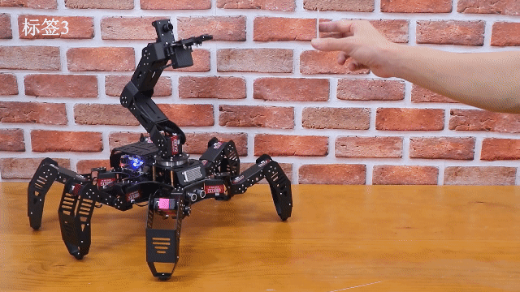

### 6.7.4 Program Analysis

The source code of the program is located in: [/home/pi/spiderpi/functions/apriltag_detect.py]()

* **Import Function Library** 

{lineno-start=4}

```
import sys
import math
import threading
import time
import cv2
import numpy as np
from common import yaml_handle
from calibration.camera import Camera 
from calibration.CalibrationConfig import *
from common import kinematics
import common.apriltag as apriltag
```

(1) Import the libraries related to OpenCV, time, math, and threads. If want to call a function in library, you can use “library name+function name (parameter, parameter)”. For example:

{lineno-start=199}

```
            time.sleep(0.01)
```

Call `sleep` function in `time` library. The function `sleep ()` is used to delay. There are some built-in libraries in Python, so they can be called directly. For example, `time`, `cv2` and `math`. You can also write a new library like `yaml_handle`.

(2) Instantiate Function Library

The name of function library is too long to memorize. For calling function easily, the library can be instantiated. For example:

{lineno-start=11}

```
from calibration.camera import Camera 
```

After instantiating, you can directly input and call the function `Board.function name (parameter, parameter)`.

* **Main Function Analysis** 

The python program `__name__ == ’__main__:’` is the main function of program. Firstly, the function `init()` is called to initialize. The initialization in this program includes: return the servo to the initial position, read the color threshold file. Generally there are also configurations for ports, peripherals, timing interrupts, etc., which are all done in the process of initialization.

{lineno-start=159}

```
if __name__ == '__main__':
    from common.ros_robot_controller_sdk import Board
    from sensor.ultrasonic_sensor import Ultrasonic
    from common.action_group_controller import ActionGroupController
    import arm_ik.arm_move_ik as AMK


    board = Board()
    ik = kinematics.IK(board)  # 实例化逆运动学库(instantiate inverse kinematics library)
    ultrasonic = Ultrasonic()
    agc = ActionGroupController(board)
    ak = AMK.ArmIK()
```

* **Obtain Corner Point Information** 

Use `np.rint()` to obtain the four corner points of the tag. 

{lineno-start=116}

```
# 检测apriltag(detect apriltag)
detector = apriltag.Detector(searchpath=apriltag._get_demo_searchpath())
def apriltagDetect(img):   
    gray = cv2.cvtColor(img, cv2.COLOR_BGR2GRAY)
    detections = detector.detect(gray, return_image=False)

    if len(detections) != 0:
        for detection in detections:                       
            corners = np.rint(detection.corners)  # 获取四个角点(obtain the four corner points)
            cv2.drawContours(img, [np.array(corners, np.int64)], -1, (0, 255, 255), 2)

            tag_family = str(detection.tag_family, encoding='utf-8')  # 获取tag_family(obtain tag_family)
            tag_id = int(detection.tag_id)  # 获取tag_id(obtain tag_id)

            object_center_x, object_center_y = int(detection.center[0]), int(detection.center[1])  # 中心点(center point)
            
            object_angle = int(math.degrees(math.atan2(corners[0][1] - corners[1][1], corners[0][0] - corners[1][0])))  # 计算旋转角(calculate rotation angle)
            
            return tag_family, tag_id
```

* **Tag Detection** 

(1)  After the angular points of the tag are obtained, mark the Tag through calling `drawContours()` function in cv2 library.

{lineno-start=125}

```
            cv2.drawContours(img, [np.array(corners, np.int64)], -1, (0, 255, 255), 2)
```

The meaning of the parameters in bracket is as follow.

The first parameter `img` is the input image

The second parameter `[np.array(corners, np.int)]` is the contour itself and list in Python.

The third parameter `-1` is the index of the contour. The value here represents all the contours in list will be drawn.

The fourth parameter `(0, 255, 255)` is the color of the contour. The values respectively corresponds to B, G, R, and the color is yellow here.

The fifth parameter `2` is the width of the contour.

(2)  Obtain the type of the tag (tag_family) and ID (tag_id)

{lineno-start=127}

```
            tag_family = str(detection.tag_family, encoding='utf-8')  # 获取tag_family(obtain tag_family)
            tag_id = int(detection.tag_id)  # 获取tag_id(obtain tag_id)
```

(3) Through calling `putText()` function in cv2 library, print the ID and category of the tag on the camera returned image.

{lineno-start=150}

```
    if tag_id is not None:
        cv2.putText(img, "tag_id: " + str(tag_id), (10, img.shape[0] - 30), cv2.FONT_HERSHEY_SIMPLEX, 0.65, [0, 255, 255], 2)
        cv2.putText(img, "tag_family: " + tag_family, (10, img.shape[0] - 10), cv2.FONT_HERSHEY_SIMPLEX, 0.65, [0, 255, 255], 2)
    else:
        cv2.putText(img, "tag_id: None", (10, img.shape[0] - 30), cv2.FONT_HERSHEY_SIMPLEX, 0.65, [0, 255, 255], 2)
        cv2.putText(img, "tag_family: None", (10, img.shape[0] - 10), cv2.FONT_HERSHEY_SIMPLEX, 0.65, [0, 255, 255], 2)
```

The meaning of the parameters in bracket is as follow.

The first parameter `img` is the input image.

The second parameter `"tag_id: " + str(tag_id)` is the displayed content.

The third parameter `(10, img.shape[0] - 30)` is the displayed position.

The fourth parameter `cv2.FONT_HERSHEY_SIMPLEX` is the font type.

The fifth parameter `0.65` is the font size.

The sixth parameter `[0, 255, 255]` is the color of the font, and the values respectively corresponds to B, G, R. The color here is yellow.

The seventh parameter  `2` is the font weight.

* **Action Controlling** 

After the tag ID is obtained, control SpiderPi Pro to execute the corresponding action group through calling `agc.run_action()` function. 

{lineno-start=82}

```
    while True:
        if debug:
            return
        if __isRunning:
            if tag_id is not None:
                action_finish = False
                time.sleep(0.5)
                if tag_id == 1:               
                    agc.run_action_group('wave',lock_servos=LOCK_SERVOS)#招手(wave)
                    tag_id = None
                    time.sleep(1)                  
                    action_finish = True                
                elif tag_id == 2:                    
                    agc.run_action_group('stepping',lock_servos=LOCK_SERVOS)#原地踏步(stepping)
                    tag_id = None
                    time.sleep(1)
                    action_finish = True          
                elif tag_id == 3:                   
                    agc.run_action_group('twist_l',lock_servos=LOCK_SERVOS)#扭腰(twist)
                    tag_id = None
                    time.sleep(1)
                    action_finish = True
                else:
                    action_finish = True
                    time.sleep(0.01)
            else:
               time.sleep(0.01)
        else:
            time.sleep(0.01)
```
### 6.7.5 Function Extension

<span id="anchor_7_4_1" class="anchor"></span>

* **Modify Action Corresponding to the Tag** 

SpiderPi Pro is default to “wave hands” in the program when the ID 1 tag is detected, but you can modify the default program. For example, we can revise the feedback action as kicking. 

(1) Enter command “cd spiderpi/functions” and press “Enter” to navigate to the directory where the game program is located.

```commandline
cd spiderpi/functions
```

(2) Enter command “vim apriltag_detect.py” and press Enter to open the program file.

```commandline
vim apriltag_detect.py
```

(3) Locate the code shown below:

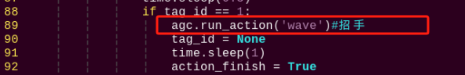

:::{Note}
 press “Shift+G” after inputting the line number to directly jump to the corresponding line. This section aims to introduce the quick jump method, therefore, the code location numbers are for reference only. Please refer to the actual situation.
:::

(4) Press “i” key to enter the editing mode.

Modify “wave” of `agc.run_action(“wave”)` as “kick”. If you want to change it to other action group, you can enter the other action group name which can be checked in “/home/pi/spiderpi/aiction_groups”.

```
kick
```

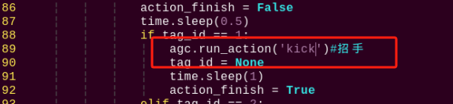

(5) After modification, press “Esc” and input “:wq” and then press Enter to save and exit.

```commandline
:wq
```

* **Modify/ Add the Tag**  

You can find the Tag materials in this directory “AprilTag collection”, but you need to extract this folder first.

:::{Note}

* There is no need to download materials online. 200 tags are provided and you can find them in "ApirlTag Collection". 
* You can print the tag in suitable size, not too large or too small, as long as the tag can be recognized by the robot. The tag will be circled in yellow when it is recognized.
* The recognition background should be white. Dark background will influence the recognition effect.

:::

Take adding Tag ID4 for example. The corresponding action of this tag is “Stand at Attention in High Posture”. Please follow the below steps to modify.

(1) According to  “ [6.7.5 Function Extension -> Modify Action Corresponding to the Tag]() ”, enter the catalog of the game program and open the corresponding program file.

(2) Locate the code in 98th line, input “5yy”, and then copy the codes of 98-102 line. 

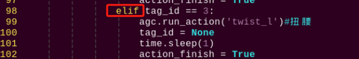

(3) When the hint of “5 lines yanked” appears, it means that the codes are copied successfully. 

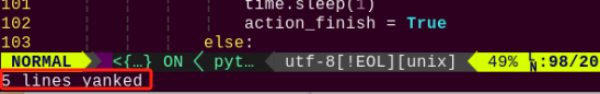

(4) Then move to the codes shown in the red frame and enter “p” to paste the codes copied before.

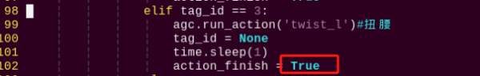

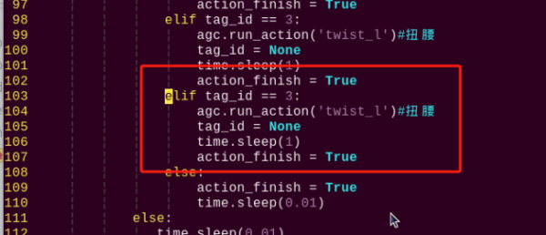

(5) Press “i” key to enter the editing mode, and modify “3” of “elif tag_id == 3:” as “4”, and “twist_l” of “agc.run_action('twist_l')” as “stand_high”. And modify the comment after the codes as “stand at attention in high posture”. If you want to change it to other action groups, you can enter other action group name which can be checked in “/home/pi/spiderpi/action_groups”.

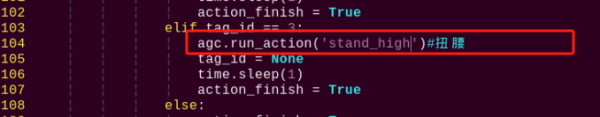

(6) After modification, press “Esc” key, enter “:wq”, and then press “Enter” to save and exit.

```commandline
:wq
```

(7) Find Tag ID4 in folder “AprilTag Collection” and print it directly.

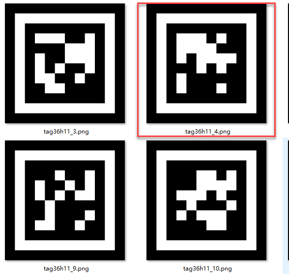

(8) According to “[6.7.2 Operation Steps]()” to start the game and check whether the modification works.

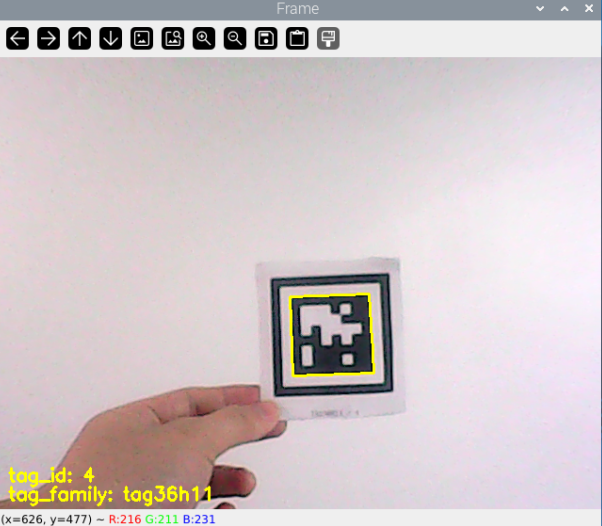

## 6.8 Face Recognition

### 6.8.1 Brief Description of the Activity

When no face is detected, the robotic arm rotates left and right to scan the area. Once a face is detected, the claw moves up and down as a greeting.  

Face recognition is one of the most widely used applications in artificial intelligence, particularly in image recognition. Among these applications, face recognition is the most popular, often used in scenarios like smart locks and facial unlocking on mobile phones.  

In this activity, we first train the face recognition model. The system then detects faces by scaling the image. After detection, the coordinates of the recognized face are converted back to the original scale, and the largest face is identified. The recognized face is then outlined with a frame.  

Next, the pan-tilt servos are set to rotate left and right to locate the face. Finally, the robot executes the feedback action based on the recognition results.

### 6.8.2 Start and Close the Game

:::{Note}
The input of commands must strictly distinguish between uppercase and lowercase letters.
:::

(1) Power on the device and, following the instructions in  "[Remote Desktop Installation and Connection\3.1 VNC Installation and Connection]()", use the VNC remote connection tool to connect.


(2) Click the iconin the top left corner of the system desktop or press the shortcut "Ctrl+Alt+T" to open the LX terminal.

(3) In the terminal, enter the command to navigate to the directory where the program is located, then press Enter:

```commandline
cd spiderpi/functions
```

(4) Enter the command and press Enter to start the program:

```commandline
python3 face_recongition.py
```

(5) To close the program, simply press "Ctrl+C" in the LX terminal. If it does not close, press it multiple times.

### 6.8.3 Program Outcome

:::{Note}
For optimal performance, please avoid using this activity under strong lighting conditions, such as direct sunlight or close proximity to incandescent lights, as intense light can affect face recognition accuracy. It is recommended to conduct this activity indoors, with the face positioned within a range of 50 cm to 1 meter from the camera.
:::

Once the activity begins, the camera's pan-tilt will rotate left and right. If no face is detected, the robotic arm will scan by rotating left and right. Upon detecting a face, the claw will move up and down to greet the user.

### 6.8.4 Program Brief Analysis 

The source code of the program is saved in：[/home/pi/spiderpi/functions/face_recongition.py]()

* **Function Logic** 

**(1) Importing Libraries**

At this initialization step, necessary libraries are imported to facilitate future function calls within the program.

{lineno-start=4}

```py
import sys
import cv2
import time
import sys
import threading
import mediapipe as mp
from common import yaml_handle
from calibration.camera import Camera 
from common.action_group_controller import ActionGroupController
from common.ros_robot_controller_sdk import Board
from calibration.camera import Camera 
from common import kinematics
```

**(2) Setting Initial State**

{lineno-start=19}

```py
debug = False
iHWSONAR = None
board = None
if sys.version_info.major == 2:
    print('Please run this program with python3!')
    sys.exit(0)
 
# 导入人脸识别模块(import facial recognition module)
Face = mp.solutions.face_detection
# 自定义人脸识别方法，最小的人脸检测置信度0.5(Customize face recognition method, and the minimum face detection confidence is 0.5)
faceDetection = Face.FaceDetection(min_detection_confidence=0.8)

lab_data = None
servo_data = None
```

**(3) Color Space Conversion**

The BGR image is converted to an RGB image.

{lineno-start=79}

```py
 imgRGB = cv2.cvtColor(img_copy, cv2.COLOR_BGR2RGB) # 将BGR图像转为RGB图像(convert BGR image to RGB image)
```

**(4) Using Mediapipe Face Model for Recognition.**

The system performs face detection and draws a rectangle around the detected face. Then, the position of the face is compared to the center of the image. If the face is centered, `start_greet` is set to `True` to trigger the action group.

{lineno-start=81}

```py
if results.detections:  # 如果检测不到人脸那就返回None(If the face is not detected, return None)

        for index, detection in enumerate(results.detections):  # 返回人脸索引index(第几张脸)，和关键点的坐标信息(Return the face index (which face) and the coordinate information of the keypoints)
            scores = list(detection.score)
            if scores and scores[0] > 0.75:
                
                bboxC = detection.location_data.relative_bounding_box  # 设置一个边界框，接收所有的框的xywh及关键点信息(Set a bounding box to receive xywh and keypoint information for all boxes)
                
                # 将边界框的坐标点,宽,高从比例坐标转换成像素坐标(Convert the coordinates' width and height of the bounding box from proportional coordinates to pixel coordinates)
                bbox = (
                    int(bboxC.xmin * img_w),
                    int(bboxC.ymin * img_h),
                    int(bboxC.width * img_w),
                    int(bboxC.height * img_h)
                )
                cv2.rectangle(img, bbox, (0, 255, 0), 2)  # 在每一帧图像上绘制矩形框(draw a rectangle on each frame of the image)
                
                # 获取识别框的信息, xy为左上角坐标点(Get information about the recognition box, where xy is the coordinates of the upper left corner)
                x, y, w, h = bbox
                center_x = int(x + (w / 2))
                center_y = int(y + (h / 2))
                area = int(w * h)
                if not start_greet: 
                    board.set_buzzer(2400, 0.1, 0.2, 1)
                    start_greet = True 
                    
            else :
                start_greet = False
                
```

**(5) Face Recognition**

If a face is detected, the `Board.setPWMServoPulse` function is used to control the servo motor by setting the PWM (Pulse Width Modulation) to perform the waving action.  

The first parameter `0.05` is the pulse interval or duration.  

The second parameter `3` refers to the pin number connected to the servo.  

The third parameter `500` represents the pulse width, which typically corresponds to the servo's position.

{lineno-start=130}

```py
    while True:
        img = camera.frame
        if img is not None:
            frame = img.copy()
            Frame = run(frame)           
            cv2.imshow('Frame', Frame)
            key = cv2.waitKey(1)
            if key == 27:
                break
        else:
            time.sleep(0.01)
```

**(6) Display the Transmitted Image**

Call the resize() function in the cv2 library to scale the image and display it in real time on the transmitted Image.

{lineno-start=133}

        frame = img.copy()
        Frame = run(frame)           
        cv2.imshow('Frame', Frame)
        key = cv2.waitKey(1)
        if key == 27:
            break

when a face is detected, the buzzer makes a sound.

{lineno-start=104}

                    board.set_buzzer(2400, 0.1, 0.2, 1)

## 6.9 Face Detection

### 6.9.1 Program logic 

In image recognition, face recognition technology is very popular and is often used in scenarios such as door locks and facial recognition for unlocking mobile phones.

To realize face detection, the first step is to zoom in or out the image.

Next, convert the coordinate of the recognized human face into the coordinate before scaling, and mark the target human face with the box. 

Lastly, control SpiderPi Pro to execute the corresponding action. When human face is not recognized, control the robotic arm to rotate around to search human face. 

### 6.9.2 Operation steps

:::{Note}
The input command should be case sensitive and space sensitive.
:::

(1) Boot up SpiderPi Pro, then remotely connect to Raspberry Pi desktop through VNC. 

(2) Click  at upper left corner of desktop, or press “Ctrl+Alt+T” to open LX terminal.

(3) Enter the command “cd spiderpi/functions” and press “Enter” to navigate to the directory where the game program is located.

```commandline
cd spiderpi/functions
```

(4) Enter “python3 face_detect.py”, then press “Enter” to start the game.

```commandline
python3 face_detect.py
```

(5) If you want to exit the game programming, press “Ctrl+C” in the LX terminal interface. If the exit fails, please try it a few more times.

### 6.9.3 Project outcome

:::{Note}
As the strong light will influence the effect of face detection, please do not play this game under strong light, such as sunlight, incandescent light. It is recommended to start this game in the indoor and the distance between human face and the camera is within 1m.
:::

After the game starts, the camera will raise to the specific angle and then rotate around to search human face. When recognizing human face, the robotic arm will stop rotating and SpiderPi Pro will “wave”.

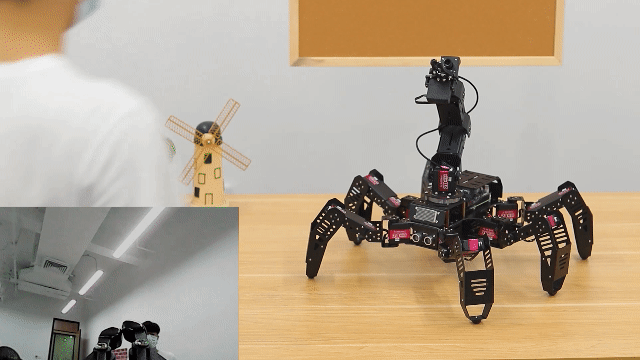


### 6.9.4 Program Analysis

The source code of this program is located in: [/home/pi/spiderpi/functions/face_detect.py]()

* **Import Function Library** 

{lineno-start=4}

```
import sys
import cv2
import time
import sys
import threading
import mediapipe as mp
from common import yaml_handle
from calibration.camera import Camera 
from common.action_group_controller import ActionGroupController
from common.ros_robot_controller_sdk import Board
from calibration.camera import Camera 
from common import kinematics
```

* **Define Global Variable** 

{lineno-start=20}

```
debug = False
iHWSONAR = None
board = None
if sys.version_info.major == 2:
    print('Please run this program with python3!')
    sys.exit(0)
 
# 导入人脸识别模块(import facial recognition module)
Face = mp.solutions.face_detection
# 自定义人脸识别方法，最小的人脸检测置信度0.5(Customize face recognition method, and the minimum face detection confidence is 0.5)
faceDetection = Face.FaceDetection(min_detection_confidence=0.8)

lab_data = None
servo_data = None
def load_config():
    global lab_data, servo_data
    
    lab_data = yaml_handle.get_yaml_data(yaml_handle.lab_file_path)
    servo_data = yaml_handle.get_yaml_data(yaml_handle.servo_file_path)

load_config()
```

* **Image Processing** 

**(1) Convert color space**

Convert the BGR image to LAB image.

{lineno-start=134}

```
    imgRGB = cv2.cvtColor(img_copy, cv2.COLOR_BGR2RGB) # 将BGR图像转为RGB图像(convert BGR image to RGB image)
```

The `cvtColor()` function is used to convert an image from one color space to another. In the example code `gray = cv2.cvtColor(frame_resize, cv2.COLOR_BGR2GRAY)` , the meanings in the parenthesis are as follow:
The first parameter `frame_resize` is the input image. 
The second parameter `cv2.COLOR_BGR2GRAY` is the type of conversion, which in this case is a conversion from BGR to grayscale.

**(2) Call face detector**

After completing the image processing steps mentioned above, the image is passed to a face detector for further processing.

{lineno-start=135}

```
    results = faceDetection.process(imgRGB) # 将每一帧图像传给人脸识别模块(transmit the image of each frame to facial recognition module)
    if results.detections:  # 如果检测不到人脸那就返回None(If the face is not detected, return None)

        for index, detection in enumerate(results.detections):  # 返回人脸索引index(第几张脸)，和关键点的坐标信息(Return the face index (which face) and the coordinate information of the keypoints)
            scores = list(detection.score)
            if scores and scores[0] > 0.75:
```

**(3) Display transmitted image**

Call `resize()` function in cv2 library to scale the shape, and display it in the live camera feed.

{lineno-start=182}

```
    while True:
        img = camera.frame
        if img is not None:
            frame = img.copy()
            Frame = run(frame)           
            cv2.imshow('Frame', Frame)
            key = cv2.waitKey(1)
            if key == 27:
                break
```

* **Action Controlling** 

When human face is recognized, call the `agc.run_action()`function to control SpiderPi Pro to execute the designated action group. 

{lineno-start=102}

```
                AGC.run_action('wave') # 识别到人脸时执行的动作(If the face is detected, execute the action)
```

When human face is not detected, call “board.bus_servo_set_position()” to control the robotic arm of SpiderPi Pro to rotate around.  

{lineno-start=111}

```
                board.pwm_servo_set_position(0.05, [[2, servo2_pulse]])
                time.sleep(0.05)
```

* **Main Function Analysis** 

(1) Call `init()` function to initialize SpiderPi Pro.

{lineno-start=42}

```
# 初始位置(initial position)
def initMove():
    ultrasonic.setRGBMode(0)
    ultrasonic.setRGB(1, (0, 0, 0))
    ultrasonic.setRGB(2, (0, 0, 0)) 

    board.pwm_servo_set_position(0.5, [[1, 1800] , [2, servo_data['servo2']]])
```

(2) Call  `reset()` function to reset variable parameters such as servo.

{lineno-start=57}

```
# 变量重置(reset variables)
def reset():
    global d_pulse
    global start_greet
    global x_pulse    
    global action_finish

 
    start_greet = False
    action_finish = True
    x_pulse = 500 
    init_move()  
```

(3) Call  `start()` function to start face tracking game.

{lineno-start=77}

```
def start():
    global __isRunning
    __isRunning = True
    print("FaceDetect Start")
```

(4) Instantiate the camera library and call  `camera_open()` function to enable camera’s distortion correction.

{lineno-start=180}

```
    camera = Camera()
    camera.camera_open(correction=True)
```

* **Subthread Analysis** 

Run a sub-thread that calls the `move()` function to control the movement of pan-tilt servo.

{lineno-start=116}

```
# 运行子线程(run sub-thread)
th = threading.Thread(target=move)
```

In the  `move()` function, adjust the rotation of the pan-tilt servo by sliding the window.

{lineno-start=92}

```
def move():
    global start_greet
    global action_finish
    global d_pulse, servo2_pulse    
    
    while True:
        if __isRunning:
            if start_greet:
                start_greet = False
                action_finish = False
                AGC.run_action('wave') # 识别到人脸时执行的动作(If the face is detected, execute the action)

                action_finish = True
                time.sleep(0.5)
            else:
                if servo2_pulse > 2000 or servo2_pulse < 1000:
                    d_pulse = -d_pulse
            
                servo2_pulse += d_pulse       
                board.pwm_servo_set_position(0.05, [[2, servo2_pulse]])
                time.sleep(0.05)
        else:
            time.sleep(0.01)
```

The meanings of the parameters in the parentheses of the code `board.bus_servo_set_position(0.05, [[21,x_pulse]])` are as follows:

The first parameter `0.05` is the runtime of the servo in the unit of m.

The second parameter `21` is the servo number, which is servo 21.

The third parameter `x_pulse` is pulse width of the servo ranging from 1000 to 1900.
### 6.9.5 Function extension

:::{Note}

The built-in action group file can be found in this catalog “/home/pi/SpiderPi/action_groups”.

:::

When human face is recognized, SpiderPi Pro will “wave hands” by default. But we can modify the program to let SpiderPi Pro react differently, such as “twist body”. Please follow the below steps to modify.

(1) Enter the command “cd spiderpi/functions/” and press “Enter” to come to the catalog where the game programs are stored.

```commandline
cd spiderpi/functions
```

(2) Enter command “vim face_detect.py” and press “Enter” to open the program file.

```commandline
vim face_detect.py
```

(3) Locate the code shown below:

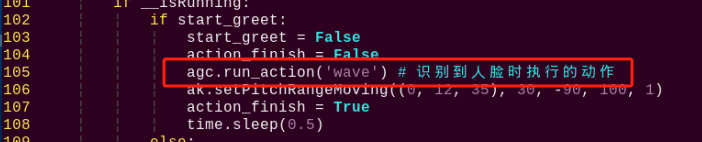

:::{Note}
 press “Shift+G” after inputting the line number to directly jump to the corresponding line. This section aims to introduce the quick jump method, therefore, the code location numbers are for reference only. Please refer to the actual situation.
:::

(4) Press “i” key to enter the editing mode.

(5) Modify “wave” in `agc.run_action(“wave”)` as “twist”. If you want to change it to other action groups, please move to the catalog “/home/pi/spiderpi/ action_groups” to check other action group names.

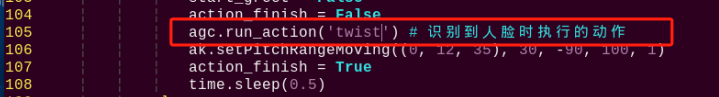

After modification, press “Esc” key and enter “:wq” and then press Enter to save and exit. 

```commandline
:wq
```

## 6.10 Auto Obstacle Avoidance

### 6.10.1 Program Logic

Ultrasonic sensor can measure the distance between SpiderPi Pro and the object ahead. After the data is obtained from the ultrasonic sensor, process and judge the data. When it’s shorter than the set distance threshold, SpiderPi Pro will turn to avoid the front obstacle. Otherwise, the robot will move forward.

### 6.10.2 Operation Steps

:::{Note}
The input command should be case sensitive and space sensitive.
:::

(1) Boot up SpiderPi Pro, then remotely connect to Raspberry Pi desktop through VNC. 

(2) Click  at upper left corner of desktop, or press “Ctrl+Alt+T” to open LX terminal.

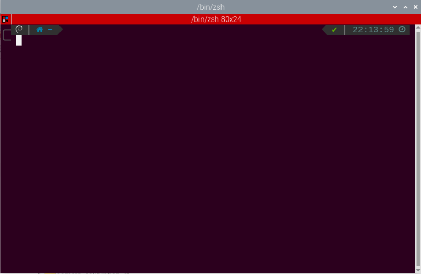

(3) Enter the command  `cd spiderpi/functions` and press “Enter” to navigate to the directory where the game program is located.

```commandline
cd spiderpi/functions
```

(4) Enter “python3 avoidance.py”, then press “Enter” to start the game.

```commandline
python3 avoidance.py
```

(5) If you want to exit the game program, press “Ctrl+C” in the LX terminal interface. If the exit fails, please try a few more times.

### 6.10.3 Project Outcome

:::{Note}
The default distance threshold is 40cm. If you want to modify it as other value, you can refer to “[6.10.5 Function Extension -> Modify Default Distance Threshold]()”.
:::

After the game starts, the measured distance will be displayed on the camera returned image. When the distance between SpiderPi Pro and the obstacle is shorter than 25cm, the robot will step back and then turn left. When longer than 25cm and shorter than 40cm, the robot will turn left. When the distance is longer than 40cm, the robot will move forward. 

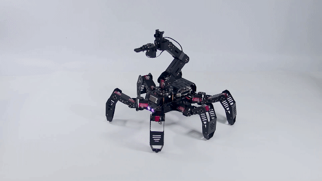

### 6.10.4 Program Analysis

The source code of this program is located in ：[/home/pi/spiderpi/functions/avoidance.py]()

* **Import Function Library** 

{lineno-start=4}

```
import os
import sys
import cv2
import time
import threading
import numpy as np
import pandas as pd
from common import yaml_handle
from common import kinematics
from calibration.camera import Camera 
from calibration.CalibrationConfig import *
from sensor.ultrasonic_sensor import Ultrasonic
import arm_ik.arm_move_ik as AMK
```

* **Define Global Variable** 

{lineno-start=19}

```
if sys.version_info.major == 2:
    print('Please run this program with python3!')
    sys.exit(0)


def load_config():
    global lab_data, servo_data
    
    lab_data = yaml_handle.get_yaml_data(yaml_handle.lab_file_path)

load_config()

Threshold = 40.0 # 默认阈值40cm(default threshold is 40cm)
TextColor = (0, 255, 255)
TextSize = 12

__isRunning = False
distance = 0
```

* **Main Function Analysis** 

(1) Initialize and Instantiate

{lineno-start=117}

```
if __name__ == '__main__':
    from common.ros_robot_controller_sdk import Board


    board = Board()
    ik = kinematics.IK(board)
    ultrasonic = Ultrasonic()
    ak = AMK.ArmIK()
```

① Call `init()` function to initialize SpiderPi Pro.

{lineno-start=135}

```
    init()
    start()
    camera = Camera()
    camera.camera_open()
```

② Call  `reset()` function to reset servo variable.

{lineno-start=38}

```
def reset():
    ak.setPitchRangeMoving((0, 15, 30), 0, -90, 100, 1)
```

③ Instantiate the camera library and call  `camera_open()` function to enable camera’s distortion correction.

{lineno-start=137}

```
    camera = Camera()
    camera.camera_open()
```

* **Distance Ranging** 

**(1) Distance threshold setting**

Set a `Threshold` to determine whether to perform obstacle avoidance. Its unit is cm.

{lineno-start=31}

```
Threshold = 40.0 # 默认阈值40cm(default threshold is 40cm)
```

**(2) Acquire and process the measured distance**

Obtain the distance measured by the ultrasonic sensor through calling `getDistance()` function.

{lineno-start=102}

```
        # 数据处理，过滤异常值(process data and filter abnormal values)
        distance_ = ultrasonic.getDistance() / 10.0
        distance_data.append(distance_)
        data = pd.DataFrame(distance_data)
        data_ = data.copy()
        u = data_.mean()  # 计算均值(calculate mean)
        std = data_.std()  # 计算标准差(calculate standard deviation)

        data_c = data[np.abs(data - u) <= std]
        distance = data_c.mean()[0]
```

Process the obtained data for more accurate distance.

{lineno-start=103}

```
        distance_ = ultrasonic.getDistance() / 10.0
        distance_data.append(distance_)
        data = pd.DataFrame(distance_data)
        data_ = data.copy()
        u = data_.mean()  # 计算均值(calculate mean)
        std = data_.std()  # 计算标准差(calculate standard deviation)

        data_c = data[np.abs(data - u) <= std]
        distance = data_c.mean()[0]
        if len(distance_data) == 5:
            distance_data.remove(distance_data[0])
```

**(3) Feedback information**

Through calling `putText()` function in cv2 library, the measured distance will be printed on the camera returned image.

{lineno-start=115}

```
        cv2.putText(img, "Dist:%.1fcm" % distance, (30, 480 - 30), cv2.FONT_HERSHEY_SIMPLEX, 1.2, TextColor, 2)
```

The meaning of the parameter in bracket is as follow.

The first parameter `img` is the input image.

The second parameter `"Dist:%.1fcm" % distance` is the displayed content

The third parameter `(30, 480 - 30)` is the displayed position.

The fourth parameter `cv2.FONT_HERSHEY_SIMPLEX` is the font type.

The fifth parameter `1.2` is the font size

The sixth parameter `TextColor` is the font color.

The seventh parameter `2` is the font weight.

* **Action Controlling** 

Compare the measured distance with the set threshold. SpiderPi Pro will execute the corresponding action according to the result. 

{lineno-start=78}

```
            if 0 < distance < Threshold:
                while distance < 25: # 小于25cm时后退(back up when the distance is less than 25cm)
                    ik.back(ik.initial_pos, 2, 80, 50, 1)
                for i in range(6): # 左转6次，每次15度，一共90度(Turn left 6 times with 15 degrees each time, a total of 90 degrees)
                    if __isRunning:
                        ik.turn_left(ik.initial_pos, 2, 50, 50, 1)
            else: 
                ik.go_forward(ik.initial_pos, 2, 80, 50, 1)
        else:
            time.sleep(0.01)
```

The corresponding actions of different distance range are listed below. 

| **Distance**           | **Action**                        |
| ---------------------- | --------------------------------- |
| 0cm < distance < 25cm  | move backwards and then turn left |
| 25cm < distance < 40cm | turn left                         |
| 40cm < distance        | move forward                      |

The movement of SpiderPi Pro can be controlled through calling function in kinematics.IK library. Please check the table below to decide which to use.

| **Function**                                | **Usage**                       |
| ------------------------------------------- | ------------------------------- |
| ik.back(ik.initial_pos, 2, 80, 50, 1)       | move backwards 80mm             |
| ik.turn_left(ik.initial_pos, 2, 15, 50, 1)  | turn left 15 degree on the spot |
| ik.go_forward(ik.initial_pos, 2, 80, 50, 1) | move forward 80mm               |

The meaning of the parameter in bracket is as follow.

The first parameter is posture

The second parameter is mode. `2` is Spider mode.

The third parameter is stride. When the robot turns, the unit is mm, and when it turns, the unit is degree.

The fourth parameter is speed in mm/s.

The fifth parameter is the number of execution.  `0`  represents that the action will be executed at loop.
### 10.5 Function Extension 

<span id="anchor_10_4_1" class="anchor"></span>

**10.5.1 Modify Default Distance Threshold**

The default distance threshold is 40cm, and it can set to 30-60. For example, modify it as 50cm. 

(1) Enter the command **“cd spiderpi/functions”** and press **“Enter”** to come to the directory of the game program. 

```commandline
cd spiderpi/functions
```

(2) Input the command **“vim avoidance.py”** and press **“Enter”** to open the program file

```commandline
vim avoidance.py
```

(3) Locate the code shown below:

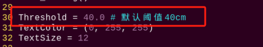

:::{Note}
Press “Shift+G” after inputting the line number to directly jump to the corresponding line. This section aims to introduce the quick jump method, therefore, the code location numbers are for reference only. Please refer to the actual situation.
:::

(4) Press “i” key to enter the editing mode. And modify “40.0” of “Threshold = 40.0” as “50.0”.

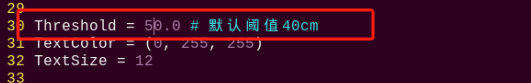

(5) After modification, press “Esc” and enter “:wq” and then press “Enter” to save and exit.

```commandline
:wq
```

## 6.11 Shape Recognition under Single Color

### 6.11.1 Program Logic 

Firstly, program SpiderPi Pro to recognize colors through Lab color space. Convert the RGB color space to Lab, and then perform image binarization, expansion, corrosion and other operations in sequence to obtain an outline only containing the target color. Then, circle the color outline to realize object color recognition.

The next step is to judge the shape of the outline and program SpiderPi Pro to give corresponding response.

### 6.11.2 Operation Steps 

:::{Note}
When entering commands, pay strict attention to case sensitivity and spaces.
:::

(1) Boot up SpiderPi Pro, then remotely connect to Raspberry Pi desktop through VNC. 

(2) Click   at upper left corner of desktop to open the Terminator.


(3) Enter the command to navigate to the directory where the game program is located and press Enter.

```commandline
cd spiderpi/advanced
```

(4) Enter “python3 shape_recognition_plain.py”, and then press “Enter” to start the game.

```commandline
python3 shape_recognition_plain.py
```

(5) f want to quit this game, just press “Ctrl+C”. If the game cannot be quit, please try again.

### 6.11.3 Project Outcome

After the game starts, place the blue object in front of SpiderPi Pro’s camera. When the shape of the object is recognized, the shape name will be printed on the terminal, and the buzzer will beep. When triangle is recognized, the buzzer will beep once. When rectangle is recognized, the buzzer will beep twice. When circle is recognized, the buzzer will beep three times.


### 6.11.4 Program Parameter Description

The source code of this program is located at: [/home/pi/spiderpi/advanced/shape_recognition_plain.py]()

* **Importing Function Libraries** 

{lineno-start=4}

```
import sys
import cv2
import math
import time
import signal
import threading
import numpy as np
from common import yaml_handle
from calibration.camera import Camera
from calibration.CalibrationConfig import *
from common import kinematics
from common.ros_robot_controller_sdk import Board
from common.action_group_controller import ActionGroupController
import arm_ik.arm_move_ik as AMK
from sensor.ultrasonic_sensor import Ultrasonic
import sensor.dot_matrix_sensor as DMS
```

(1)  Import the libraries related to OpenCV, time, math, and threads. If want to call a function in library, you can use “library name+function name (parameter, parameter)”. For example:

{lineno-start=78}

```
            time.sleep(3)
```

Call `sleep` function in “time” library. The function `sleep ()` is used to delay. There are some built-in libraries in Python, so they can be called directly. For example, “time”, “cv2” and “math”. You can also write a new library like “yaml_handle”.

**(2) Instantiating Function Libraries**

The name of function library is too long to memorize. For calling function easily, the library can be instantiated. For example:

{lineno-start=14}

```
from common import kinematics
from common.ros_robot_controller_sdk import Board
from common.action_group_controller import ActionGroupController
```

After instantiating, you can directly input and call the function `Board.function name (parameter, parameter)`.

* **Main Function Analysis** 

The python program `__name__ == ’__main__:’` is the main function of program. Firstly, the function “init()” is called to initialize. The initialization in this program includes: return the servo to the initial position, read the color threshold file. Generally there are also configurations for ports, peripherals, timing interrupts, etc., which are all done in the process of initialization.

{lineno-start=148}

```
if __name__ == '__main__':
    #加载参数(load parameter)
    param_data = np.load(calibration_param_path + '.npz')

    #获取参数(obtain parameter)
    mtx = param_data['mtx_array']
    dist = param_data['dist_array']
    newcameramtx, _ = cv2.getOptimalNewCameraMatrix(mtx, dist, (640, 480), 0, (640, 480))
    mapx, mapy = cv2.initUndistortRectifyMap(mtx, dist, None, newcameramtx, (640, 480), 5)

    load_config()
    init_move()
    
    camera = Camera()
    camera.camera_open()
```

* **Parameters of Color Detection** 

Shape recognition is realized through detecting the color of the object. The detected color is blue.

{lineno-start=123} 

```
    color = 'blue'
```

The main detection parameters involved in the process of detecting the color of the object are as follows:

(1) Before converting the image into LAB space, denoise the image and use GaussianBlur() function for Gaussian filtering. 

{lineno-start=118}

```
    frame_gb = cv2.GaussianBlur(img, (3, 3), 3)
```

The first parameter `img` is the input image.

The second parameter `(3, 3)` is the size of Gaussian kernel. Larger kernel will lead to greater filtering, which results in fuzzier output image and more complex computation. 

The third parameter `3` is the standard deviation of Gaussian function along the X direction. It is used to control the change around the average in Gaussian filtering. When the data increases, the allowable variation range around the average value expands; if it decreases, the allowable variation range around the average value narrow down.

(2) Use inRange function to perform binaryzation on the input image, as the picture shown. 

{lineno-start=124}

```
    frame_mask = cv2.inRange(frame_lab,
                             (lab_data[color]['min'][0],
                              lab_data[color]['min'][1],
                              lab_data[color]['min'][2]),
                             (lab_data[color]['max'][0],
                              lab_data[color]['max'][1],
                              lab_data[color]['max'][2]))
```

(3) To avoid interference and make the image smoother, use cv2.morphologyEx function to process the image. 

{lineno-start=131}

```
    opened = cv2.morphologyEx(frame_mask, cv2.MORPH_OPEN, np.ones((6, 6), np.uint8))
    closed = cv2.morphologyEx(opened, cv2.MORPH_CLOSE, np.ones((6, 6), np.uint8))
```

Take `opened = cv2.morphologyEx(frame_mask, cv2.MORPH_OPEN, np.ones((6,6),np.uint8))` for example.

The first parameter `frame_mask` represents the input image. 

The second parameter represents the way to change. `cv2.MORPH_OPEN` indicates open operation. Perform corrosion first, and then dilation to eliminate the black spots. And `cv2.MORPH_CLOSE` refers to close operation. In close operation, dilation is performed first, and then corrosion to remove bright spots. 

The third parameter `np.ones((6,6),np.uint8)` represents the size of the box.

(4) Find out the maximum contour of the object. 

{lineno-start=54}

```
# 找出面积最大的轮廓(find the contour with the maximum area)
def get_area_maxContour(contours):
    contour_area_temp = 0
    contour_area_max = 0
    area_max_contour = None
    for c in contours:
        contour_area_temp = math.fabs(cv2.contourArea(c))
        if contour_area_temp > contour_area_max:
            contour_area_max = contour_area_temp
            if contour_area_temp > 50:
                area_max_contour = c
    return area_max_contour, contour_area_max
```

To filter out disturbance, set the command, like `if contour_area_temp > 50`, which means that only when the area is more than 50, the maximum contour is effective.

* **Color Recognition Parameters** 

When the robot recognizes a blue object, the cv2.drawContours() function is used to draw the contour of the object.

{lineno-start=136}

```
        cv2.drawContours(img, areaMaxContour, -1, (0, 0, 255), 2)
```

The first parameter `img` is the input image;

The second parameter `areaMaxContour` is the contour itself, which is a list in Python;

The third parameter `-1` is the index of the contour. Here, the value represents drawing all the contours in the contour list;

The fourth parameter `(0, 0, 255)` is the color of the contour. The order is R, G, B, and here it is blue;

The fifth parameter `2` is the width of the contour.

* **Shape Judgment Parameters**

(1) After the object contour is framed, acquire polygon approximate object shape through cv2.approxPolyDP, as shown in the picture.

{lineno-start=138}

```
        approx = cv2.approxPolyDP(areaMaxContour, epsilon, True)
```

The first parameter `areaMaxContour` represents the set of points of the contour.

The second parameter `epsilon` represents the distance between the filtered line segment set and the newly generated line segment set is d. If d is smaller than epsilon, filter out. Otherwise, keep it.

The third parameter `True` represents the closed contour newly generated. `False` represents open contour. 

The below picture will help you better understand.


Process AC segment first. When d, distance between B and AC, is more than epsilon, then keep AB. Then, process BC segment.

:::{Note}
 you can set the value of epsilon. Epsilon of this game program is set to 0.035 times the contour perimeter. The smaller the value, the better the recognition effect.
:::

(2) Obtain the quantity of the sides of polygon approximate object shape, and display it on the terminal. 

{lineno-start=140}

```
        if len(shape_list) == 24:
            shape_length = int(round(np.mean(shape_list)))
            shape_list = []
            #print(shape_length)
    else:
        shape_length = 0
    return img
```

(3) Through obtaining the number of the sides, judge the shape of the object and display it on the terminal. At the same time, control the buzzer to sound different times continuously according to the shape. 

{lineno-start=71}

```
# 主要控制函数(main control function)
def move():
    #global shape_length, board
    while move_st:
        if shape_length == 3:
            print('三角形')
            board.set_buzzer(2400, 0.1, 0.4, 1)  # 以2400Hz的频率，0.1秒开始响，0.4秒停止响，重复1次(The buzzer sounds at a frequency of 2400Hz for 0.1 seconds, followed by a pause of 0.4 seconds, and it repeats this pattern once)
            time.sleep(3)
            
        elif shape_length == 4:
            print('矩形')
            board.set_buzzer(2400, 0.1, 0.4, 2)  # 以2400Hz的频率，0.1秒开始响，0.4秒停止响，重复2次(The buzzer sounds at a frequency of 2400Hz for 0.1 seconds, followed by a pause of 0.4 seconds, and it repeats this pattern twice)
            time.sleep(3)
            
        elif shape_length >= 6:
            print('圆')
            board.set_buzzer(2400, 0.1, 0.4, 3)  # 以2400Hz的频率，0.1秒开始响，0.4秒停止响，重复3次(The buzzer sounds at a frequency of 2400Hz for 0.1 seconds, followed by a pause of 0.4 seconds, and it repeats this pattern three times)
            time.sleep(3)
            
        else:
            time.sleep(1)
```
### 6.11.5 Function Extension

* **Changing the Default Recognition Color** 

The default recognizable color of this game is blue. Here, taking **changing the default recognition color to red** as an example, the specific modification steps are as follows:

(1) Enter command “cd spiderpi/advanced” to the catalog where the game programs are stored.

```commandline
cd spiderpi/advanced
```

(2) Enter command “sudo vim shape_recognition_plain.py” to open the program file.

```commandline
sudo vim shape_recognition_plain.py
```

(3) Locate the code shown below:

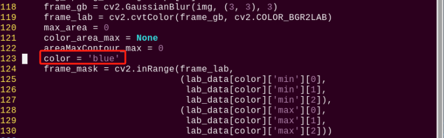

:::{Note}
press “Shift+G” after inputting the line number to directly jump to the corresponding line. This section aims to introduce the quick jump method, therefore, the code location numbers are for reference only. Please refer to the actual situation. 
:::

(4) Press “i” key to enter the editing mode, then modify “blue” of “color = 'blue'” as “red”.

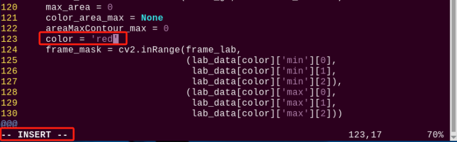

(5) After modification, press “Esc” and input “:wq” to save the file and exit.

```commandline
:wq
```

(6) Execute the steps in “[6.11.2 Operation Steps]()” to check the modification effect.

* **Changing the Feedback Sound**

When triangle is recognized, the buzzer will beep once. When rectangle is recognized, the buzzer will beep twice. When circle is recognized, the buzzer will beep third times. And we make the buzzer beep twice when the circle is recognized for example. 

(1) Enter the command **“cd spiderpi/advanced”** and press **“Enter”** to enter the catalog where the game programs are stored.

```commandline
cd spiderpi/advanced
```

(2) Enter the command **“sudo vim shape_recognition_plain.py”** and press **“Enter”** to open the program file.

```commandline
sudo vim shape_recognition_plain.py
```

(3) Scroll down to find these codes. 

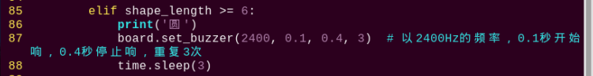

(4) Press “i” key to enter the editing mode and modify the “3” in `board.set_buzzer(2400, 0.1, 0.4, 3)` to “2”.

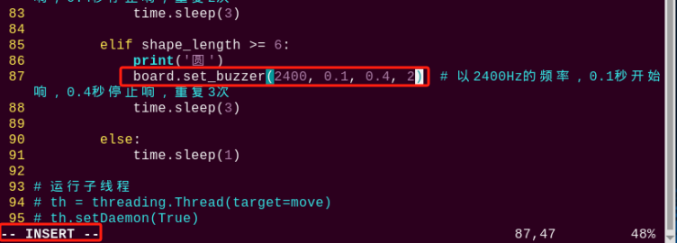

(5) After modification, press the "**Esc**" key, enter "**:wq**" and press Enter to save and exit.

```commandline
:wq
```

(6) Execute the steps in “[6.11.2 Operation Steps]()” to check the modification effect.

## 6.12 Shape Recognition

### 6.12.1 Program logic

Firstly, process the real-time camera image through OpenCV, and then perform binaryzation, corrosion, dilation, etc., to obtain the contour only containing the target color, and mark it.

After obtaining the target contour, deduce the corresponding shape according to the contour approximation result. And the recognition result will be displayed on the dot matrix screen, so as to realize shape recognition.

### 6.12.2 Operation steps

:::{Note}
The input command should be case sensitive and space sensitive. 
:::

(1) Boot up SpiderPi Pro, then remotely connect to Raspberry Pi desktop through VNC. 

(2) Clickat upper left corner of desktop to open the Terminator.


(3) Enter the command “cd spiderpi/advanced” and press “Enter” to navigate to the directory where the game program is located.

```
cd spiderpi/advanced
```

(4) Enter command “python3 shape_recognition.py”, and then press “Enter” to start the game.

```commandline
python3 shape_recognition.py
```

(5) If want to close this game, press “Ctrl+C” on LX terminal. If the game cannot be quit, please try again.

### 6.12.3 Project outcome

:::{Note}
The default recognition color is red, green and blue. The recognizable shapes are triangle, rectangle and circle. 
:::

When the shape is recognized, the corresponding shape pattern will be displayed on the dot matrix screen. In addition, the quantity of sides of the shape and the shape name are printed at the terminal.

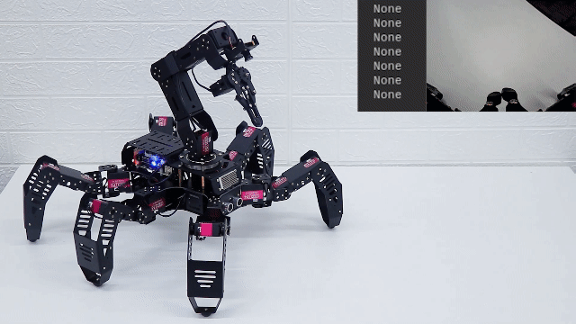

### 6.12.4 Program Parameter Description

The source code of this program is located at [/home/pi/spiderpi/advanced/shape_recognition.py]()

* **Import Function Library** 

{lineno-start=4}

```
import sys
import cv2
import math
import time
import signal
import threading
import numpy as np
from calibration.camera import Camera
from calibration.CalibrationConfig import *
from common import yaml_handle
from common import kinematics
from common.ros_robot_controller_sdk import Board
from common.action_group_controller import ActionGroupController
import arm_ik.arm_move_ik as AMK
from sensor.ultrasonic_sensor import Ultrasonic
import sensor.dot_matrix_sensor as DMS
```

(1) Import the libraries related to OpenCV, time, math, and threads. If want to call a function in library, you can use “library name+function name (parameter, parameter)”. For example:

{lineno-start=198}

```
            time.sleep(0.01)
```

Call `sleep` function in “time” library. The function `sleep ()` is used to delay. There are some built-in libraries in Python, so they can be called directly. For example, `time`, `cv2` and `math`. You can also write a new library like `yaml_handle`.

(2) Instantiating Function Libraries

The name of function library is too long to memorize. For calling function easily, the library can be instantiated. For example:

{lineno-start=15}

```
from common.ros_robot_controller_sdk import Board
from common.action_group_controller import ActionGroupController
import arm_ik.arm_move_ik as AMK
```

After instantiating, you can directly input and call the function `Board.function name (parameter, parameter)`.

* **Analysis of the Main Function** 

In a Python program,  `__name__ == ’__main__:’` is the main function of the program. First, the function init() is called for initialization configuration. In this program, the initialization includes: returning the servo to the initial position and reading the color threshold file. Generally, there are also configurations such as ports, peripherals, and timer interrupts. All of these need to be completed in the initialization content.

{lineno-start=172}

```
if __name__ == '__main__':
    #加载参数(load parameter)
    param_data = np.load(calibration_param_path + '.npz')

    #获取参数(obtain parameter)
    mtx = param_data['mtx_array']
    dist = param_data['dist_array']
    newcameramtx, _ = cv2.getOptimalNewCameraMatrix(mtx, dist, (640, 480), 0, (640, 480))
    mapx, mapy = cv2.initUndistortRectifyMap(mtx, dist, None, newcameramtx, (640, 480), 5)
```

* **Defining Global Variables** 

{lineno-start=42}

```
# 读取颜色阈值函数(read color threshold and parameters of coordinate transformation)
def load_config():
    global lab_data
    
    lab_data = yaml_handle.get_yaml_data(yaml_handle.lab_file_path)
    
# 初始位置(initial position)
def init_move():
    ultrasonic.setRGBMode(0)
    ultrasonic.setRGB(0, (0, 0, 0))
    ultrasonic.setRGB(1, (0, 0, 0))
    ik.stand(ik.initial_pos)
    ak.setPitchRangeMoving((0, 12, 18), -60, -90, 100, 2)
```

**(1) Gaussian Filtering**

Before converting the image from RGB into LAB space, denoise the image and use GaussianBlur() function in cv2 library for Gaussian filtering.

{lineno-start=132}

```
    frame_lab = cv2.cvtColor(frame_gb, cv2.COLOR_BGR2LAB)  # 将图像转换到LAB空间(convert the image to LAB space)
```

The meaning of the parameters in bracket is as follow 

The first parameter `img` is the input image.

The second parameter `(3, 3)` is the size of Gaussian kernel.

The third parameter `3` is the allowable variance around the average in Gaussian filtering. The larger the value, the larger the allowable variance around the average value; The smaller the value, the smaller the allowable variance around the average value.

**(2) Binarization Processing**

Adopt `inRange()` function in cv2 library to perform binaryzation on the image. 

{lineno-start=139}

```
            frame_mask = cv2.inRange(frame_lab,
                             (lab_data[i]['min'][0],
                              lab_data[i]['min'][1],
                              lab_data[i]['min'][2]),
                             (lab_data[i]['max'][0],
                              lab_data[i]['max'][1],
                              lab_data[i]['max'][2]))  #对原图像和掩模进行位运算(perform bitwise operation to original image and mask)
```

The first parameter in the bracket is the input image. The second and the third parameters respectively are the lower limit and upper limit of the threshold. When the RGB value of the pixel is between the upper limit and lower limit, the pixel is assigned a value of 1, otherwise, 0.

**(3) Corrosion and dilation**

The function of erosion is to remove burrs from the edges of the image. The function of dilation is to expand the edge of the image and fill in the non-target pixels at the edge or inside of the target object.  

To reduce distraction and make the image smoother, use `morphologyEx()` function in OpenCV library to perform open operation and close operation in sequence on the gray-scale image obtained after binaryzation.

{lineno-start=146}

```
            opened = cv2.morphologyEx(frame_mask, cv2.MORPH_OPEN, np.ones((6,6),np.uint8))  #开运算(opening operation)
            closed = cv2.morphologyEx(opened, cv2.MORPH_CLOSE, np.ones((6,6),np.uint8)) #闭运算(Closing operation)
```

The open operation is to erode first and then dilate, which can eliminate small areas with high brightness and separate objects at thin points. The boundary of the larger object can be smoothed without changing its area.

The close operation is to dilate first, then corrode. Its function is to bridge narrow discontinuities and slender ravines, eliminate small holes, make up for breaks in contour lines, and it also has a certain smoothing effect on contours. 

The meaning of the parameters in the parentheses of the `morphologyEx()` function is as follow. 

The first parameter is the input image

The second parameter is the morphological method used. `cv2.MORPH_OPEN` is for open operation, and `cv2.MORPH_CLOSE` is for close operation.

The third parameter is the kernel of the morphological operation. `np.ones((6,6),np.uint8)` is a 3×3 square structural element. 

**(4) Acquire the maximum contour**

After processing the image, acquire the contour of the target to be recognized, which involves `findContours()` function in cv2 library. 

{lineno-start=148}

```
            contours = cv2.findContours(closed, cv2.RETR_EXTERNAL, cv2.CHAIN_APPROX_NONE)[-2]  #找出轮廓(find contours)
```

The first parameter in parentheses is the input image; the second parameter is the retrieval mode of the contour; the third parameter is the approximation method of the contour. 

Find the contour of the maximum area among the obtained contours. To avoid interference, please set a minimum value. Only when the area is larger than this value, the target contour is valid. 

{lineno-start=68}

```
            if contour_area_temp > 50:  # 只有在面积大于50时，最大面积的轮廓才是有效的，以过滤干扰(Only when the area is greater than the set value, the contour with the maximum area is considered valid to filter out interference)
                area_max_contour = c
```

After obtaining the contour with largest area, use `drawContours()` function in cv2 library to mark the contour. 

{lineno-start=68}

```
        cv2.drawContours(img, areaMaxContour_max, -1, (0, 0, 255), 2)
```

**(5) Shape Recognition**

Calculate the perimeter of the contour with `arcLength()` function in cv2 library and use the `approxPolyDP()` function for contour approximation

{lineno-start=157}

```
        # 识别形状(shape recognition)
        # 周长  0.035 根据识别情况修改，识别越好，越小(Perimeter 0.035. Adjust according to the detection performance, the better the detection, the smaller the value)
        epsilon = 0.035 * cv2.arcLength(areaMaxContour_max, True)
        # 轮廓相似(contours are similar)
        approx = cv2.approxPolyDP(areaMaxContour_max, epsilon, True)
```

Based on the contour approximation result, acquire the number of the side of the recognized image to judge the corresponding shape of the image. 

{lineno-start=162}

```
        shape_list.append(len(approx))
        if len(shape_list) == 24:
            shape_length = int(round(np.mean(shape_list)))                            
            shape_list = []
    else:
        shape_length = 0
```

* **Dot Matrix Display** 

According to the recognition result, the corresponding pattern will be displayed on the dot matrix screen.

{lineno-start=75}

```
        if shape_length == 3:
            print('三角形')
            ## 显示'三角形'(display 'triangle')
            tm.display_buf = (0x80, 0xc0, 0xa0, 0x90, 0x88, 0x84, 0x82, 0x81,
                              0x81, 0x82, 0x84,0x88, 0x90, 0xa0, 0xc0, 0x80)
            tm.update_display()
            
        elif shape_length == 4:
            print('矩形')
            ## 显示'矩形'(display 'rectangle')
            tm.display_buf = (0x00, 0x00, 0x00, 0x00, 0xff, 0x81, 0x81, 0x81,
                              0x81, 0x81, 0x81,0xff, 0x00, 0x00, 0x00, 0x00)
            tm.update_display()
            
        elif shape_length >= 6:           
            print('圆')
            ## 显示'圆形'(display 'circle')
            tm.display_buf = (0x00, 0x00, 0x00, 0x00, 0x1c, 0x22, 0x41, 0x41,
                              0x41, 0x22, 0x1c,0x00, 0x00, 0x00, 0x00, 0x00)
            tm.update_display()
            
        else:
            ## 清屏(clear the screen)
            tm.display_buf = [0] * 16
            tm.update_display()
            print('None')
```

There are 16 columns of LEDs on the dot matrix screen and each column is controlled with a hexadecimal value, that is **“10001000”**. The status of LEDs corresponding to this value, from top to bottom, is “on off off off on off off off”.

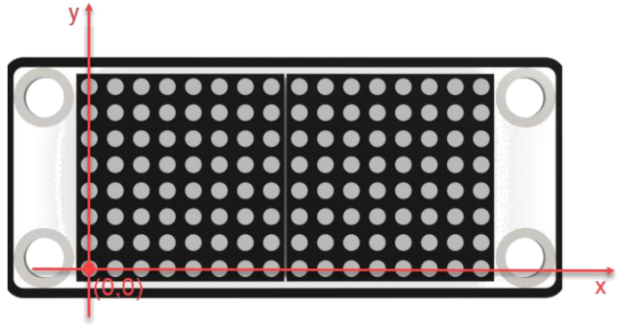

Through calling `update_display()` function in HiwonderSDK.tm1640 library, refresh the font in the tm.display_buf buffer area and display it on the dot matrix screen, and then you can control the dot matrix screen to display the desired pattern.
